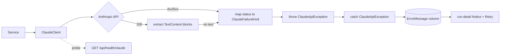

# Design Discussion: Claude model retirement + analysis error diagnosis

**Date:** 2026-08-22
**Feature:** Analysis runs fail with "An unexpected error occurred" because every Claude call hardcodes a retired model. Fix the model, make it configurable, and make failures diagnosable.

---

## Root Cause (confirmed, not hypothesized)

Production logs (`app-logs-iepadvisor-api-production`, 2026-08-22 23:42–23:44 UTC) show three consecutive failures — analysis runs 12, 13, and 14:

```
System.Net.Http.HttpRequestException: {"type":"error","error":{"type":"not_found_error",
  "message":"model: claude-sonnet-4-20250514"},"request_id":"req_011CeJg96PRbL75TvhoRJKA8"}
   at Anthropic.SDK.Messaging.MessagesEndpoint.GetClaudeMessageAsync(...)
   at IepAssistant.Services.Implementations.ClaudeClient.CompleteAsync(...) ClaudeClient.cs:line 69
   at IepAssistant.Services.Implementations.AnalysisRunService.ExecuteRunAsync(...) line 170
```

`claude-sonnet-4-20250514` has been retired by Anthropic and now returns **404 `not_found_error`**. The broad `catch (Exception)` at `AnalysisRunService.cs:252` swallows this into the literal string `"An unexpected error occurred during analysis."` (`:255`), which is exactly what you saw.

**Blast radius is the whole product, not just analysis.** The same literal is hardcoded in 11 places across 10 files — IEP parsing, ETR parsing, progress reports, meeting prep, AI assist, and the student workspace all call the same dead model. Analysis is simply the path you happened to exercise. Every Claude-backed feature in the app is currently broken.

Good news: `AnalysisRunService.FailRunAsync` (`:588–613`) correctly refunds the reserved quota unit on failure, so the three failed runs did **not** consume any of the 5-per-child allowance.

---

## Current State

**Model configuration doesn't exist.** The only Anthropic config key in the solution is `Anthropic:ApiKey` (`appsettings.json:26-28`), read at exactly one place (`ClaudeClient.cs:28`). The model ID is a hardcoded literal in:

| File | Line | Form | MaxTokens |
|---|---|---|---|
| `Models/ClaudeCompletionRequest.cs` | 8 | default property value (dead — always overridden) | 16384 |
| `Implementations/AnalysisRunService.cs` | 174 | inline literal | 32000 |
| `Implementations/IepAnalysisService.cs` | 411 | inline literal | 16384 |
| `Implementations/EtrAnalysisService.cs` | 334 | inline literal | 32000 |
| `Implementations/ProgressReportAnalysisService.cs` | 221 | inline literal | 16384 |
| `Implementations/MeetingPrepService.cs` | 686 | inline literal | 8192 |
| `Implementations/IepProcessingService.cs` | 231 | inline literal | 16384 |
| `Implementations/EtrProcessingService.cs` | 271 | inline literal | 32000 |
| `Implementations/IepAssistService.cs` | 26 | `private const string Model` | 1024 / 2048 |
| `Implementations/StudentWorkspaceService.cs` | 23 | `private const string Model` | 1024 |

Plus test assertions at `ClaudeClientTests.cs:23,93,103,127` and `IepAssistServiceTests.cs:153`.

**Error handling collapses every failure into one string.** There are 11 broad `catch (Exception)` blocks across the nine Claude-calling services. Not one distinguishes `HttpRequestException` from `TaskCanceledException` from a `NullReferenceException`. `Exception.Message` is never copied into any persisted field — exception detail lives only in `ILogger`. A 404 dead model, a 429 rate limit, and a genuine bug all render identically to the user.

Two services — `IepAssistService` and `StudentWorkspaceService` — have **zero** try/catch. A Claude HTTP failure there propagates uncaught to the controller as a 500.

**Response parsing takes the first content block:**

```csharp
// ClaudeClient.cs:71
var responseText = (response.Content?.FirstOrDefault() as TextContent)?.Text;
```

**No retry, no circuit breaker, no Polly.** The named `"Claude"` HttpClient (`Program.cs:87-94`) sets a 15-minute timeout and nothing else. The design doc that introduced `IClaudeClient` said the abstraction was for "centralized retry/telemetry/prompt builders" (`docs/designs/2026-05-27-school-side-and-analysis-rework-design.md:75`) — the abstraction landed, the resilience never did.

**Nothing detected this.** Three production errors sat in Elasticsearch overnight with no alert. `HealthController` returns a static `"healthy"` and never touches a dependency.

**Frontend** (`run-detail.tsx:59-63`) renders `run.errorMessage ?? "Something went wrong…"` in an error `Notice`. It uses `??` rather than `||` (so an empty-string message renders a title with a blank body — unique in the app; every sibling surface uses `||`), has no Retry button (every sibling analysis tab has one), and `Notice` carries no `role="alert"`, so a failure arriving via polling is never announced to screen readers.

---

## The trap in the obvious fix

**Swapping the model string alone will replace a loud 404 with a silent wrong answer.**

Claude Opus 5 has adaptive thinking **on by default**. Responses therefore begin with a `thinking` content block, and `Content.FirstOrDefault() as TextContent` returns `null` — the `as` cast fails silently. `CompleteAsync` returns `null`, `ParseResponse(null)` returns null, and the run fails with `"Failed to generate analysis."` (`AnalysisRunService.cs:179`). Same broken feature, new misleading message, and it would look like a prompt problem rather than a parsing bug.

I verified `Anthropic.SDK` 5.10.0 does model this — the assembly exports `ThinkingContent`, `RedactedThinkingContent`, `MessageParameters.Thinking`, and `OutputConfig.Effort` — so the SDK version is current enough for Opus 5; the extraction logic is what's wrong. Fixing `ClaudeClient.cs:71` to select text blocks explicitly is **not optional cleanup, it is part of the fix**.

---

## Patterns to Follow

- **`ServiceResult<T>` wrapper** on the backend (`seven-hills.local.md:13`) — already used consistently in `AnalysisRunService`; new service methods stay in that shape.
- **Idempotent fail-and-refund** — `AnalysisRunService.FailRunAsync` (`:588-613`) nulls `UsageRecordId` in the same save as the status transition so a double failure path can't double-refund. This is the model for correct failure handling; other services should not be reinvented differently.
- **Options pattern for config** — standard ASP.NET Core `IOptions<T>` binding, consistent with `.claude/project-context.md:26-31` ("Use environment variables for configuration").
- **Hand-written stub handlers in tests** — `ClaudeClientTests.cs:37-72` uses `StubHandler : HttpMessageHandler` + `StubHttpClientFactory`. No Moq anywhere in the solution; new tests follow the same hand-rolled style.
- **Inline/banner errors with retry** — the documented UI rule (`docs/designs/2026-07-01-ux-consistency-professionalism-design.md:33`): "inline/banner errors with retry; Toast for transient success." `run-detail.tsx` currently has the banner but not the retry.

---

## Desired End State

**1. Model becomes configuration, with a per-call-site override.**

`AnthropicOptions` bound from an `Anthropic` config section:

```jsonc
// appsettings.json
"Anthropic": {
  "ApiKey": "",
  "Model": "claude-opus-5",
  "Effort": "medium"
}
```

`ClaudeCompletionRequest.Model` becomes `string?` (null = use configured default). `ClaudeClient` resolves `request.Model ?? options.Model`. The eight inline literals and two `const string Model` fields are deleted; call sites stop naming a model at all unless they deliberately want a different one. The next retirement is an Azure App Service setting change, not a 10-file redeploy.

**2. `ClaudeClient` extracts text correctly and classifies failures.**

```csharp
// text extraction that survives thinking blocks
var responseText = string.Concat(
    response.Content?.OfType<TextContent>().Select(c => c.Text) ?? []);
```

A typed `ClaudeApiException(ClaudeFailureKind kind, string userMessage, Exception? inner)` replaces the current "return null / let HttpRequestException escape" behavior. `ClaudeClient` catches the SDK's exceptions once and maps HTTP status → kind → a safe, actionable user-facing sentence.

**3. Services catch the typed exception before their broad catch.**

Each of the nine services gains a `catch (ClaudeApiException ex)` ahead of `catch (Exception)`, persisting `ex.UserMessage` into its existing `ErrorMessage` column (all capped at 2000 chars) and logging `ex` with the run/document id. The broad catch stays as the genuine-bug backstop and keeps its current generic string. `IepAssistService` and `StudentWorkspaceService` gain their first try/catch so a Claude outage returns their existing `"…temporarily unavailable."` constants instead of a 500.

**4. A readiness probe catches a dead model before a user does.**

`Anthropic.SDK` 5.10.0 exposes `client.Models.GetModelAsync(id)`, which is a free metadata lookup — no tokens, no inference. A new `GET /api/health/claude` calls it against the configured model and returns 200 with the resolved model id, or 503 with the failure kind. A configured-but-nonexistent model is then visible from a curl, a uptime check, or a post-deploy smoke step, rather than only from a user burning an analysis attempt.

**5. Frontend states the failure and offers a retry.**

`run-detail.tsx` switches `??` → `||`, adds a "Retry Analysis" button matching the sibling tabs, and `Notice`'s error variant gains `role="alert"`.

### Failure classification

```
ClaudeFailureKind
├─ Configuration     → API key missing/invalid (401), model not found (404)
├─ RateLimited       → 429
├─ Timeout           → TaskCanceledException on the 15-min HttpClient timeout
├─ Transient         → 5xx, connection failures
├─ RequestTooLarge   → 413, or context-window overflow
├─ InvalidResponse   → 200 but no text block / unparseable JSON
└─ Unknown           → anything else
```



---

## Data Design Decisions

**`ClaudeFailureKind` → code enum, not a database lookup table.** It exists solely to drive `switch` branches in C# and to pick a canned user message. Adding a case requires new mapping code anyway, so runtime editability buys nothing and a DB round-trip on every failure costs something. This is the one enum-shaped thing this change introduces.

**Schema changes are required after all.** `AnalysisRun.ErrorMessage` and the legacy analysis siblings already exist at `HasMaxLength(2000)`, so those only need better strings. But `IepDocument` and `EtrDocument` have **no `ErrorMessage` property at all** (`IepDocument.cs:13`, `EtrDocument.cs:13` define only `Status`) — parse failures there have nowhere to put a message. One additive migration adds `ErrorMessage nvarchar(2000) NULL` to both, matching the existing convention.

---

## Design Decisions

| Decision | Rationale |
|---|---|
| Target model `claude-opus-5` | Your call. Anthropic's recommended default and strongest reasoning for nuanced IEP analysis. Note the cost delta: $5/$25 per MTok vs Sonnet 4's tier — roughly 1.7× `claude-sonnet-5`. Worth watching against the 5-analyses-per-child subscription economics. |
| Model in config, not code | A retired model is a recurring event, not a one-off. Config makes the next one a settings change. |
| Throw a typed exception rather than change `CompleteAsync`'s return type | Keeps the `string?` signature and avoids rewriting all nine call sites' happy paths. Services opt into the specific catch. |
| Keep the broad `catch (Exception)` | It's the correct backstop for genuine bugs; the problem was that it was the *only* handler, not that it exists. |
| No Polly retry in this change | You scoped retry out. Failures will now be *labeled* `RateLimited` / `Transient`, which is the prerequisite for adding retry later — noted as deferred, not forgotten. |
| Fix text extraction as part of the model swap | Not optional: Opus 5's default-on thinking makes the current first-block extraction return null. Shipping the model swap without this ships a still-broken feature. |
| Tests assert the *configured* model, not a literal | `ClaudeClientTests.cs:103` and `IepAssistServiceTests.cs:153` hardcode the model string and would break on every future migration. |

---

## Resolved Questions

1. **`max_tokens` vs. adaptive thinking — RESOLVED: `Effort = "medium"` globally.** Thinking tokens count against `max_tokens`, and `AnalysisRunService` requests 32000 non-streaming. Setting `output_config.effort` to `medium` across all call sites bounds reasoning so the JSON payload has room, and avoids converting the shared client to streaming. Current non-streaming `max_tokens` values stay as they are. Truncation (surfacing as `InvalidResponse`) is a monitored risk to be tuned per-call-site if it appears.

2. **Legacy per-document analysis paths — RESOLVED: full treatment everywhere.** All nine Claude-calling services get both the config-driven model and the typed error handling, including `IepAnalysisService`, `EtrAnalysisService`, and `ProgressReportAnalysisService`. Consistent behavior app-wide, no second pass later.

3. **Target model — RESOLVED: `claude-opus-5`.** Cost delta noted in Design Decisions.

## Open Questions

1. **Does `Anthropic.SDK` 5.10.0 serialize a default `Temperature`?** Opus 5 rejects sampling parameters with a 400. The current code never sets it, but if the SDK emits a default, every call fails. A five-minute empirical check during implementation, not a design decision — flagged so it doesn't get skipped.

2. **Alerting stays out of scope.** These three errors sat unnoticed overnight. Detection remains "the health endpoint exists and someone can curl it" until alert rules are picked up as separate work.

## Post-SpecFlow Additions (resolved 2026-08-22)

Gap analysis surfaced defects the initial design missed. All resolved:

3. **Retry mechanism — RESOLVED: new endpoint replaying the stored snapshot.** No retry route exists today (`AnalysisRunController` exposes only create/list/get). `POST /api/children/{childId}/analysis-runs/{runId}/retry` re-uses the failed run's persisted `SourceContentSnapshot`, so a retry analyzes exactly the content the failed run saw. The alternative — having the frontend call `createRun` with `run.sources` — would re-run `BuildSourceSnapshotAsync` and silently analyze a *different* document set if a source was deleted or re-parsed in between.

4. **Legacy quota leak — RESOLVED: fix the pattern and restore burned units.** `SubscriptionService.cs:243-244` shows `TryRecordUsageAsync` is `TryReserveUsageAsync(...) is not null` — it reserves a usage record and discards the id. `IepAnalysisService.cs:115` calls it and never releases, so every legacy IEP-analysis failure permanently consumes one of the 5-per-child allowance. Convert it to the reserve/release pattern `AnalysisRunService` already uses, and identify units burned during this outage for credit-back. (`EtrAnalysisService.cs:77-78` is a TODO with no quota enforcement at all — noted, not fixed here.)

5. **Refund leak on cancellation — RESOLVED: fail paths use `CancellationToken.None`.** `AnalysisRunService.cs:255` passes the possibly-cancelled `ct` to `FailRunAsync`; on shutdown the refund's `SaveChangesAsync(ct)` throws and the unit leaks. The worker's own catch already gets this right (`AnalysisRunWorker.cs:66`). Every typed catch must call `FailRunAsync(runId, ex.UserMessage, CancellationToken.None)` — never set status inline, which would bypass the refund entirely and leave the row terminal so neither the idempotency guard nor the startup sweep can repair it.

6. **`Timeout` must not swallow shutdown cancellation.** `TaskCanceledException` is raised both by the 15-minute HttpClient timeout and by graceful shutdown (the worker passes `stoppingToken` down to `CompleteAsync`). Without a discriminator, every deploy restart writes "the request timed out" onto in-flight runs. Check `ct.IsCancellationRequested` to tell them apart.

7. **`UserMessage` is always a canned per-kind constant, never `inner.Message`.** The production 404 body carries the model id and `request_id`; the 401 path can echo key material. Neither may reach a parent-visible `ErrorMessage` column.

8. **`failureKind` goes on the DTO.** Without it the frontend cannot vary the affordance — `RequestTooLarge` needs "change selection" rather than "retry", and `Configuration` should suppress a pointless retry entirely.

9. **Health probe hardening.** `HealthController` has no `[Authorize]`, so the probe would anonymously expose the configured model and give unauthenticated callers a lever to generate outbound Anthropic requests. It must also not inherit the named `"Claude"` client's 15-minute timeout, or a hung endpoint hangs the health check. And it proves only that the model *exists* — it does not prove `effort` or sampling parameters are accepted, so a post-deploy smoke running one real minimal completion is still required.

10. **Misleading parse-failure copy.** `etr-error-banner.tsx` tells users "This can happen when the PDF is scanned or has unusual formatting" and `iep-viewer-page.tsx:357` says "Try re-uploading" — both were blaming users' documents all night for a dead model. Soften to reflect the real (now available) error message.

11. **Poll cap vs. HTTP timeout.** `use-analysis-run.ts:7` stops polling at 5 minutes while the Claude call can run 15. A slow failure lands in `Error` after polling has stopped, so the user never sees it without a manual refresh — and the new `role="alert"` is inert in exactly that case. Add a "Check now" action to the `pollTimedOut` notice.

## Out of Scope (flagged, not actioned)

- **Secrets in the working tree.** `api/IepAssistant.Api/appsettings.Development.json` contains a live-format Anthropic API key (`:18`), an Azure SQL password (`:3`), and a storage account key (`:4`) in plaintext. The file is correctly gitignored and is **not** in git history, so this is not a disclosure — but it contradicts `.claude/project-context.md:26-31` and those credentials are worth rotating into user-secrets or environment variables. Separate task.
- **`ExpiryReminderSentAt` migration gap.** Production logs show `Invalid column name 'ExpiryReminderSentAt'` failing the staff-invite expiry scan daily around 2026-07-21→23 — an unapplied migration, unrelated to this bug. Separate task.
- Polly retry/backoff, Elasticsearch alert rules, and migration from the community `Anthropic.SDK` package to the official `Anthropic` SDK — all deferred per your scope choice.

---

## Testing Strategy

**Unit — `ClaudeClientTests` (extends the existing `StubHandler` pattern):**
- 404 `not_found_error` → `ClaudeApiException` with `Configuration` kind *(this is the exact regression that caused this bug)*
- 429 → `RateLimited`; 503 → `Transient`; `TaskCanceledException` → `Timeout`
- Response whose first block is `thinking` and second is `text` → returns the text *(guards the Opus 5 trap)*
- Response with only a `thinking` block → `InvalidResponse`, not a silent null
- Missing API key → `Configuration`, not a bare null return
- Model resolution: request override wins; null request model falls back to configured default

**Unit — `AnalysisRunServiceTests` (extends the existing `FakeClaudeClient`):**
The current fakes only ever return a canned string or null, so the broad catch at `:252` is entirely untested. Add a fake that *throws* `ClaudeApiException` and assert the run lands in `Error` with `ex.UserMessage` persisted — and that the quota unit is refunded, which is the property most worth not regressing.

**Integration:** `GET /api/health/claude` returns 200 for the configured model and 503 for a deliberately bogus one.

**Frontend:** Vitest coverage for `run-detail.tsx` — error status renders the message, empty-string message falls back (the `??`→`||` fix), Retry button fires. There is currently no test file under `web/src/features/analysis/`.

**Manual verification (the actual acceptance test):** log in, run an analysis over the already-uploaded IEP that failed last night, confirm it completes. Then re-check `app-logs-iepadvisor-api-production` for a clean run.

Note `.claude/project-context.md:62-68` sets a 70% coverage bar; `IepAnalysisService`, `EtrAnalysisService`, `ProgressReportAnalysisService`, `MeetingPrepService`, `IepProcessingService`, and `EtrProcessingService` currently have **no test file at all**. Bringing all six up to standard is larger than this change — the plan will cover the paths it touches and flag the rest.
