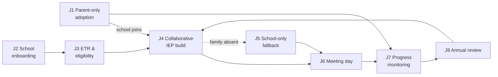

# Journey Index

**Created:** 2026-08-03
**Status:** Draft — written at **vision scope**. Each journey describes the target experience and carries an explicit **"Gap vs. today"** section separating what exists from what doesn't.
**Companion:** [`docs/personas/`](../personas/00-persona-index.md)

## What these are

Eight **cross-persona swimlane journeys**. They live here rather than inside persona files because the flagship flows involve three or four personas at once; retelling them from each vantage point guarantees drift.

Each journey follows the same format:

| Section | Purpose |
|---|---|
| Header | Mode, personas, trigger, success condition, duration |
| Preconditions | What must be true before this journey starts |
| Stages | The spine — stage, actor, action, system/AI role, emotional state, failure mode |
| Swimlane | Visual flow across lanes |
| Fallbacks & Degradations | What happens when someone doesn't participate |
| Gap vs. today | Exists / partial / missing — the implementable backlog |
| Design implications | What this journey demands of the product |
| Success metrics | How we'd know it works |
| Open questions | Unresolved decisions |

## The eight journeys

| # | Journey | Mode | Driver | The question it answers |
|---|---|---|---|---|
| **J1** | [Parent-only adoption](J1-parent-only-adoption.md) | C | Dana, Rosa | A parent arrives alone with a PDF. How do they get to understanding? |
| **J2** | [School onboarding](J2-school-onboarding.md) | A→B | Karen, Dennis | A district signs up. How do they get from contract to a staff member actually working? |
| **J3** | [ETR & eligibility](J3-etr-eligibility.md) | A/B | Steph | Evaluation through eligibility determination — everything *before* there's an IEP |
| **J4** | [Collaborative IEP build](J4-collaborative-iep-build.md) | A | Steph, Dana | **The flagship.** School and family co-building one document |
| **J5** | [School-only fallback](J5-school-only-fallback.md) | B | Steph | The family doesn't participate. How does the school finish and get out cleanly? |
| **J6** | [Meeting day](J6-meeting-day.md) | A/B | Dennis, Steph, Dana | The hour everything converges on |
| **J7** | [Progress monitoring](J7-progress-monitoring.md) | A/B/C | Priya, Steph | The 10 months between meetings — where plans succeed or quietly fail |
| **J8** | [Annual review](J8-annual-review.md) | A/B/C | Steph, Dana | The loop closes and restarts |

## How they connect

The **outer loop** is J4 → J6 → J7 → J8 → J4: the annual IEP cycle, which is the product's real heartbeat. J1, J2, and J3 are entry paths into it; J5 is the mandatory fallback branch.

## Standing decisions

Decided 2026-08-03; they constrain every journey below.

- **We are the system of record.** The platform authors and holds the legal IEP and ETR. Not a layer beside district IEP software. Consequences land in [J3](J3-etr-eligibility.md), [J4](J4-collaborative-iep-build.md), and [J5](J5-school-only-fallback.md) — chiefly that state-prescribed form output and e-signature are in scope, and that our export **is** the document, not a hand-off.
- **The school shares the draft as a whole**, in one deliberate act, once it's coherent — not section by section. See [J4](J4-collaborative-iep-build.md)'s visibility model.
- **Validation:** pilot interviews plus advisory review by a special-ed director, a case manager, and a parent advocate.

## Reading the modes

- **Mode A — Both sides.** School and family on the platform. Shared workspace, structured input, bilingual collaboration.
- **Mode B — School-only.** Family absent. The school completes a compliant document and **exports** it for traditional review. Never blocked, never nagged.
- **Mode C — Parent-only.** School not on the platform. The parent uploads and manages independently. Today's shipped product.

**A journey that only works in Mode A is not finished.** Every journey below states its behavior in each applicable mode.

## Gap summary across all journeys

Aggregated from each journey's "Gap vs. today" section. Rough implementation weight, not a plan.

| Capability | Status today | Journeys |
|---|---|---|
| Document upload → parse → sections/goals | **Exists** | J1, J7, J8 |
| Parent analysis + meeting prep | **Exists** | J1, J6, J8 |
| IEP version comparison | **Exists** | J8 |
| Org signup, schools, staff invites, audit log | **Exists** | J2 |
| Educator IEP authoring workspace + versions | **Partial** | J4, J5 |
| Parent/student invite + link acceptance | **Exists** | J2, J4 |
| **Shared workspace with scoped visibility** | **Missing** | J4 |
| **Structured parent/student input slots** | **Missing** | J3, J4, J8 |
| **AI drafting copilot for educators** | **Missing** | J3, J4, J5 |
| **Compliance timelines & deadline alerts** | **Missing** | J2, J3, J5, J7, J8 |
| **Bilingual content + bidirectional translation** | **Missing** | all |
| **Session notes → progress reports** | **Missing** | J7 |
| **Meeting-day surface (school side)** | **Missing** | J6 |
| **Export / state-prescribed form output** | **Missing** | J5 |
| **E-signature & prior written notice** | **Missing** | J4, J5, J6 |
| **Caseload-shaped educator home** | **Missing** | J3–J8 |
| **Student participation surface** | **Missing** | J4, J6 |

## Using these for the UX rethink

1. **Pick a journey, not a screen.** The prior three UX passes worked screen-by-screen; that's why the app is consistent and still shaped like a database.
2. **Check every mode.** A flow that assumes the parent shows up will fail most of the time.
3. **Name the persona and the stage.** "This serves Steph at J4/S2" is a reviewable claim; "improves the authoring page" is not.
4. **Treat gaps as hypotheses.** Everything here is unvalidated — see each persona's Evidence ledger.
