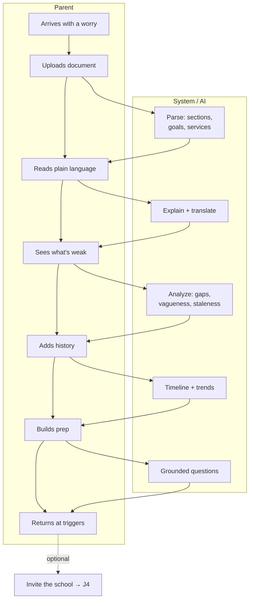

# J1 — Parent-Only Adoption

**Mode:** C (school not on the platform)
**Personas:** [Dana ◆](../personas/parent-primary.md) · [Rosa ◆](../personas/parent-multilingual.md) · [Sam ○](../personas/platform-admin.md)
**Trigger:** A parent has an IEP or ETR they don't fully understand, usually shortly after receiving it or shortly before a meeting
**Success:** Within one session the parent can state, in their own words, what the plan says, what's weak about it, and what they'll ask about
**Duration:** First session 15–30 min; the relationship continues for years
**Status:** The most mature journey in the product today — and the one whose *first five minutes* matter most

## Why this journey is strategically load-bearing

This is the **self-serve wedge**. It requires no district contract, no procurement, no Karen (P7). It's how the product acquires users, learns the domain, and builds the parent-side reputation that later makes districts want the platform.

It's also the only journey where the parent is **alone** — no case manager to interpret, no meeting scheduled by someone else. Everything the product does here it does unassisted.

The critical constraint: **the parent arrives at a moment of anxiety, not curiosity.** They are not evaluating a tool. They are trying to find out whether something is wrong. Any onboarding that treats them as a prospect to be nurtured will lose them.

## Preconditions

- Parent possesses at least one document (PDF, often a scan, sometimes a photo of paper)
- No school-side account exists for their child
- Parent has heard about the product from a support group, another parent, search, or an advocate

## Stages

| # | Stage | Actor | What they do | System / AI | Feeling | Failure mode |
|---|---|---|---|---|---|---|
| S1 | **Arrive** | Dana | Lands from search or a recommendation, carrying a specific worry | Communicate value in one sentence; ask nothing yet | Skeptical, hurried | A marketing page that explains the company instead of answering "will this help me?" |
| S2 | **First document** | Dana | Uploads the IEP — ideally **before** creating an account | Accept the file; begin parsing immediately; ask for an account only when there's something to save | Committed, impatient | Signup wall before any value; upload limits; PDF-only rejection of a phone photo |
| S3 | **Wait** | — | Watches processing | Show real progress and partial results as they land; never a blank spinner | Anxious | Silent multi-minute wait; parse failure with a dead end |
| S4 | **First understanding** | Dana | Reads the plain-language version | Translate the whole document to plain language in their language; structure it: services, goals, accommodations, placement | **The hinge moment.** Relief or abandonment | Structured data dump instead of an explanation; clinical language retained |
| S5 | **First insight** | Dana | Learns something they didn't know | Surface what's notable: vague/unmeasurable goals, missing baselines, services without minutes, goals unchanged from last year | "This sees things I couldn't" | Generic advice; hedging; nothing specific to *their* document |
| S6 | **Establish context** | Dana | Adds their child, uploads remaining documents (prior IEPs, ETR, progress reports) | Extract history; build a timeline; compare across years | Investing | Being asked for data the documents already contain |
| S7 | **Prepare** | Dana | Builds concerns and questions for the meeting | AI proposes questions grounded in specific document lines; parent edits; produces a printable artifact | Prepared, steadier | A generic question list they could have found anywhere |
| S8 | **Return** | Dana | Comes back when a document arrives or a meeting nears | Re-engage on *their* triggers: meeting date, new document, progress-report window | Habitual reliance | Engagement-farming notifications that get muted |
| S9 | **Bridge** | Dana | Learns their school could join | Offer a low-pressure way to invite the school; **never gate parent value on it** | Hopeful | Pressure that makes the parent feel their tool is incomplete |

## Swimlane

## Fallbacks & Degradations

- **Parse fails** (bad scan, photo, unusual format) — never a dead end. Offer OCR retry, manual section tagging, or "ask a question about this document" over raw text. A parent who hit a wall in their first five minutes does not come back.
- **Only a fragment exists** — a parent with just a goals page still gets value. Never require a complete document set.
- **Not the legal guardian** — a grandparent, foster parent, or non-custodial parent may hold documents. Don't assume the uploader is the rights-holder.
- **Two households** — separated parents may both need access with different visibility. Model this rather than forcing account sharing.
- **Rosa (P2)** — every stage above happens in Spanish, including the marketing entry point and the first email. If the entry point is English-only, Rosa never reaches S2.

## Gap vs. today

| Capability | Status |
|---|---|
| Upload → parse → sections & goals | **Exists** (PdfPig + Claude structuring, background worker) |
| Child profiles, IEP/ETR documents, goals | **Exists** |
| Analysis tab, meeting-prep tab, comparison | **Exists** |
| Knowledge base, IEP 101 | **Exists** |
| **Upload before signup** | **Missing** — registration precedes everything |
| **Plain-language rendering of the whole document** | **Missing** — sections are structured, not explained |
| **Any language other than English** | **Missing** — no i18n at all |
| **Progressive results during parsing** | **Missing** — status is uploaded → processing → parsed/error |
| **Parse-failure recovery path** | **Missing** — error status with reprocess, no manual fallback |
| **Trigger-based re-engagement** | **Missing** — no meeting dates, no notification model |
| **Invite-your-school bridge** | **Partial** — accept-link exists school→parent; no parent→school direction |
| **Phone-first document reading** | **Partial** — responsive, but built desktop-first |

## Design Implications

1. **Value before account.** Upload and parse anonymously; require signup only to *save*. The current registration-first flow is the largest addressable drop-off in the product.
2. **The first screen after parsing is an explanation, not a data structure.** Today's IEP viewer shows sections and goals — correct data, wrong first impression. Dana needs prose that says what this plan does for their child.
3. **Never a blank wait.** Stream partial results; a document that takes 90 seconds must show progress by second five.
4. **Parse failure needs a real path forward**, including chat over raw extracted text. Silent dead ends at S3 are unrecoverable.
5. **Re-engagement is trigger-based, not scheduled.** Meeting dates, new documents, and progress-report windows are the only legitimate reasons to notify. Everything else trains muting.
6. **Language selection is the first question, in the user's language**, at the marketing entry point — not a profile setting found later.
7. **The school-invite bridge must be zero-pressure and parent-controlled.** Mode C is not a funnel toward Mode A; it's a permanent, complete product.
8. **Design for the phone.** This journey happens at night, on a couch, one-handed.

## Success Metrics

- % of arrivals reaching S4 (first understanding) — the single most important funnel number
- Time from upload to first plain-language content
- Parse success rate, and recovery rate after failure
- Return rate within 30 days
- % of parents who complete a prep artifact before a meeting
- Segmented by language: does Rosa's funnel match Dana's?

## Open Questions

- How much do we invest in OCR quality for scanned/photographed documents? It may be the real gate on S3.
- Is there a free tier that keeps Mode C viable long-term, and where does the subscription boundary fall relative to S4/S5? Gating the first insight would break this journey.
- Do we actively pursue the parent→school bridge, or treat Mode C as a standalone business?
- How do we handle two-household families — a genuine structural gap in the current model?
