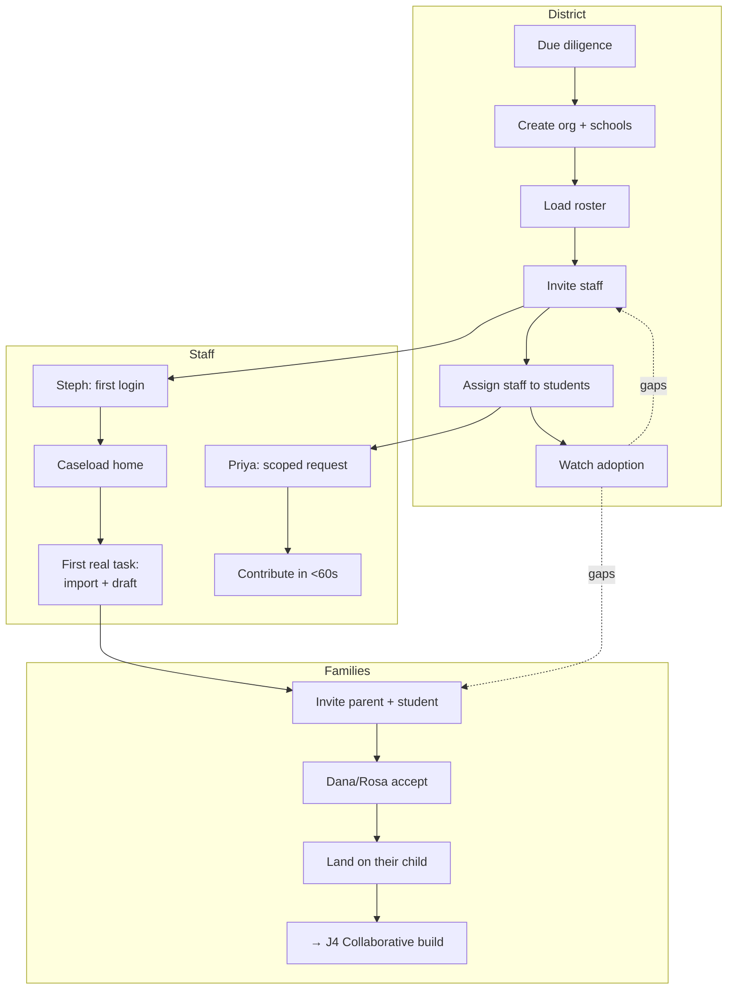

# J2 — School / District Onboarding

**Mode:** A (targets both-sides) — must still land safely in B
**Personas:** [Karen ◆](../personas/district-sped-director.md) · [Dennis ◆](../personas/school-admin-lea.md) · [Steph ○](../personas/case-manager.md) · [Priya ○](../personas/service-provider.md) · [Dana/Rosa ○](../personas/parent-primary.md) · [Sam ○](../personas/platform-admin.md)
**Trigger:** A district decides to pilot or adopt the platform
**Success:** A case manager completes real work in the product within their first week, and a parent accepts a link — **not** that the roster is loaded
**Duration:** Days to weeks
**Status:** The foundation exists (self-serve signup, schools, staff invites, roster scoping); the *adoption* half does not

## The failure this journey exists to prevent

Every school software rollout dies the same way: the administrator configures everything, announces it at a staff meeting, and the staff never come back. Setup completes; adoption doesn't.

So this journey's success condition is deliberately **not** "the district is configured." It's **Steph doing real work in week one.** Configuration is a prerequisite, not an outcome, and every stage below is judged by whether it moves a working educator closer to a first real task.

The second constraint: **Karen (P7) can't be the only one selling it internally.** A rollout that depends on the director nagging staff fails. The product has to earn Steph's time on its own in the first session.

## Preconditions

- A decision-maker has agreed to pilot (paid or free)
- Security/data review has passed, or is running in parallel
- Someone at the district can supply the roster and staff list

## Stages

| # | Stage | Actor | What they do | System / AI | Feeling | Failure mode |
|---|---|---|---|---|---|---|
| S1 | **Due diligence** | Karen | Asks the hard questions: FERPA, data ownership, AI governance, exit | Publish clear answers as product surfaces, not a sales PDF | Cautious | Vague data answers end the conversation |
| S2 | **Create the org** | Karen/Dennis | Signs up, names the district, creates schools | Guided setup wizard | Committed | A long form before any sense of what the product does |
| S3 | **Load the roster** | Dennis | Gets students into the system | One-at-a-time for small pilots; import for real scale; SIS integration eventually | Tedious | Manual entry of 800 students — a hard adoption stop |
| S4 | **Invite staff** | Dennis | Invites case managers, service providers, administrators | Role-differentiated invites; expiry warnings; resend | Administrative | One generic "Educator" role that gives Priya Steph's interface |
| S5 | **Assign** | Dennis | Connects staff to students | Bulk assignment; flag unassigned students | Detail work | Per-student manual assignment across a whole building |
| S6 | **Staff first session** | Steph | Opens the invite and logs in | **This is the make-or-break stage.** Land on their caseload with one obvious valuable action | Skeptical, time-poor | An empty dashboard, or a tour, or a request to configure preferences |
| S7 | **First real task** | Steph | Does actual work — drafts an IEP, imports a prior one | Import last year's IEP and generate a draft. Deliver a visible win in the first session | "This saved me time" | A blank authoring workspace |
| S8 | **Light contributors** | Priya | Receives a single scoped request and completes it | Task-first landing, minimal auth, under a minute | Neutral (the goal) | Full onboarding required for a two-sentence contribution |
| S9 | **Invite families** | Steph/Dennis | Sends parent and student links | Bilingual invitations; clear explanation of what the parent gets; track acceptance | Hopeful | English-only invites; no explanation of value; silent expiry |
| S10 | **Parent joins** | Dana/Rosa | Accepts the link | Land on their child, not a setup flow. Merge cleanly if they already have a Mode C account | Curious | Being asked to re-enter what the school already has |
| S11 | **Rollout health** | Karen | Watches adoption | Adoption by building and role; unassigned students; unaccepted invites; unresponsive families | Reassured or alarmed | No visibility, so problems surface at renewal |

## Swimlane

## Fallbacks & Degradations

- **Roster too large for manual entry** — without import, adoption stops at S3. Small pilots (≤20 students) hide this; the first real district exposes it.
- **Staff don't accept invites** — surface it to Dennis with a resend path, and don't let a stalled invite silently block student assignment.
- **Families don't accept** — the district lands in **Mode B** ([J5](J5-school-only-fallback.md)). This must be a normal, quiet state, not a warning banner. Steph continues unaffected.
- **Parent already has a Mode C account** — link, don't duplicate. Their uploaded history and private notes carry over and stay private.
- **District wants parent collaboration off entirely** — an org-level setting that puts the whole district in Mode B by policy. Some will require this.
- **Partial adoption** — one enthusiastic building, three inert ones. Normal. Don't design as if adoption is district-uniform.

## Gap vs. today

| Capability | Status |
|---|---|
| Self-serve org signup + setup wizard | **Exists** |
| Schools CRUD, staff invites (revoke/resend/deactivate), roster scoping | **Exists** |
| Assigned-staff panel, parent/student invite bridges, link acceptance | **Exists** |
| Audit log viewer, oversight dashboard tiles | **Exists** |
| **Bulk roster import (CSV)** | **Missing** — explicitly deferred; blocks any real district |
| **Role differentiation within Educator** | **Missing** — Steph, Priya, and Dennis get one shell |
| **Caseload-shaped first-session landing** | **Missing** — `/educator` home is oversight tiles or thin profile |
| **A first-session "win" (import prior IEP → draft)** | **Missing** — authoring starts empty |
| **Light-contributor flow for Priya** | **Missing** — no scoped task links |
| **Bilingual invitations and parent-facing copy** | **Missing** |
| **Mode C → Mode A account linking** | **Unclear** — accept-link exists; merge semantics with an existing parent account unverified |
| **Adoption metrics for Karen** | **Partial** — tiles show status, not staff adoption |
| **Org-level "collaboration off" policy** | **Missing** |
| **SSO (SAML/Clever/ClassLink)** | **Missing** — deferred; will be demanded by real districts |

## Design Implications

1. **Optimize S6–S7, not S2–S5.** Setup is done once by one person; the first staff session is the actual adoption gate and gets almost no design attention today.
2. **Steph's first login lands on their caseload with one obvious action.** Not a tour, not an empty state, not settings. "Import last year's IEP for a student" is the ideal first task because it produces a visible win in minutes.
3. **Split the Educator role in the product experience**, even if the auth role stays one value. Steph, Priya, and Dennis need different homes, different navigation, and different notification volumes. This is the highest-leverage change in the school surface.
4. **Bulk import is an adoption blocker, not a convenience.** It's the difference between piloting and deploying.
5. **Invitations are product surfaces.** Bilingual, explaining what the recipient gets, with visible acceptance tracking and non-silent expiry.
6. **Mode C users must link, never duplicate.** A parent who already uses the product and whose school then joins should experience continuity, with their private material staying private.
7. **Give Karen adoption visibility from day one** — active staff by building, drafts in progress, invite acceptance, unassigned students. Rollout problems must be visible while they're fixable.
8. **Onboarding is guided, not documented.** Every step Sam (P8) performs manually is a step that should be in the product.

## Success Metrics

- **Days from org creation to a case manager's first completed real task** — the headline metric
- Staff invite acceptance rate; time-to-first-login
- % of staff active in week 2 (not week 1 — week 1 is compliance with an announcement)
- Parent/student link acceptance rate, segmented by language
- Students with no assigned staff; students with no linked family
- Priya-class contributors completing a request without a support ticket

## Open Questions

- Do we integrate with an SIS for roster sync, or is import sufficient for the first several districts? This is the biggest scaling decision in this journey.
- When does SSO become mandatory rather than nice-to-have?
- Who runs onboarding — Sam (P8) as a service, or fully self-serve? This determines how much internal tooling J2 needs.
- Should the product require district approval before a parent can see any draft, as an org policy? (Related to Dennis's and Karen's veto concerns.)
- How do we handle a parent whose Mode C documents conflict with the district's records?
