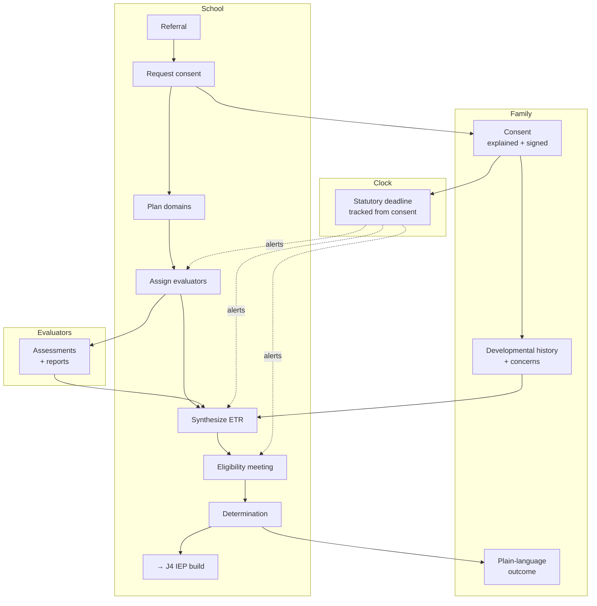

# J3 — Evaluation & Eligibility (ETR)

**Mode:** A / B
**Personas:** [Steph ◆](../personas/case-manager.md) · [Priya ○](../personas/service-provider.md) · [Dennis ○](../personas/school-admin-lea.md) · [Karen ○](../personas/district-sped-director.md) · [Dana/Rosa ○](../personas/parent-primary.md) · [Alex ○](../personas/student-transition.md)
**Trigger:** A referral for evaluation (parent request, teacher/intervention-team referral) or a three-year re-evaluation coming due
**Success:** A defensible eligibility determination, made on time, that the family understood and participated in
**Duration:** Statutory — commonly 60 days from consent to determination, with state variation
**Status:** Parent-side ETR viewing exists; the school-side evaluation *process* does not

## Why this journey matters more than its visibility suggests

The ETR is where **eligibility** — whether a child receives special education at all — is decided, and it's where the data that drives every subsequent IEP is generated. Present levels, service recommendations, and goal baselines all trace back to here.

It's also the journey with the **hardest clock in special education.** The evaluation timeline is a bright-line statutory deadline. Missing it is a compliance violation with Karen's (P7) name attached, and it's the single most common finding in state monitoring.

And it's the **highest-anxiety moment for the family.** For a parent going through initial evaluation, this is the process that decides whether their child's difficulty is recognized. Dana at J3 is more frightened than Dana at any other stage.

## Preconditions

- A referral exists
- Parent consent for evaluation has been obtained (itself a timeline-starting event)
- Evaluators are assigned across the relevant domains

## Stages

| # | Stage | Actor | What they do | System / AI | Feeling | Failure mode |
|---|---|---|---|---|---|---|
| S1 | **Referral** | Steph/Dennis | Records the referral and its source | Open the case; start the statutory clock; identify the determination deadline | Procedural | Referral tracked in email; clock starts unrecorded |
| S2 | **Consent** | Dana/Rosa | Receives and signs consent | Explain in plain language, in their language, what is being evaluated and what it means. Capture consent; **this event starts the legal clock** | Anxious, uninformed | A form signed without understanding — and the most consequential signature in the process |
| S3 | **Plan the evaluation** | Steph | Determines domains and assigns evaluators | Suggest domains from the referral concern; check coverage against requirements | Organizing | A missed domain discovered at the eligibility meeting |
| S4 | **Parent & student input** | Dana, Alex | Contribute developmental history, concerns, observations; student contributes self-perception | **Structured input slots** — guided, asynchronous, in their language, not a blank form emailed home | Finally consulted | Input requested as a PDF attachment, returned late or never |
| S5 | **Assess** | Priya + evaluators | Conduct assessments and write reports | Track who owes what by when; single scoped submission per evaluator; deadline-aware | Workload pressure | Chasing five evaluators by email; one report arrives the morning of the meeting |
| S6 | **Synthesize** | Steph | Assembles the ETR from all sources | **AI drafts the summary from actual assessment data with citations**; converge findings; flag contradictions between evaluators | Time-pressured | Manually retyping findings from five reports at 9pm |
| S7 | **Determine eligibility** | Team + Dennis | Meets and decides eligibility and category | Present the evidence for each criterion; ensure required participants; document the reasoning | Consequential | A determination whose rationale isn't recorded and can't be defended later |
| S8 | **Explain the outcome** | Dana/Rosa | Learns whether their child qualifies and what it means | Plain-language explanation of the determination, the category, and what happens next — in their language, same day | Relief or grief; often confusion | A 30-page report handed over with "we'll be in touch about the IEP" |
| S9 | **Hand off** | Steph | Carries ETR findings into the IEP | Present levels, baselines, and recommendations flow into the [J4](J4-collaborative-iep-build.md) draft automatically | Continuity | Re-entering everything the ETR already established |

## Swimlane

## Fallbacks & Degradations

- **Mode B — family doesn't respond to input requests.** The evaluation proceeds. Document the attempts (this documentation is itself legally valuable), use existing records for developmental history, and never let a missing parent input block the timeline.
- **Parent declines consent** — the process stops. The product must handle a closed, non-eligible case cleanly rather than leaving an orphaned open record.
- **Determination is "not eligible"** — a real and common outcome that the product must handle with as much care as eligibility. The family needs an explanation and their appeal rights, and the case closes without an IEP.
- **Evaluator misses their deadline** — escalate to Steph, then Dennis, before the statutory date is at risk, not after.
- **Re-evaluation with no new testing** — teams may determine existing data is sufficient. This is a distinct, lighter path that still requires documented agreement.
- **Rosa (P2)** — consent, input requests, and the outcome explanation must all be in Spanish, at the time they happen. Consent signed without comprehension is the most serious failure in this journey.

## Gap vs. today

| Capability | Status |
|---|---|
| ETR documents: upload, parse, view (parent side) | **Exists** (`etr-documents` feature, viewer, list) |
| School-side student records and assigned staff | **Exists** |
| **Evaluation as a process/case object** | **Missing** — ETRs exist only as documents |
| **Statutory timeline tracking from consent** | **Missing** — no deadline model anywhere in the product |
| **Consent capture and explanation** | **Missing** |
| **Structured parent/student input collection** | **Missing** |
| **Multi-evaluator assignment and submission tracking** | **Missing** |
| **AI synthesis of ETR from assessment data** | **Missing** |
| **Eligibility determination recording with rationale** | **Missing** |
| **Plain-language outcome explanation** | **Missing** |
| **ETR → IEP data handoff** | **Missing** — no flow from ETR findings into authoring |
| **Bilingual consent and communication** | **Missing** |

## Design Implications

1. **Model the evaluation as a case with a clock**, not as a document that eventually appears. The deadline is the organizing object; consent is the event that starts it. This is the single most valuable school-side capability the product could add, and it doesn't exist.
2. **Consent is a designed experience, not a form.** It's the moment a legally binding decision is made by the least-informed participant. Explain it, in their language, before asking for a signature — and record that the explanation was provided.
3. **Structured input slots for family and student**, guided and asynchronous, replacing the emailed blank form. Developmental history is information only the family has, and the current collection method reliably fails to get it.
4. **Evaluator coordination is a system job.** Who owes what, by when, with escalation before the statutory date is at risk. Priya (P5) should receive one scoped request, not a chain of emails.
5. **AI synthesis must cite everything.** Steph will accept a drafted summary; Steph will never accept an uncited finding. A fabricated score in an ETR is a career-level event.
6. **Handle "not eligible" as a first-class outcome** with the same care as eligibility — explanation, rights, clean case closure.
7. **ETR findings flow directly into the IEP draft.** Present levels and baselines exist here; re-entering them in J4 is the exact duplication Steph will not tolerate.
8. **The family-facing outcome is same-day and plain-language.** The gap between the determination meeting and the family's understanding of it is where distrust is manufactured.

## Success Metrics

- % of evaluations completed within the statutory timeline (the number Karen reports to the state)
- Days from consent to determination, distribution not just average
- % of evaluations with documented family input received
- Evaluator on-time submission rate
- Time Steph spends synthesizing the ETR (before/after)
- % of families who can state the determination and its meaning afterward — segmented by language

## Resolved Decisions

- **We are the system of record.** *(2026-08-03.)* We own the ETR document itself, not just coordination around it — so S6 synthesis produces the actual evaluation report, and S7's determination record is the district's legal record of eligibility.

## Open Questions

- Evaluation timelines vary by state (60 days is common; some states differ, and school-day vs. calendar-day rules vary). How much state-specific configuration is required?
- Do we host assessment data, or only the narrative reports? Hosting raw protocol data has real privacy and licensing implications.
- Is the eligibility *meeting* the same product surface as the IEP meeting ([J6](J6-meeting-day.md)), or a distinct one?
- Independent educational evaluations (IEEs) obtained by the family — do they enter the process here, and how?
