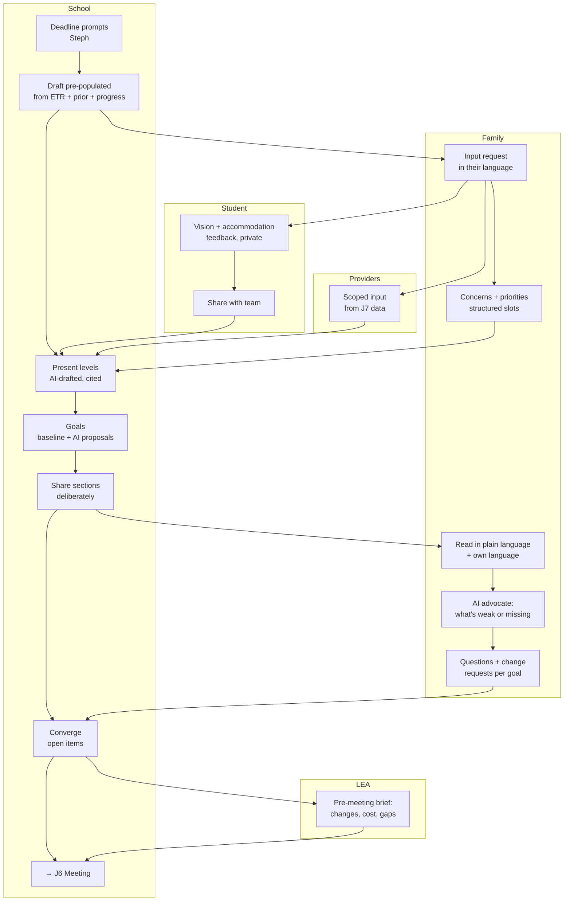

# J4 — Collaborative IEP Build

**Mode:** A (both sides) — degrades to [J5](J5-school-only-fallback.md) at any point
**Personas:** [Steph ◆](../personas/case-manager.md) · [Dana ◆](../personas/parent-primary.md) · [Rosa ◆](../personas/parent-multilingual.md) · [Alex ○](../personas/student-transition.md) · [Priya ○](../personas/service-provider.md) · [Dennis ○](../personas/school-admin-lea.md)
**Trigger:** An annual review approaching, an eligibility determination completed ([J3](J3-etr-eligibility.md)), or a requested amendment
**Success:** The family arrives at the meeting having already read, understood, and contributed to the draft — and the meeting is a conversation rather than a reading
**Duration:** 2–4 weeks before the meeting
**Status:** **The flagship journey.** It is also the one that barely exists today

---

## The core idea

Today, in nearly every district: the school writes the IEP, then presents it. The parent's first real encounter with the document is the meeting itself, where changing anything means objecting to finished work in front of professionals on a clock. "Parent participation" is technically satisfied and functionally absent.

The target: **one living document, visible to all parties as it forms, with contribution rights scoped by role.**

- The **school authors and holds legal sign-off** — this is non-negotiable, both legally and for Steph's (P4) and Karen's (P7) willingness to adopt.
- The **family and student contribute through structured, first-class slots** — concerns, vision, input on proposed goals — that are *part of the document*, not comments attached to the side.
- **Steph shares the draft as a whole, when it's ready.** Nothing is family-visible until that moment.

That last point is the compromise that makes the whole thing viable. A live open draft — where a parent watches Steph type a half-formed present-levels statement — is professionally unacceptable and would kill school adoption. **A deliberate share of a coherent draft** gets the collaboration benefit without the hazard, and gives the family the complete picture they need to analyze it and respond meaningfully.

## Preconditions

- Student exists in the district's roster with Steph assigned
- Family has accepted a link ([J2](J2-school-onboarding.md)); if not, this is Mode B → [J5](J5-school-only-fallback.md)
- Prior IEP and/or ETR findings available
- Meeting date scheduled (this is the clock everything hangs on)

## Stages

| # | Stage | Actor | What they do | System / AI | Feeling | Failure mode |
|---|---|---|---|---|---|---|
| S1 | **Open the cycle** | Steph | Starts the annual IEP ~4 weeks out | Prompted by the deadline, not by memory. Create the draft **pre-populated** from prior IEP + ETR + progress data | Relieved it's started | Steph remembers late; the draft starts blank |
| S2 | **Solicit input** | System | Requests input from family, student, and providers *before* drafting | Structured, guided, asynchronous requests in each recipient's language, with a real deadline | — | Input requested after the draft is written, making it decorative |
| S3 | **Family input** | Dana / Rosa | Writes concerns, priorities, what's working and what isn't | Guided prompts, not a blank box. Rosa writes Spanish; team receives English; **both stored** | Heard, for once | A blank "parent concerns" field emailed home two days before |
| S4 | **Student input** | Alex | Records their vision, preferences, which accommodations help | Low-pressure, phone-native, over several days; **private until Alex shares** | Consulted, not managed | One cold question at the meeting table |
| S5 | **Provider input** | Priya | Submits progress data and section input | One scoped request, under a minute, from J7 data already recorded | Neutral | Chased by email; written from memory |
| S6 | **Draft present levels** | Steph | Writes/reviews present levels | **AI drafts from actual data with citations**; every claim traceable to an assessment, note, or progress record | In control, faster | Uncited AI prose Steph must verify line by line — slower than writing it |
| S7 | **Draft goals** | Steph | The core authoring work | Baseline visible; AI proposes measurable goals grounded in it; accept/edit/reject inline; measurability and alignment checked live | **The moment the product earns its keep** | A form field. Generic goal-bank filler |
| S8 | **Share the draft** | Steph | Deliberately shares the **whole draft** once it's coherent | One share action; family notified in their language; draft state always legible to Steph | Deliberate | Accidental visibility of unfinished work — the thing Steph fears most |
| S9 | **Family reviews** | Dana / Rosa | Reads the complete draft in plain language, in their language | Explain each goal and service in plain language; **AI advocate flags what's weak, vague, or missing** across the whole document | Prepared instead of ambushed | A PDF in a portal a parent can't parse |
| S10 | **Family responds** | Dana / Rosa | Asks questions, requests changes, agrees to parts | Structured responses attached to specific goals/sections; agreement recorded per item | Participating | A single free-text reply nobody can act on |
| S11 | **Converge** | Steph | Resolves questions and requests before the meeting | Every open item visible in one place; resolved items marked; only genuine disagreements survive to the meeting | Prepared | Discovering the family's objections in the room |
| S12 | **Pre-meeting brief** | Dennis | Reads what's proposed, what changed, what it commits | Two-minute auto-generated brief; resource commitments flagged; procedural gaps listed | No surprises | Walking in cold |
| S13 | **Meeting** | All | → [J6](J6-meeting-day.md) | The meeting starts from a shared, understood draft | Substantive | — |

## Swimlane

## The visibility model

**Decided: the draft is shared as a whole, not section by section.**

Three states, applied to the entire draft:

| State | Who sees it | Set by |
|---|---|---|
| **Working** | School team only | Default; the draft's initial state |
| **Shared** | + family and student — the complete draft, read + respond | Steph, deliberately, once |
| **Proposed** | + formally on the table for the meeting; agreement tracked per item | Steph, when the draft is meeting-ready |

**Why whole-draft rather than per-section.** Per-section sharing looked safer but is worse for both sides. The family can't analyze a partial document — services, goals, and placement only make sense together, and a parent reading three of eight sections asks questions the missing five would have answered. And it multiplies the back-and-forth: eight share decisions, eight notification moments, eight partial review passes, with Steph tracking who has seen what. One coherent share produces one informed review.

Requirements:
- **Steph always knows whether the draft is shared.** A single persistent, unambiguous state indicator.
- **Sharing is one deliberate act**, taken when the draft is coherent enough to be understood as a whole.
- **Re-sharing after revision is explicit**, with the family told what changed since they last read it.
- **Nothing auto-shares.** Not on a schedule, not on completion. Karen (P7) and Dennis (P6) will veto anything else.
- **A share can't be un-seen.** Don't offer a revoke that implies otherwise; offer a clear "this draft has been revised" instead.

**Consequence for staging:** S8 moves later and matters more. Steph works privately through S6–S7 and shares once the draft holds together. The family's review window (S9–S11) is therefore shorter and denser — which makes the deadline prompts in S1 and the pre-drafting input in S2–S5 more important, not less. If Steph starts late, the family's window disappears entirely.

## Fallbacks & Degradations

- **Family doesn't respond to input requests (S3)** — proceed. Steph is notified once, the attempt is documented, drafting continues on schedule. **No blocking state, no repeated nagging, no "waiting on parent" that Steph can't clear.**
- **Family doesn't review the shared draft (S9)** — the meeting proceeds as a traditional presentation. Degrades to [J5](J5-school-only-fallback.md) behavior without a mode switch.
- **Family engages late** — a parent who reads the draft the night before must still be able to submit responses that reach Steph before the meeting.
- **Family disagrees fundamentally** — the product records disagreement cleanly rather than pushing toward false consensus. Unresolved items are legitimate meeting content, and this is where due-process risk lives.
- **Student doesn't engage** — silently fine. Never surface a student's non-participation to their parent as a failure.
- **Mid-cycle staff change** — a new case manager inherits the draft with full context.
- **Rosa (P2)** — every stage in Spanish, simultaneously with the English. If translation lags authoring, Rosa's participation window closes.

## Gap vs. today

| Capability | Status |
|---|---|
| Educator authoring workspace, draft list, versions | **Partial** — workspace exists; authoring depth unknown |
| Finalized version shared to parent (read-only) | **Exists** (`parent-version-detail-page`) |
| Parent-side goals, analysis, meeting-prep | **Exists** (but on *uploaded* documents, not live drafts) |
| **Pre-populated draft from prior IEP + ETR + progress** | **Missing** |
| **AI drafting copilot (present levels, goals)** | **Missing** |
| **Baseline-aware goal workspace with measurability checks** | **Missing** |
| **Whole-draft share state (working → shared → proposed)** | **Missing** — today it's binary: draft (hidden) → finalized (shared) |
| **"What changed since you last read it"** | **Missing** |
| **Structured family input slots** | **Missing** |
| **Student input surface** | **Missing** |
| **Provider scoped input requests** | **Missing** |
| **Per-goal family responses / agreement tracking** | **Missing** |
| **Plain-language rendering of a live draft** | **Missing** |
| **AI advocate analysis on a shared draft** | **Missing** — analysis exists only on parsed uploads |
| **Bilingual simultaneous authoring/reading** | **Missing** |
| **Meeting dates / deadline-driven prompts** | **Missing** |
| **Pre-meeting brief for the LEA rep** | **Missing** |

## Design Implications

1. **The draft is never blank.** Prior IEP + ETR findings + progress data → a real starting draft. Without this, Steph's adoption case collapses and every downstream stage starts late.
2. **The goal workspace is the product's center of gravity.** Baseline data visible beside the goal being written, AI proposals inline, one keystroke to accept/edit/reject, measurability validated as you type. This deserves more design investment than any other screen in the application.
3. **Whole-draft sharing, author-controlled, always legible.** One deliberate share of a coherent document — the precondition for schools tolerating a shared workspace at all, and the only way the family gets a picture complete enough to analyze. Revisions after sharing need a "what changed" summary, not a re-share ceremony.
4. **Input is solicited before drafting, not after.** Input collected after the draft exists is decoration, and families can tell.
5. **Structured slots, not blank boxes.** "What are your concerns?" gets a shrug. "What's one thing that worked this year, and one that didn't?" gets usable input.
6. **Family responses attach to specific items.** A per-goal question is actionable; a free-text email is not. This also produces the per-item agreement record Dennis (P6) needs.
7. **AI serves opposing parties simultaneously and honestly.** It helps Steph write the goal *and* helps Dana see the goal is vague. That tension is the product's integrity, and it must be designed deliberately — the parent-side advocate must not be softened because the school is a customer.
8. **Translation is simultaneous, not a publishing step.** When Steph shares a section, Rosa can read it in Spanish immediately.
9. **Every degradation is silent to the school.** Steph's timeline and workflow are identical whether the family participates fully or not at all.
10. **Deadlines drive the journey.** The whole cycle is prompted by a date. Without a timeline model, S1 never fires and everything else is late.

## Success Metrics

- % of meetings where the family read the draft beforehand — **the headline metric for this journey**
- % of IEPs with family input recorded *before* drafting started
- Number of items resolved before the meeting vs. surfaced in it
- Steph's authoring time per IEP (before/after)
- % of goals accepted from AI proposals without heavy editing
- Family-reported "I understood the draft before the meeting" — segmented by language
- Student input recorded, for transition-age students
- **Counter-metric:** unintended-visibility incidents. Must be zero

## Resolved Decisions

- **We are the system of record.** *(2026-08-03.)* This journey authors the legal document. S6–S8 are real authoring, not assist-and-sync. Consequences: state-prescribed form variance, e-signature, and prior written notice all land inside this journey's eventual scope.
- **Whole-draft sharing, not section-by-section.** *(2026-08-03.)* See the visibility model above.

## Open Questions

- How much do state-prescribed IEP form variations constrain the authoring model? (Now unavoidable — we own the output.)
- Should a district be able to disable parent draft visibility by policy? (Some will demand it — likely yes.)
- Where's the line between "AI advocate helps the parent" and "AI advocate coaches toward due process"? A parent-side feature that increases litigation would end school-side adoption.
- E-signature and prior-written-notice generation are now in scope (system of record) — when, not whether.
- When both parents have accounts in separate households, whose input is "the family's"?
