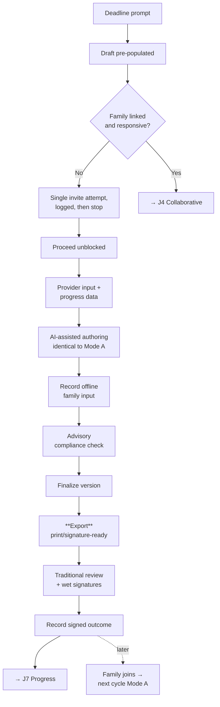

# J5 — School-Only Fallback

**Mode:** B
**Personas:** [Steph ◆](../personas/case-manager.md) · [Dennis ○](../personas/school-admin-lea.md) · [Karen ○](../personas/district-sped-director.md) · [Priya ○](../personas/service-provider.md)
**Trigger:** The family isn't on the platform, doesn't respond, or the district has disabled family collaboration by policy
**Success:** Steph produces a complete, compliant IEP on time and **gets it out of the system** for traditional review — with no added friction versus not using the product at all
**Duration:** Same cycle as [J4](J4-collaborative-iep-build.md)
**Status:** Partially exists as a side effect; not designed as a supported path

---

## Why this is a first-class journey, not an error state

**Most IEPs will be written this way**, at least for the first several years:

- Districts adopt before families do — for a while the school side is live and no parent has a login
- Many families won't engage regardless. Working multiple jobs, no reliable internet, language barriers, prior bad experiences, or simply trust that the school has it handled
- Some districts will **disable** family collaboration by policy

If Mode B feels like a degraded version of the product, the product is unusable for most of its actual use. The design bar: **Steph's experience in Mode B is indistinguishable from Mode A minus the family lanes.** No warnings, no blocked states, no nagging, no "incomplete" framing because a parent didn't reply.

The second requirement is the one that makes Karen (P7) comfortable signing: **the document must be able to leave.** Whatever we produce has to become a real artifact the district can print, email, sign on paper, and file — the way IEPs have always been reviewed.

## Preconditions

- Student in the roster, Steph assigned
- No linked family account, or a linked account that isn't responding, or an org policy disabling collaboration

## Stages

| # | Stage | Actor | What they do | System / AI | Feeling | Failure mode |
|---|---|---|---|---|---|---|
| S1 | **Open the cycle** | Steph | Starts the draft on the deadline prompt | Pre-populate from prior IEP, ETR, progress data — identical to J4/S1 | Normal | Any hint that this cycle is second-class |
| S2 | **Attempt contact** | System | Invites the family once, in their likely language | One invitation, one reminder, then stop. **Record the attempt** — the documentation itself has legal value | Neutral | Repeated nagging that damages the school relationship with the family |
| S3 | **Proceed** | Steph | Drafts without waiting | **No blocking state.** No "awaiting parent input" badge that can't be cleared | Unimpeded | A workflow that stalls pending a response that will never come |
| S4 | **Gather internal input** | Priya + team | Provider input and progress data | Same scoped requests as J4/S5 — the internal collaboration is unaffected | Normal | — |
| S5 | **Author** | Steph | Present levels and goals | Same AI drafting copilot, same goal workspace, same citations as J4 | Productive | A reduced AI experience because the family isn't present |
| S6 | **Substitute for family input** | Steph | Records family input obtained by other means — a phone call, a conference, a paper form returned | A place to enter input received offline, attributed and dated | Diligent | No way to record that the parent *did* participate, just not through the app |
| S7 | **Compliance check** | Steph | Verifies completeness before finalizing | Ambient, advisory checks: required sections, measurable goals, service minutes, documented contact attempts | Confident | A hard gate that blocks finalization over a professional judgment |
| S8 | **Finalize** | Steph + Dennis | Locks the version | Immutable version; who finalized, when | Done | An accidental finalize with no correction path |
| S9 | **Export** | Steph | **Gets the document out** | Produce a complete, correctly formatted document — print-ready, signature-ready, in the district's expected format | Relieved | An export that doesn't look like an IEP and can't be used |
| S10 | **Traditional review** | Steph/Dennis | Paper or email review, meeting, wet signatures | The product steps aside gracefully and doesn't fight the paper process | Familiar | A product that insists on owning a process it can't complete |
| S11 | **Record the outcome** | Steph | Enters what was signed and agreed | Capture the signed outcome and any in-meeting changes so the record stays true | Closed | A system record that diverges from the signed paper document — worse than no record |
| S12 | **Family may join later** | Dana | Accepts a link months later | Their child's history is there, in their language. Next cycle is Mode A | Late but welcome | History unavailable because it was authored "school-only" |

## Swimlane

## Fallbacks & Degradations

*This journey **is** the fallback. Its own degradations:*

- **Family engages partway through** — upgrade to Mode A mid-cycle without restarting. Steph shares what's appropriate at that point.
- **Family engages after finalization** — they get the finalized version with plain-language explanation ([J1](J1-parent-only-adoption.md)-style value on a school-authored document), and the next cycle is collaborative.
- **District policy forbids family access entirely** — an org-level setting; the family surface simply isn't offered for that district's students.
- **A district runs us alongside a legacy system during migration** — a transitional reality even though we're the system of record. Export must land cleanly in the legacy system for that window, or Steph is doing double entry and will stop using us.
- **Correction after finalization** — an amendment path that preserves the original version rather than editing history.

## Gap vs. today

| Capability | Status |
|---|---|
| Educator authoring workspace, drafts, versions | **Partial** |
| Immutable finalized versions | **Partial** (`IepVersion`; DB-trigger immutability noted as an open item) |
| Parent invite/link with acceptance tracking | **Exists** |
| **Export to print/signature-ready document** | **Missing** — the hard requirement of this journey |
| **District-format / state-form output** | **Missing** |
| **Advisory compliance checking** | **Missing** |
| **Recording offline family input** | **Missing** |
| **Documented contact attempts** | **Partial** — invites are tracked; not framed as compliance evidence |
| **Recording signed outcomes and in-meeting changes** | **Missing** |
| **Amendment path post-finalization** | **Missing** |
| **Org-level collaboration-off policy** | **Missing** |
| **Guarantee of no blocking "awaiting parent" states** | **Unverified** — needs an explicit audit of the authoring flow |

## Design Implications

1. **Export is a hard requirement, not a feature.** Without a document the district can print, sign, and file, the product cannot be used by a school in Mode B — which is most schools, most of the time. This is arguably the highest-priority missing school-side capability after the timeline model.
2. **Audit the authoring flow for blocking states.** Any UI that reads as "waiting on family," any progress indicator that can't reach complete without a parent, any checklist item Steph can't clear — each one is a daily irritation that accumulates into abandonment. This is a cheap fix and a large trust win.
3. **Contact attempts are compliance evidence.** Districts must be able to show they sought parent participation. Frame the record that way — it's a selling point for Karen (P7), not just plumbing.
4. **One invitation, one reminder, then silence.** Nagging families damages the school's relationship with them, and Steph will be the one who hears about it.
5. **Offline participation must be recordable.** Most family input in Mode B arrives by phone call or paper. If the product can't hold it, the product's record of participation is false — the worst possible outcome for a compliance artifact.
6. **Compliance checks are advisory, never blocking.** Steph overrides on professional judgment routinely and must always be able to.
7. **The system record must match the signed document.** If a paper meeting changed three goals, S11 must capture that. A confidently wrong record is worse than no record.
8. **Mode B history is fully preserved for a later Mode A.** Nothing authored school-only is lost or degraded when the family joins.
9. **Never label Mode B as incomplete.** No "0% family engagement" metrics shown to Steph. It's not their failure and framing it that way makes the product an accusation.

## Success Metrics

- **Parity:** Steph's authoring time and step count in Mode B vs. Mode A — should be indistinguishable
- Export success: % of finalized IEPs exported and actually used in the district's process
- Zero blocking states attributable to family non-participation (audited, not measured)
- % of Mode B cycles with documented contact attempts
- Mode B → Mode A conversion by the following cycle
- Record fidelity: divergence between the signed document and the system record

## Resolved Decisions

- **We are the system of record.** *(2026-08-03.)* This raises the stakes on S9 considerably: export isn't a convenience hand-off to the district's "real" system, because there isn't one. Our finalized document **is** the IEP, and the export is the artifact that gets signed and filed. It must be correct, complete, and in the district's expected form.

## Open Questions

- **What format does export need to be?** State-prescribed forms, district templates, or a professional generic PDF? Now the highest-priority unknown in this journey — as system of record we can't defer form fidelity.
- Do we need e-signature at launch, or is print-and-sign sufficient for the first several districts?
- How long do we retain Mode B documents for a family that never joins?
- Does the family ever get automatic access to a finalized IEP without the school explicitly sharing it?
