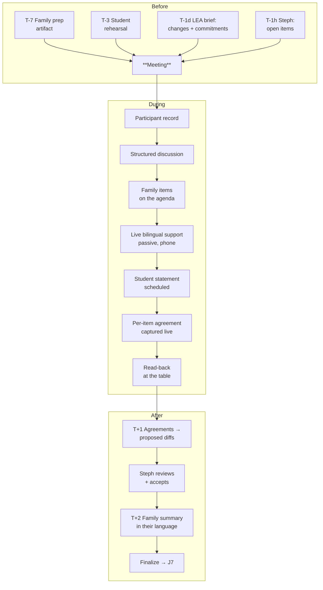

# J6 — Meeting Day

**Mode:** A / B
**Personas:** [Dennis ◆](../personas/school-admin-lea.md) · [Steph ◆](../personas/case-manager.md) · [Dana ◆](../personas/parent-primary.md) · [Rosa ◆](../personas/parent-multilingual.md) · [Alex ○](../personas/student-transition.md) · [Priya ○](../personas/service-provider.md)
**Trigger:** The scheduled IEP or eligibility meeting
**Success:** Everyone leaves understanding the same decisions, the family genuinely participated, and the document matches what was agreed **without a week of reconstruction**
**Duration:** 45–90 minutes, plus a 1-week shadow on either side
**Status:** Parent-side prep exists; the meeting itself has no product surface at all

---

## The hour everything converges on

This is the only moment when all personas are in the same place. It's also where the product has the least presence and the most to lose.

Three things reliably go wrong:

1. **Speed outruns comprehension.** Professionals discuss at professional pace. Dana parses it afterward in the car; Rosa parses it eight seconds behind and never catches up. Silence gets recorded as agreement.
2. **Agreements evaporate.** What was said in the room and what appears in the final document diverge. Nobody is lying — it's reconstruction from memory days later, and the family notices the difference.
3. **The room is adult-shaped.** Alex sits through an hour about themselves and is asked one question near the end.

The design constraint is severe: **almost nobody can meaningfully use software during this meeting.** Dana's phone is face-down. Steph is facilitating. Alex is being looked at. Priya is watching the clock.

Only **Dennis** (P6) reliably has a laptop open and a reason to use it. So the product's meeting-day surface is primarily Dennis's, and everything else is designed for **before** and **after**.

## Preconditions

- Draft exists; in Mode A it has been shared and reviewed ([J4](J4-collaborative-iep-build.md))
- Required participants invited with proper notice
- Interpreter arranged where needed

## Stages

| # | Stage | Actor | What they do | System / AI | Feeling | Failure mode |
|---|---|---|---|---|---|---|
| S1 | **T-7 days: family prepares** | Dana / Rosa | Reads the draft, builds questions, decides priorities | Prep artifact from [J4](J4-collaborative-iep-build.md)/S9–S10; printable; in their language | Getting ready | Nothing to prepare with — first sight of the draft is the meeting |
| S2 | **T-3 days: student prepares** | Alex | Rehearses what they want to say | Their vision statement, in their words, ready to read or hand over | Less exposed | Asked cold at the table |
| S3 | **T-1 day: LEA brief** | Dennis | Reads the two-minute brief | What's proposed, what changed, **what it commits the district to**, procedural gaps, family input received | Prepared | Walking in cold and deciding a placement on the spot |
| S4 | **T-1 hour: Steph preps** | Steph | Reviews open items | Unresolved questions, disagreements, required-participant check | Organized | Discovering the family's objections in the room |
| S5 | **Convene** | All | Introductions, participant record, procedural safeguards | Record who attended in what role — a required element that is routinely reconstructed later | Formal | Participant record written from memory afterward |
| S6 | **Discuss** | All | Present levels, goals, services, placement | Structure to keep the meeting on track; time awareness so transition planning isn't squeezed out | Substantive or overwhelming | One contentious goal eats the hour |
| S7 | **Family participates** | Dana / Rosa | Raises concerns, asks questions, pushes back | In Mode A, their pre-submitted items are **on the agenda**, so participating doesn't require interrupting professionals | Equal footing | Silence read as agreement |
| S8 | **Rosa keeps pace** | Rosa | Follows in real time | Live bilingual support on their phone, passive, no interaction required — supplementing, never replacing, the interpreter | Included | Understanding eight seconds late, permanently |
| S9 | **Student speaks** | Alex | Shares their vision and accommodation feedback | Their prepared statement is a scheduled agenda item, not an afterthought | Taken seriously | One token question at minute 52 |
| S10 | **Decide** | Team + Dennis | Reach agreement item by item; Dennis commits district resources | Capture agreements **as they're made**, per item — including explicit disagreements | Resolved | "We'll write it up and send it" |
| S11 | **Close** | Dennis / Steph | Confirm what was agreed before anyone leaves | A read-back summary at the table — in both languages where needed | Aligned | Everyone leaves with a different understanding |
| S12 | **T+1 day: reconcile** | Steph | Turns the meeting into document changes | Captured agreements → **proposed diffs** Steph reviews and accepts | Fast, accurate | Reconstructing an hour from handwritten notes on Thursday |
| S13 | **T+2 days: family confirms** | Dana / Rosa | Sees what was recorded | Plain-language summary in their language: what was decided, what changed, what happens next | Trust preserved | The final document doesn't match their memory of the room |

## Swimlane

## Fallbacks & Degradations

- **Mode B — family absent.** The meeting proceeds; capture and reconciliation still deliver most of the value to Steph and Dennis. Note the absence factually, without editorializing.
- **Virtual or hybrid meeting** — increasingly common, and it changes everything: capture is easier, live translation is more feasible, reading the room is harder.
- **No consent to record** — capture must degrade to manual/structured note-taking. Consent is per-meeting, per-participant, and never assumed.
- **Interpreter is late or absent** — a real and common failure. Our live support helps but must never be presented as satisfying the district's obligation, and the meeting may legally need to be rescheduled.
- **The family brings an advocate or attorney** — the tone changes completely. The product should not react to this at all; anything that looks like the system treating an advocated family differently is a serious hazard.
- **Meeting runs out of time and reconvenes** — a partial meeting with continuation is a normal state that must be modeled, not an abandoned one.
- **Alex doesn't want to speak** — completely fine, silently.

## Gap vs. today

| Capability | Status |
|---|---|
| Parent-side meeting-prep tab and checklists | **Exists** |
| Parent-side analysis to build questions from | **Exists** |
| **Any school-side meeting surface** | **Missing** |
| **Meeting as a scheduled object with a date** | **Missing** — no meeting model anywhere |
| **LEA pre-meeting brief** | **Missing** |
| **Participant/attendance record** | **Missing** |
| **In-meeting agreement capture** | **Missing** |
| **Meeting notes → proposed document diffs** | **Missing** |
| **Live bilingual meeting support** | **Missing** |
| **Post-meeting family summary** | **Missing** |
| **Consent management for recording** | **Missing** |
| **Student participation surface** | **Missing** |

## Design Implications

1. **The meeting is an object, not a date on a document.** Scheduled, with participants, an agenda, agreements, and outcomes. Nearly every capability in this journey depends on that model existing — and it's the same model that drives [J4](J4-collaborative-iep-build.md)/S1's deadline prompts.
2. **Design for before and after; be nearly invisible during.** The only in-meeting surfaces worth building are Dennis's capture view and Rosa's passive phone support. Anything requiring active attention from Steph or Dana will go unused.
3. **The LEA brief is small, high-value, and cheap.** Two minutes, phone-readable, auto-generated, with resource commitments flagged. It's the best effort-to-value ratio in the school surface.
4. **Capture agreements per item, live.** The gap between the room and the document is where trust is lost and due process begins. Per-item capture also produces the participation evidence Karen (P7) needs.
5. **Notes become proposed diffs, never auto-applied.** Steph reviews and accepts. Nothing enters a legal document without human approval.
6. **Live bilingual support must be passive.** Rosa is listening, not operating a phone. Ambient, glanceable, zero interaction. And it is explicitly a supplement to the interpreter — say so in the product, for Karen's sake and for honesty's.
7. **Give the student a scheduled slot.** Not "any questions, Alex?" at minute 52 — an agenda item with prepared content. This is the cheapest possible fix to the tokenism problem.
8. **The post-meeting family summary closes the loop.** Two days later, in their language: here's what was decided. It's the single highest-trust artifact in the entire product and it doesn't exist.
9. **Consent for any recording is explicit, visible to the room, and revocable.** Get this wrong once and Karen ends the contract.
10. **Read-back before anyone leaves.** A 90-second summary at the table prevents most divergence, costs nothing, and needs only a screen.

## Success Metrics

- % of meetings where the family had reviewed the draft beforehand
- Family-reported understanding immediately after — segmented by language
- Time from meeting to finalized document (target: same or next day)
- Divergence between captured agreements and the final document
- % of meetings with a complete participant record
- % of transition-age meetings where the student contributed prepared content
- % of meetings ending on time with all required topics covered
- **Counter-metric:** due-process filings and facilitated-IEP requests

## Open Questions

- Do we record/transcribe meetings at all? The value is high and the legal exposure is real — this needs a deliberate decision with counsel, not a default.
- Is live bilingual meeting support technically viable at the quality required for clinical vocabulary? Below a certain accuracy it's actively harmful.
- Is the eligibility meeting ([J3](J3-etr-eligibility.md)/S7) the same surface as the IEP meeting, or distinct?
- Do virtual meetings deserve dedicated support (an integrated meeting view), or do we stay platform-agnostic?
- Who owns the meeting record legally, and what are its retention obligations?
- Should the family be able to see the captured agreements in real time during the meeting?
