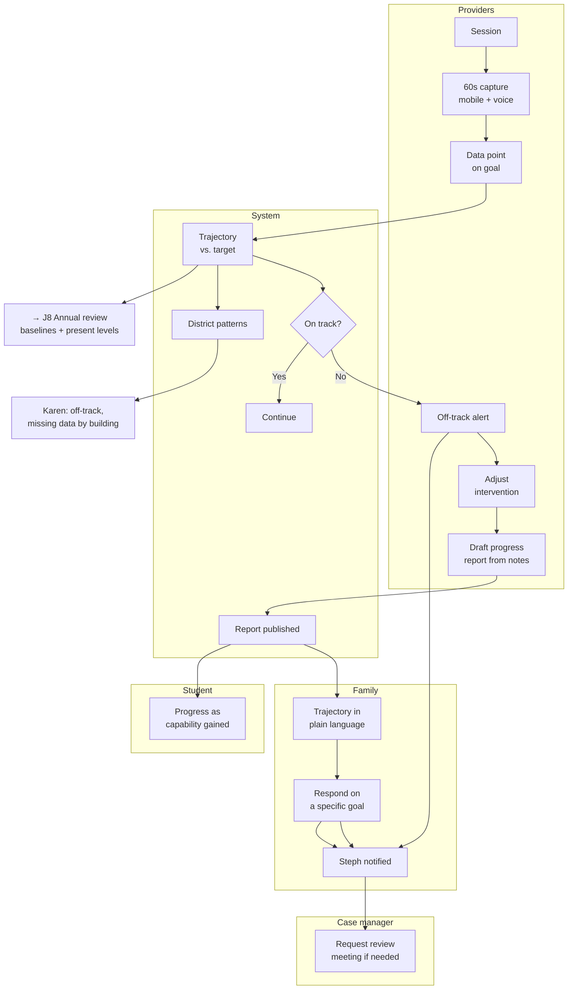

# J7 — Progress Monitoring

**Mode:** A / B / C
**Personas:** [Priya ◆](../personas/service-provider.md) · [Steph ◆](../personas/case-manager.md) · [Dana ○](../personas/parent-primary.md) · [Rosa ○](../personas/parent-multilingual.md) · [Alex ○](../personas/student-transition.md) · [Karen ○](../personas/district-sped-director.md)
**Trigger:** Continuous — services begin the day the IEP takes effect
**Success:** A goal that isn't working is identified and changed **during** the year, not documented as unmet at the annual review
**Duration:** ~10 months, the longest journey in the product
**Status:** Parent-side progress-report viewing exists; the data-generation side does not

---

## The journey where plans quietly fail

Every other journey is an event. This one is the 10 months in between — and it's where the IEP either works or doesn't.

The dominant failure pattern is well known and almost never caught in time:

> Q1: "Progressing." Q2: "Progressing." Q3: "Progressing." Q4: "Goal not met."

Nobody lied. The goal was ambitious, progress was slower than needed, and no one compared the trajectory against the target until the year was over. **The information to catch it existed by November.** The plan simply had no mechanism to notice.

Fixing that requires two things the product doesn't have: **data captured close to when it's generated** (Priya's problem), and **trajectory compared against target continuously** (nobody's job today).

The parent-side stake is different and equally real: Dana's core question — *is this working?* — is currently answered by a word on a form.

## Preconditions

- IEP in effect with measurable goals and stated baselines
- Service providers assigned and delivering
- Reporting periods defined (typically quarterly, aligned to report cards)

## Stages

| # | Stage | Actor | What they do | System / AI | Feeling | Failure mode |
|---|---|---|---|---|---|---|
| S1 | **Deliver** | Priya + staff | Provide services and instruction | — | Routine | — |
| S2 | **Capture** | Priya | Records what happened and a data point | **60-second capture immediately after the session.** Mobile, voice-capable, student pre-selected | Neutral (the goal) | Reconstructing 52 students on Friday from memory |
| S3 | **Accumulate** | System | Builds a trajectory per goal | Plot progress against the baseline and the target date | — | Data points that never become a picture |
| S4 | **Detect** | System | Notices off-track goals early | Compare trajectory to target; flag *by November*, not in May. Alert **Priya first** — she can change the intervention | — | Detection at the annual review, when it's a finding rather than an opportunity |
| S5 | **Adjust** | Priya / Steph | Changes the intervention | Record what changed and when, so the next review knows what was tried | Responsive | Off-track flagged and nothing happens |
| S6 | **Report** | Priya / Steph | Produces the quarterly progress report | **Drafted from captured session data**, reviewed and sent — not rewritten from scratch | Fast | Writing the same observations a third time |
| S7 | **Family reads** | Dana / Rosa | Learns whether it's working | Trajectory, not a status word: "40% at Q3 against an 80% year-end target." Plain language, their language | Informed | "Progressing" — a word that means nothing |
| S8 | **Family responds** | Dana / Rosa | Asks a question or raises a concern | A response path attached to the specific goal, routed to Steph | Engaged | The report is a dead-end PDF |
| S9 | **Student sees** | Alex | Sees their own progress | Framed as capability gained, in their words | Motivated, occasionally | A deficit dashboard |
| S10 | **Escalate** | Steph / Dana | Calls a review meeting when a goal is clearly failing | Make "request an IEP review" a normal, low-friction action for either party | Proactive | Waiting for the annual review because that's the only defined moment |
| S11 | **Oversee** | Karen | Sees district-wide patterns | Off-track goals by building, missing progress data, goals never reported on | Informed | Discovering at year-end that a building reported nothing |
| S12 | **Feed forward** | System | Carries the year's data into the next cycle | Progress data becomes present levels and baselines in [J8](J8-annual-review.md) / [J4](J4-collaborative-iep-build.md) | Continuity | Starting next year's present levels from scratch |

## Swimlane

## Fallbacks & Degradations

- **Mode C (parent-only)** — Dana uploads school-issued progress reports; the product extracts and charts the trajectory. **This is the most valuable Mode C feature after initial understanding** and works with no school involvement at all: four quarterly reports become a trend line the school never drew.
- **Mode B** — internal capture and detection work fully; the family gets whatever the district sends by its normal means.
- **Provider doesn't capture data** — escalate to Steph before the reporting deadline, not after. Missing data is itself a compliance signal Karen needs.
- **Goal isn't measurable** — a goal written vaguely in [J4](J4-collaborative-iep-build.md) can't be monitored here. This is the strongest possible argument for the measurability checks in J4/S7, and the product should be able to say so plainly.
- **Data exists elsewhere** (gradebook, assessment platform, therapy system) — import rather than demanding re-entry, or Priya won't participate.
- **Off-track for good reasons** (illness, absence, a placement change) — allow context to be recorded so the flag doesn't become a false accusation.

## Gap vs. today

| Capability | Status |
|---|---|
| Progress report viewer (parent side) | **Exists** (`progress-reports` feature, viewer page) |
| Goals extracted from parsed IEPs | **Exists** |
| Child goals tab | **Exists** |
| **Session-note capture** | **Missing** — no concept in the product |
| **Progress data points against goals over time** | **Missing** |
| **Trajectory vs. target visualization** | **Missing** |
| **Off-track detection and alerting** | **Missing** |
| **Progress reports authored from captured data** | **Missing** — reports are viewed, not created |
| **Mobile capture surface** | **Missing** |
| **Family response on a specific goal** | **Missing** |
| **Student progress view** | **Missing** |
| **District-level progress patterns** | **Missing** |
| **Progress data → next year's present levels** | **Missing** |
| **Bilingual progress reporting** | **Missing** |

## Design Implications

1. **Capture must cost under 60 seconds or it will not happen.** Mobile, voice-capable, student pre-selected, one data point, immediately post-session. Every second of friction is multiplied by Priya's 52 students. This is the foundation the entire journey rests on — nothing downstream works without it.
2. **Trajectory, not status.** The central visual is progress against target over time. Replacing "progressing" with a line is the highest-value change for both Dana and Steph, and it's the only way S4 detection is possible at all.
3. **Detect early and alert the person who can act.** November, not May. Priya first, Steph second, Dennis only if unaddressed. An alert to someone who can't change the intervention is noise.
4. **Write once, use three times.** Session notes → progress report → present levels → annual review. This single chain is Priya's biggest win and Steph's second-biggest, and it removes the recall-based documentation that makes progress data unreliable today.
5. **Mode C progress tracking is a standalone product.** Uploading four quarterly reports and getting a real trend line is compelling with zero school involvement — and it's achievable with the parsing infrastructure that already exists.
6. **Progress reports are a two-way surface.** Dana reading "40% at Q3" needs a way to say "that concerns me" attached to that goal — the earliest possible intervention point and the cheapest way to prevent an escalation later.
7. **Make requesting a review meeting normal.** Either party, low friction. Today the annual review is the only defined moment, which is why failing goals run a full year.
8. **Frame progress for the student as capability**, in their words — the only framing that produces engagement rather than avoidance.
9. **Give Karen missing-data visibility.** A building that reports nothing is both a compliance risk and an early warning that adoption is failing there.
10. **Import where data already exists.** Priya will not re-enter what's in another system.

## Success Metrics

- **Median time from session to data capture** — the leading indicator for everything else
- % of goals with data in each reporting period
- % of off-track goals detected before Q3
- % of detected off-track goals that produced a documented intervention change
- Progress report authoring time (before/after)
- Family engagement with progress reports; % who respond
- % of goals met at annual review (the lagging outcome metric)
- Mode C: parents uploading successive progress reports over a year

## Open Questions

- Do we integrate with gradebooks, assessment platforms, or therapy documentation systems, or is capture always manual? This determines whether S2 is achievable at scale.
- Is there a standard for progress data across goal types (percentage, trials, rubric, frequency)? Goal types vary enormously and a single data model may not fit.
- Who owns off-track alerts if the provider is a contractor rather than district staff?
- Does the student see progress by default, or does the parent control that?
- How do we avoid off-track detection becoming a staff-performance signal? That's exactly the surveillance framing Steph and Priya would reject — and it would make the data less honest, not more.
