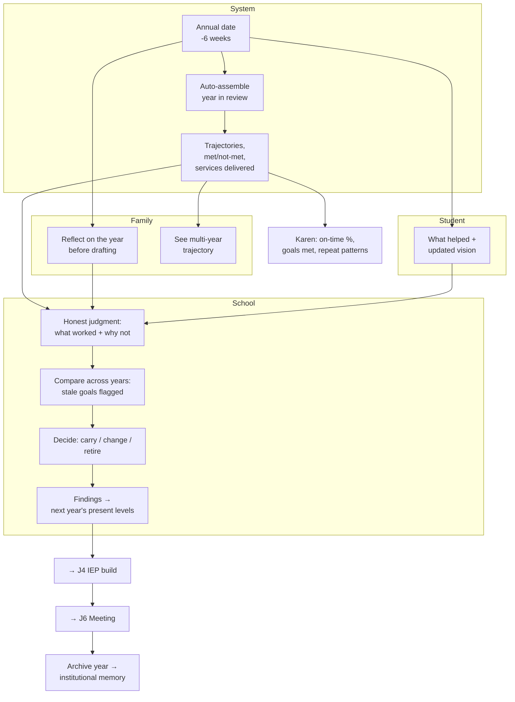

# J8 — Annual Review

**Mode:** A / B / C
**Personas:** [Steph ◆](../personas/case-manager.md) · [Dana ◆](../personas/parent-primary.md) · [Rosa ◆](../personas/parent-multilingual.md) · [Alex ○](../personas/student-transition.md) · [Priya ○](../personas/service-provider.md) · [Dennis ○](../personas/school-admin-lea.md) · [Karen ○](../personas/district-sped-director.md)
**Trigger:** The IEP's annual date approaching — a hard statutory deadline
**Success:** The team makes an honest judgment about what worked, and next year's plan is built on that judgment rather than on last year's document
**Duration:** 4–6 weeks
**Status:** Version comparison exists; the review *judgment* doesn't

---

## Where the loop closes — or short-circuits

The annual review is legally an evaluation of the past year and practically, far too often, a copy-forward. The pattern:

> Open last year's IEP → update the dates → adjust a few percentages → schedule the meeting.

It's compliant. It's also how a goal that didn't work gets rewritten unchanged for a third year, and how a parent notices the same sentence in three consecutive documents.

The cause isn't laziness — it's that **the honest version is much harder.** Answering "did this work, and why not?" requires progress data that's often incomplete, a comparison nobody has time to assemble, and a willingness to record that something failed.

The product's job here is to **make the honest version the fast version.** If reviewing the year's actual outcomes is easier than copying forward, the copy-forward stops.

This is also the journey where **the platform's memory beats any individual's**. Steph may be new. Dennis wasn't at last year's meeting. Dana remembers a promise nobody wrote down. The system holds three years of goals, progress, and agreements — and that continuity is one of the strongest arguments for the product existing.

## Preconditions

- IEP in effect approaching its annual date
- A year of progress data ([J7](J7-progress-monitoring.md)) — complete or not
- Team assigned, family linked or not

## Stages

| # | Stage | Actor | What they do | System / AI | Feeling | Failure mode |
|---|---|---|---|---|---|---|
| S1 | **Deadline surfaces** | System | The annual date approaches | Prompt Steph ~6 weeks out; escalate to Dennis, then Karen, if unaddressed | — | Discovered 10 days out; the whole cycle is compressed and quality collapses |
| S2 | **Year in review** | Steph | Sees what actually happened | **Auto-assembled:** each goal, its baseline, its target, actual trajectory, met/not-met, interventions tried, services delivered vs. prescribed | "I can see the year" | Assembling this manually — which is why it isn't done |
| S3 | **Honest judgment** | Steph + Priya | Determines what worked and why not | Prompt for the *why* per unmet goal — too ambitious? wrong intervention? insufficient service? absence? | Reflective | "Not met" recorded with no reason, guaranteeing the same goal next year |
| S4 | **Family reflects** | Dana / Rosa | Contributes their view of the year | Structured, in their language, **before** drafting: what improved at home, what didn't, what they want next year | Consulted first, not last | Asked for "concerns" after the draft is written |
| S5 | **Student reflects** | Alex | What helped, what didn't, what's next | Which accommodations they actually used; updated vision as it changes with age | Growing agency | Never asked |
| S6 | **Compare across years** | Steph / Dana | Sees multi-year trajectory | Goals across years side by side — including goals repeated with no change | Perspective | A goal in its third year, unnoticed |
| S7 | **Decide the shape** | Steph | Determines what carries forward, changes, or is retired | Flag stale/repeated goals; propose retirement of mastered ones; suggest new areas from the data | Deliberate | Copy-forward by default |
| S8 | **Build next year** | Steph | → [J4](J4-collaborative-iep-build.md) | The review's findings pre-populate present levels and baselines. **This is what "the draft is never blank" actually means** | Continuous | Present levels retyped from scratch |
| S9 | **Meeting** | All | → [J6](J6-meeting-day.md) | The meeting reviews the year *and* sets the next one | Substantive | The past year gets four minutes |
| S10 | **Close the loop** | System | Archives the year | The completed year becomes durable history: goals, data, decisions, rationale | Institutional memory | History lost at staff turnover |
| S11 | **District view** | Karen | Sees annual-review compliance and outcomes | On-time completion, goals met by building, repeated-goal patterns | Informed | Timeline violations found by the state first |

## Swimlane

## Fallbacks & Degradations

- **Mode C (parent-only)** — Dana uploads successive IEPs and the product does S6 unaided: multi-year comparison showing which goals repeat, which language is identical year over year, which services changed. **The version-comparison feature that already exists is the seed of the most persuasive thing the product can show a parent.**
- **Mode B** — the school-side review runs in full; the family gets the outcome by traditional means, and [J5](J5-school-only-fallback.md)'s export applies.
- **Progress data is sparse or missing** — say so plainly. "Insufficient data to judge this goal" is an honest finding and itself a signal worth acting on. Fabricating a judgment from no data is the worst available option.
- **Staff turnover mid-year** — the new case manager inherits full history. This is where the product's memory advantage is most visible and most valuable.
- **Student moves districts** — the family's Mode C record travels with them even when the district's doesn't. A real differentiator worth designing for.
- **Review is late** — a compliance event. Track and escalate; don't hide it.
- **Amendment instead of full review** — mid-year changes are a distinct, lighter path that shouldn't be forced through the full annual cycle.

## Gap vs. today

| Capability | Status |
|---|---|
| IEP version comparison | **Exists** (`iep-comparison`, comparison page) |
| Multiple IEPs per child with history | **Exists** |
| Goals extracted per document | **Exists** |
| Parent analysis across documents | **Partial** |
| **Annual date tracking and deadline prompts** | **Missing** — no timeline model |
| **Auto-assembled year-in-review** | **Missing** |
| **Met/not-met judgment with recorded rationale** | **Missing** |
| **Multi-year goal trajectory** | **Missing** (comparison is document-to-document, not goal-over-time) |
| **Stale/repeated goal detection** | **Missing** |
| **Family and student year-end reflection** | **Missing** |
| **Review findings → next draft pre-population** | **Missing** |
| **Services delivered vs. prescribed** | **Missing** |
| **District annual-review compliance view** | **Missing** |

## Design Implications

1. **The annual date is the product's master clock.** It drives S1 here, [J4](J4-collaborative-iep-build.md)/S1, and every escalation Karen (P7) needs. The timeline model is the highest-leverage missing capability in the entire product — it's the prerequisite for four of the eight journeys.
2. **Auto-assemble the year in review.** Every input exists in the system; nobody has time to gather it. Producing this one artifact automatically is the difference between honest review and copy-forward, and it's a direct consequence of [J7](J7-progress-monitoring.md)'s data capture.
3. **Require a reason for every unmet goal.** One structured field. It's what turns "not met" into a decision about next year instead of a fact to be restated.
4. **Detect repeated goals and surface them.** A goal appearing in its third year with unchanged language is the clearest possible signal, and it's invisible to everyone today — including the parent who half-remembers reading it before.
5. **Goals are entities that persist across documents.** Today goals belong to a parsed document. Modeling a goal as something with a life across years — created, revised, met, retired — is what makes trajectory, staleness detection, and honest review possible. This is a genuine data-model decision, not a UI one.
6. **Family reflection comes before drafting.** Same principle as [J4](J4-collaborative-iep-build.md)/S2, and the same failure if inverted.
7. **Findings pre-populate the next draft.** The loop only closes if S8 actually feeds [J4](J4-collaborative-iep-build.md)/S1. Otherwise the review is an artifact nobody reads.
8. **Multi-year comparison is the parent-side flagship.** In Mode C it needs nothing from the school and shows a parent something no one has ever shown them: their child's plan, over time, side by side.
9. **Archive with rationale, not just documents.** Why a goal was retired matters more in two years than the goal text does.
10. **Sparse data must be reported honestly.** "We can't judge this" is a finding. It's also, for Karen, an early warning about a building.

## Success Metrics

- % of annual reviews completed on time (Karen's state-reported number)
- % of unmet goals with a recorded reason
- % of goals repeated year-over-year with unchanged language — **should fall over time**
- % of reviews with family reflection recorded before drafting
- Steph's time to produce the year-in-review (target: near zero)
- % of next-year drafts pre-populated from review findings
- Goals met per year, trending
- Mode C: parents using multi-year comparison

## Open Questions

- Should goals be modeled as first-class entities with cross-year identity? This is the enabling data-model change for most of this journey — and it's a significant one.
- How do we handle a student whose IEP was written in another district or another system? Partial history is the normal case, not the exception.
- Does the product take a position on goal quality (flagging vague or unambitious goals to the school), or only present data? Taking a position is more valuable and more likely to make Karen nervous.
- Are amendments and re-evaluations ([J3](J3-etr-eligibility.md)) distinct cycles, or variations on this one?
- Multi-year trend visualization: how much value is there for a parent whose child has three years of data, and does it justify the modeling work?
