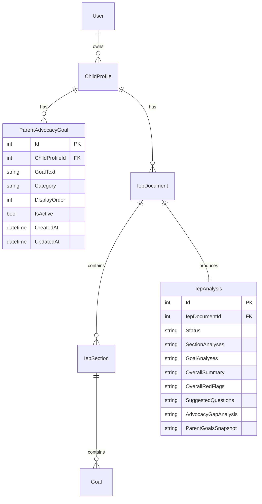

# feat: Parent Goal Advocacy System

## Overview

Parents define advocacy goals and priorities for their child. When an IEP is analyzed, the AI cross-references these parent goals against the IEP's official goals and produces a gap analysis — flagging which parent priorities are addressed, partially addressed, or missing from the IEP.

This is the platform's core differentiator: no other tool lets parents define what *they* want and then checks whether the IEP delivers (see brainstorm: `docs/brainstorms/2026-03-14-platform-features-brainstorm.md`).

## Problem Statement / Motivation

Parents often feel powerless in IEP meetings because they don't have a structured way to articulate their priorities or check whether the IEP addresses them. The current analysis tells parents what's in the IEP and flags issues — but it doesn't know what the parent *wants*. This feature closes that gap.

## Proposed Solution

### Three capabilities:

1. **Goal CRUD** — Parents create, edit, reorder, and delete advocacy goals on a child profile
2. **Analysis augmentation** — When parent goals exist, the Claude analysis prompt includes them and produces an additional "Advocacy Gap Analysis" section
3. **Staleness detection** — If goals change after an analysis, the UI shows a banner prompting re-analysis

## Technical Approach

### Data Model

#### New Entity: `ParentAdvocacyGoal`

```csharp
// api/IepAssistant.Domain/Entities/ParentAdvocacyGoal.cs
public class ParentAdvocacyGoal : BaseEntity, IAuditableEntity
{
    public int ChildProfileId { get; set; }
    public string GoalText { get; set; } = string.Empty;     // 10-500 chars
    public string? Category { get; set; }                      // "academic" | "behavioral" | "services" | "placement" | null
    public int DisplayOrder { get; set; }
    public bool IsActive { get; set; } = true;

    // Audit fields
    public DateTime CreatedAt { get; set; } = DateTime.UtcNow;
    public DateTime UpdatedAt { get; set; } = DateTime.UtcNow;
    public int? CreatedById { get; set; }
    public int? UpdatedById { get; set; }

    // Navigation
    public ChildProfile ChildProfile { get; set; } = null!;
}
```

#### New Column on `IepAnalysis`

```csharp
// Added to IepAnalysis entity
public string? AdvocacyGapAnalysis { get; set; }       // JSON - gap analysis results
public string? ParentGoalsSnapshot { get; set; }         // JSON - snapshot of goals at analysis time
```

#### ERD



### Gap Analysis Response Schema

When parent goals exist, Claude returns an additional `advocacyGapAnalysis` section:

```json
{
  "advocacyGapAnalysis": {
    "summary": "The IEP addresses 2 of your 4 priorities. Reading fluency and speech therapy are well-covered. Social skills and inclusion time are not addressed.",
    "goalAlignments": [
      {
        "parentGoalText": "Improve reading fluency to grade level",
        "parentGoalCategory": "academic",
        "alignmentStatus": "addressed",
        "alignedIepGoals": ["Goal 1: Student will read 120 wpm by May 2027"],
        "explanation": "Goal 1 directly targets reading fluency with a measurable target.",
        "recommendation": null
      },
      {
        "parentGoalText": "More time in general education classroom",
        "parentGoalCategory": "placement",
        "alignmentStatus": "not_addressed",
        "alignedIepGoals": [],
        "explanation": "The current placement section specifies 60% of time in special education with no plan to increase general education time.",
        "recommendation": "Ask the team: 'What would my child need to demonstrate to increase time in general education? Can we add a goal for this?'"
      }
    ]
  }
}
```

**Alignment statuses:** `"addressed"` | `"partially_addressed"` | `"not_addressed"`

### Staleness Detection Rules

An analysis is considered stale when:
- Any `ParentAdvocacyGoal` for the child has `CreatedAt` or `UpdatedAt` > `IepAnalysis.CreatedAt`
- OR the count of active goals differs from the `ParentGoalsSnapshot`

**Exceptions:**
- Reordering goals (`DisplayOrder` change only) does NOT trigger staleness — gap analysis is about content, not ordering
- Goals edited during an in-progress analysis: allow editing, show stale banner when analysis completes

### Implementation Phases

#### Phase 1: Backend — Entity, Repository, Service, Controller

**New files:**

| File | Pattern Source |
|------|---------------|
| `api/IepAssistant.Domain/Entities/ParentAdvocacyGoal.cs` | Follow `ChildProfile.cs` |
| `api/IepAssistant.Domain/Data/Configurations/ParentAdvocacyGoalConfiguration.cs` | Follow `ChildProfileConfiguration.cs` |
| `api/IepAssistant.Domain/Repositories/ParentAdvocacyGoalRepository.cs` | Follow `ChildProfileRepository.cs` (interface + impl) |
| `api/IepAssistant.Services/Models/ParentAdvocacyGoalModels.cs` | Follow `ChildProfileModels.cs` |
| `api/IepAssistant.Services/Interfaces/IParentAdvocacyGoalService.cs` | Follow `IChildProfileService.cs` |
| `api/IepAssistant.Services/Implementations/ParentAdvocacyGoalService.cs` | Follow `ChildProfileService.cs` |
| `api/IepAssistant.Api/DTOs/AdvocacyGoals/CreateAdvocacyGoalRequest.cs` | Follow `CreateChildProfileRequest.cs` |
| `api/IepAssistant.Api/DTOs/AdvocacyGoals/UpdateAdvocacyGoalRequest.cs` | Follow `UpdateChildProfileRequest.cs` |
| `api/IepAssistant.Api/DTOs/AdvocacyGoals/AdvocacyGoalDto.cs` | Follow `ChildProfileDto.cs` |
| `api/IepAssistant.Api/Controllers/AdvocacyGoalsController.cs` | Follow `ChildrenController.cs` |

**Modified files:**

| File | Change |
|------|--------|
| `api/IepAssistant.Domain/Data/ApplicationDbContext.cs` | Add `DbSet<ParentAdvocacyGoal>` |
| `api/IepAssistant.Domain/DependencyInjection.cs` | Register `IParentAdvocacyGoalRepository` |
| `api/IepAssistant.Services/DependencyInjection.cs` | Register `IParentAdvocacyGoalService` |

**API Endpoints:**

| Method | Route | Purpose |
|--------|-------|---------|
| GET | `/api/children/{childId}/advocacy-goals` | List active goals for a child (ordered by DisplayOrder) |
| POST | `/api/children/{childId}/advocacy-goals` | Create a new advocacy goal |
| PUT | `/api/advocacy-goals/{id}` | Update goal text, category, or display order |
| DELETE | `/api/advocacy-goals/{id}` | Soft-delete a goal |
| PUT | `/api/children/{childId}/advocacy-goals/reorder` | Batch reorder goals (accepts array of {id, displayOrder}) |

**Ownership validation:** Load goal → include ChildProfile → verify `ChildProfile.UserId == currentUserId`. Same pattern as `IepDocumentsController`.

**Validation rules:**
- GoalText: required, 10-500 characters, trimmed
- Category: optional, must be one of `academic`, `behavioral`, `services`, `placement` (or null)
- DisplayOrder: auto-assigned on create (max existing + 1), explicit on reorder
- Soft limit: max 10 active goals per child (return 400 if exceeded)

**EF Migration:** `dotnet ef migrations add AddParentAdvocacyGoals`

#### Phase 2: Backend — Analysis Augmentation

**Modified files:**

| File | Change |
|------|--------|
| `api/IepAssistant.Domain/Entities/IepAnalysis.cs` | Add `AdvocacyGapAnalysis` and `ParentGoalsSnapshot` string properties |
| `api/IepAssistant.Services/Models/IepAnalysisModels.cs` | Add `AdvocacyGapAnalysisResponse`, `GoalAlignmentResponse` models |
| `api/IepAssistant.Services/Implementations/IepAnalysisService.cs` | Augment `BuildIepContentForAnalysis` to append parent goals; augment system prompt with gap analysis instructions; parse gap analysis from Claude response; snapshot goals at analysis time |
| `api/IepAssistant.Api/DTOs/IepDocuments/IepAnalysisDto.cs` | Add `AdvocacyGapAnalysis` field |

**Prompt augmentation approach:**

In `BuildIepContentForAnalysis` (line ~133), after assembling IEP sections, append:

```
=== PARENT ADVOCACY GOALS ===
The parent has defined the following priorities for their child.
Analyze each parent goal against the IEP content and determine alignment.

Priority 1 [academic]: Improve reading fluency to grade level
Priority 2 [services]: Speech therapy at least 3 times per week
Priority 3 [placement]: More time in general education classroom
```

In the system prompt (line ~177), add instructions for the `advocacyGapAnalysis` response section with the JSON schema defined above.

**Snapshot:** When analysis runs, serialize the active parent goals to `ParentGoalsSnapshot` as JSON. This preserves what was analyzed even if goals change later.

**EF Migration:** `dotnet ef migrations add AddAdvocacyGapAnalysisColumns`

#### Phase 3: Frontend — Goal Management UI

**New files:**

| File | Description |
|------|-------------|
| `web/src/features/advocacy-goals/api/advocacy-goals-api.ts` | API client functions |
| `web/src/features/advocacy-goals/hooks/use-advocacy-goals.ts` | Data fetching hook |
| `web/src/features/advocacy-goals/components/advocacy-goal-form.tsx` | Add/edit form (text input + category dropdown) |
| `web/src/features/advocacy-goals/components/advocacy-goals-list.tsx` | List with reorder, edit, delete |
| `web/src/features/advocacy-goals/components/advocacy-goal-card.tsx` | Single goal display with category badge |
| `web/src/features/advocacy-goals/components/advocacy-goals-empty-state.tsx` | Empty state with explanation of the feature |

**Modified files:**

| File | Change |
|------|--------|
| `web/src/types/api.ts` | Add `AdvocacyGoal`, `CreateAdvocacyGoalRequest`, `UpdateAdvocacyGoalRequest`, `AdvocacyGapAnalysis`, `GoalAlignment` types |
| `web/src/features/children/components/child-detail-page.tsx` | Add advocacy goals section between profile info and IEP documents list |

**UX details:**
- Goals displayed as cards with category color badges (academic=blue, behavioral=purple, services=green, placement=orange)
- Reorder via up/down arrow buttons (simpler than drag-and-drop, works on mobile)
- Inline add form at top of list, modal or inline edit on existing goals
- Empty state: "Define your priorities for [child name]'s education. When you analyze an IEP, we'll check whether these goals are addressed." with a CTA to add the first goal
- Soft limit feedback: at 10 goals, show message "Focused goals produce better analysis. Consider consolidating."

#### Phase 4: Frontend — Gap Analysis Display & Staleness

**New files:**

| File | Description |
|------|-------------|
| `web/src/features/iep-documents/components/advocacy-gap-analysis.tsx` | Gap analysis section in analysis tab |
| `web/src/features/iep-documents/components/goal-alignment-card.tsx` | Single goal alignment display |
| `web/src/features/iep-documents/components/stale-analysis-banner.tsx` | Banner component for stale analysis |

**Modified files:**

| File | Change |
|------|--------|
| `web/src/features/iep-documents/components/analysis-tab.tsx` | Add gap analysis section (conditionally rendered when gap data exists) |
| `web/src/features/iep-documents/components/analysis-overview.tsx` | Add stale analysis banner at top |
| `web/src/features/iep-documents/hooks/use-iep-analysis.ts` | Add staleness check logic (compare goal timestamps vs analysis timestamp) |

**Gap analysis display:**
- Section appears after the overall summary, before section-level analysis
- Each parent goal shown as a card with alignment status badge:
  - `addressed` = green badge + aligned IEP goals listed
  - `partially_addressed` = yellow badge + explanation of what's missing
  - `not_addressed` = red badge + recommendation for what to ask at the meeting
- Summary line at top: "2 of 4 priorities addressed in this IEP"
- Link to manage advocacy goals at bottom of section

**Stale banner:**
- Yellow/amber banner at top of analysis page: "Your advocacy goals have changed since this analysis was run. Re-analyze to check alignment with your updated priorities?"
- "Re-analyze" button triggers the existing analysis endpoint
- Banner also appears when goals were added after a no-goals analysis
- Banner dismissable per-session (localStorage flag), reappears on next visit

## System-Wide Impact

- **Interaction graph**: Creating/editing advocacy goals → staleness check on analysis views → re-analysis triggers background worker → Claude API call → analysis results updated
- **Error propagation**: Goal CRUD errors handled at service layer via ServiceResult. Analysis augmentation failures should not break existing analysis — if parent goals fail to load, run standard analysis and log the error.
- **State lifecycle risks**: If analysis fails mid-way with goal augmentation, the `IepAnalysis` record has the snapshot but no results. Existing error handling (status = "error") covers this.
- **API surface parity**: The new `/advocacy-goals` endpoints follow the exact same patterns as `/children` endpoints. No divergence.

## Acceptance Criteria

### Functional Requirements

- [x] Parent can create an advocacy goal with text (10-500 chars) and optional category
- [x] Parent can edit an existing advocacy goal's text and category
- [x] Parent can soft-delete an advocacy goal with confirmation
- [x] Parent can reorder advocacy goals via up/down buttons
- [x] Maximum 10 active goals per child (soft limit with message)
- [x] When IEP analysis runs and parent goals exist, gap analysis section is produced
- [x] Gap analysis maps each parent goal to IEP goals with alignment status (addressed/partially/not_addressed)
- [x] When no parent goals exist, analysis runs exactly as before (no gap section)
- [x] Parent goals are snapshotted at analysis time in `ParentGoalsSnapshot` column
- [x] Stale analysis banner appears when goals change after last analysis
- [x] Re-analyze button on stale banner triggers new analysis with current goals
- [x] Reordering goals does NOT trigger stale banner
- [x] Ownership validation: only the parent who owns the child can manage goals
- [x] Empty state explains the feature and encourages adding goals

### Non-Functional Requirements

- [x] Goal CRUD operations respond in < 200ms
- [x] Analysis with goal augmentation adds no more than ~5s to existing analysis time
- [x] Category badges are color-coded for quick scanning
- [x] Up/down reorder works on mobile touch devices

## Dependencies & Risks

**Dependencies:**
- None — this feature builds on the existing child profile and analysis pipeline without requiring other new features

**Risks:**
- Claude prompt token growth: 10 parent goals add ~500 tokens to the prompt. Well within limits (current prompt + content is ~4-8k tokens, max is 16k).
- Gap analysis quality: Claude may produce shallow alignment mappings. Mitigate with clear examples in the prompt and structured JSON schema.
- Existing analysis tests: No tests exist currently, so no regression risk. However, the analysis prompt change should be manually verified.

## Sources & References

### Origin

- **Brainstorm document:** [docs/brainstorms/2026-03-14-platform-features-brainstorm.md](docs/brainstorms/2026-03-14-platform-features-brainstorm.md) — Key decisions carried forward: parent goals as core differentiator, goals on ChildProfile not IEP, analyses as immutable snapshots with re-analyze prompt, minimal external dependencies.

### Internal References

- Entity pattern: `api/IepAssistant.Domain/Entities/ChildProfile.cs`
- Repository pattern: `api/IepAssistant.Domain/Repositories/ChildProfileRepository.cs`
- Service pattern: `api/IepAssistant.Services/Implementations/ChildProfileService.cs`
- Controller pattern: `api/IepAssistant.Api/Controllers/ChildrenController.cs`
- Analysis service (augmentation target): `api/IepAssistant.Services/Implementations/IepAnalysisService.cs:133-346`
- Analysis models: `api/IepAssistant.Services/Models/IepAnalysisModels.cs`
- Frontend form pattern: `web/src/features/children/components/child-form.tsx`
- Frontend hook pattern: `web/src/features/children/hooks/use-children.ts`
- Frontend types: `web/src/types/api.ts`
