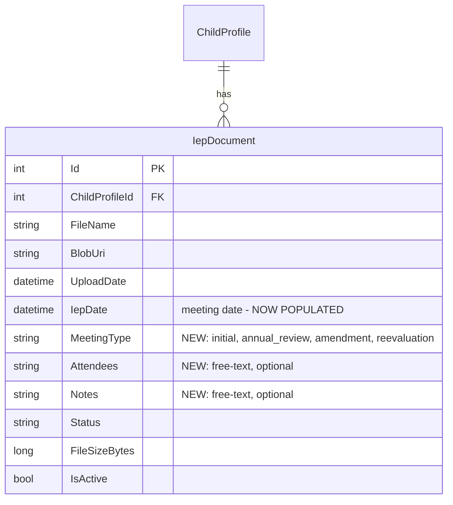

# feat: IEP as Event — Enhanced Upload with Meeting Metadata

## Overview

Replace the current "drop a PDF" upload flow with a two-step process: parent creates an IEP record with meeting metadata (date, type, attendees, notes), then attaches the PDF. This turns each IEP from a faceless file into a meaningful event in the child's education timeline.

(see brainstorm: `docs/brainstorms/2026-03-14-platform-features-brainstorm.md`, Feature 2)

## Problem Statement / Motivation

Currently, uploading an IEP is just a file drop. The `IepDate` field on the entity exists but is never populated. There's no way to record what type of meeting produced this IEP, who attended, or any notes. This means:

- No timeline view possible (no dates to anchor events)
- No meeting type context for analysis (annual review vs. amendment vs. initial)
- No foundation for version comparison (Feature 3) or deadline tracking (Feature 10)
- The platform treats an IEP like a generic document rather than a milestone in the child's education

## Proposed Solution

### Data Model Changes

Add new fields to the existing `IepDocument` entity:

```csharp
// New fields on IepDocument entity
public string? MeetingType { get; set; }     // "initial" | "annual_review" | "amendment" | "reevaluation"
public string? Attendees { get; set; }        // Free-text, optional
public string? Notes { get; set; }            // Free-text, optional
```

The existing `IepDate` field (currently nullable and never set) becomes the meeting date — populated from the form.

### ERD



### Key Use Case: Create Before Meeting

A parent will often create the IEP record *before* the IEP meeting — entering the meeting date, type, and attendees in advance. They may upload a draft of the IEP before the meeting, then replace it with the final version afterward. This means:

- **File upload is optional at creation time.** An IEP can exist as metadata-only (no PDF yet).
- **A PDF can be attached later** via a separate upload action.
- **The PDF can be replaced** (e.g., draft → final version).
- **Status flow changes:** A new IEP without a file starts as `"created"` (not `"uploaded"`). Once a file is attached, it moves to `"uploaded"` → `"processing"` → `"parsed"`.

### API Changes

**New endpoint:** `POST /api/children/{childId}/ieps`

Create an IEP event record (no file required):

```json
{
  "iepDate": "2026-03-20",
  "meetingType": "annual_review",
  "attendees": "Mrs. Smith, Dr. Jones",
  "notes": "Upcoming annual review"
}
```

Returns 201 with the IEP record (status: `"created"`).

**Modified endpoint:** `POST /api/ieps/{id}/upload`

Attach or replace a PDF on an existing IEP:

```
POST /api/ieps/{id}/upload
Content-Type: multipart/form-data

file: <PDF file>
```

This sets `FileName`, `BlobUri`, `FileSizeBytes`, `UploadDate`, transitions status to `"uploaded"`, and enqueues background processing. If a file already exists, the old blob is deleted first.

**New endpoint:** `PUT /api/ieps/{id}/metadata`

Update metadata on an existing IEP:

```json
{
  "iepDate": "2026-03-20",
  "meetingType": "annual_review",
  "attendees": "Mrs. Smith, Dr. Jones, OT therapist",
  "notes": "Final version after meeting"
}
```

### Frontend Changes

Replace the current upload-only flow with a decoupled two-step approach:

**Step 1: Create IEP Event** — An inline form on the child detail page with meeting date (required), meeting type dropdown (required), attendees (optional), notes (optional). No file required. Creates the IEP record in `"created"` status.

**Step 2: Attach PDF** — On the IEP document card, a file upload zone appears for IEPs in `"created"` status (no PDF yet). Can also replace an existing PDF on any IEP.

This supports the key use case: parent creates the IEP event *before* the meeting, uploads a draft, then replaces it with the final version after.

**Document card states:**
- `created` (no PDF): Shows meeting info + "Upload PDF" button/zone
- `uploaded` / `processing`: Shows meeting info + file info + processing indicator
- `parsed`: Shows meeting info + file info + "View" + "Analyze" links
- `error`: Shows meeting info + error message + "Retry" button

The IEP document list is updated to show meeting date and meeting type badge.

## Technical Approach

### Phase 1: Backend — Entity + Migration + API

**Modified files:**

| File | Change |
|------|--------|
| `api/IepAssistant.Domain/Entities/IepDocument.cs` | Add `MeetingType`, `Attendees`, `Notes` fields |
| `api/IepAssistant.Domain/Data/Configurations/IepDocumentConfiguration.cs` | Add max lengths for new fields |
| `api/IepAssistant.Services/Models/IepDocumentModels.cs` | Add new fields to `IepDocumentModel`, add `CreateIepDocumentModel` and `UpdateIepMetadataModel` |
| `api/IepAssistant.Services/Implementations/IepDocumentService.cs` | Add `CreateAsync` (metadata only), refactor `UploadAsync` to attach file to existing IEP, add `UpdateMetadataAsync` |
| `api/IepAssistant.Services/Interfaces/IIepDocumentService.cs` | Add `CreateAsync`, `UpdateMetadataAsync`, `AttachFileAsync` |
| `api/IepAssistant.Api/Controllers/IepDocumentsController.cs` | New create endpoint (JSON), new attach-file endpoint, new metadata update endpoint. Keep existing upload as backward-compatible. |
| `api/IepAssistant.Api/DTOs/IepDocuments/IepDocumentDto.cs` | Add `MeetingType`, `Attendees`, `Notes` |

**New files:**

| File | Description |
|------|-------------|
| `api/IepAssistant.Api/DTOs/IepDocuments/CreateIepRequest.cs` | Request DTO for creating IEP event (iepDate, meetingType, attendees, notes) |
| `api/IepAssistant.Api/DTOs/IepDocuments/UpdateIepMetadataRequest.cs` | Request DTO for metadata update |

**EF Migration:** `dotnet ef migrations add AddIepEventMetadata`

**Validation rules:**
- `IepDate`: required, must be a valid date (can be in the future for upcoming meetings)
- `MeetingType`: required, must be one of `initial`, `annual_review`, `amendment`, `reevaluation`
- `Attendees`: optional, max 1000 characters
- `Notes`: optional, max 2000 characters
- `Status`: new value `"created"` for IEPs without a file; existing values unchanged

### Phase 2: Frontend — Create IEP Form + Upload Redesign

**Modified files:**

| File | Change |
|------|--------|
| `web/src/types/api.ts` | Add `meetingType`, `attendees`, `notes` to `IepDocument` type; add `CreateIepRequest` type |
| `web/src/features/iep-documents/api/iep-documents-api.ts` | Add `createIep`, `attachFile`, `updateIepMetadata`; keep `uploadIepDocument` for backward compat |
| `web/src/features/iep-documents/components/iep-upload.tsx` | Refactor to file-only upload zone (used within document cards for attaching PDFs) |
| `web/src/features/iep-documents/components/iep-document-list.tsx` | Show meeting date, meeting type badge, "Upload PDF" zone for `created` status docs |
| `web/src/features/iep-documents/components/iep-viewer-page.tsx` | Show meeting metadata in header area |
| `web/src/features/children/components/child-detail-page.tsx` | Replace `IepUpload` with "New IEP" button + create form |

**New files:**

| File | Description |
|------|-------------|
| `web/src/features/iep-documents/components/create-iep-form.tsx` | Form for creating IEP event (date, type, attendees, notes) |

**Meeting type options:**

| Value | Display Label |
|-------|--------------|
| `initial` | Initial IEP |
| `annual_review` | Annual Review |
| `amendment` | Amendment |
| `reevaluation` | Reevaluation |

**Upload form layout (using brand components):**

```
┌─────────────────────────────────────────┐
│ IEP Details                             │
│                                         │
│ Meeting Date *        Meeting Type *    │
│ [date input]          [dropdown]        │
│                                         │
│ Attendees (optional)                    │
│ [textarea - who was at the meeting]     │
│                                         │
│ Notes (optional)                        │
│ [textarea - any notes from the meeting] │
│                                         │
│ ┌─────────────────────────────────────┐ │
│ │   Drop PDF here or click to upload  │ │
│ │          (same drag-and-drop)       │ │
│ └─────────────────────────────────────┘ │
│                                         │
│         [ Upload IEP ]                  │
└─────────────────────────────────────────┘
```

### Phase 3: Document List & Viewer Updates

Update the document list to show richer information:

- Meeting date formatted nicely (e.g., "Mar 1, 2026")
- Meeting type as a brand Badge (e.g., "Annual Review" in teal)
- Sort by meeting date (IepDate) descending instead of upload date

Update the IEP viewer page header to show:
- Meeting type badge
- Meeting date
- Attendees (if provided)
- Notes expandable section (if provided)

## Acceptance Criteria

### Functional Requirements

- [ ] Parent can create an IEP event with meeting date and type (no file required)
- [ ] Meeting type dropdown offers: Initial IEP, Annual Review, Amendment, Reevaluation
- [ ] Meeting date can be in the future (for upcoming meetings)
- [ ] Attendees and notes are optional free-text fields
- [ ] IEP starts in `"created"` status when no file is attached
- [ ] Parent can attach a PDF to an existing IEP (drag-and-drop zone on the document card)
- [ ] Attaching a PDF transitions status from `"created"` to `"uploaded"` and enqueues processing
- [ ] Parent can replace a PDF on an existing IEP (old blob deleted, new one uploaded)
- [ ] IEP document list shows meeting date and meeting type badge
- [ ] IEP document list sorts by meeting date descending
- [ ] IEP cards in `"created"` status show "Upload PDF" prompt
- [ ] IEP viewer page header shows meeting metadata (date, type, attendees, notes)
- [ ] Parent can update metadata on an existing IEP
- [ ] Existing IEPs with no metadata still display correctly (backward compatible)
- [ ] `IepDate` is now populated from the create form

### Non-Functional Requirements

- [ ] Upload with metadata completes in same time as current upload (<2s for typical PDFs)
- [ ] All new form fields use brand Input/Textarea/Select components
- [ ] Meeting type badges use brand Badge component
- [ ] Form validates required fields before allowing submit

## Dependencies & Risks

**Dependencies:** None — builds on existing IepDocument entity

**Risks:**
- Multipart form with both fields and file requires careful controller binding (ASP.NET Core handles this with `[FromForm]` attributes)
- Existing documents have null `IepDate` and null `MeetingType` — UI must handle gracefully

## Sources & References

### Origin
- **Brainstorm document:** [docs/brainstorms/2026-03-14-platform-features-brainstorm.md](docs/brainstorms/2026-03-14-platform-features-brainstorm.md) — Feature 2: "IEP as an Event". Key decisions: treat IEP as event not file, capture meeting date/type/attendees/notes, foundation for timeline and comparison features.

### Internal References
- Entity: `api/IepAssistant.Domain/Entities/IepDocument.cs`
- EF config: `api/IepAssistant.Domain/Data/Configurations/IepDocumentConfiguration.cs`
- Service: `api/IepAssistant.Services/Implementations/IepDocumentService.cs:48-72` (upload flow)
- Controller: `api/IepAssistant.Api/Controllers/IepDocumentsController.cs:59-86` (upload endpoint)
- Frontend upload: `web/src/features/iep-documents/components/iep-upload.tsx`
- Frontend API: `web/src/features/iep-documents/api/iep-documents-api.ts:16-29`
- Frontend types: `web/src/types/api.ts:63-72`
- Document list: `web/src/features/iep-documents/components/iep-document-list.tsx`
