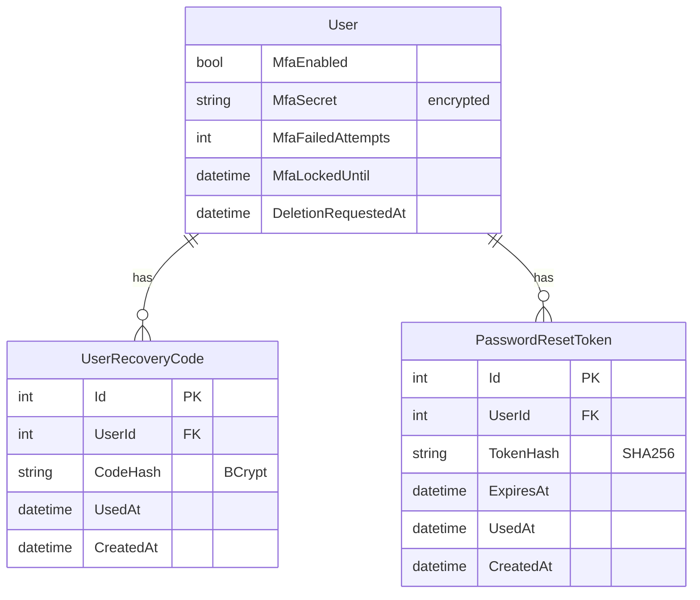

# feat: Security Hardening — MFA, Password Reset, Account Deletion

## Overview

Add production-grade security features: TOTP-based MFA with recovery codes, email-based password reset via Azure Communication Services, rate limiting on auth endpoints, and GDPR-style account deletion with data export. All implemented with minimal external dependencies per project preference (see brainstorm: `docs/brainstorms/2026-03-14-platform-features-brainstorm.md`, Feature 5).

## Problem Statement / Motivation

Parents are sharing sensitive child disability and education data (FERPA-relevant). The current auth system has: no MFA, no password reset, no account lockout, no rate limiting, no account deletion, and JWT tokens stored in localStorage with no server-side revocation. This must be addressed before real users.

## Proposed Solution

### Design Principles
- **Zero new server NuGet packages** — TOTP via `System.Security.Cryptography`, rate limiting via built-in `AddRateLimiter`, secret encryption via Data Protection API
- **One new npm package** — `qrcode.react` for QR code rendering
- **Azure Communication Services** for password reset emails (HttpClient, no SDK)

### Data Model Changes

#### Modified: `User` entity

```csharp
// New fields on User
public bool MfaEnabled { get; set; } = false;
public string? MfaSecret { get; set; }           // Encrypted Base32 TOTP secret
public int MfaFailedAttempts { get; set; } = 0;
public DateTime? MfaLockedUntil { get; set; }
public long? LastTotpTimestamp { get; set; }       // Unix seconds of last successful TOTP (replay prevention)
public int FailedLoginAttempts { get; set; } = 0;  // Password-based lockout
public DateTime? LockedUntil { get; set; }         // Password-based lockout
public int SecurityStamp { get; set; } = 0;        // Incremented on security events; invalidates all JWTs
public DateTime? DeletionRequestedAt { get; set; }
```

#### New entity: `UserRecoveryCode`

```csharp
public class UserRecoveryCode : BaseEntity
{
    public int UserId { get; set; }
    public string CodeHash { get; set; } = string.Empty;  // HMAC-SHA256 hash (not BCrypt — avoids 10x verify cost)
    public DateTime? UsedAt { get; set; }
    public DateTime CreatedAt { get; set; } = DateTime.UtcNow;
    public User User { get; set; } = null!;
}
```

#### New entity: `PasswordResetToken`

```csharp
public class PasswordResetToken : BaseEntity
{
    public int UserId { get; set; }
    public string TokenHash { get; set; } = string.Empty;  // SHA256 hash
    public DateTime ExpiresAt { get; set; }
    public DateTime? UsedAt { get; set; }
    public DateTime CreatedAt { get; set; } = DateTime.UtcNow;
    public User User { get; set; } = null!;
}
```

#### ERD



## Technical Approach

### Phase 1: TOTP Service + MFA Backend

**New files:**

| File | Description |
|------|-------------|
| `api/IepAssistant.Services/Implementations/TotpService.cs` | Pure C# TOTP (RFC 6238) with Base32 encode/decode, code generation, validation with ±1 step drift |
| `api/IepAssistant.Services/Interfaces/ITotpService.cs` | Interface |
| `api/IepAssistant.Services/Implementations/MfaSecretProtector.cs` | Data Protection API wrapper for encrypting/decrypting TOTP secrets at rest |
| `api/IepAssistant.Domain/Entities/UserRecoveryCode.cs` | Recovery code entity |
| `api/IepAssistant.Domain/Data/Configurations/UserRecoveryCodeConfiguration.cs` | EF config |

**Modified files:**

| File | Change |
|------|--------|
| `api/IepAssistant.Domain/Entities/User.cs` | Add MFA fields |
| `api/IepAssistant.Domain/Data/ApplicationDbContext.cs` | Add DbSets |
| `api/IepAssistant.Domain/DependencyInjection.cs` | Register repos if needed |
| `api/IepAssistant.Services/DependencyInjection.cs` | Register TotpService, MfaSecretProtector |
| `api/IepAssistant.Services/Implementations/AuthService.cs` | Two-step login (password → MFA pending token → full JWT), MFA setup/enable, recovery code generation/validation |
| `api/IepAssistant.Api/Controllers/AuthController.cs` | New endpoints: `POST mfa/setup`, `POST mfa/verify-setup`, `POST mfa/verify`, `POST mfa/disable`, `POST mfa/recovery` |
| `api/IepAssistant.Api/Program.cs` | Add Data Protection, rate limiting policies |

**MFA pending token:** A short-lived JWT (5 min expiry) with claim `token_type: "mfa_pending"` and the user ID. The main JWT bearer `OnTokenValidated` handler MUST reject tokens carrying this claim — preventing misuse as a full auth token. This keeps the flow stateless.

**MFA login flow:**
1. `POST /api/auth/login` — validate email+password. If MFA enabled, return `{ requiresMfa: true, mfaPendingToken: "..." }` (short-lived, 5min). If MFA not enabled, return full JWT as before (backward compatible).
2. `POST /api/auth/mfa/verify` — validate MFA pending token + TOTP code → return full JWT
3. Recovery: `POST /api/auth/mfa/recovery` — validate MFA pending token + recovery code → return full JWT

**TOTP parameters (explicit):** HMAC-SHA1, 30-second period, 6 digits, 20-byte (160-bit) secret, Base32 encoded. otpauth URI format: `otpauth://totp/IEP%20Advisor:{email}?secret={base32}&issuer=IEP%20Advisor&algorithm=SHA1&digits=6&period=30`

**TOTP replay prevention:** Track `LastTotpTimestamp` on User. Reject any code whose time-step is ≤ the last successful timestamp.

**Token revocation via SecurityStamp:** Include `SecurityStamp` as a claim in all issued JWTs. On each request, `OnTokenValidated` checks the claim against the database value. When any security event occurs (password change, MFA enable/disable, password reset, account deletion), increment `SecurityStamp`, instantly invalidating all existing tokens.

**Password-based lockout:** Track `FailedLoginAttempts` on User. Lock account for 15 minutes after 10 failed password attempts. Rate limiting is defense-in-depth on top of this.

**MFA disable requires password + TOTP code** (not just TOTP).

**Recovery code hashing:** Use HMAC-SHA256 with a server-side key (from Data Protection) instead of BCrypt. This allows direct lookup and avoids the 10x BCrypt verify cost when checking against unused codes.

**Service decomposition:** Split AuthService into focused services:
- `IAuthService` — login, register, profile (existing)
- `IMfaService` — setup, verify, disable, recovery codes
- `IPasswordResetService` — initiate, reset
- `IAccountService` — data export, deletion, cancel deletion

**Data Protection key persistence:** Configure `PersistKeysToAzureBlobStorage` for Azure deployment so encrypted MFA secrets survive app restarts and scale-out.

**Hard-delete mechanism:** A daily `IHostedService` background worker (matching existing pattern from IEP processing workers) that queries users past the 30-day grace period and cascades deletion.

**Rate limiting (built-in .NET 9):**
- Login: 10 attempts / 15 min / IP
- MFA verify: 5 attempts / 15 min / user
- Password reset request: 3 / hour / IP

### Phase 2: Password Reset

**New files:**

| File | Description |
|------|-------------|
| `api/IepAssistant.Domain/Entities/PasswordResetToken.cs` | Token entity |
| `api/IepAssistant.Domain/Data/Configurations/PasswordResetTokenConfiguration.cs` | EF config |
| `api/IepAssistant.Services/Implementations/EmailService.cs` | Azure Communication Services email via HttpClient |
| `api/IepAssistant.Services/Interfaces/IEmailService.cs` | Interface |

**Modified files:**

| File | Change |
|------|--------|
| `api/IepAssistant.Services/Implementations/AuthService.cs` | `InitiatePasswordReset`, `ResetPassword` methods |
| `api/IepAssistant.Api/Controllers/AuthController.cs` | `POST forgot-password` (always 202), `POST reset-password` |
| `api/IepAssistant.Api/appsettings.json` | Add Azure Communication Services connection string placeholder |

**Password reset flow:**
1. `POST /api/auth/forgot-password` — always returns 202. If email exists, generates SHA256-hashed token (15 min expiry), sends email with reset link
2. `POST /api/auth/reset-password` — validates token hash, sets new password, invalidates all tokens for user

### Phase 3: Account Deletion + Data Export

**New endpoints:**

| Method | Route | Description |
|--------|-------|-------------|
| GET | `/api/auth/data-export` | Returns JSON of all user data (profile, children, IEPs, goals, analyses) |
| POST | `/api/auth/delete-account` | Requires password + MFA code (if enabled). Soft deletes user, schedules hard delete in 30 days |
| POST | `/api/auth/cancel-deletion` | Cancel pending deletion within 30-day grace period |

**Modified files:**

| File | Change |
|------|--------|
| `api/IepAssistant.Services/Implementations/AuthService.cs` | `ExportUserData`, `ScheduleDeletion`, `CancelDeletion` |
| `api/IepAssistant.Api/Controllers/AuthController.cs` | New endpoints |

### Phase 4: Frontend MFA + Password Reset UI

**New files:**

| File | Description |
|------|-------------|
| `web/src/features/auth/components/mfa-setup-page.tsx` | QR code display + code verification + recovery codes display |
| `web/src/features/auth/components/mfa-verify-page.tsx` | TOTP code entry during login |
| `web/src/features/auth/components/forgot-password-page.tsx` | Email input form |
| `web/src/features/auth/components/reset-password-page.tsx` | New password form (from email link) |
| `web/src/features/auth/components/account-deletion-section.tsx` | Delete account section on profile page |

**Modified files:**

| File | Change |
|------|--------|
| `web/src/types/api.ts` | Add MFA types, password reset types |
| `web/src/features/auth/api/auth-api.ts` | Add MFA, password reset, deletion API calls |
| `web/src/features/auth/stores/auth-context.tsx` | Handle two-step MFA login flow |
| `web/src/features/auth/components/login-page.tsx` | Handle `requiresMfa` response, redirect to MFA verify |
| `web/src/features/auth/components/profile-page.tsx` | Add MFA enable/disable section + account deletion |
| `web/src/app/routes.tsx` | Add MFA setup, verify, forgot/reset password routes |

**npm install:** `qrcode.react` (QR code rendering)

### Phase 5: EF Migration

Single migration covering all entity changes: `AddSecurityHardening`

## Acceptance Criteria

### MFA
- [ ] User can enable TOTP MFA from profile page
- [ ] QR code displayed for authenticator app scanning
- [ ] Manual entry code shown as fallback
- [ ] User must verify a code before MFA is activated
- [ ] 10 recovery codes generated and shown once at setup
- [ ] Login with MFA: password step → TOTP code step → JWT issued
- [ ] Recovery code can be used instead of TOTP code
- [ ] Used recovery codes cannot be reused
- [ ] User can disable MFA (requires current TOTP code)
- [ ] MFA secret encrypted at rest via Data Protection API
- [ ] Account locked after 5 failed MFA attempts for 15 minutes
- [ ] TOTP replay prevention: same code cannot be used twice within the same time step
- [ ] Disabling MFA requires password + TOTP code
- [ ] SecurityStamp included in JWT; validated on each request
- [ ] Password change/reset/MFA events increment SecurityStamp (invalidates all tokens)
- [ ] Account locked after 10 failed password attempts for 15 minutes

### Password Reset
- [ ] "Forgot password" link on login page
- [ ] Email sent with reset link (Azure Communication Services)
- [ ] Reset token expires in 15 minutes
- [ ] Token is single-use
- [ ] Always returns 202 regardless of email existence (no enumeration)
- [ ] New password must meet existing validation rules (8+ chars)
- [ ] All existing reset tokens invalidated after successful reset

### Rate Limiting
- [ ] Login: 10 attempts / 15 min / IP
- [ ] MFA verify: 5 attempts / 15 min / user
- [ ] Password reset: 3 requests / hour / IP
- [ ] Returns 429 Too Many Requests when limit exceeded

### Account Deletion
- [ ] User can export all their data as JSON from profile page
- [ ] User can request account deletion (requires password + MFA if enabled)
- [ ] 30-day grace period before hard delete
- [ ] User can cancel deletion within grace period
- [ ] Hard delete removes: user record, child profiles, IEP documents, blob storage files, advocacy goals, analyses, recovery codes, reset tokens

### Non-Functional
- [ ] Zero new server-side NuGet packages
- [ ] TOTP secret never logged or returned after initial setup
- [ ] All new endpoints have appropriate `[Authorize]` or `[AllowAnonymous]`
- [ ] Brand UI components used throughout new pages

## Dependencies & Risks

**Dependencies:**
- Azure Communication Services account (for email)
- `qrcode.react` npm package

**Risks:**
- TOTP time drift: using ±1 step (90 second window) mitigates clock skew between server and authenticator app
- Email deliverability: Azure Communication Services requires domain verification for production
- Data Protection API key rotation: need to handle gracefully so encrypted MFA secrets remain readable

## Sources & References

### Origin
- **Brainstorm:** [docs/brainstorms/2026-03-14-platform-features-brainstorm.md](docs/brainstorms/2026-03-14-platform-features-brainstorm.md) — Feature 5: Security Hardening. Key decisions: TOTP-based MFA with minimal dependencies, recovery codes at enrollment, FERPA compliance posture.

### External References
- [RFC 6238 — TOTP Specification](https://datatracker.ietf.org/doc/html/rfc6238)
- [OWASP MFA Cheat Sheet](https://cheatsheetseries.owasp.org/cheatsheets/Multifactor_Authentication_Cheat_Sheet.html)
- [AuthQuake: Microsoft MFA TOTP Vulnerability](https://workos.com/blog/authquake-microsofts-mfa-system-vulnerable-to-totp-brute-force-attack)
- [ASP.NET Core Rate Limiting (built-in)](https://learn.microsoft.com/en-us/aspnet/core/performance/rate-limit)
- [ASP.NET Core Data Protection API](https://learn.microsoft.com/en-us/aspnet/core/security/data-protection/introduction)

### Internal References
- Auth service: `api/IepAssistant.Services/Implementations/AuthService.cs`
- Auth controller: `api/IepAssistant.Api/Controllers/AuthController.cs`
- User entity: `api/IepAssistant.Domain/Entities/User.cs`
- JWT config: `api/IepAssistant.Api/Program.cs:74-98`
- Frontend auth: `web/src/features/auth/stores/auth-context.tsx`
