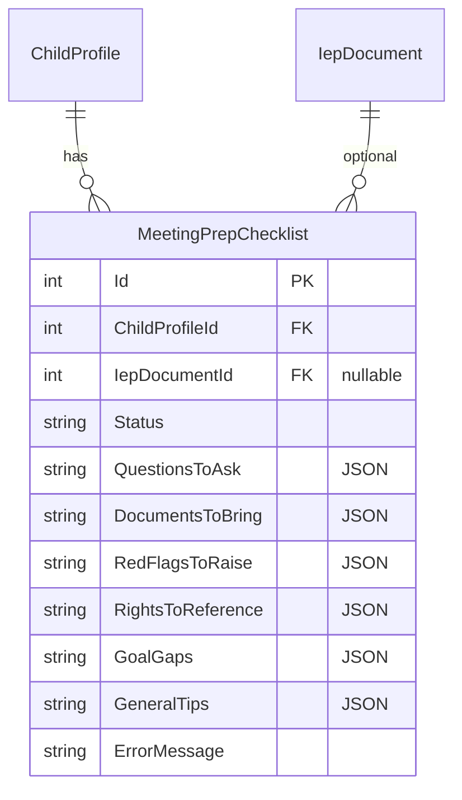

# feat: Meeting Prep Checklists — AI-Generated with or without IEP

## Overview

AI-generated meeting prep checklists that help parents walk into IEP meetings prepared and confident. Checklists include questions to ask, documents to bring, red flags to raise, rights to reference, and parent goal gaps to advocate for. Checklists are persisted with check-off state so parents can use them during the meeting.

**Key design decision:** Checklists work in two modes:
1. **With IEP analysis** — uses the full analysis (red flags, SMART gaps, suggested questions) plus parent goals
2. **Without IEP** — uses only child profile info + parent advocacy goals. This covers the critical use case where a parent has an upcoming meeting, has defined their priorities, but doesn't have a document yet.

(see brainstorm: `docs/brainstorms/2026-03-14-platform-features-brainstorm.md`, Feature 4)

## Problem Statement / Motivation

The current analysis tells parents what's in the IEP and flags issues — but it doesn't tell them what to *do* at the meeting. Parents need actionable, printable checklists they can bring. Additionally, parents often know about an upcoming meeting before they receive the IEP document — they should be able to generate a prep checklist from their goals and child info alone.

## Proposed Solution

### Two Generation Modes

**Mode A: From IEP Analysis** (richer output)
- Trigger: Parent clicks "Generate Meeting Prep" on an analyzed IEP
- Context sent to Claude: parsed IEP sections, analysis red flags, SMART gaps, parent goals, child info, meeting metadata
- Output: detailed checklist with IEP-specific questions and flagged items

**Mode B: From Goals Only** (no IEP required)
- Trigger: Parent clicks "Prep for Meeting" on the child detail page
- Context sent to Claude: child profile (name, grade, disability, district), parent advocacy goals, meeting type (if IEP event exists)
- Output: general prep checklist focused on advocating for the parent's goals

### Data Model

#### New entity: `MeetingPrepChecklist`

```csharp
public class MeetingPrepChecklist : BaseEntity, IAuditableEntity
{
    public int ChildProfileId { get; set; }
    public int? IepDocumentId { get; set; }        // null for goals-only mode
    public string Status { get; set; } = "pending"; // pending, generating, completed, error
    public string? QuestionsToAsk { get; set; }     // JSON array of ChecklistItem
    public string? DocumentsToBring { get; set; }   // JSON array of ChecklistItem
    public string? RedFlagsToRaise { get; set; }    // JSON array of ChecklistItem
    public string? RightsToReference { get; set; }  // JSON array of ChecklistItem
    public string? GoalGaps { get; set; }           // JSON array of ChecklistItem
    public string? GeneralTips { get; set; }        // JSON array of ChecklistItem
    public string? ErrorMessage { get; set; }
    // IAuditableEntity fields...
    public ChildProfile ChildProfile { get; set; } = null!;
    public IepDocument? IepDocument { get; set; }
}
```

Each JSON array contains `ChecklistItem` objects:

```csharp
public class ChecklistItem
{
    public string Text { get; set; } = string.Empty;
    public string? Context { get; set; }          // why this matters
    public string? LegalBasis { get; set; }       // IDEA provision if applicable
    public bool IsChecked { get; set; } = false;
}
```

#### ERD



### API Endpoints

| Method | Route | Description |
|--------|-------|-------------|
| POST | `/api/children/{childId}/meeting-prep` | Generate checklist from goals only (Mode B) |
| POST | `/api/ieps/{iepId}/meeting-prep` | Generate checklist from IEP analysis (Mode A) |
| GET | `/api/children/{childId}/meeting-prep` | List checklists for a child |
| GET | `/api/meeting-prep/{id}` | Get a specific checklist |
| PUT | `/api/meeting-prep/{id}/check` | Toggle check state on an item (body: { section, index, isChecked }) |
| DELETE | `/api/meeting-prep/{id}` | Soft delete a checklist |

### Claude Prompt Design

**Mode A prompt** (with IEP analysis):
```
You are an IEP meeting preparation expert helping a parent prepare for their child's IEP meeting.

CHILD INFORMATION:
Name: {name}, Grade: {grade}, Disability: {disability}, District: {district}

MEETING INFORMATION:
Type: {meetingType}, Date: {iepDate}

PARENT ADVOCACY GOALS:
<user_goal>Goal 1 text</user_goal>
<user_goal>Goal 2 text</user_goal>

IEP ANALYSIS SUMMARY:
{overallSummary}

RED FLAGS IDENTIFIED:
{redFlags formatted}

GOAL ANALYSIS CONCERNS:
{goalConcerns formatted}

Generate a meeting preparation checklist as JSON...
```

**Mode B prompt** (goals only, no IEP):
```
You are an IEP meeting preparation expert. A parent is preparing for an upcoming
IEP meeting and has not yet received the IEP document, but has defined their
priorities for their child.

CHILD INFORMATION:
Name: {name}, Grade: {grade}, Disability: {disability}, District: {district}

PARENT ADVOCACY GOALS:
<user_goal>Goal 1 text</user_goal>

Generate a meeting preparation checklist focused on helping this parent advocate
for their stated goals...
```

**Response JSON schema:**
```json
{
  "questionsToAsk": [
    { "text": "Question text", "context": "Why to ask this", "legalBasis": "34 CFR 300.xxx or null" }
  ],
  "documentsToBring": [
    { "text": "Document name", "context": "Why you need this" }
  ],
  "redFlagsToRaise": [
    { "text": "Issue to bring up", "context": "Why it matters", "legalBasis": "..." }
  ],
  "rightsToReference": [
    { "text": "Your right", "context": "How to use it", "legalBasis": "..." }
  ],
  "goalGaps": [
    { "text": "Goal not addressed", "context": "What to ask for" }
  ],
  "generalTips": [
    { "text": "Preparation tip", "context": "Why it helps" }
  ]
}
```

## Technical Approach

### Phase 1: Backend — Entity, Service, Queue, Controller

**New files:**

| File | Description |
|------|-------------|
| `api/IepAssistant.Domain/Entities/MeetingPrepChecklist.cs` | Entity |
| `api/IepAssistant.Domain/Data/Configurations/MeetingPrepChecklistConfiguration.cs` | EF config |
| `api/IepAssistant.Services/Models/MeetingPrepModels.cs` | ChecklistItem, MeetingPrepChecklistModel, CheckItemRequest |
| `api/IepAssistant.Services/Interfaces/IMeetingPrepService.cs` | Interface |
| `api/IepAssistant.Services/Implementations/MeetingPrepService.cs` | Claude integration, prompt building, checklist generation |
| `api/IepAssistant.Api/BackgroundServices/MeetingPrepWorker.cs` | Queue + BackgroundService |
| `api/IepAssistant.Api/Controllers/MeetingPrepController.cs` | All endpoints |
| `api/IepAssistant.Api/DTOs/MeetingPrep/CheckItemRequest.cs` | DTO for toggling check state |

**Modified files:**

| File | Change |
|------|--------|
| `api/IepAssistant.Domain/Data/ApplicationDbContext.cs` | Add DbSet |
| `api/IepAssistant.Services/DependencyInjection.cs` | Register service |
| `api/IepAssistant.Api/Program.cs` | Register queue + worker |

### Phase 2: Frontend — Meeting Prep UI

**New files:**

| File | Description |
|------|-------------|
| `web/src/features/meeting-prep/api/meeting-prep-api.ts` | API client |
| `web/src/features/meeting-prep/hooks/use-meeting-prep.ts` | Data fetching hook |
| `web/src/features/meeting-prep/components/meeting-prep-tab.tsx` | Main tab with checklist sections |
| `web/src/features/meeting-prep/components/checklist-section.tsx` | Reusable section with checkable items |
| `web/src/features/meeting-prep/components/checklist-item.tsx` | Single checkable item with context/legal |
| `web/src/features/meeting-prep/components/meeting-prep-empty-state.tsx` | Empty state with generate CTA |

**Modified files:**

| File | Change |
|------|--------|
| `web/src/types/api.ts` | Add MeetingPrepChecklist, ChecklistItem types |
| `web/src/features/iep-documents/components/iep-viewer-page.tsx` | Add "Meeting Prep" tab |
| `web/src/features/children/components/child-detail-page.tsx` | Add "Prep for Meeting" button (goals-only mode) |

**UX: Checklist display** (using brand components):
- Each section (Questions, Documents, Red Flags, Rights, Goal Gaps, Tips) as a Card with Lora H3 heading
- Each item: checkbox + text + expandable context/legal basis
- Checked items get strikethrough + muted style
- Progress indicator: "4 of 12 items checked"

## Acceptance Criteria

### Functional Requirements

- [ ] Parent can generate a meeting prep checklist from an analyzed IEP (Mode A)
- [ ] Parent can generate a meeting prep checklist from child goals alone (Mode B, no IEP required)
- [ ] Checklist includes: questions to ask, documents to bring, red flags to raise, rights to reference, goal gaps, general tips
- [ ] Each checklist item has text, optional context explanation, optional legal basis
- [ ] Parent can check/uncheck items (persisted to database)
- [ ] Checked items show strikethrough with muted styling
- [ ] Progress indicator shows "X of Y items checked"
- [ ] Multiple checklists can exist per child (one per meeting)
- [ ] Checklists are soft-deletable
- [ ] Meeting prep tab appears in IEP viewer (for Mode A checklists)
- [ ] "Prep for Meeting" button on child detail page (for Mode B)
- [ ] Checklist generation runs as background task (same queue pattern as analysis)
- [ ] User-supplied goal text wrapped in `<user_goal>` tags in prompt (prompt injection mitigation)
- [ ] Goals-only mode produces useful output even with no IEP analysis data

### Non-Functional Requirements

- [ ] Checklist generation completes in <30 seconds
- [ ] Brand UI components used throughout
- [ ] All new endpoints have `[Authorize]` with ownership validation

## Dependencies & Risks

**Dependencies:** None — uses existing Claude API integration, advocacy goals, and child profiles

**Risks:**
- Claude token usage: checklist prompts are shorter than full IEP analysis prompts (~2-4K tokens input vs 8-16K), so cost is manageable
- Goals-only mode quality: with less context, Claude may produce more generic output. Mitigate with specific prompt instructions.

## Sources & References

### Origin
- **Brainstorm:** [docs/brainstorms/2026-03-14-platform-features-brainstorm.md](docs/brainstorms/2026-03-14-platform-features-brainstorm.md) — Feature 4: Meeting Prep Checklists. Key decisions: checklists higher priority than templates, persisted with check-off state, exportable format.

### Internal References
- Analysis service pattern: `api/IepAssistant.Services/Implementations/IepAnalysisService.cs`
- Background worker pattern: `api/IepAssistant.Api/BackgroundServices/IepAnalysisWorker.cs`
- Analysis entity pattern: `api/IepAssistant.Domain/Entities/IepAnalysis.cs`
- Advocacy goals: `api/IepAssistant.Domain/Repositories/ParentAdvocacyGoalRepository.cs`
- Child profile: `api/IepAssistant.Domain/Entities/ChildProfile.cs`
- Frontend analysis tab: `web/src/features/iep-documents/components/analysis-tab.tsx`
