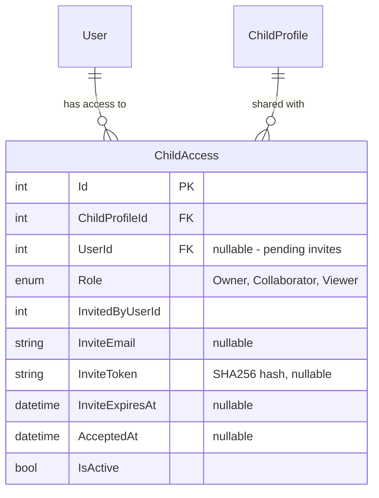

# feat: Shared Access — Invite Co-Parents and Advocates per Child

## Overview

Allow parents to invite co-parents, advocates, or attorneys to view or collaborate on a specific child's profile and IEP data. Access is per-child (not account-wide), role-based (Viewer or Collaborator), and controlled entirely by the primary parent. This is the most architecturally impactful feature so far — it changes the core authorization model from single-owner to multi-user access.

(see brainstorm: `docs/brainstorms/2026-03-14-platform-features-brainstorm.md`, Feature 7)

## Problem Statement / Motivation

IEP meetings frequently involve multiple stakeholders — co-parents, advocates, attorneys. Currently, only the account owner can see their child's data. There's no way to share IEP analysis, advocacy goals, or meeting prep checklists with a support team.

## Proposed Solution

### New Entity: `ChildAccess`

A many-to-many join table between `User` and `ChildProfile`:

```csharp
public enum AccessRole { Owner, Collaborator, Viewer }  // hierarchy: Owner > Collaborator > Viewer

public class ChildAccess : BaseEntity, IAuditableEntity
{
    public int ChildProfileId { get; set; }
    public int? UserId { get; set; }                 // nullable for pending invites (no account yet)
    public AccessRole Role { get; set; } = AccessRole.Viewer;  // enum, stored as string via HasConversion
    public int? InvitedByUserId { get; set; }        // nullable for seeded owner rows
    public string? InviteEmail { get; set; }         // email used for invite (before user accepts)
    public string? InviteToken { get; set; }         // SHA256 hash — cleared on acceptance (single-use)
    public DateTime? InviteExpiresAt { get; set; }
    public DateTime? AcceptedAt { get; set; }
    public bool IsActive { get; set; } = true;
    // audit fields...

    public ChildProfile ChildProfile { get; set; } = null!;
    public User? User { get; set; }
}
```

**Key design decisions from technical review:**
- **`UserId` is nullable** — pending invites have no user yet. Authorization queries filter `UserId IS NOT NULL AND AcceptedAt IS NOT NULL`.
- **`Role` is an enum** (`AccessRole`) stored as string via `HasConversion<string>()`. Compile-time safety prevents typo-based authorization bypass across 17+ files.
- **`InvitedByUserId` is nullable** — seeded owner rows from migration have no inviter.
- **`InviteToken` is cleared on acceptance** — single-use to prevent replay.
- **Composite unique index** on `(ChildProfileId, UserId)` where `UserId IS NOT NULL` prevents duplicate grants.
- **Exactly-one-owner invariant** enforced at the service layer — cannot revoke/deactivate the last owner record.

### ERD



### Migration Strategy for Existing Data

When this feature is deployed, existing `ChildProfile` records have `UserId` as the sole owner. A data migration creates `ChildAccess` records with `Role = "owner"` for every existing child-user relationship. After migration, authorization queries go through `ChildAccess` instead of `ChildProfile.UserId`.

**Important:** `ChildProfile.UserId` is NOT removed — it stays as a denormalized field for backward compatibility and as the "created by" reference. But authorization now checks `ChildAccess`.

### Roles and Permissions

| Permission | Owner | Collaborator | Viewer |
|-----------|-------|-------------|--------|
| View child profile | Yes | Yes | Yes |
| View IEP documents + analysis | Yes | Yes | Yes |
| View advocacy goals | Yes | Yes | Yes |
| View meeting prep checklists | Yes | Yes | Yes |
| View IEP comparison/timeline | Yes | Yes | Yes |
| Upload/attach IEP documents | Yes | Yes | No |
| Add/edit advocacy goals | Yes | Yes | No |
| Generate meeting prep | Yes | Yes | No |
| Trigger IEP analysis | Yes | Yes | No |
| Edit child profile | Yes | No | No |
| Delete child profile | Yes | No | No |
| Manage sharing (invite/revoke) | Yes | No | No |
| Delete IEP documents | Yes | No | No |

### Invitation Flow

1. Owner goes to child detail page → "Share" button → enters email + selects role
2. Backend creates `ChildAccess` record with `InviteToken` (SHA256 hashed), `InviteEmail`, `InviteExpiresAt` (7 days), `AcceptedAt = null`
3. Email sent with invite link: `{frontendUrl}/accept-invite?token={rawToken}`
4. Invitee clicks link:
   - If already has account: logs in, `ChildAccess.UserId` set, `AcceptedAt` set
   - If no account: redirected to register, then token auto-accepted on first login
5. Accepted invitees see the shared child in their children list (with a "Shared" badge)

### API Endpoints

| Method | Route | Description |
|--------|-------|-------------|
| POST | `/api/children/{childId}/share` | Create invite (owner only) |
| GET | `/api/children/{childId}/access` | List who has access (owner only) |
| DELETE | `/api/children/{childId}/access/{accessId}` | Revoke access (owner only) |
| POST | `/api/invites/accept` | Accept an invite by token |
| GET | `/api/children` | Updated: returns owned + shared children with role |

### Authorization Refactoring

The core change: replace `ChildProfile.UserId == userId` checks with `ChildAccess` join queries.

**Repository layer changes:**

`ChildProfileRepository.GetByUserIdAsync(userId)` becomes:
```sql
SELECT c.* FROM ChildProfiles c
INNER JOIN ChildAccess ca ON ca.ChildProfileId = c.Id
WHERE ca.UserId = @userId AND ca.IsActive AND ca.AcceptedAt IS NOT NULL AND c.IsActive
```

`ChildProfileRepository.GetByIdForUserAsync(id, userId)` becomes:
```sql
SELECT c.* FROM ChildProfiles c
INNER JOIN ChildAccess ca ON ca.ChildProfileId = c.Id
WHERE c.Id = @id AND ca.UserId = @userId AND ca.IsActive AND ca.AcceptedAt IS NOT NULL AND c.IsActive
```

**New method:** `GetAccessRoleAsync(childId, userId)` → returns the role string ("owner"/"viewer"/"collaborator") or null.

**Pattern B refactoring:** All `entity.ChildProfile.UserId != userId` checks become `!HasAccess(childProfileId, userId)` calls. For write operations, additionally check `role != "viewer"`.

**Centralized access check:** Create an `IAccessService` (Scoped lifetime) with:
- `GetRoleAsync(childId, userId)` → `AccessRole?` (null = no access). Single method — callers check role directly.
- Per-request cache: `Dictionary<(int, int), AccessRole?>` on the Scoped instance avoids redundant DB hits within a single HTTP request.

**Defense-in-depth:** Create an `[AuthorizeChildAccess(MinimumRole)]` action filter that reads `childId` from the route, checks access via `IAccessService`, and short-circuits with 403 before the controller body runs. Service-layer checks become a secondary safety net.

**Service method template (consistent across all 17 files):**
1. Resolve `childId` from the input
2. `var role = await _accessService.GetRoleAsync(childId, userId)` (first 3 lines)
3. If null → return not-found
4. If operation requires minimum role → check `role >= minimumRole`
5. Proceed

**Blob storage path fix:** Change from `users/{userId}/children/{childProfileId}/...` to `children/{childProfileId}/{guid}/{fileName}`. Child-centric, not user-centric — prevents scattered files when collaborators upload.

## Technical Approach

### Phase 1: Backend — Entity, Migration, Access Service

**New files:**

| File | Description |
|------|-------------|
| `api/IepAssistant.Domain/Entities/ChildAccess.cs` | Entity with AccessRole enum |
| `api/IepAssistant.Domain/Entities/AccessRole.cs` | Enum: Owner, Collaborator, Viewer |
| `api/IepAssistant.Domain/Data/Configurations/ChildAccessConfiguration.cs` | EF config with HasConversion<string>, filtered unique index |
| `api/IepAssistant.Api/Filters/AuthorizeChildAccessAttribute.cs` | Action filter for defense-in-depth route-level auth |
| `api/IepAssistant.Services/Interfaces/IAccessService.cs` | Centralized access checking |
| `api/IepAssistant.Services/Implementations/AccessService.cs` | Implementation |
| `api/IepAssistant.Services/Interfaces/IShareService.cs` | Invite/accept/revoke |
| `api/IepAssistant.Services/Implementations/ShareService.cs` | Implementation |
| `api/IepAssistant.Api/Controllers/ShareController.cs` | Sharing endpoints |
| `api/IepAssistant.Api/DTOs/Share/CreateInviteRequest.cs` | DTO |
| `api/IepAssistant.Api/DTOs/Share/AcceptInviteRequest.cs` | DTO |
| `api/IepAssistant.Api/DTOs/Share/ChildAccessDto.cs` | DTO |

**Modified files:**

| File | Change |
|------|--------|
| `api/IepAssistant.Domain/Data/ApplicationDbContext.cs` | Add DbSet |
| `api/IepAssistant.Domain/Repositories/ChildProfileRepository.cs` | Rewrite queries to join ChildAccess |
| `api/IepAssistant.Services/DependencyInjection.cs` | Register services |

**EF Migration:** Single migration that:
1. Creates the `ChildAccess` table
2. Seeds owner records via raw SQL `INSERT INTO ChildAccess (ChildProfileId, UserId, Role, AcceptedAt, IsActive, CreatedAt, UpdatedAt) SELECT Id, UserId, 'Owner', GETUTCDATE(), 1, GETUTCDATE(), GETUTCDATE() FROM ChildProfiles WHERE IsActive = 1`
3. Atomic — if the seed fails, the table creation rolls back too

This ensures the new authorization model has data from the moment it's deployed. No separate C# seeding step.

### Phase 2: Backend — Refactor Authorization in All Services

Update every service to use `IAccessService` instead of direct `UserId` checks. This is the highest-risk phase.

**Modified files (all services):**

| File | Change |
|------|--------|
| `ChildProfileService.cs` | Use AccessService, enforce owner role for edit/delete |
| `IepDocumentService.cs` | Use AccessService, enforce collaborator+ for write ops |
| `ParentAdvocacyGoalService.cs` | Use AccessService, enforce collaborator+ for write ops |
| `MeetingPrepService.cs` | Use AccessService, enforce collaborator+ for generate |
| `IepAnalysisService.cs` | Use AccessService for GetAnalysisAsync |
| `IepProcessingService.cs` | Use AccessService for GetSectionsAsync |
| `IepComparisonService.cs` | Use AccessService |
| `AccountService.cs` | Update ExportDataAsync to use owned children (not shared) |

### Phase 3: Frontend — Sharing UI + Permission-Aware Rendering

**New files:**

| File | Description |
|------|-------------|
| `web/src/features/sharing/api/sharing-api.ts` | API client |
| `web/src/features/sharing/components/share-child-dialog.tsx` | Invite form (email + role dropdown) |
| `web/src/features/sharing/components/access-list.tsx` | Who has access (for owner) |
| `web/src/features/sharing/components/shared-badge.tsx` | "Shared with you" badge |
| `web/src/features/auth/components/accept-invite-page.tsx` | Token acceptance page |

**Modified files:**

| File | Change |
|------|--------|
| `web/src/types/api.ts` | Add `role` to ChildProfile, add sharing types |
| `web/src/features/children/components/child-detail-page.tsx` | Add "Share" button for owners, show access list, hide edit/delete for non-owners |
| `web/src/features/children/components/children-list-page.tsx` | Show "Shared" badge, indicate role |
| `web/src/features/advocacy-goals/components/advocacy-goals-list.tsx` | Hide add/edit/delete for viewers |
| `web/src/features/iep-documents/components/iep-upload.tsx` | Hide for viewers |
| `web/src/app/routes.tsx` | Add `/accept-invite` route |

## Acceptance Criteria

### Functional Requirements

- [ ] Owner can invite a user by email with a role (viewer or collaborator)
- [ ] Invite creates a token-based email link with 7-day expiry
- [ ] Invitee can accept the invite (with or without existing account)
- [ ] Accepted invitees see the shared child in their children list with a "Shared" badge
- [ ] Viewers can see all child data (profile, IEPs, analysis, goals, checklists, comparison) but cannot modify
- [ ] Collaborators can add/edit advocacy goals, upload IEPs, generate meeting prep, trigger analysis
- [ ] Only owners can edit/delete child profile, manage sharing, delete documents
- [ ] Owner can view who has access and revoke access at any time
- [ ] Contributions from revoked collaborators remain visible
- [ ] Existing users (pre-migration) retain full owner access to their children
- [ ] Shared children show the user's role in the UI
- [ ] Cannot revoke the last owner — exactly-one-owner invariant enforced
- [ ] Invite token cleared on acceptance (single-use)
- [ ] Duplicate invite to same email for same child is handled gracefully (resend, not duplicate)
- [ ] Blob storage paths are child-centric (`children/{childId}/...`), not user-centric
- [ ] AccessRole is a C# enum (compile-time safety across 17+ files)
- [ ] Migration seeds owner ChildAccess records via raw SQL atomically
- [ ] Action filter provides defense-in-depth authorization on routes
- [ ] Per-request cache on IAccessService avoids redundant DB queries

### Non-Functional Requirements

- [ ] Authorization checks add <5ms per request (single indexed JOIN)
- [ ] All 29 controller actions correctly enforce new authorization model
- [ ] Invite tokens are SHA256 hashed (never stored in plaintext)
- [ ] No user enumeration via invite endpoint

## Dependencies & Risks

**Dependencies:**
- Security Hardening feature (for email service — reuses EmailService for invite emails)
- Requires careful migration to seed owner ChildAccess records

**Risks:**
- **High risk:** 17+ service-layer authorization checks must all be updated. Missing one = authorization bypass.
- **Migration risk:** Seeding owner records must be atomic. If it fails partway, some children become inaccessible.
- **Frontend risk:** Every page that shows child data must respect the role. Missing a permission check = UI shows buttons that 403 on click.

## Sources & References

### Origin
- **Brainstorm:** [docs/brainstorms/2026-03-14-platform-features-brainstorm.md](docs/brainstorms/2026-03-14-platform-features-brainstorm.md) — Feature 7: Shared Access. Key decisions: per-child sharing, viewer vs collaborator roles, primary parent controls, contributions from revoked collaborators remain, custody conflicts deferred.

### Internal References
- Authorization map: 29 controller actions, 17 service checks (documented in research above)
- ChildProfile entity: `api/IepAssistant.Domain/Entities/ChildProfile.cs`
- ChildProfile repository: `api/IepAssistant.Domain/Repositories/ChildProfileRepository.cs`
- All services listed in Phase 2 modified files
