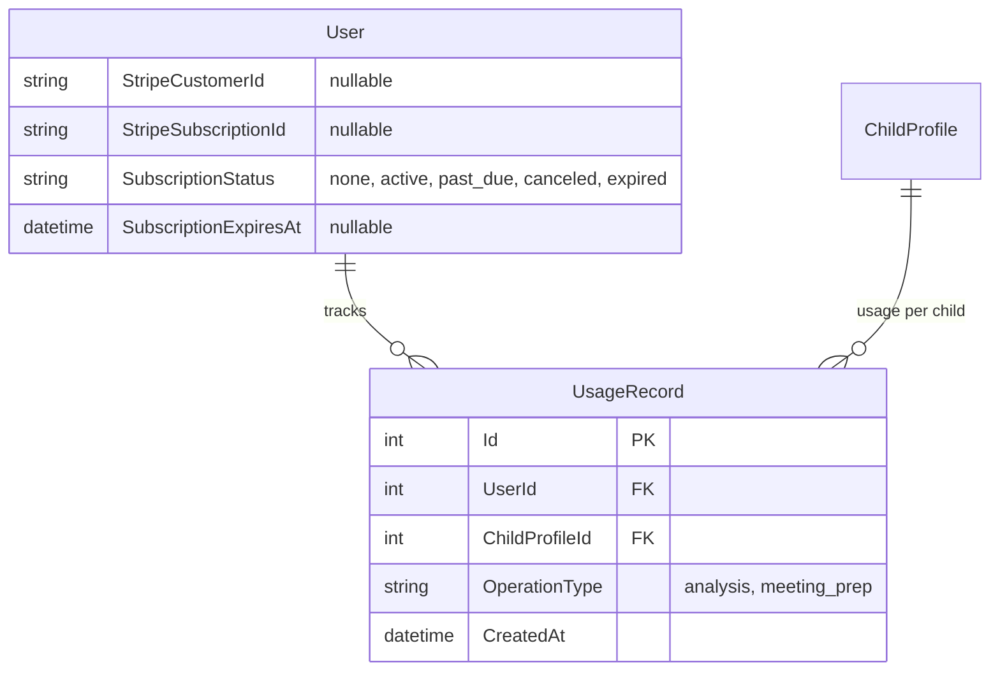

# feat: Subscription & Usage Limits — Stripe Billing with Analysis Quotas

## Overview

Add a single paid subscription tier ($50/year) with usage limits (5 IEP analyses per child per year). Stripe Checkout for payment, Stripe Customer Portal for subscription management, webhook-driven status sync. Users without an active subscription cannot perform AI operations (analysis, meeting prep generation). Read-only access to existing data is preserved forever, even on lapsed subscriptions.

(see brainstorm: `docs/brainstorms/2026-03-14-platform-features-brainstorm.md`, Feature 8)

## Problem Statement / Motivation

The platform uses Claude API for IEP analysis and meeting prep — these have real per-call costs. Without a subscription gate, there's no way to sustain the service. The brainstorm decided on an annual subscription model driven by AI costs, with read-only access preserved indefinitely on lapsed subscriptions.

## Proposed Solution

### Pricing

| Tier | Price | Analyses/Child/Year | Other AI Ops |
|------|-------|---------------------|--------------|
| IEP Advisor Pro | $50/year | 5 per child | Unlimited meeting prep |
| Beta (invite-only) | Free | 5 per child | Unlimited meeting prep |

### Beta Invite Codes

Admin-generated invite codes that grant a free subscription equivalent (same limits as paid, no Stripe involvement). Used for beta testers.

- Admin creates codes via a simple API endpoint (or seeded in DB)
- User enters code on a "Redeem Invite" page
- Code sets `SubscriptionStatus = "active"` and `SubscriptionExpiresAt = 1 year from now` without Stripe
- Each code is single-use, tracked in a `BetaInviteCode` entity
- Codes have optional expiry dates

### What's Gated vs Free

**Requires active subscription:**
- Upload/attach IEP documents (triggers processing)
- Trigger IEP analysis
- Generate meeting prep checklists
- IEP version comparison (since it reads analyzed data, keep it accessible)

**Always available (even without subscription or on lapse):**
- View existing children, IEPs, analyses, goals, checklists
- Add/edit advocacy goals (no AI cost)
- Create IEP events (metadata only, no file processing)
- Edit profile, manage sharing
- IEP 101, onboarding

### Architecture

**Stripe Checkout** for payment (hosted page, zero frontend payment code, PCI compliant).
**Stripe Customer Portal** for subscription management (cancel, update payment, view invoices).
**Webhooks** for subscription status sync (Stripe → our DB).
**Usage tracked in our DB** — not Stripe meters. Simple counter per child.

### Data Model

#### Modified: `User` entity

```csharp
public string? StripeCustomerId { get; set; }
public string? StripeSubscriptionId { get; set; }
public string SubscriptionStatus { get; set; } = "none"; // none, active, past_due, canceled, expired
public DateTime? SubscriptionExpiresAt { get; set; }
```

#### New entity: `UsageRecord`

```csharp
public class UsageRecord : BaseEntity
{
    public int UserId { get; set; }
    public int ChildProfileId { get; set; }
    public string OperationType { get; set; } = string.Empty; // "analysis", "meeting_prep"
    public DateTime CreatedAt { get; set; } = DateTime.UtcNow;
    public User User { get; set; } = null!;
    public ChildProfile ChildProfile { get; set; } = null!;
}
```

#### New entity: `BetaInviteCode`

```csharp
public class BetaInviteCode : BaseEntity
{
    public string Code { get; set; } = string.Empty;        // 8-char alphanumeric
    public int? RedeemedByUserId { get; set; }
    public DateTime? RedeemedAt { get; set; }
    public DateTime? ExpiresAt { get; set; }                 // code expiry (not subscription expiry)
    public bool IsActive { get; set; } = true;
    public DateTime CreatedAt { get; set; } = DateTime.UtcNow;
    public User? RedeemedBy { get; set; }
}
```

#### ERD



### API Endpoints

| Method | Route | Description |
|--------|-------|-------------|
| POST | `/api/stripe/create-checkout-session` | Create Stripe Checkout session, redirect URL |
| POST | `/api/stripe/create-portal-session` | Create Stripe Customer Portal session |
| POST | `/api/webhooks/stripe` | Webhook receiver (no auth — Stripe signature verified) |
| GET | `/api/subscription/status` | Current subscription status + usage counts |
| POST | `/api/subscription/redeem-invite` | Redeem a beta invite code (grants free subscription) |
| POST | `/api/admin/beta-codes` | Generate beta invite codes (admin only) |
| GET | `/api/admin/beta-codes` | List all beta codes with redemption status (admin only) |

### Stripe Webhook Events

| Event | Action |
|-------|--------|
| `customer.subscription.created` | Set SubscriptionStatus = active, store SubscriptionId |
| `customer.subscription.updated` | Sync status (active/past_due/canceled) |
| `customer.subscription.deleted` | Set SubscriptionStatus = expired |
| `invoice.payment_succeeded` | Confirm subscription active, reset usage if new period |
| `invoice.payment_failed` | Set SubscriptionStatus = past_due |

### Usage Enforcement

Before any AI operation, check:
1. `user.SubscriptionStatus == "active"` — if not, return 402 Payment Required
2. For analysis: count `UsageRecords` for this child where `OperationType == "analysis"` and `CreatedAt` within the current subscription year — if >= 5, return 429 with "Analysis limit reached for this child"

**Where to enforce:**
- `IepAnalysisService.AnalyzeDocumentAsync` — before calling Claude
- `MeetingPrepService.GenerateChecklistAsync` — before calling Claude
- Controller level for upload/attach file (before enqueuing processing)

### Subscription Flow

1. User clicks "Subscribe" on profile/dashboard
2. Backend creates Stripe Customer (if none), creates Checkout Session with the annual price
3. User redirected to Stripe Checkout hosted page
4. On success, Stripe sends webhook → we update DB
5. User redirected back to success page
6. To manage subscription: "Manage Subscription" button → Stripe Customer Portal

## Technical Approach

### Phase 1: Backend — Entities, Stripe Service, Webhook, Usage Enforcement

**New files:**

| File | Description |
|------|-------------|
| `api/IepAssistant.Domain/Entities/UsageRecord.cs` | Usage tracking entity |
| `api/IepAssistant.Domain/Data/Configurations/UsageRecordConfiguration.cs` | EF config |
| `api/IepAssistant.Services/Interfaces/ISubscriptionService.cs` | Subscription + usage checking |
| `api/IepAssistant.Services/Implementations/SubscriptionService.cs` | Stripe integration, usage enforcement |
| `api/IepAssistant.Api/Controllers/StripeController.cs` | Checkout + Portal session creation |
| `api/IepAssistant.Api/Controllers/StripeWebhookController.cs` | Webhook handler (no [Authorize]) |
| `api/IepAssistant.Api/DTOs/Stripe/CreateCheckoutRequest.cs` | DTO |
| `api/IepAssistant.Api/DTOs/Stripe/SubscriptionStatusDto.cs` | Status + usage response |

**Modified files:**

| File | Change |
|------|--------|
| `api/IepAssistant.Domain/Entities/User.cs` | Add Stripe fields |
| `api/IepAssistant.Domain/Data/ApplicationDbContext.cs` | Add DbSet |
| `api/IepAssistant.Services/DependencyInjection.cs` | Register SubscriptionService |
| `api/IepAssistant.Services/Implementations/IepAnalysisService.cs` | Check subscription + usage before Claude call |
| `api/IepAssistant.Services/Implementations/MeetingPrepService.cs` | Check subscription before Claude call |
| `api/IepAssistant.Api/Controllers/IepDocumentsController.cs` | Check subscription before upload/processing |
| `api/IepAssistant.Api/Program.cs` | Configure Stripe, exclude webhook from auth |
| `api/IepAssistant.Api/appsettings.json` | Add Stripe config placeholders |

**NuGet:** `Stripe.net`

**EF Migration:** `AddSubscriptionAndUsage`

### Phase 2: Frontend — Subscribe Button, Usage Dashboard, Gating

**New files:**

| File | Description |
|------|-------------|
| `web/src/features/subscription/api/subscription-api.ts` | API client |
| `web/src/features/subscription/hooks/use-subscription.ts` | Subscription status + usage hook |
| `web/src/features/subscription/components/subscription-status.tsx` | Status card with usage bars |
| `web/src/features/subscription/components/subscribe-button.tsx` | Redirects to Stripe Checkout |
| `web/src/features/subscription/components/subscription-required.tsx` | Gate component for unsubscribed users |

**Modified files:**

| File | Change |
|------|--------|
| `web/src/types/api.ts` | Add subscription types |
| `web/src/features/auth/components/profile-page.tsx` | Add subscription section |
| `web/src/features/auth/components/dashboard-page.tsx` | Show subscription status + usage |
| `web/src/features/iep-documents/components/analysis-empty-state.tsx` | Show "Subscribe to analyze" if no subscription |
| `web/src/features/iep-documents/components/iep-upload.tsx` | Disable if no subscription |
| `web/src/components/layouts/sidebar.tsx` | Add "Subscription" nav item |
| `web/src/app/routes.tsx` | Add subscription success/cancel routes |

**Usage display:**
- Per-child analysis count: "3 of 5 analyses used this year"
- Brand teal progress bar
- "Upgrade" or "Subscribe" CTA when at limit or not subscribed

## Acceptance Criteria

### Functional Requirements

- [ ] User can subscribe via Stripe Checkout ($50/year)
- [ ] Subscription status synced via Stripe webhooks
- [ ] User can manage subscription via Stripe Customer Portal (cancel, update payment)
- [ ] Active subscription required for: IEP analysis, meeting prep generation, file upload/processing
- [ ] Analysis limited to 5 per child per subscription year
- [ ] Usage counter displayed per child on dashboard and child detail page
- [ ] Lapsed subscriptions retain read-only access to all existing data
- [ ] Advocacy goals, child profiles, IEP event creation (no file) work without subscription
- [ ] 402 Payment Required returned for gated operations without subscription
- [ ] 429 returned when analysis limit reached for a child
- [ ] Webhook endpoint has no JWT auth requirement (Stripe signature verified instead)
- [ ] Webhook events are idempotent (duplicate events don't corrupt state)
- [ ] Admin can generate beta invite codes
- [ ] User can redeem a beta invite code to get a free 1-year subscription
- [ ] Beta codes are single-use and optionally have an expiry date
- [ ] Beta subscriptions have the same limits as paid (5 analyses/child)
- [ ] "Redeem Invite" page accessible from login/register flow and profile

### Non-Functional Requirements

- [ ] Stripe secret key never exposed to frontend
- [ ] Webhook signature verified on every event
- [ ] One NuGet package: `Stripe.net`
- [ ] Zero frontend Stripe code (Checkout + Portal are hosted redirects)
- [ ] Brand UI components used throughout

## Dependencies & Risks

**Dependencies:**
- Stripe account with API keys
- Stripe product + price configured in dashboard ($50/year recurring)
- Stripe webhook endpoint registered in dashboard

**Risks:**
- Webhook delivery: Stripe retries for up to 72 hours, but transient DB issues could cause missed events. Store processed event IDs for idempotency.
- Subscription status race: between payment and webhook delivery, there's a brief window where the user has paid but our DB hasn't updated. Handle with polling on the success page.

## Sources & References

### Origin
- **Brainstorm:** [docs/brainstorms/2026-03-14-platform-features-brainstorm.md](docs/brainstorms/2026-03-14-platform-features-brainstorm.md) — Feature 8: Subscription & Usage Limits. Key decisions: annual subscription driven by AI costs, read-only access preserved forever on lapse.

### External References
- [Stripe.net NuGet (v50.4.1)](https://www.nuget.org/packages/Stripe.net)
- [Stripe Checkout (subscriptions)](https://docs.stripe.com/billing/subscriptions/build-subscriptions?platform=web&ui=checkout)
- [Stripe Customer Portal](https://docs.stripe.com/customer-management)
- [Stripe Webhooks](https://docs.stripe.com/webhooks)
- [Stripe Test Cards](https://docs.stripe.com/testing)

### Internal References
- User entity: `api/IepAssistant.Domain/Entities/User.cs`
- Analysis service: `api/IepAssistant.Services/Implementations/IepAnalysisService.cs`
- Meeting prep service: `api/IepAssistant.Services/Implementations/MeetingPrepService.cs`
- IEP documents controller: `api/IepAssistant.Api/Controllers/IepDocumentsController.cs`
