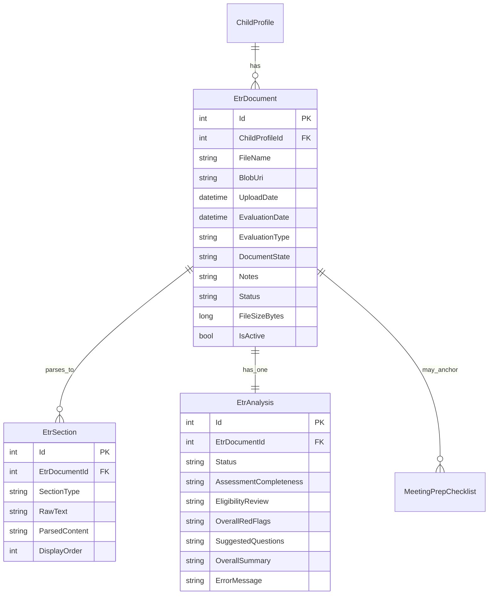

# feat: ETR Meeting Workflow

A parallel document workflow for **Evaluation Team Reports (ETRs)** that mirrors the existing IEP workflow: upload → parse via Claude → structured analysis → meeting prep. Parents will create an ETR for a child, upload a draft or prior ETR PDF, and receive the same depth of AI-assisted breakdown they get from the IEP flow — with ETR-specific analysis focused on assessment completeness, eligibility determination, red flags, and suggested meeting questions.

## Problem

Parents with ETR meetings on the calendar (often with only a draft document, sometimes only a prior/outdated version) have no way to use this platform to understand, analyze, or prepare for that meeting. ETR meetings determine eligibility for special education and set the foundation for any resulting IEP — missing an issue at ETR cascades into every downstream decision. The platform already handles IEPs well; ETRs are the obvious adjacent workflow.

## Scope

**In scope (v1):**
- `EtrDocument`, `EtrSection`, `EtrAnalysis` entities mirroring IEP triplet
- Upload pipeline with Claude-based parsing into ETR-specific section taxonomy
- Analysis across four pillars: assessment completeness, eligibility determination review, red flags / parent rights, suggested meeting questions
- Meeting prep generation from an ETR (extends existing `MeetingPrepChecklist`)
- Frontend feature folder `web/src/features/etr-documents/`
- Top-level ETR section in navigation (cross-child list grouped by child)
- Multiple ETRs per child, chronological timeline

**Out of scope (v1):**
- Automated draft-vs-prior comparison (parent can view both; no cross-document analysis)
- ETR-to-IEP cross-analysis (alignment between ETR findings and IEP goals)
- Support for 504 plans, BIPs, other document types
- In-app document editing/annotation
- Auto-trigger of analysis after parse completes (manual, matching IEP)

## Sources

- **Brainstorm:** `docs/brainstorms/2026-04-22-etr-meeting-workflow-brainstorm.md` — carried forward: separate parallel entities, separate top-level ETR section, full-parity MVP, multiple ETRs per child with timeline, four analysis pillars.
- **Design:** `docs/designs/2026-04-22-etr-meeting-workflow-design.md` — carried forward: all five open-question resolutions (manual analyze, flat cross-child list, new-ETR-per-upload, dedicated meeting-prep prompt branch, separate ETR analysis limit).
- **Existing patterns referenced:**
  - `api/IepAssistant.Domain/Entities/IepDocument.cs`
  - `api/IepAssistant.Services/Implementations/IepProcessingService.cs:44,178,190-237`
  - `api/IepAssistant.Services/Implementations/IepAnalysisService.cs:78,277`
  - `api/IepAssistant.Api/BackgroundServices/IepProcessingWorker.cs`
  - `api/IepAssistant.Api/BackgroundServices/IepAnalysisWorker.cs`
  - `api/IepAssistant.Api/Controllers/IepDocumentsController.cs`
  - `api/IepAssistant.Api/Controllers/MeetingPrepController.cs`
  - `api/IepAssistant.Services/Implementations/MeetingPrepService.cs`
  - `api/IepAssistant.Domain/Data/Configurations/` (Fluent API config pattern)
  - `api/IepAssistant.Api/Program.cs:57-72` (DI registration)
  - `web/src/features/iep-documents/` (feature folder pattern)
  - `web/src/features/children/components/child-detail-page.tsx:268` (create-IEP entry point)
  - `web/src/app/routes.tsx:170` (route registration)

## Data Design Decisions

All enum-like fields on new entities use **code-level strings**, not DB lookup tables. Rationale: values are structural (not business-configurable), changes should require code review + deploy, matches existing IEP conventions (`IepDocument.Status`, `IepSection.SectionType`, `IepAnalysis.Status` are all strings).

| Field | Values | Why not a lookup table |
|---|---|---|
| `EtrDocument.Status` | `created, uploaded, processing, parsed, error` | Pipeline states, code-controlled |
| `EtrDocument.DocumentState` | `draft, final` | Two stable values, code-controlled |
| `EtrDocument.EvaluationType` | `initial, reevaluation, transfer, other` | Stable IDEA categories |
| `EtrSection.SectionType` | 14 taxonomy strings (see design doc) | Claude outputs these; no FK needed |
| `EtrAnalysis.Status` | `pending, analyzing, completed, error` | Pipeline states, code-controlled |

## ERD

## Acceptance Criteria

- [ ] Parent can create an ETR for a child from the child detail page (fills evaluation date, evaluation type, document state draft/final, optional notes).
- [ ] Parent can upload a PDF (≤50MB) to an ETR; non-PDF / oversized / corrupt uploads are rejected with clear errors.
- [ ] Upload enqueues a processing job that parses the document via Claude into ETR-taxonomy sections within ~2 minutes for a typical 30-page ETR.
- [ ] Parent can trigger analysis; within ~2 minutes the ETR shows results across all four pillars: assessment completeness, eligibility review, red flags, meeting questions.
- [ ] Parent can generate a meeting-prep checklist from an ETR; checklist categories (questions, documents, rights, notes) are ETR-contextualized (not IEP-centric boilerplate).
- [ ] Parent can list and view all ETRs for a child in chronological order.
- [ ] Parent can access a top-level ETR page showing ETRs across all their children, grouped by child.
- [ ] All ETR endpoints enforce `[Authorize]` + child ownership via `AccessService`; `/process` and `/analyze` additionally require `Collaborator` role.
- [ ] ETR upload and analyze operations are gated by the user's subscription in the same way as IEP operations.
- [ ] Deleting a child cascades to delete their ETRs, sections, analyses, and meeting-prep records.
- [ ] Deleting an ETR (soft-delete via `IsActive=false`) hides it from listings without breaking existing references.
- [ ] Migration adding `EtrDocumentId` to `MeetingPrepChecklist` is additive, nullable, and backwards-compatible.

## Implementation Phases

### Phase 1 — Create ETR metadata (vertical slice)

**Scope:** Parent can create, list, view (shell), and delete an ETR. No upload yet.

**Backend:**
- Add `EtrDocument` entity → `api/IepAssistant.Domain/Entities/EtrDocument.cs` (mirror `IepDocument.cs`; fields per ERD)
- Add `EtrDocumentConfiguration` → `api/IepAssistant.Domain/Data/Configurations/EtrDocumentConfiguration.cs` (HasMaxLength, HasIndex on `ChildProfileId`, Cascade delete from `ChildProfile`)
- Add DbSet on `ApplicationDbContext` → `api/IepAssistant.Domain/Data/ApplicationDbContext.cs`
- Generate migration: `dotnet ef migrations add AddEtrDocuments`
- `IEtrDocumentRepository` + `EtrDocumentRepository` → `api/IepAssistant.Domain/Repositories/EtrDocumentRepository.cs` (list-by-child, get-by-id with ownership filter)
- Register in `DependencyInjection.cs`
- `IEtrDocumentService` + `EtrDocumentService` → `api/IepAssistant.Services/Implementations/EtrDocumentService.cs` (Create/List/GetById/UpdateMetadata/Delete with `ServiceResult<T>` return)
- `EtrDocumentsController` → `api/IepAssistant.Api/Controllers/EtrDocumentsController.cs`:
  - `GET /api/children/{childId}/etrs`
  - `GET /api/etrs/{id}`
  - `POST /api/children/{childId}/etrs` (body: `CreateEtrRequest { EvaluationDate, EvaluationType, DocumentState, Notes }`)
  - `PUT /api/etrs/{id}/metadata`
  - `DELETE /api/etrs/{id}`
- DTOs → `api/IepAssistant.Api/DTOs/EtrDocuments/`: `CreateEtrRequest.cs`, `UpdateEtrMetadataRequest.cs`, `EtrDocumentDto.cs`

**Frontend:**
- `web/src/features/etr-documents/api/etr-documents-api.ts` (axios calls, mirror IEP)
- `web/src/features/etr-documents/hooks/use-etr-documents.ts`
- `web/src/features/etr-documents/components/create-etr-form.tsx` (form with date, evaluationType select, documentState toggle, notes textarea)
- `web/src/features/etr-documents/components/etr-document-list.tsx` (per-child list component)
- `web/src/features/etr-documents/components/etr-viewer-page.tsx` (shell with tabs: Overview, Sections, Analysis, Meeting Prep — later phases populate them)
- Register route in `web/src/app/routes.tsx`: `/etrs/:id` → `EtrViewerPage`
- Add "New ETR" button + `<EtrDocumentList />` to `web/src/features/children/components/child-detail-page.tsx` alongside the existing IEP surface

**Testing / verification:**
- Unit test: `EtrDocumentService` CRUD + ownership rejection
- Integration test: Create → list → get → delete round-trip with auth
- Manual: Create an ETR from child detail page, confirm it appears in list, open viewer, delete it

**Exit criteria:** Parent can create, list, view shell, and delete ETRs. No file handling yet.

---

### Phase 2 — Upload + Claude parsing (vertical slice)

**Scope:** Parent uploads a PDF, background worker parses it via Claude into ETR sections, UI shows parsed content.

**Backend:**
- Add `EtrSection` entity → `api/IepAssistant.Domain/Entities/EtrSection.cs` (mirror `IepSection.cs`)
- `EtrSectionConfiguration` (HasMaxLength for SectionType, HasIndex on `EtrDocumentId`)
- Add DbSet + migration: `AddEtrSections`
- `IEtrSectionRepository` + impl
- `EtrProcessingQueue` (singleton `Channel<int>`) → `api/IepAssistant.Api/BackgroundServices/EtrProcessingQueue.cs`
- `EtrProcessingWorker` (BackgroundService) → `api/IepAssistant.Api/BackgroundServices/EtrProcessingWorker.cs`
- `IEtrProcessingService` + impl → `api/IepAssistant.Services/Implementations/EtrProcessingService.cs`:
  - `ProcessDocumentAsync(int etrId)` — download blob, extract text, call `StructureWithClaudeAsync`, persist sections, update status
  - Inline Claude prompt for ETR parsing (14 section taxonomy defined in design doc)
  - Model: `claude-sonnet-4-20250514`, MaxTokens 16384
  - Uses named `HttpClient "Claude"`
- Add endpoints to `EtrDocumentsController`:
  - `POST /api/etrs/{id}/upload` (multipart, 50MB limit, PDF magic-byte validation, subscription gate, enqueue after blob write)
  - `GET /api/etrs/{id}/download` (SAS URL)
  - `GET /api/etrs/{id}/sections`
  - `POST /api/etrs/{id}/process` (re-enqueue, `Collaborator` role check)
- Register queue singleton + worker in `Program.cs` next to IEP workers

**Frontend:**
- `web/src/features/etr-documents/components/etr-upload.tsx` (drag-drop, file picker, progress)
- `web/src/features/etr-documents/hooks/use-etr-processing.ts` (poll status)
- Populate "Sections" tab in `etr-viewer-page.tsx` with collapsible section list (can reuse/adapt IEP section detail components where taxonomy doesn't differ meaningfully)
- Show processing/error banners based on status

**Testing / verification:**
- Unit test: `EtrProcessingService` with mocked Claude response → confirms section persistence, error-path sets status `error` with message
- Integration test: Upload PDF → enqueue → worker runs → sections exist
- Manual: Upload a real sample ETR, confirm all 14 section types surfaced appropriately; confirm rejection of non-PDF, >50MB, corrupt PDF

**Exit criteria:** PDF upload results in parsed, viewable sections.

---

### Phase 3 — Analysis pipeline (vertical slice)

**Scope:** Parent triggers analysis; all four pillars render in UI.

**Backend:**
- Add `EtrAnalysis` entity → `api/IepAssistant.Domain/Entities/EtrAnalysis.cs` (fields: Status, AssessmentCompleteness, EligibilityReview, OverallRedFlags, SuggestedQuestions, OverallSummary, ErrorMessage — all JSON/text)
- `EtrAnalysisConfiguration` + DbSet + migration `AddEtrAnalyses`
- `IEtrAnalysisRepository` + impl
- `EtrAnalysisQueue` + `EtrAnalysisWorker`
- `IEtrAnalysisService` + impl → `api/IepAssistant.Services/Implementations/EtrAnalysisService.cs`:
  - `AnalyzeDocumentAsync(int etrId)` — load sections, call Claude with the four-pillar prompt, persist results
  - Inline prompt enforces structured JSON output for each pillar
- Controller endpoints:
  - `POST /api/etrs/{id}/analyze` (requires status `parsed`, subscription, per-child ETR analysis limit, `Collaborator` role)
  - `GET /api/etrs/{id}/analysis`
- Add separate ETR analysis limit in subscription config (mirrors IEP; does not consume IEP allowance)

**Frontend:**
- `web/src/features/etr-documents/components/analysis-tab.tsx` (tabbed subviews)
- Subviews, small and focused (per user preference for tightly-scoped components):
  - `assessment-completeness-view.tsx` — checklist of evaluated domains with gaps
  - `eligibility-review-view.tsx` — supported/unsupported conclusions with rationale
  - `etr-red-flags-list.tsx` — reuse `red-flag-card.tsx` component from IEP
  - `suggested-questions-list.tsx`
  - `analysis-processing.tsx` + `analysis-empty-state.tsx` (can be shared components if cleanly extracted)
- `web/src/features/etr-documents/hooks/use-etr-analysis.ts` (polling)

**Testing / verification:**
- Unit test: `EtrAnalysisService` with mocked Claude response covering all four pillars, including malformed JSON → `error` status
- Integration test: Full create→upload→parse→analyze flow produces expected analysis shape
- Manual: Real ETR analysis — validate each pillar makes sense for a draft ETR scenario

**Exit criteria:** Analysis runs end-to-end; all four pillars render with real content.

---

### Phase 4 — Meeting prep integration (vertical slice)

**Scope:** Parent generates a meeting-prep checklist anchored to an ETR.

**Backend:**
- Migration `AddEtrDocumentIdToMeetingPrepChecklist`: add nullable `EtrDocumentId` int FK on `MeetingPrepChecklist` with index and cascade-on-delete from `EtrDocument`. Additive, zero-downtime.
- Update `MeetingPrepChecklist.cs` + configuration
- Extend `IMeetingPrepService` to accept an ETR context (new method `GenerateFromEtrAsync(int checklistId)` or branch inside existing generation logic based on which FK is set)
- Add ETR-specific prompt branch in `MeetingPrepService.cs` — distinct from IEP prompt, centered on ETR concerns (IEE rights, challenging eligibility determination, requesting specific evaluations)
- Add endpoint to `MeetingPrepController`: `POST /api/etrs/{etrId}/meeting-prep`
- `MeetingPrepWorker` routes to the correct service method based on populated FK

**Frontend:**
- Populate "Meeting Prep" tab in `etr-viewer-page.tsx` — reuse `meeting-prep-tab.tsx`, `checklist-item-row.tsx`, `checklist-section.tsx` from `web/src/features/meeting-prep/components/` (these should work as-is since `MeetingPrepChecklist` structure is unchanged)
- Pass ETR context to the tab component

**Testing / verification:**
- Unit test: `MeetingPrepService` routes to ETR branch when `EtrDocumentId` set; IEP branch otherwise
- Integration test: Generate meeting prep from an ETR → checklist produced with ETR-contextualized content (spot-check presence of IEE / eligibility-challenge items)
- Migration test: Apply to a copy of production schema and confirm additive
- Manual: Generate meeting prep from a real ETR, eyeball quality vs. IEP version

**Exit criteria:** ETR viewer's Meeting Prep tab produces a usable, ETR-appropriate checklist.

---

### Phase 5 — Top-level ETR section + polish (vertical slice)

**Scope:** Dedicated top-level ETR navigation surface; polish edge cases.

**Backend:**
- Add `GET /api/etrs` — returns user's ETRs across all their children with `ChildProfile` included (grouped server-side or returned flat with child info for client grouping)

**Frontend:**
- New route in `web/src/app/routes.tsx`: `/etrs` → new `EtrListPage` component
- New nav entry: "ETRs" in primary navigation (alongside existing top-level items)
- `web/src/features/etr-documents/components/etr-list-page.tsx` — flat list grouped by child, each card shows evaluation date, document state, status, analysis state
- Empty state (no ETRs yet) directs user to a child to create one
- Error states: failed uploads, failed parse, failed analysis — retry affordance
- Breadcrumbs: child → ETR; top-level list → ETR detail

**Polish / edge cases:**
- Orphan cleanup: `EtrDocument` in `created` state for >7 days with no upload → background cleanup job (or defer to a follow-up) — **flagged for simplify pass**
- Subscription downgrade mid-analysis: analysis completes; subsequent analyses require upgrade
- Concurrent analyze requests on same ETR: controller short-circuits if `Status=analyzing`
- Large ETR lists per child: pagination (page size 20, matching IEP)
- Delete ETR → soft-delete; verify sections/analysis/meeting-prep still reachable via admin but hidden from parent UI

**Testing / verification:**
- E2E Playwright: create ETR → upload → wait for parse → analyze → wait for analysis → generate meeting prep → delete
- Manual: Walk the full parent journey from login

**Exit criteria:** Navigation discoverable, feature feels complete, golden-path E2E passes.

---

## Quality Gates

- [ ] All new EF migrations are additive and reversible; production schema drift validated against `appsettings.Development.json` + a staging run
- [ ] Claude prompts checked into source control (inline in services); reviewer confirms prompts request structured JSON with clear schemas
- [ ] All new backend endpoints have `[Authorize]`; `/process`, `/analyze`, `/delete` have explicit role checks
- [ ] No new `any` in TypeScript; all API DTOs typed
- [ ] Components stay small and tightly scoped (user preference) — extract when a component exceeds ~200 lines or handles >2 responsibilities
- [ ] No new heavy dependencies added to frontend (consistent with memory: prefer minimal deps)
- [ ] No react-query introduced (match existing axios + hand-rolled hooks pattern)
- [ ] Test coverage for service-layer happy + error paths
- [ ] Manual run through with a real sample ETR before each phase's PR merge

## System-wide Impact

- **Database:** 4 migrations (EtrDocuments, EtrSections, EtrAnalyses, MeetingPrepChecklist FK addition). All additive. Estimated schema size: ~3 new tables, 1 FK.
- **Background workers:** 2 new hosted services (`EtrProcessingWorker`, `EtrAnalysisWorker`) running alongside 3 existing. Channel queues are in-process — no infrastructure change.
- **Claude API usage:** Parse + analyze + meeting-prep — three Claude calls per ETR lifecycle, same cost shape as IEP. Subscription/limit changes applied.
- **Blob storage:** ETR PDFs stored in same Azure Blob container as IEPs (consider `etrs/` prefix for clarity) — no new storage account.
- **Logging/APM:** Serilog + Elastic APM pick up new workers/endpoints automatically.
- **Frontend bundle:** New feature folder adds ~similar footprint as IEP feature folder; no new dependencies expected.

## Dependencies

- `IepAssistant.Domain` (existing)
- `IepAssistant.Services` (existing)
- Anthropic.SDK (already integrated)
- Azure Blob Storage (already integrated)
- `AccessService` (already implemented for IEP ownership)
- Subscription gating (already implemented)

## Success Metrics

- Parent can go from "I have an ETR meeting tomorrow" to a populated meeting-prep checklist in <10 minutes (upload + parse + analyze + meeting-prep generation, mostly waiting on async workers).
- Assessment completeness analysis surfaces at least one missed/under-evaluated domain on a real sample draft ETR that a knowledgeable advocate would also flag (manual validation, not automated).
- Zero regressions to the existing IEP workflow (CI + manual spot-check).

## Risks & Mitigations

- **Risk:** Claude output for ETR parsing is less structured than IEP parsing because ETRs vary more by district.
  - **Mitigation:** ETR-specific prompt with strong section-type constraint; `other` catch-all section for unrecognized content; manual validation on 3+ sample ETRs before merge.
- **Risk:** Adding `EtrDocumentId` to `MeetingPrepChecklist` introduces dual-anchor complexity and a service-layer fork.
  - **Mitigation:** Enforce "exactly one of IepDocumentId/EtrDocumentId is set" via service-layer validation (DB-level CHECK constraint optional, skipping for v1 simplicity).
- **Risk:** Parents confuse ETR and IEP surfaces.
  - **Mitigation:** Distinct top-level navigation entry; ETR viewer has clear "Evaluation Team Report" heading; create-ETR form explains what an ETR is inline.
- **Risk:** Analysis rerun policy (design doc open question #3) — parent uploads a revised draft expecting re-analysis of the same ETR record.
  - **Mitigation:** Resolved to "new ETR per upload"; UI copy on ETR-list encourages creating a new ETR entry when a revised draft arrives.

## Follow-ups (explicitly deferred)

- Draft vs. prior ETR comparison view
- ETR-to-IEP alignment check ("did the IEP goals address what the ETR identified?")
- Prompt-file abstraction (externalize Claude prompts from service files) — revisit if prompt drift becomes a maintenance burden
- Orphan-ETR cleanup job
- Admin backfill for historical ETRs
- 504 and BIP document types (evaluate generalizing abstraction once second parallel workflow is live)

---

**Design review:** Approved 2026-04-22 (all five recommendations accepted: manual analyze, flat cross-child list, new-ETR-per-upload, dedicated meeting-prep prompt, separate ETR analysis limit).
