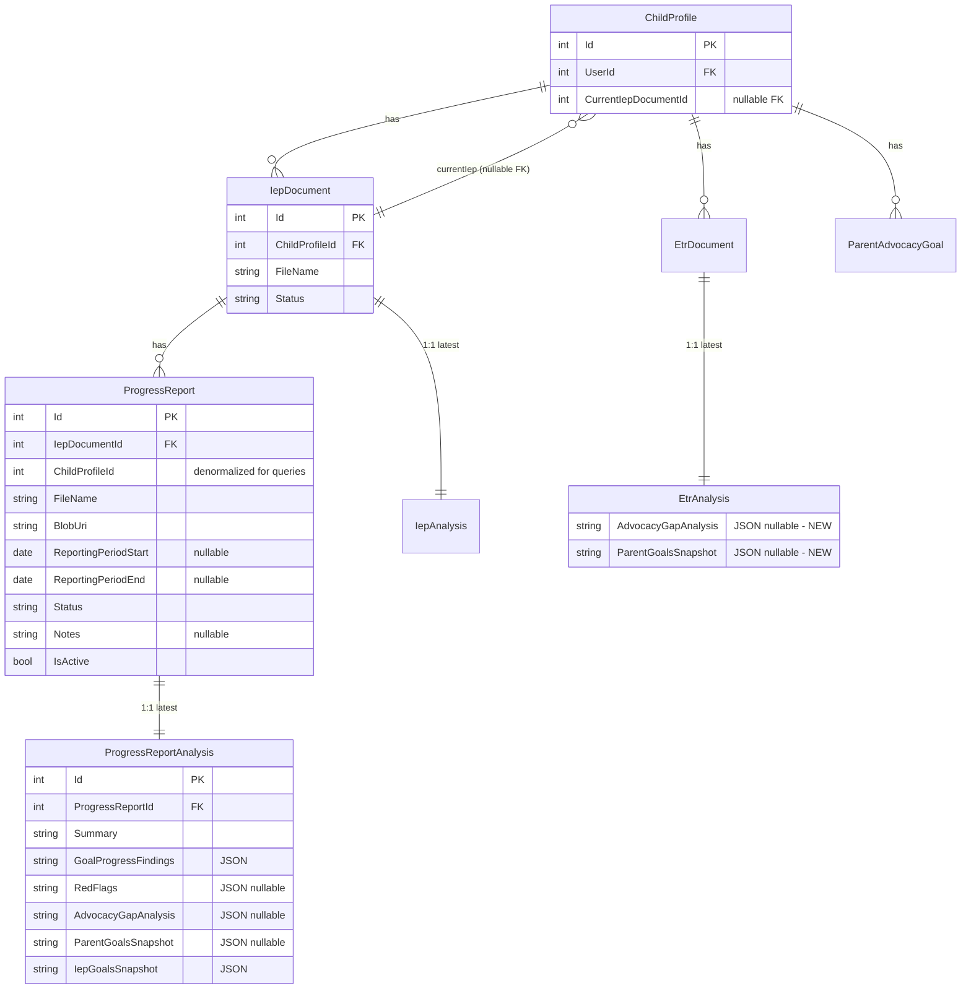

# feat: Child detail tabs, current IEP, progress reports, goals in all analyses

## Summary

Reorganize the child detail page into tabs (Overview / IEPs / ETRs / Goals), let parents mark one IEP as the **current** IEP per child, add **Progress Reports** that attach to an IEP and support Claude-powered analysis, and ensure parent **advocacy goals are passed into IEP, ETR, and Progress Report analyses**.

Origin: see [design discussion](../designs/2026-04-28-child-tabs-progress-reports-design.md). Design was approved; structure approved as a 6-phase vertical-slice plan.

## Why

The child detail page is a long stack of cards that grows every time we add a feature; tabs reduce cognitive load and give us shareable URLs. Parents asked for a way to mark "the IEP we're currently operating under" so progress can be tracked against it — this is the natural anchor for **progress reports**, which schools issue 3–4× a year and which today have no home in the product. Finally, advocacy goals are already the centerpiece of IEP analysis, but ETR analysis ignores them and progress reports don't yet exist; bringing all three analyses into alignment makes the advocacy story coherent end-to-end.

## Acceptance Criteria

- [ ] `/children/:id` renders a tab shell with **Overview / IEPs / ETRs / Goals**; default tab = Overview; switching tabs updates the URL; deep links and browser back/forward work.
- [ ] Old `/ieps/:id` and `/etrs/:id` routes still resolve (redirect to nested route under the child).
- [ ] A parent can mark an IEP as **current** for a child; only one IEP can be current at a time; the badge appears on the IEPs tab and on the IEP viewer.
- [ ] When the first IEP is uploaded for a child, it is auto-set as current. When a newer IEP supersedes the current one (newer `IepDate`), the user can be prompted (or auto-update — see Phase 2) to make it current.
- [ ] A parent can upload a **Progress Report** from the IEP viewer's new "Progress Reports" tab. The report is attached to that IEP. The list shows status (created → uploaded → processing → parsed → error).
- [ ] A Progress Report can be analyzed; the analysis output includes per-IEP-goal progress assessment, advocacy gap analysis (when parent goals exist), and a summary.
- [ ] **ETR analysis** loads parent advocacy goals, snapshots them on the analysis row, and produces an advocacy gap analysis when goals exist — same UX as IEP analysis.
- [ ] Existing ETR analyses without a goal snapshot show a "stale analysis" banner offering re-analyze.
- [ ] Sharing/access rules are enforced: viewers can read progress reports + analyses; only owner/editor can upload, delete, or set current.
- [ ] All new endpoints have access checks via `IAccessService`.
- [ ] Manual browser walkthrough of the full flow (upload IEP → set current → upload progress report → analyze → confirm advocacy goals appear) passes before each phase is declared done.

## Non-Goals

- Automatic re-analysis when advocacy goals change (manual re-analyze remains the only trigger).
- Per-user "current IEP" preference (current is child-level, applies to all collaborators).
- Backfilling existing ETR analyses with goal snapshots (stale banner instead).
- Changing IEP analysis behavior (it already includes goals).

## Data Design Decisions

- **`IepDocument.MeetingType`** — already a free-string column today (`"initial" | "annual_review" | "amendment" | "reevaluation"`). **Leave as-is**; not in scope. (Noted because it looks enum-ish.)
- **`ProgressReport.Status`** — string column matching the existing `IepDocument.Status` and `EtrDocument.Status` pattern. **Code enum** at the service layer, persisted as string. Rationale: matches existing codebase pattern; values rarely change.
- **`ProgressReportAnalysis` JSON columns** — same pattern as `IepAnalysis` (serialize structured DTOs to `nvarchar(max)`).

## Data Model Changes

## Implementation Phases

### Phase 1 — Tab shell + nested routes (UI only)

**Goal:** Tabs render with the existing content, no behavior changes, URLs work.

- [x] If `web/src/components/ui/tabs.tsx` doesn't exist, create a small primitive (`Tabs`, `TabsList`, `TabsTrigger`, `TabsContent`) wired to React Router (active tab derived from URL, not local state). Reuse pattern from `etr-viewer-page.tsx`.
- [x] Refactor `web/src/features/children/components/child-detail-page.tsx`:
  - Lift Profile + Sharing into `child-overview-tab.tsx`.
  - Lift IEPs Card into `child-ieps-tab.tsx` (currently the IEP Card content).
  - Lift ETRs Card into `child-etrs-tab.tsx`.
  - Lift Advocacy Goals Card into `child-goals-tab.tsx`.
  - Keep `child-detail-page.tsx` as a thin shell: header (name, edit, remove) + tab nav + `<Outlet />` (or render-by-segment if not using outlets).
- [x] Update `web/src/app/routes.tsx`:
  - Replace `/children/:id` with a parent route that renders the shell, plus nested routes:
    - `/children/:id` → redirect to `/children/:id/overview`
    - `/children/:id/overview`
    - `/children/:id/ieps`
    - `/children/:id/etrs`
    - `/children/:id/goals`
    - `/children/:id/ieps/:iepId` → renders `IepViewerPage` inside the IEPs tab
    - `/children/:id/etrs/:etrId` → renders `EtrViewerPage` inside the ETRs tab
  - Keep top-level `/ieps/:id` and `/etrs/:id` as redirect routes that look up `childProfileId` and forward to the nested URL. Implement via a small `<RedirectIepToChild />` / `<RedirectEtrToChild />` wrapper that uses the existing `getById` API and `<Navigate>`.
- [x] Update internal links (`<Link to="/ieps/...">` etc.) to the new nested URLs. Grep for `/ieps/` and `/etrs/`.
- [ ] **Vertical test checkpoint:** dev server, click each tab, deep-link into each tab via URL, browser back/forward, verify old `/ieps/:id` redirects. *(deferred to manual verification by user)*

**Files touched (illustrative):**
- `web/src/components/ui/tabs.tsx` *(new if missing)*
- `web/src/features/children/components/child-detail-page.tsx`
- `web/src/features/children/components/child-overview-tab.tsx` *(new)*
- `web/src/features/children/components/child-ieps-tab.tsx` *(new)*
- `web/src/features/children/components/child-etrs-tab.tsx` *(new)*
- `web/src/features/children/components/child-goals-tab.tsx` *(new)*
- `web/src/app/routes.tsx`

### Phase 2 — Current IEP

**Goal:** A child has at most one current IEP; surfaced in the IEPs tab.

- [x] **Migration** `AddCurrentIepDocumentIdToChildProfile`:
  - Add `CurrentIepDocumentId int NULL` FK to `IepDocuments(Id)` with `OnDelete: SetNull`.
- [x] **Domain** `ChildProfile.cs`: add `CurrentIepDocumentId` (int?) and optional nav `IepDocument? CurrentIepDocument`.
- [x] **Service** `ChildProfileService.SetCurrentIepAsync(childId, iepId, userId)`.
- [x] **Service rule** in `IepDocumentService`: auto-set on first IEP via `EnsureCurrentIepAsync` (called from `CreateAsync` and `UploadAsync`).
- [x] **Controller** `ChildrenController.SetCurrentIep`: `PUT /api/children/{childId}/current-iep/{iepId}`.
- [x] **API surface in response DTOs:** `ChildProfileDto.CurrentIepDocumentId`.
- [x] **Frontend**: `setCurrentIep` API, "Current" badge + "Set as current" button on IEPs tab, "Current IEP" badge + "Make current" button in IEP viewer header.
- [ ] **Tests:** no test framework yet in /api or /web. Deferred.
- [ ] **Vertical test checkpoint:** deferred to manual verification.

### Phase 3 — Goals in ETR analysis

**Goal:** ETR analysis mirrors IEP analysis for advocacy goals.

- [x] **Migration** `AddAdvocacyGoalSnapshotsToEtrAnalysis`.
- [x] **Domain** `EtrAnalysis.cs`: AdvocacyGapAnalysis + ParentGoalsSnapshot nullable strings.
- [x] **Service** `EtrAnalysisService`: inject IParentAdvocacyGoalRepository, load goals, branch prompt on hasParentGoals, persist snapshot + gap analysis.
- [x] **Models** `EtrAnalysisModels.cs`: response + service model expose AdvocacyGapAnalysis + ParentGoalsSnapshot.
- [x] **Frontend**: Advocacy Goals view in ETR analysis tab (reuses `advocacy-gap-analysis.tsx`); stale-analysis banner when child has goals but snapshot is empty (reuses `stale-analysis-banner.tsx`).
- [ ] **Tests:** no test framework yet. Deferred.
- [ ] **Vertical test checkpoint:** deferred to manual verification.

### Phase 4 — Progress Reports: upload + parsing

**Goal:** A parent can upload a progress report attached to an IEP, see it in a list, and view its parsed sections.

- [x] **Migration** `AddProgressReports`: applied to dev DB. NoAction on ChildProfile FK to avoid cascade-cycle.
- [x] **Domain**: `ProgressReport` entity, `IProgressReportRepository` + impl, DI registration.
- [x] **Services**: `IProgressReportService` + impl with create/upload/get/list/update/delete/download. Parsing service deferred to Phase 5 (will run Claude PDF analysis with IEP + advocacy goal context — no separate "sections" table needed for progress reports).
- [x] **Models**: `ProgressReportModel`, `CreateProgressReportModel`.
- [x] **API**: `ProgressReportsController` with list-by-iep, get, create, upload, update-metadata, download, delete. Access enforced via `IAccessService`.
- [x] **Frontend** (`web/src/features/progress-reports/`): types, api, hook, create form, upload, list with status pills, viewer page with PDF preview.
- [x] **Wire into IEP viewer**: "Progress Reports" tab on `iep-viewer-page.tsx` next to Meeting Prep.
- [x] **Routing**: `/children/:childId/ieps/:id/progress-reports/:prId`.
- [x] **Sharing**: viewer role hides New/Delete/Upload UI; backend enforces Collaborator+ for create/upload/update and Owner for delete.
- [ ] **Tests:** no test framework yet. Deferred.
- [ ] **Vertical test checkpoint:** deferred to manual verification.

### Phase 5 — Progress Report analysis

**Goal:** Each progress report can be analyzed; output ties IEP goal progress + advocacy goal alignment.

- [x] **Migration** `AddProgressReportAnalyses`: applied to dev DB.
- [x] **Domain**: `ProgressReportAnalysis` entity, config, repository, DI.
- [x] **Service**: `ProgressReportAnalysisService` loads PR → IEP → IEP goals → advocacy goals → sends PDF + context to Claude → persists snapshots + findings + advocacy gap.
- [x] **Models**: `ProgressReportAnalysisModel`, Claude response shapes (GoalProgressFinding, ProgressReportRedFlag, IepGoalSnapshot).
- [x] **Background**: `ProgressReportAnalysisQueue` + `ProgressReportAnalysisWorker` registered in Program.cs. Auto-queue on upload + manual `POST /api/progress-reports/{id}/analyze`.
- [x] **API**: `GET /api/progress-reports/{id}/analysis`, `POST /api/progress-reports/{id}/analyze`.
- [x] **Frontend**: `useProgressReportAnalysis` hook with polling, `ProgressReportAnalysisTab`, `GoalProgressCard`, reuses `AdvocacyGapAnalysisSection`. Document/Analysis tabs on PR viewer.
- [ ] **Subscription/usage limits**: deferred — same status as ETR analysis (no enforcement).
- [ ] **Tests:** no test framework yet. Deferred.
- [ ] **Vertical test checkpoint:** deferred to manual verification.

### Phase 6 — Polish, sharing audit, regression

- [x] Walked every new endpoint. All service methods (ProgressReportService, ProgressReportAnalysisService, ChildProfileService.SetCurrentIepAsync, EtrAnalysisService) enforce access via `IAccessService.GetRoleAsync` (read paths) or `HasMinimumRoleAsync` (write paths: Collaborator+ for create/upload/update, Owner for delete). Verified by inspection: 20 access-check call sites across the new/changed services.
- [x] Polled progress-report list while reports are mid-analysis so the status pill updates without a manual refresh (`useProgressReports` polls every 4s while any report is `uploaded` or `processing`).
- [ ] Sentry tags: skipped — no existing Sentry usage in the .NET layer to extend.
- [ ] `dashboard-children-section.tsx` progress-report count: skipped (out of scope; not requested).
- [ ] `CLAUDE.md` updates: no new conventions worth codifying.
- [ ] Manual end-to-end browser walkthrough (per CLAUDE.md rule):
  - Upload IEP → confirm auto-set current.
  - Upload second IEP → set as current → confirm badge moves.
  - Add advocacy goals.
  - Re-analyze IEP → confirm gap analysis present (regression).
  - Analyze ETR → confirm gap analysis present (new).
  - Upload progress report → analyze → confirm IEP goal progress + advocacy gap.
  - Deep link into each tab via URL.
  - Open a stale ETR analysis from before Phase 3 → confirm stale banner → re-analyze.
  - Old `/ieps/:id` and `/etrs/:id` URLs redirect.
  - Viewer-role user can read but not upload/delete/set-current.
- [ ] Run `dotnet test` and `npm test` in `/web`.

## Open Questions Carry-forward (from design)

1. **Existing ETR analyses lack snapshot.** Resolved: stale-analysis banner pattern (Phase 3).
2. **Progress Report parsing.** Resolved: dedicated `ProgressReportParsingService` (Phase 4).
3. **Reporting period detection.** Resolved: parent enters at upload (Phase 4 form). Future enhancement: Claude-suggested default — out of scope.
4. **Current IEP for shared users.** Resolved: child-level (single FK).
5. **Migration of existing analyses.** Resolved: nullable columns; rely on stale banner.

## Sources

- Design discussion: [docs/designs/2026-04-28-child-tabs-progress-reports-design.md](../designs/2026-04-28-child-tabs-progress-reports-design.md)
- Reference patterns:
  - IEP analysis with goal snapshot: `api/IepAssistant.Services/Implementations/IepAnalysisService.cs:174-213`
  - ETR analysis (current, no goals): `api/IepAssistant.Services/Implementations/EtrAnalysisService.cs:121`
  - Tab pattern: `web/src/features/etr-documents/components/etr-viewer-page.tsx`
  - Stale banner pattern: `web/src/features/iep-documents/components/stale-analysis-banner.tsx`
  - Existing routes: `web/src/app/routes.tsx`
- Memory: [PLAN.md](../../PLAN.md), [MEMORY.md](../../../.claude/projects/-Users-bradgardner-dev-iep-assistant/memory/MEMORY.md)
