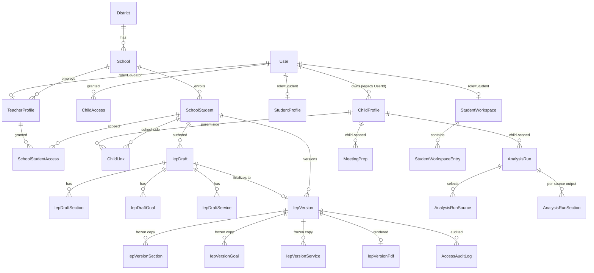

# feat: School-side IEP authoring, multi-doc AnalysisRun & student workspace

## Summary

Pivot the platform from a parent-only PDF-analysis tool into a three-sided system — **parent / educator / student** — delivered in three product slices over nine implementation phases. Each phase is a vertical slice (entity + EF config + service + queue/endpoint + frontend + tests) behind a feature flag.

1. **Analysis rework** — replace per-document `IepAnalysis` / `EtrAnalysis` with a multi-source `AnalysisRun`; extract Meeting Prep to its own feature; centralize Claude access behind `IClaudeClient`.
2. **School-side authoring** — `District → School → TeacherProfile` org; educators author IEPs as structured data (`IepDraft`); `finalize` produces an immutable `IepVersion` snapshot with `LineageId` lineage and a QuestPDF-rendered PDF; parents are invited and linked via `ChildLink`; inline + sidebar AI; FERPA-aligned `AccessAuditLog`.
3. **Student workspace** — invited student accounts with a self-advocacy workspace whose entries can be pulled into IEPs and meeting prep.

> Origin: see brainstorm `docs/brainstorms/2026-05-26-school-side-and-analysis-rework-brainstorm.md` and design `docs/designs/2026-05-27-school-side-and-analysis-rework-design.md`. All key decisions below are carried forward from those documents.

## Goals

- A child-level **Analysis** experience where a parent (or educator) selects any combination of source documents and runs one analysis producing per-source sections + cross-document synthesis.
- A standalone **Meeting Prep** feature, no longer entangled with analysis output.
- Educators author **structured IEPs** (not PDFs) and **finalize** them into immutable, PDF-backed versions shared with linked parents.
- **Goal/Service/Section lineage** across versions for year-over-year analysis and progress-report alignment.
- A **student self-advocacy workspace** that contributes to the IEP and meeting prep without entangling minor-consent complexity with document mechanics.
- Ship safely via **vertical slices behind feature flags**, with each slice in production before the next begins.

## Non-Goals (this rework)

- Per-state IEP form templates / state form packs (capture `StateCode` only).
- E-signature / formal parent consent capture (leave a no-op finalize hook).
- Section 504 plan authoring (leave a `DocumentType` enum hook on `IepVersion`).
- ETR draft/version authoring (ETRs remain school-uploaded PDFs).
- District admin console (self-serve educator signup only).
- Usage-limit enforcement on the school side (track `UsageRecord`, do not enforce).
- Real-time collaborative editing (last-write-wins only).

## Data Design Decisions

Enum-like fields and their storage choice (string-converted enums unless noted, matching `HasConversion<string>()` convention):

| Field | Decision | Rationale |
| --- | --- | --- |
| `User.Role` (`Parent`/`Educator`/`Student`/`Admin`) | **Code enum** | Auth pipeline branches on it; changing requires deploy anyway. Migrate existing `"User"` → `"Parent"`. |
| `AnalysisRun.Status` (`pending`/`running`/`completed`/`error`) | **Code enum** (replaces current loose strings) | State machine belongs in code; no runtime editing need. |
| `AnalysisRunSource.SourceType` (`IepDocument`/`EtrDocument`/`IepVersion`/`ProgressReport`) | **Code enum** | Fixed set tied to entity types. |
| `IepVersion.DocumentType` (`Iep`/`Section504`) | **Code enum** | Hook for future 504 support; only `Iep` used now. |
| `IepDraft.Status` (`draft`/`finalizing`/`finalized`/`archived`) | **Code enum** | Drives finalize state machine. |
| `IepSectionKind` (PLAAFP domains, services, accommodations, transition, placement, …) | **Code enum** | Mirrors existing `SectionType` strings; aligns with IDEA §614 structure. |
| `StudentWorkspaceEntry.EntryKind` (`Strength`/`Interest`/`AccommodationRequest`/`MeetingStatement`/`AiInterviewAnswer`) | **Code enum** | Fixed contribution types. |
| `SchoolStudentAccess.Role` / `ChildAccess.Role` | **Existing code enum** (`Viewer`/`Collaborator`/`Owner`) | Reuse existing `AccessRole`. |
| `AccessAuditLog.Action` (`view`/`edit`/`share`/`export`/`finalize`) | **Code enum** | Audit semantics fixed. |
| `MeetingPrep` source links | reuse existing optional doc FKs | Already modeled on `MeetingPrepChecklist`. |

## Entity Relationship Diagram

## Slice & Phase Map

| Slice | Phase | Scope |
| --- | --- | --- |
| 1 | **P0** | `IClaudeClient` abstraction + `IFeatureFlags` infra |
| 1 | **P1** | `AnalysisRun` entity + queue + worker + child Analysis tab + legacy backfill |
| 1 | **P2** | Meeting Prep extraction to standalone tab/feature; drop `SuggestedQuestions` overlap |
| 2 | **P3** | Identity/role discriminator + `District`/`School`/`TeacherProfile`/`SchoolStudent`/`ChildLink` + invite/link |
| 2 | **P4** | `IepDraft` authoring UI + structured sections/goals/services/accommodations/transition |
| 2 | **P5** | `finalize` → `IepVersion` (immutable + `LineageId`) + QuestPDF + parent visibility |
| 2 | **P6** | Educator AI (inline + sidebar) + `AccessAuditLog` |
| 3 | **P7** | `Student` role + invite flow + consent capture |
| 3 | **P8** | `StudentWorkspace` + entries + pull-into-IEP / pull-into-MeetingPrep |

---

## Phase P0 — Claude abstraction & feature flags

**Scope:** Pure refactor + infra; no user-visible change. Sets the foundation for every later AI feature and flagged rollout.

**Backend**
- Add `IClaudeClient` (`api/IepAssistant.Services/Abstractions/IClaudeClient.cs`) wrapping `Anthropic.SDK` — methods for `CompleteAsync(ClaudeRequest)` and `CompleteWithDocumentAsync(...)` (PDF bytes path). Centralizes API key read, `IHttpClientFactory.CreateClient("Claude")`, retry/backoff, and telemetry.
- Implement `ClaudeClient` (`Services/Implementations/ClaudeClient.cs`); register in DI.
- Replace the 6 `new AnthropicClient(...)` call sites (`IepAnalysisService.cs:287`, `EtrAnalysisService.cs:245`, `ProgressReportAnalysisService.cs:225`, `MeetingPrepService.cs:700`, `IepProcessingService.cs:188`, `EtrProcessingService.cs:178`) with injected `IClaudeClient`. **No prompt text changes** in this phase — only transport moves.
- Add `IFeatureFlags` (`Services/Abstractions/IFeatureFlags.cs`) reading `Feature:*` config keys; implement `ConfigurationFeatureFlags`. Flags: `Feature:AnalysisRun`, `Feature:MeetingPrepStandalone`, `Feature:SchoolSide`, `Feature:StudentWorkspace`.

**Tests**
- Unit: `ClaudeClient` builds the same request shape (mock `HttpMessageHandler`); existing analysis services still produce identical prompts (snapshot test on prompt string).
- Unit: `ConfigurationFeatureFlags` reads/defaults correctly.

**Acceptance criteria**
- [x] All Claude calls route through `IClaudeClient`; zero remaining `new AnthropicClient` (only `ClaudeClient.cs`).
- [x] Existing IEP/ETR/progress/meeting-prep flows behave identically (prompts/model/MaxTokens preserved verbatim; build 0 warnings). Note: full end-to-end regression with a live key still pending.
- [x] Flags default to **off**; toggling a flag requires no redeploy (`ConfigurationFeatureFlags` reads `Feature:*`).

> Follow-ups noted in review (not blocking P0): (1) bind `Anthropic:ApiKey` + flags via `IOptions<T>` with startup validation; (2) enrich `IClaudeClient` return to a small result carrying `StopReason` (lost from two ETR log lines) to aid truncation diagnostics. Bonus fixed in P0: `IepProcessingService` no longer `new HttpClient` per request (now pooled `"Claude"` client).

**Checkpoint:** Full existing test suite green; manual smoke of one IEP analysis.

---

## Phase P1 — AnalysisRun (multi-source) + legacy backfill

**Scope:** New analysis primary path behind `Feature:AnalysisRun`.

**Backend — entities** (`api/IepAssistant.Domain/Entities/`)
- `AnalysisRun`: `ChildProfileId`, `Status` (enum), `OverallSummary`, `CrossDocSynthesis` (JSON), `OverallRedFlags` (JSON), `ParentGoalsSnapshot` (JSON), `ErrorMessage`, audit fields.
- `AnalysisRunSource`: `AnalysisRunId`, `SourceType` (enum), `SourceId`, **`SourceContentSnapshot`** (denormalized text/section JSON captured at enqueue so later viewing/re-runs are stable even if the source is deleted — addresses SpecFlow "source deleted mid-run").
- `AnalysisRunSection`: `AnalysisRunId`, `AnalysisRunSourceId`, `SectionKind`, `Analysis` (JSON), `DisplayOrder`.
- Sibling `*Configuration.cs` for each; register via `ApplyConfigurationsFromAssembly`.

**Backend — service/queue/worker**
- `AnalysisRunService` (`Services/Implementations/AnalysisRunService.cs`) returning `ServiceResult<T>`; guards via `IAccessService.HasMinimumRoleAsync` (min `Viewer` to read, `Collaborator` to create).
- `AnalysisRunQueue` + `AnalysisRunWorker` (`api/IepAssistant.Api/BackgroundServices/`) mirroring `IepAnalysisWorker` shape (channel, `IServiceScopeFactory`, status written by service).
- Worker builds one Claude prompt across all sources via `IClaudeClient`, returns per-source sections + synthesis.
- **Usage limit:** redefine the unit to per-run in `SubscriptionService.CanPerformAnalysisAsync` / `UsageRecord`. An **errored or zero-completed run does not consume quota**; quota is decremented only on transition to `completed`.

**Backend — controller**
- `AnalysisRunController`: `POST /api/children/{childId}/analysis-runs` (body: selected sources), `GET .../analysis-runs`, `GET .../analysis-runs/{id}`.
- Validation: **reject < 1 source**; a 1-source run is allowed but skips cross-doc synthesis (synthesis section omitted, not empty). Warn (non-blocking) when two selected sources share a `LineageId`/same underlying IEP to avoid duplicate content.

**Backend — migration / backfill**
- Migration creates new tables.
- **Idempotent data migration** backfilling each existing `IepAnalysis` / `EtrAnalysis` into a single-source `AnalysisRun` (+ one `AnalysisRunSource`, sections copied). Skip rows already backfilled (guard on a marker). Handle `analyzing`/`error` legacy rows by mapping status across; orphaned rows (missing doc) are skipped and logged. **Row-count parity assertion** in a migration test.

**Frontend** (`web/src/features/analysis/`)
- `api/analysis-runs-api.ts`, `hooks/use-analysis-runs.ts` (poll via `usePolling` while any run is `pending`/`running`).
- Child-level **Analysis** tab (`/children/:childId/analysis`) registered in `routes.tsx` and `ChildOutletContext`: source picker (lists IEPs, ETRs, finalized IepVersions, progress reports), "Run analysis" CTA, run history, run detail reusing existing `analysis-*.tsx` components scoped to a run.

**Tests**
- Unit: source validation (0 rejected, 1 skips synthesis, N ok); quota only on completed.
- Integration: backfill idempotent + row-count parity; deleting a source after a completed run preserves output (snapshot honored).
- Browser: upload IEP + ETR → run combined analysis → see per-source sections + synthesis.

**Acceptance criteria**
- [x] Run with 0 sources rejected with clear error (validated in `AnalysisRunService.CreateRunAsync` + unit test).
- [x] Errored run does not consume quota; completed run consumes exactly one unit (run-scoped reserve via `UsageRecordId` + refund-by-id; worker startup sweep + per-item fail path; concurrency-proof unit test).
- [x] Deleting a source attached to a completed run leaves the run viewable (content snapshotted at enqueue into `AnalysisRunSource.SourceContentSnapshot`; execute reads only the snapshot — reviewer-confirmed).
- [x] Backfill produces exactly one run per legacy analysis (row-count parity) — idempotent keyed backfill + parity unit test.
- [x] Flag off → Analysis tab hidden, legacy per-doc analysis still reachable (tab link + route both gated via `FeatureRoute`/`/api/config`; legacy endpoints untouched).

> Shipped P1a–P1d (commits e588b75, 2bead45, b92844f, 3de9565). Backend: 23 unit tests green. **Pending:** browser verification of the combined-run golden path (local `vite build` blocked by an esbuild host/binary version mismatch unrelated to the code — typecheck + lint pass), and backfill verified on a staging DB copy.

**Checkpoint:** Combined IEP+ETR run verified in browser; backfill verified on a staging copy.

---

## Phase P2 — Meeting Prep extraction

**Scope:** Promote Meeting Prep to a standalone child-level feature behind `Feature:MeetingPrepStandalone`; remove analysis overlap.

**Backend**
- Graduate `MeetingPrepChecklist` usage into a clear `MeetingPrep` feature surface (keep entity name to avoid migration churn; add `MeetingDate` + selected-source links if not present).
- Remove `SuggestedQuestions` from `AnalysisRun` output generation (and stop populating it on legacy path) — meeting-relevant questions now live only in Meeting Prep. **Verify existing Meeting Prep reads don't depend on analysis `SuggestedQuestions`.**

**Frontend**
- Child-level **Meeting Prep** tab (`/children/:childId/meeting-prep`); move existing meeting-prep UI out of the IEP viewer/analysis area.

**Tests**
- Integration: removing `SuggestedQuestions` from analysis doesn't break Meeting Prep generation/reads.
- Browser: create a meeting prep from the new tab with a meeting date + selected docs.

**Acceptance criteria**
- [x] Meeting Prep reachable as its own tab; no longer rendered inside analysis (child-level `/children/:childId/meeting-prep` behind `Feature:MeetingPrepStandalone`; embedded IEP/ETR viewer tabs hidden when flag on).
- [x] Analysis output no longer contains `SuggestedQuestions` (fully removed from legacy IepAnalysis/EtrAnalysis entities/services/prompts/models/DTOs/UI per user decision; AnalysisRun already excluded them; per-section `SectionAnalysisResult.SuggestedQuestions` hint intentionally retained).
- [x] Flag off → behavior reverts to prior in-analysis location (embedded viewer tabs gated on `useFeatureFlagStatus().loaded` so they show when flag off, hide when on, no load-flash).

> Shipped P2a (commit `876b405`) + P2b (`9c48a29`). Backend 33 tests green; frontend type-check + lint clean. Added `MeetingDate` to MeetingPrepChecklist (threaded through generation). **Pending:** browser golden path (esbuild host/binary mismatch still blocks local `vite build`) and a staging-DB check of the destructive SuggestedQuestions column drop. **Slice 1 (P0–P2) feature-complete.**

**Checkpoint:** Meeting prep golden path in browser; **Slice 1 ships.**

---

## Phase P3 — Identity, school org & parent↔school linking

**Scope:** Foundation for school side behind `Feature:SchoolSide`.

**Backend — identity**
- Extend `User.Role` enum: `Parent`/`Educator`/`Student`/`Admin`; migration maps existing `"User"`→`"Parent"`, `"Admin"` unchanged.
- `TeacherProfile` (FK `UserId`, `SchoolId`, title, credentials), `StudentProfile` (FK `UserId`, DOB, `StateCode`) side-tables.
- **Co-parent / multi-owner:** migration backfills an `Owner` `ChildAccess` row for every existing `ChildProfile.UserId`. Update owner-dependent reads (`ChildProfileRepository:21,28`, `SubscriptionService:120`, `AccountService:39`, `MeetingPrepService:301`) to treat accepted `Owner` `ChildAccess` rows as authoritative while **keeping `ChildProfile.UserId` as a denormalized primary-owner pointer** (Open Q1 default).

**Backend — org & school student**
- `District`, `School` (FK `DistrictId`, `StateCode`), `SchoolStudent` (FK `SchoolId`, name, DOB, `StateCode`, grade, disability category).
- `SchoolStudentAccess` (parallel to `ChildAccess`: `SchoolStudentId`, `UserId?`, `Role`, invite fields) governing educator access.
- `ChildLink` (`ChildProfileId`, `SchoolStudentId`, `LinkedAt`, `IsActive`) joining the two sides.
- **Self-serve educator onboarding:** educator signs up, creates or claims a `School` (under a `District` they create/select); School/District are org metadata, not gated.
- Repositories enforce **`SchoolId`-bounded queries** for educators (Open Q2 default — no cross-school scans).

**Backend — invite/link flow** (mirror `ShareService` SHA-token pattern)
- Educator enters parent email when creating/sharing a `SchoolStudent` → invite email with hashed token.
- Parent accepts → **match-or-create**: if the parent already has a `ChildProfile` plausibly matching (offer to link existing) else create a linked `ChildProfile`; resolve to exactly one `ChildLink`. Duplicate invites/links are **idempotent**.
- Revoke link → **forward-only**: already-shared `IepVersion`s the parent saw remain in their history; new versions stop flowing (state this explicitly in UI).

**Frontend**
- Educator app shell `/educator/*` (role-guarded): dashboard, school student list, create-student, invite-parent.
- Parent-side: accept-link screen reusing `/accept-invite` patterns; "linked to [School]" indicator on the child.

**Tests**
- Integration: multi-owner ChildAccess grants both parents read+share; `SchoolStudentAccess` scopes educator to their school only; duplicate `ChildLink` idempotent; revoke is forward-only.
- Unit: role migration mapping; educator `SchoolId`-bound query rejects cross-school access.

**Acceptance criteria**
- [x] Existing users become `Parent`; each gets an `Owner` ChildAccess backfilled (P3a: UserRole enum + tolerant converter + migration UPDATE + idempotent Owner-ChildAccess backfill).
- [x] Educator can self-serve create a school and a student (P3b: EducatorService onboard/create-student; P3d UI).
- [x] Parent invite → link resolves to one `ChildLink` (existing-record link or new record) (P3c: match-or-create, race-safe atomic claim; P3d accept-link UI).
- [x] Educator cannot access another school's students (P3b: SchoolId-bound queries + SchoolStudentAccess; proven by test).
- [x] Revoking a link stops future version visibility but preserves prior (P3c: forward-only `IsActive=false`; full enforcement at version-share time lands in P5).

> Shipped P3a–P3d (commits `9cc9251`, `8c8f1b4`, `019132f`, `5e1e14f`). 57 backend tests green; frontend type-check clean, lint at baseline. Security-reviewed (no auth bypass; invite/link race + IDOR + token-escaping fixes folded in). **Known limitation (user-accepted):** single-role model means onboarding flips a user Parent→Educator (a person can't be both on one account). **Pending:** browser golden path (esbuild host/binary mismatch still blocks local `vite build`); migrations on a staging DB. **Slice 2 foundation complete.**

**Checkpoint:** Educator signup → create student → invite parent → parent links, verified in browser.

---

## Phase P4 — Structured IEP authoring (draft)

**Scope:** Educator authors mutable `IepDraft` with all structured sections.

**Backend — entities**
- `IepDraft` (FK `SchoolStudentId`, `Status` enum, `DocumentType` enum default `Iep`, `LastEditedByUserId`, `LastEditedAt`).
- `IepDraftSection` (`SectionKind` enum, `RichText`, `DisplayOrder`, `LineageId` assigned on create, `LastEditedByUserId`/`LastEditedAt`).
- `IepDraftGoal` (`Domain`, `GoalText`, `Baseline`, `TargetCriteria`, `MeasurementMethod`, `Timeframe`, `LineageId`).
- `IepDraftService` (service line: type, frequency, duration, location, provider role, start/end, `LineageId`).
- `IepDraftAccommodation` (`Category`, text, `LineageId`); `IepDraftTransitionItem` (postsecondary goal area, services, `LineageId`).
- `IepDraftService`/CRUD endpoints per child entity; all guarded by `SchoolStudentAccess` (`Collaborator`+).

**Backend — editing semantics**
- **Last-write-wins per field**; each save stamps `LastEditedByUserId`/`LastEditedAt` on the affected section/goal so UI shows "edited by X at T".

**Frontend** (`web/src/features/iep-authoring/`)
- IEP authoring workspace: section navigator + structured editors (Goals list w/ structured fields, Services table, Accommodations list, Transition, PLAAFP narrative sections). Small, tightly-scoped components (per CLAUDE.md). Autosave via debounced PATCH; show last-edited stamps.

**Tests**
- Unit: `LineageId` assigned once on create.
- Integration: two concurrent edits → last write wins, stamps updated.
- Browser: educator builds a full draft (all section types).

**Acceptance criteria**
- [x] Educator can create/edit all section types as structured data (P4a: IepDraft + 5 child entities, full CRUD; P4b: authoring workspace with editors for goals/services/accommodations/transition/narrative).
- [x] Each goal/service/accommodation/transition item is an addressable entity with a stable `LineageId` (Guid assigned once on create, never mutated; re-add gets fresh; verified by test).
- [x] Concurrent edits resolve last-write-wins with visible attribution (P4a: stamps LastEditedByUserId/At on child + parent draft; P4b: LastEditedStamp + autosave).

> Shipped P4a (commit `cd35bc1`) + P4b (`e70abd0`). 66 backend tests green; frontend type-check clean, lint at baseline. Backend reviewed (no IDOR; AsSplitQuery + ordering tiebreaker fixes). Frontend async-reviewed — two Critical autosave data-loss races fixed (edit-then-switch-tab lost update; PUT-after-DELETE) plus reentrancy guard. Entity named `IepDraftServiceLine` (avoids colliding with the service class). **Pending:** browser golden path (esbuild mismatch still blocks local `vite build`); migrations on staging.

**Checkpoint:** Full draft authored in browser.

---

## Phase P5 — Finalize → immutable IepVersion + PDF

**Scope:** The highest-risk phase. Finalize deep-copies a draft into an immutable `IepVersion` and renders a PDF.

**Backend — entities**
- `IepVersion` (FK `SchoolStudentId`, `SourceDraftId`, `VersionNumber`, `DocumentType`, `EffectiveDate`, `FinalizedByUserId`, `FinalizedAt`, immutable).
- `IepVersionSection` / `IepVersionGoal` / `IepVersionService` / `IepVersionAccommodation` / `IepVersionTransitionItem`: frozen deep copies, each carrying the **`LineageId` copied from the draft entity** (carry-forward), new PK per row.
- `IepVersionPdf` (FK `IepVersionId`, `BlobUri`, `Checksum`, `RenderedAt`, `RenderStatus` enum `pending`/`rendered`/`error`).

**Backend — finalize**
- `IepVersionService.FinalizeAsync`: **transactional + draft freeze** — set draft `Status=finalizing` (blocks edits), deep-copy within a single transaction so a concurrent edit cannot be partially captured (addresses SpecFlow concurrency gap), compute next `VersionNumber`, carry `LineageId` for surviving entities, assign fresh `LineageId` for new ones, dropped entities simply absent.
- **Immutability enforcement:** `SaveChanges` interceptor throws if any `IepVersion*` entity is `Modified`/`Deleted` (init-only setters + interceptor).
- **PDF render queued** (Open Q3 default): `IepVersionPdfQueue` + worker uses **QuestPDF** (`QuestPDF` package added to `IepAssistant.Services.csproj`) to render from the version aggregate, upload via `IBlobStorageService`, set `RenderStatus`. **Render failure leaves a retryable `IepVersionPdf` (status=error); the version remains valid; parent view shows "PDF generating/unavailable" rather than breaking.**
- On finalize, if `SchoolStudent` is linked → version becomes parent-visible; if no link → trigger parent invite. Finalize, invite, and (optional) auto-AnalysisRun are **failure-isolated** (version success doesn't roll back on invite/PDF failure).
- **No-change / re-finalize:** allowed; produces a new version (document research shows amendments are new versions). UI confirms when content is identical.
- **Finalize hooks (no-op now):** e-signature/consent hook point left in `FinalizeAsync` (Open Q7 deferral).

**Frontend**
- "Finalize" action in authoring workspace with confirm; version history list; version detail (read-only) + "Download PDF" (shows generating state).
- Parent side: finalized `IepVersion`s appear alongside legacy `IepDocument`s and are selectable as `AnalysisRun` sources.

**Tests**
- Unit: `LineageId` carry/add/drop on finalize; `VersionNumber` increments.
- Integration: finalize is atomic (concurrent edit during finalize either fully included or excluded, never partial); immutability interceptor blocks version mutation; PDF failure → retryable, version still valid + parent-visible without PDF; edit draft after finalize → new draft state, version unchanged.
- Browser: educator finalizes → PDF downloads → parent sees the version.

**Acceptance criteria**
- [x] Finalize is transactional; concurrent edits never partially captured (P5a: serializable tx + draft-freeze; relies on SQL Server range-locks — see deferred note; unique-version DB backstop added).
- [x] `IepVersion*` rows cannot be updated/deleted (interceptor enforced) (P5a `ImmutableVersionInterceptor`, excludes `IepVersionPdf`; verified by test).
- [x] `LineageId` correctly carried for surviving entities, fresh for new, absent for dropped (P5a; verified by carry/add/drop test).
- [x] PDF render failure yields a retryable state and never a broken parent view (P5b: failure → RenderStatus=Error + retry endpoint; version stays valid; P5c UI shows generating/error+retry).
- [x] Linked parent sees the finalized version; ~~unlinked triggers invite~~ → no parent email at finalize, so auto-invite isn't possible; parent visibility requires an existing active ChildLink (educator invites via P3c). Documented deviation.

> Shipped P5a (`170bc97`) + P5b (`a5c5f28`) + P5c (`9250b0a`). 78 backend tests green; frontend type-check clean, lint at baseline. Reviewed by dotnet-reviewer + data-integrity-guardian (backend) and react-reviewer (frontend). **Deferred (not in acceptance criteria):** IepVersions as AnalysisRun sources (needs AnalysisSourceType enum + snapshot extension). **Slice 2 nearly complete** (P6 = educator AI + audit log remains).

> **P5a shipped** (commit pending) — IepVersion + 5 frozen children + IepVersionPdf, immutability interceptor (excludes IepVersionPdf), transactional FinalizeAsync (serializable tx + draft-freeze; chose serializable isolation over a rowversion token per refinement), LineageId carry-forward, unique `(SchoolStudentId, VersionNumber)`, version→student `Restrict` (protects the legal record), educator + parent-linked version reads. 75 tests. Reviewed (dotnet-reviewer + data-integrity-guardian).
> **Deferred follow-ups from review (not blockers):** (1) the snapshot-atomicity guarantee relies on SQL Server serializable range-locks that the SQLite test engine can't reproduce — proven by construction + unique-index backstop, not by a concurrency test; (2) interceptor doesn't catch `ExecuteUpdate`/`ExecuteDelete`/raw SQL — for a true legal system-of-record, add a DB trigger or `DENY UPDATE,DELETE` on the 6 content tables before launch; (3) no time-based/admin reset for a draft wedged in `Finalizing` (crash-mid-tx rolls back safely, so this is only a defense-in-depth gap).

**Checkpoint:** Finalize→PDF→parent-visibility verified; immutability + concurrency tests green. (Consider splitting into P5a immutable snapshot / P5b PDF if the phase runs long.)

---

## Phase P6 — Educator AI + access audit log

**Scope:** AI assist for educators behind `Feature:SchoolSide`; FERPA-aligned audit logging.

**Backend**
- Inline assist endpoints using `IClaudeClient` with purpose-built prompt builders: `POST /api/iep-drafts/{id}/goals/{goalId}/assist` (rewrite/improve/suggest-measurement), and similar for present-levels/services. Returns suggestions; **does not auto-apply** (educator accepts).
- IEP-scoped **sidebar chat**: `POST /api/iep-drafts/{id}/chat` with the draft as context; stateless or lightweight thread.
- `AccessAuditLog` (append-only: `Action` enum, `ActorUserId`, `ResourceType`, `ResourceId`, `RecipientUserId?`, `Timestamp`). Write on every `IepVersion`/`IepDraft` view, edit, share, export, finalize. (Open Q4 default: store now, parent-facing log UI deferred.)

**Frontend**
- Inline "AI help" affordances on goal/services/present-levels fields (accept/dismiss suggestion).
- IEP-scoped sidebar chat panel in authoring workspace.

**Tests**
- Unit: assist prompt builders produce expected request schema (mock `IClaudeClient`).
- Integration: audit log entry written on every IEP view path.
- Browser: "rewrite this goal" inline; sidebar "is this goal measurable?".

**Acceptance criteria**
- [x] Inline assist returns suggestions without auto-applying (P6b returns suggestion text only; P6c accept routes through the row edit/autosave path — explicit user action).
- [x] Sidebar chat answers with the draft as context (P6b folds a compact draft rendering into the prompt; P6c ephemeral thread).
- [x] Every IEP view/edit/share/export/finalize writes an `AccessAuditLog` row (P6a fire-and-forget queued writer wired into IepDraft view/edit, IepVersion view/finalize/export, ChildLink share).

> Shipped P6a (`cce62ac`) + P6b (`2eccbde`) + P6c (`8bd9d83`). 91 backend tests green; frontend type-check clean, lint at baseline. P6a also fixed a latent authz bug (string-enum `>= role` compared alphabetically in SQL). **Slice 2 complete (P3–P6).**

**Checkpoint:** AI assist + audit verified; **Slice 2 ships.**

---

## Phase P7 — Student role & invite

**Scope:** Student accounts behind `Feature:StudentWorkspace`.

**Backend**
- `Student` role already in enum (P3); invite flow (parent- or teacher-initiated) reusing SHA-token pattern.
- **Consent capture:** student account requires explicit consent acknowledgment before activation (`StudentProfile.ConsentAcceptedAt`). Capture `StateCode` + DOB to support future age-of-majority logic (Open Q5 hook; no per-state branching now).
- **Dual-invite resolution:** parent- and teacher-initiated invites for the same student resolve to **one** account/workspace (idempotent on email).
- Student links to exactly one `SchoolStudent`/`ChildProfile` pair.

**Frontend**
- Student app shell `/student/*` (role-guarded); accept-invite + consent screen.

**Tests**
- Integration: dual invites → one account; consent required before activation; student bound to one student/child pair.

**Acceptance criteria**
- [x] Student account requires consent before activation (P7a consent gate checked first; P7b required consent checkbox).
- [x] Duplicate invites resolve to one workspace (dual parent+educator invites converge on one StudentProfile; idempotent invites).
- [x] Student linked to exactly one SchoolStudent/ChildProfile pair (one-pair guard + same-person ChildLink check + unique filtered indexes on the link columns).

> Shipped P7a (`ec28e64`) + P7b (`5f4bd29`). 102 backend tests green; frontend type-check clean, lint at baseline. Security-reviewed (agent-smith): added a same-person guard (can't fuse unrelated children's records), atomic token claim, and unique link-column indexes. Single-role model: accepting flips Parent→Student (documented).

**Checkpoint:** Parent invites student → student consents → account active.

---

## Phase P8 — Student self-advocacy workspace

**Scope:** Workspace content + pull-into actions behind `Feature:StudentWorkspace`.

**Backend**
- `StudentWorkspace` (FK student `UserId`), `StudentWorkspaceEntry` (`EntryKind` enum, content, `CreatedAt`).
- Optional AI-led interview: `POST /api/student-workspace/interview` via `IClaudeClient` producing `AiInterviewAnswer` entries.
- **Read permissions:** teachers/parents can read entries that the student has marked shareable (baseline: entries are private until student shares; pull-in only operates on shareable entries).
- **Pull-into-IEP** (educator) and **pull-into-MeetingPrep** (parent): copy entry content as an **independent snapshot** — later student edits/deletes do **not** mutate the pulled copy (SpecFlow lifecycle gap).

**Frontend**
- Student workspace page (strengths, interests, accommodation requests, meeting statements, AI interview).
- Educator authoring: "Pull from student workspace" in goal/section editors.
- Parent Meeting Prep: "Pull from student workspace".

**Tests**
- Integration: pulled entries are snapshots (edit source → copy unchanged); private entries not readable/pullable; revoking student invite preserves already-pulled content.
- Browser: student adds entries → teacher pulls into a goal → parent pulls into meeting prep.

**Acceptance criteria**
- [x] Student workspace entries are private until shared (P8a `IsShareable` default false; educator/parent reads filter to shareable only — tested for both; P8b share toggle).
- [x] Pulled entries are independent snapshots (pull = copy-by-value into a draft field via existing edit/autosave; no FK to the entry — proven by test).
- [x] Revoking a student invite preserves already-pulled IEP/meeting-prep content (by construction — the copied text lives in the draft, no linkage to revoke against).

> Shipped P8a (`afb6a2a`) + P8b (`b6ce1cd`). 118 backend tests green; frontend type-check clean, lint at baseline, react-reviewed ship-ready. Pull-into is a frontend copy-by-value (no backend pull endpoint). **Slice 3 complete — entire 9-phase rework done.**

**Checkpoint:** End-to-end student contribution flow; **Slice 3 ships.**

---

## Technical Review Refinements (binding)

Applied from DotNet, React, and Simplicity reviews (2026-05-29). These override any looser wording above.

### Backend mechanism specifics

- **Immutability interceptor scope (P5).** The `SaveChanges` interceptor blocks `Modified`/`Deleted` only on the **content** tables (`IepVersion`, `IepVersionSection/Goal/Service/Accommodation/TransitionItem`). It **must exclude `IepVersionPdf`** (the PDF worker legitimately updates `RenderStatus`/`BlobUri` after render). Pair with init-only setters. Note interceptors do **not** catch `ExecuteUpdate`/`ExecuteDelete`/raw SQL — treat as a convention; if true FERPA immutability is needed, add a DB trigger / revoke UPDATE later (out of scope now, note it).
- **Finalize concurrency + ordering (P5).** Add a `rowversion`/`[Timestamp]` concurrency token to `IepDraft` and its editable children. `FinalizeAsync`: open transaction → `SELECT ... UPDLOCK` (or rely on the rowversion token) → flip `Status=finalizing` → deep-copy → **commit** → *then* enqueue the PDF render job and any invite/auto-AnalysisRun. Never enqueue inside the transaction (avoids the worker reading an uncommitted version). Concurrent draft PATCH that loaded before the freeze fails the concurrency-token check rather than landing a partial write.
- **Backfill execution model (P1).** Split into (a) a schema-only migration that creates the new tables, and (b) a **resumable, batched, idempotent** one-off backfill run as a hosted startup task / admin-triggered job — **not** in `Migration.Up()` (avoids Azure SQL single-transaction timeout/log pressure). Idempotency marker: a unique `AnalysisRun.BackfillSourceKey` (e.g. `"IepAnalysis:{id}"` / `"EtrAnalysis:{id}"`); skip rows whose key already exists. Row-count parity is asserted by a test against a staging copy, not inside the migration.
- **LineageId invariant + index (P4/P5).** `LineageId` is assigned once on draft-entity create, copied verbatim to version copies, repeated across versions (intentionally not globally unique). Add a **non-unique index `(SchoolStudentId, LineageId)`** to back year-over-year queries. A dropped-then-newly-added goal gets a **fresh** `LineageId` (never reuses a dropped one).
- **`ChildProfile.UserId` becomes display-only after P3.** All **authorization** reads go solely through accepted `ChildAccess` rows; `UserId` is a denormalized primary-owner pointer for display, never consulted for authz (closes the dual-source privilege-bypass surface). Update the 4 read sites accordingly.
- **AnalysisRun quota (P1).** Parent-side quota uses an **atomic check-and-reserve** (reserve on enqueue, release on error) rather than decrement-on-complete, so concurrent enqueues can't overrun. School-side remains tracked-not-enforced.
- **QuestPDF config (P5).** Set `QuestPDF.Settings.License = LicenseType.Community` **once at app startup**, not per worker scope. Bound the PDF worker channel concurrency so a burst of finalizes doesn't starve the thread pool. (Confirm org is under the $1M Community-license threshold before shipping.)
- **JSON columns** stay `nvarchar(max)` + `HasConversion` (existing convention) — do **not** mix in EF9 native JSON mapping.
- **Role-value migration ordering (P3).** The data migration mapping `"User"`→`"Parent"` must run **before** any app instance reads `User.Role` through the new enum converter (or give the converter a tolerant fallback) to avoid parse failures during rollout.
- **AccessAuditLog writes (P6)** are fire-and-forget/queued (not a synchronous INSERT on every read path); index `(ResourceType, ResourceId, Timestamp)`.
- **`AnalysisRunSource.SourceContentSnapshot`** may be large — blob-back it if it holds full extracted IEP text rather than storing inline.
- **`SchoolStudentAccess`** keeps the table (clean parent/school separation) but **drops the invite-token fields** until educator-to-educator sharing is a real requirement; educator access is granted directly on self-serve school claim. (Re-add invite fields when sharing lands.)

### Frontend architecture (previously under-specified)

- **Role guarding.** Add `User.Role` to the `me`/auth payload (P3). Build a `RoleRoute` wrapper (`allow={['Educator']}`) mirroring the existing `AdminRouteGuard`; wrong-role users redirect to their role-home. Add a single **role→home-route resolver** (parent→`/dashboard`, educator→`/educator`, student→`/student`) since all roles currently land on `/dashboard`. **P3 frontend is blocked until this exists.**
- **Authoring autosave (P4).** Do **not** use `usePolling` (it's a read-poller). Add a dedicated `useAutosave`/`useDebouncedPatch` hook: debounced write on change, retry on failure, `idle/saving/saved/error` indicator, flush-on-navigation via React Router v7 `useBlocker`.
- **Editor state ownership (P4).** The authoring editor holds **locally-owned, fetch-once** field state. Collaborator "last edited by X" stamps are **read-only metadata on a separate cadence** — never merged into editable field state (prevents poll responses clobbering in-progress typing under last-write-wins).
- **Dual async status (P5).** `AnalysisRun.Status` and `IepVersionPdf.RenderStatus` are independent — run **two pollers** with their own enabled predicates and stop conditions. Add a **"timed out / still working"** terminal state for work exceeding `usePolling`'s ~5-min cap (60×5s).
- **AI state hooks (P6).** `useFieldAssist` (`idle/loading/suggested/applied`, accepting a suggestion routes through the **autosave** path, not a parallel write) and `useIepChat` (message list + in-flight handling; chat is ephemeral client-side per the "lightweight" choice).
- **Client feature flags.** Expose `Feature:*` to the client (via the `me` payload or a `/config` endpoint); add a `useFeatureFlag` hook. Flag-off = **hidden** tabs/shells/nav (not disabled). Gate the new Analysis / Meeting-Prep tabs and `/educator` / `/student` shells on their flags.
- **Component decomposition targets** (each <80 lines, container/presentational split): `SectionNavigator`, `GoalEditorRow`, `ServicesTable`, `AccommodationsList`, `LastEditedStamp`, `AssistPopover`, `ChatPanel`, `FinalizeDialog`, `VersionHistoryList`, `PdfStatusBadge`, `SourcePicker`, `RunDetail`.
- **`data-testid` convention** on new authoring inputs and AI controls so per-slice browser golden-path tests have stable selectors.
- The educator student-list is a **new feature folder** (`features/educator/`), not a reskin of `features/children/` — `SchoolId`-bound, no parent assumptions prop-drilled in.

## Cross-Cutting Requirements

- **Feature-flag-off behavior:** define for in-flight work — runs already `pending`/`running` complete even if `Feature:AnalysisRun` is turned off; drafts remain readable but new finalize blocked if `Feature:SchoolSide` off. State this per flag.
- **Audit everywhere IEP data is viewed** once P6 lands (retroactively applies to parent IepVersion views).
- **All new mutating endpoints** guard via the appropriate access service (`IAccessService` for child-side, `SchoolStudentAccess` for school-side).
- **StateCode** captured on `ChildProfile`, `SchoolStudent`, `School`, `StudentProfile` as a forward hook (no per-state logic now).

## Testing Strategy (summary)

- **Unit:** new services, `LineageId` carry-forward (add/carry/drop), `IClaudeClient` adapter, prompt builders, role migration, feature-flag reads.
- **Integration:** finalize atomicity + immutability interceptor, backfill idempotency + row-count parity, multi-owner ChildAccess, `SchoolStudentAccess` scoping, link idempotency/revoke semantics, pull-in snapshot independence, consent gating.
- **Migration:** staging before/after with row-count parity assertions.
- **Browser (per slice golden path):** S1 combined analysis + meeting prep; S2 author→finalize→PDF→parent-visible + AI assist; S3 student contribute→pull-in. Document manual-verification caveats per CLAUDE.md.

## Quality Gates

- [ ] Existing suite green after P0 refactor (no behavior change).
- [ ] Each phase: new unit + integration tests pass; lint clean; browser golden path verified.
- [ ] Each slice gated behind its flag; default off; no redeploy to toggle.
- [ ] No `new AnthropicClient` outside `ClaudeClient`.
- [ ] Migrations reversible or forward-only with documented rollback; backfills idempotent.

## Open Questions (defaults adopted from design; flag if any should change)

1. `ChildProfile.UserId` kept as denormalized primary-owner pointer; ChildAccess authoritative. **(default: keep)**
2. Educator queries `SchoolId`-bounded; no cross-school scans. **(default: enforce)**
3. PDF render queued, not synchronous. **(default: queue)**
4. `AccessAuditLog` stored from P6; parent-facing log UI deferred.
5. `StateCode` captured; no per-state form logic this rework.
6. `IepVersion.DocumentType` enum hook for Section 504; not implemented now.
7. E-signature/consent: no-op finalize hook left; deferred.
8. ETR draft/version authoring deferred; ETRs stay uploaded PDFs.

## Sources

- **Brainstorm:** `docs/brainstorms/2026-05-26-school-side-and-analysis-rework-brainstorm.md` — scope (all four pillars in MVP), separate-but-linked child records, District→School→Teacher org, AnalysisRun multi-source, full structured authoring, draft→finalize→share immutable, single-User role discriminator, co-parent via ChildAccess Owner, last-write-wins, student self-advocacy workspace, vertical-slice sequencing.
- **Design:** `docs/designs/2026-05-27-school-side-and-analysis-rework-design.md` — current-state file references, patterns to follow, entity list, decision table, slice scope, testing strategy.
- **Repo research:** analysis entity shapes (`IepAnalysis.cs`, `EtrAnalysis.cs`), queue/worker pattern (`IepAnalysisWorker.cs`), 6× `new AnthropicClient` call sites, `ChildAccess`/`ShareService` invite flow, EF conventions (no soft-delete filter; `*Configuration.cs`; string enums), routes (`web/src/app/routes.tsx`), no PDF generation today.
- **Framework research:** QuestPDF chosen (code-first, no Chromium, Community MIT < $1M revenue); separate `IepVersion` aggregate over temporal tables/JSON snapshot; `LineageId` GUID lineage pattern.
- **Domain research:** industry aggregate structure (PLAAFP/Goals+Objectives/Services/Accommodations/Transition separate), immutable versioning by meeting cycle, parents rarely co-editors in district systems (our differentiator), transition-age student participation (14/16), FERPA audit-log expectation, e-signature on finalize, Section 504 as sibling doc type.
- **SpecFlow analysis:** edge cases folded into acceptance criteria — zero/one-source runs, source-deleted-mid-run snapshotting, quota-on-completed-only, backfill idempotency, finalize atomicity + concurrent-edit capture, PDF-failure retryable state, link idempotency/revoke-forward-only, student consent gating, pull-in snapshot independence, feature-flag-off in-flight behavior.
