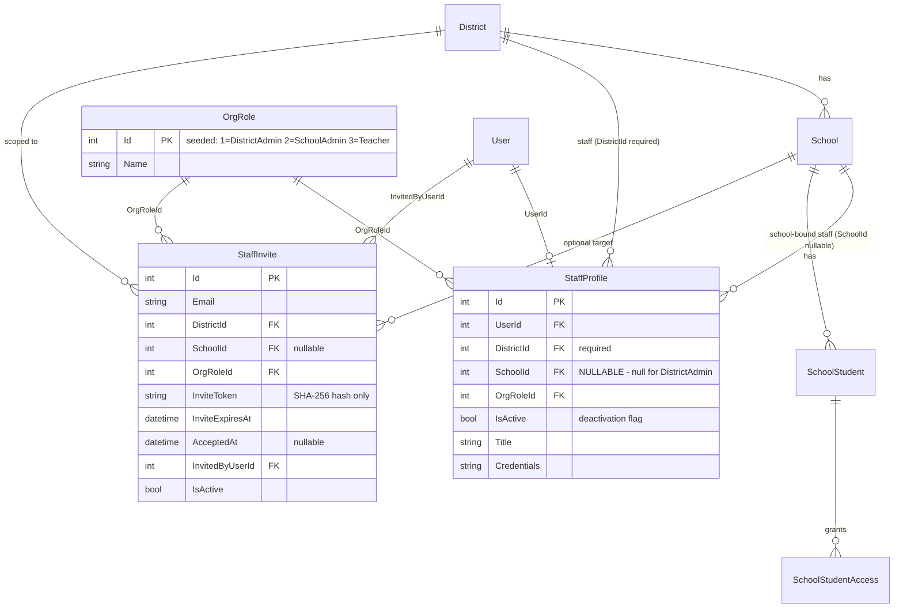

# feat: School Self-Serve Signup & Org Management

## Overview

Make the platform sellable to schools/districts. Today the school side is structurally hidden: registration hardcodes `Parent`, the educator onboarding form is reachable only by typing `/educator`, districts/schools are created accidentally from free text, no admin tier exists, and all school-side feature flags are off outside dev. This plan adds a self-serve district signup, a 3-tier org-role model (District Admin / School Admin / Teacher), invite-only staff joining with real email, a district/school admin console with a first-run wizard, fixes roster scoping, retires all four feature flags, and covers the golden paths with Playwright.

## Problem Statement

- No path for a school to buy or even see the product: every registration is a Parent (`AuthService.cs:109`); `/educator` has no UI entry point; flags are off in prod.
- Org creation is a security/dedup mess: `EducatorService.OnboardAsync` find-or-creates District+School from free text — any educator silently lands in (or creates) an org with no ownership.
- No admin tier: `UserRole` = Parent/Educator/Student/Admin (platform); the only org concept is per-student `AccessRole`. "District admins create schools and other users" has no backend.
- Roster inconsistency: `GetStudentsAsync` lists the whole school while `GetStudentAsync` enforces per-student access (`EducatorService.cs:154-188`) — teachers see students they cannot open.
- Role flips leave stale JWTs (`refreshUser()` doesn't re-mint; `RefreshTokenAsync` unimplemented).

## Proposed Solution

See the design doc for full detail. Summary of decided shape (all decisions from brainstorm + design review, user-approved):

1. **Two-path `/register`** — "I'm a parent" (existing flow, beta code kept) | "I represent a school/district" (open). District path: `POST /api/auth/register-district` creates User(Educator) + **new** District + StaffProfile(DistrictAdmin) in one transaction and **returns a JWT** → first-run wizard (create school → invite staff, skippable).
2. **Org roles via `OrgRoles` DB lookup table** (user decision) seeded DistrictAdmin/SchoolAdmin/Teacher; `StaffProfile` (renamed from `TeacherProfile`, user decision) gains `OrgRoleId`, required `DistrictId`, nullable `SchoolId` (null = district admin). Global `UserRole` stays `Educator` for all staff. Admins are supersets of Teacher within scope (player-coach).
3. **Invite-only staff** — `StaffInvite` (hash-stored single-use token, 14-day, email-bound, atomic claim — mirrors ChildLink/StudentInvite; Generate/Hash consolidated into a shared helper). Real email via existing ACS `EmailService`. `/staff/accept-invite` registers the recipient and mints a JWT immediately. Free-text self-onboard **removed**.
4. **Admin console** in the educator shell: `/educator/admin/schools`, `/educator/admin/staff`, district overview; School Admin sees school-scoped slice. Admins see scope-wide rosters and **assign staff to students**; teachers see assigned-only.
5. **Flags retired** — `AnalysisRun`, `MeetingPrepStandalone`, `SchoolSide`, `StudentWorkspace` plumbing deleted; `/educator/*`/`/student/*` get **role guards** instead.
6. **Playwright e2e** golden paths, using dev-only `Email:ExposeLinksForTesting` to surface invite URLs in API responses.

## Data Design Decisions

| Field | Decision | Rationale |
|---|---|---|
| Org role (DistrictAdmin/SchoolAdmin/Teacher) | **DB lookup table `OrgRoles`** with stable seeded IDs + code-side `OrgRoleIds` constants | User decision (design review) — overrides code-enum recommendation |
| `UserRole` | unchanged code enum | existing; staff are all `Educator` |
| `AccessRole` (per-student) | unchanged code enum | existing Viewer/Collaborator/Owner |
| StaffInvite status | derived (no status column): pending = `AcceptedAt == null && IsActive && not expired` | matches ChildLink/StudentInvite pattern |

## Technical Approach

### Architecture



**Authorization model (DB-backed, not claim-backed).** The JWT keeps its current claims (role=Educator, SecurityStamp); org identity is resolved per-request from `StaffProfile` — this is what the five existing SchoolId checks already do (`ChildLinkService.cs:376`, `StudentInviteService.cs:321`, `StudentWorkspaceService.cs:289`, `IepDraftService.cs:463`, `IepAssistService.cs:391`). A new shared `IOrgAccessService` centralizes:

```csharp
// api/IepAssistant.Services/Implementations/OrgAccessService.cs (new)
public interface IOrgAccessService
{
    Task<StaffContext?> GetStaffContextAsync(int userId);        // profile + org role, IsActive-checked
    Task<bool> CanActOnSchoolAsync(int userId, int schoolId);     // DistrictAdmin: any school in district; SchoolAdmin/Teacher: own school
    Task<bool> CanActOnStudentAsync(int userId, int schoolStudentId, AccessRole minRole); // player-coach superset: admins pass within scope; teachers need SchoolStudentAccess
}

// api/IepAssistant.Services/Models/OrgRoleIds.cs (new) — stable seeded IDs
public static class OrgRoleIds { public const int DistrictAdmin = 1; public const int SchoolAdmin = 2; public const int Teacher = 3; }
```

**Session invalidation:** org mutations (deactivate staff, change org role) bump `User.SecurityStamp`. **P1 must verify** the JWT middleware actually validates the `SecurityStamp` claim against the DB; if it doesn't, add that check — otherwise deactivation leaves a live 7-day token (SpecFlow blocker).

**District creation is never find-or-create.** `register-district` always inserts a new District (duplicate names allowed). Reusing `OnboardAsync`'s find-or-create would let a stranger join an existing district by typing its name (SpecFlow blocker).

**Token helper consolidation:** extract `Generate()`/`Hash()` from the duplicated private methods (`ChildLinkService.cs:457`, `StudentInviteService.cs:380`) into `api/IepAssistant.Services/Security/InviteTokenHelper.cs`; retrofit both services; `StaffInviteService` uses it. Claim logic stays per-service (atomic `ExecuteUpdateAsync` guarded on `AcceptedAt == null`).

### Implementation Phases

Each phase is a vertical slice with a testing checkpoint. 118 existing backend tests must stay green at every checkpoint; `npm run type-check` + lint clean in `/web`.

#### Phase 1 — Org foundation: StaffProfile + OrgRoles + OrgAccessService

**Backend:**
- [x] New `OrgRole` entity + `OrgRoles` table, seeded via `HasData` (stable IDs 1/2/3); `OrgRoleIds` constants class
- [x] Rename `TeacherProfile` → `StaffProfile` (entity, EF config, DbSet, table rename in migration) — sweep all consumers: `EducatorService`, `ChildLinkService`, `StudentInviteService`, `StudentWorkspaceService`, `IepDraftService`, `IepAssistService`, `IepVersionService`, DTOs/models (`EducatorModels.cs:12`, `EducatorDtos.cs:42`)
- [x] `StaffProfile`: add `OrgRoleId` (FK, required), `DistrictId` (FK, required), `IsActive` (default true); make `SchoolId` nullable — all FKs Restrict (no multiple-cascade-path)
- [x] Migration `20260607132334_StaffProfileOrgRolesAndWipe`: raw-SQL child-first wipe + `sp_rename` TeacherProfiles→StaffProfiles + new columns + OrgRoles seed; Users reset to Parent
- [x] New `OrgAccessService` + DI; five duplicated SchoolId checks migrated; teacher semantics preserved, admin superset added; AccessRole compared in-memory (no SQL-side enum comparison)
- [x] **SecurityStamp verified**: already validated per-request in `Program.cs:137-160` `OnTokenValidated` (user missing / !IsActive / stamp mismatch → 401). No change needed
- [x] `GET /api/educator/me` surfaces `orgRoleId`, `orgRoleName`, `districtId`, `districtName`, `schoolId?`, `schoolName?`, `isActive`

**Frontend:**
- [x] Educator `me` types extended (`EducatorProfile` + `ORG_ROLE` map); shared via cached `useEducatorProfile` hook (done with P3 frontend)

**Testing checkpoint:** ✅ 146/146 green (118 pre-existing + 28 new `OrgAccessServiceTests` matrix tests); real `OrgAccessService` (not mocked) threaded through all service test fixtures.

#### Phase 2 — District signup (vertical slice)

**Backend:**
- [x] `POST /api/auth/register-district`: `RegisterDistrictRequest` DTO (no invite code), transactional User(Educator) + **new District always** + StaffProfile(DistrictAdmin, SchoolId null); returns `LoginResponse` (JWT+user); rate-limited with login policy
- [x] Parent `POST /api/auth/register` unchanged (beta code kept)

**Frontend:**
- [x] Two-path chooser (`register-path-card.tsx` radiogroup) + extracted `parent-register-form.tsx` (behavior preserved, `?code=` prefill) + new `district-register-form.tsx`; `?type=district|parent` deep links; testids `register-path-*`, `register-district-*`
- [x] District success: shared `persistSession` (login/MFA/district all single-sourced) → navigate `/educator`
- [x] `PublicRoute`/`roleHome` unchanged

**Testing checkpoint:** ✅ 155/155 backend green (9 new AuthService tests: atomicity, distinct-district-on-duplicate-name, email collision, JWT role, DTO validation); type-check clean; lint at baseline (browser pass deferred to P5 wizard landing).

#### Phase 3 — Schools management + org-role nav

**Backend:**
- [x] `School.IsActive` + migration `20260607134210_SchoolIsActive`
- [x] `DistrictController` + `DistrictService`: overview, schools list (any staff), create/edit/deactivate (DistrictAdmin only; deactivate blocked w/ explicit message while active students/staff; cross-district → 404)
- [x] Authz via `OrgAccessService`/StaffContext; failure mapping matches EducatorController conventions

**Frontend:**
- [x] `/educator/admin/schools` — `features/district-admin/` (list/create/inline-edit/two-step deactivate, empty-state CTA); testids `district-schools-*`/`district-school-*`
- [x] Sidebar: "Administration" group (Schools) for DistrictAdmin via cached `useEducatorProfile`; Staff item is a one-liner in P4 (full flag removal lands in P7)
- [x] Educator dashboard: `district-overview-card` for DistrictAdmin

**Testing checkpoint:** ✅ 180/180 backend green (25 new DistrictService tests: role matrix, cross-district 404, deactivate-blocked rules, stateCode inheritance); type-check clean; lint at 8-error pre-existing baseline.

#### Phase 4 — Staff invites end-to-end

**Backend:**
- [x] `InviteTokenHelper` extraction + retrofit ChildLink/StudentInvite (behavior-identical, suites green)
- [x] `StaffInvite` entity + config + migration `20260607135956_AddStaffInvite`
- [x] `StaffInviteService`: org-role invite rules, email-has-account + duplicate-pending rejections, scope-filtered list, revoke, resend (new token, fresh clock, same row)
- [x] `AcceptAsync`: claim-FIRST inside transaction; distinct expired/invalid; email-registered-after-invite rejected without consuming token; mints JWT via new `JwtTokenFactory` (claims single-sourced)
- [x] `GET /api/staff-invites/preview?token=` (anonymous, rate-limited)
- [x] `EmailService.SendStaffInviteEmailAsync` → `{FrontendUrl}/staff/accept-invite?token=...`
- [x] `Email:ExposeLinksForTesting` resolved once at startup (`InviteLinkExposure` singleton): requires flag + empty ConnectionString + Development env; logged+ignored otherwise
- [x] Staff management: scope-filtered list, deactivate (IsActive=false + SecurityStamp bump — note: stamp is `int`, incremented; last-active-DistrictAdmin guard incl. self), reactivate

**Frontend:**
- [x] `/educator/admin/staff` — staff + invites lists, scoped invite form, copyable `inviteUrl` field, revoke/resend, deactivate/reactivate (inline confirms); sidebar Staff item for District+School admins
- [x] `/staff/accept-invite` — bare public route (reset-password precedent): preview-driven; signed-in users get "sign out to continue" prompt; success → shared `persistSession` → `/educator`
- [x] Deactivated staff see "access has been deactivated" notice on `/educator`

**Testing checkpoint:** ✅ 219/219 green (39 new StaffInvite tests covering the full lifecycle, races, rejections, scope matrix, last-admin guard, stamp bump, exposure gate); type-check clean; lint at baseline. Browser round-trip exercised in P5/P8.

#### Phase 5 — First-run wizard + self-onboard removal

**Frontend:**
- [x] `ProgressDots` promoted to `web/src/components/ui/progress-dots.tsx` (aria preserved)
- [x] `/educator/setup` wizard (welcome → create school → invite staff → done; skippable; reuses `SchoolForm`/`InviteForm`; non-DistrictAdmin redirected)
- [x] `register-district` lands on `/educator/setup`; finish → `/educator`
- [x] `setup-checklist-card` on dashboard while district has zero schools/staff (derived, no schema)

**Backend:**
- [x] Deleted `POST /api/educator/onboard`, `OnboardAsync` (+find-or-create), interface member, onboard DTOs/models; fixtures switched to direct StaffProfile seeding
- [x] `educator-home-page`: onboarding branch removed; null-profile "contact support" notice; deactivated-access branch kept

**Frontend cleanup:** ✅ `educator-onboarding-form.tsx` + `onboardEducator` API + dead `isOnboarded` plumbing deleted.

**Testing checkpoint:** ✅ 217/217 green (219 − 2 deleted onboarding tests); type-check clean; lint at baseline. Browser golden-path runs in P8.

#### Phase 6 — Roster scoping + staff assignment

**Backend:**
- [x] `GetStudentsAsync` role-branched (Teacher=granted only; SchoolAdmin=school; DistrictAdmin=district across active schools, w/ schoolName); `GetStudentAsync` switched to `CanActOnStudentAsync(Viewer)` — list authz == detail authz (also fixed an inactive-school parity gap in OrgAccessService DistrictAdmin scope)
- [x] `CreateStudentAsync` optional `schoolId` (required+validated for DistrictAdmin, must match own school otherwise); creator keeps Owner grant
- [x] Assignment endpoints: GET/POST/DELETE `/api/educator/students/{id}/staff-access` (Collaborator default, admin-only scope-checked, reactivates-not-duplicates, target must be active school-bound staff of the student's school)
- [x] `DeactivateStaffAsync` returns solely-owned student count + list for reassignment hints

**Frontend:**
- [x] "Assigned staff" panel (list + admin-only assign/revoke, teachers read-only); deactivate solely-owned Notice with student links
- [x] Students list: DistrictAdmin school filter + school badges; teacher empty state; create form school select for DistrictAdmin

**Testing checkpoint:** ✅ 238/238 green (+17: roster matrix, list==detail parity, create-student resolution, assignment lifecycle, solely-owned enrichment); type-check clean; lint at baseline.

#### Phase 7 — Feature flag retirement

Inventory is complete (research report). All-or-nothing sweep:

**Backend:**
- [x] Deleted `IFeatureFlags`/`ConfigurationFeatureFlags`/`FeatureFlags`/`ConfigController` + DI + `Feature:*` config; zero residual references
- [x] Unconditionalized all call sites (actual counts: EducatorController 10, IepDraftController 18, StudentWorkspaceController 7, IepVersionController 6, IepAssistController 4, StudentInviteController 4, ChildLink 3, AnalysisRun 3); `Backfill:AnalysisRunsEnabled` untouched (separate toggle)

**Frontend:**
- [x] Deleted `FeatureRoute`, `use-feature-flags.ts`, `features/config/`
- [x] Role guards live: `/educator/*` → RoleRoute(Educator), `/student` → RoleRoute(Student); `/student/accept-invite` ProtectedRoute-only (invitee is a Parent pre-flip); `/accept-link` ProtectedRoute any-role
- [x] All `FeatureRoute` usages unwrapped; 11 component call sites unconditionalized (flag-ON branches kept in IEP/ETR viewers — embedded meeting-prep tabs removed)
- [x] Empty states verified safe: `school-ieps-card` (null when empty), Analysis tab (Notice), Meeting-Prep tab (own empty state), `student-shared-entries` (null), `SchoolLinkBadge` (null)
- [x] Sidebar pure role checks; org-role Administration group preserved

**Testing checkpoint:** ✅ 235/235 green (238 − 3 deleted flag tests); type-check clean; lint at baseline; zero `useFeatureFlag|FeatureRoute|/api/config` references. Browser pass happens in P8. Follow-up noted: `etr-meeting-prep-tab.tsx` now orphaned (cleanup candidate).

#### Phase 8 — Playwright e2e + production-readiness

**E2E (in `/e2e`):**
- [x] `helpers/org-data.ts` (registerDistrictAdmin, createStaffViaInvite via exposed inviteUrl, students, grants, cleanup); dev config has `Email:ExposeLinksForTesting=true`
- [x] `district-signup.spec.ts` — UI golden path through the wizard (caught + fixed a real bug: PublicRoute clobbered the post-signup navigate; sessionStorage redirect honored now)
- [x] `staff-invite.spec.ts` — accept golden path + garbage/claimed-token + existing-account rejections (fresh contexts)
- [x] `org-management.spec.ts` — SchoolAdmin cross-school/elevation blocked, revoke, deactivate → live JWT 401s, reactivate, last-DistrictAdmin self-deactivation guard
- [x] `roster-scoping.spec.ts` — grant → teacher sees exactly that student; revoke → gone; SchoolAdmin school-scoped
- [x] `register.page.ts` selects parent path (chooser regression)
- [x] Regression sweep: 67 passed / 8 failed — all 8 pre-existing test drift (advocacy-goals/iep-documents tab navigation, phantom `dashboard-subscription` testid); zero regressions from this work
- [x] Page objects: district-register, district-setup, staff-accept

**Production-readiness:**
- [x] Ops checklist written: `docs/ops/2026-06-07-school-launch-checklist.md` (App Service settings, flag cleanup, post-deploy validation signals)
- [ ] Verify a real ACS send (manual — needs the prod/staging connection string; deferred to deploy)
- [x] Full migration chain verified on real SQL Server (QA DB, applied 2026-06-07 incl. rename+wipe; note: wipe affects pre-existing QA staff accounts)
- [x] Secrets: `appsettings.Development.json` is gitignored — earlier "committed secrets" note was incorrect; nothing in git history

**Final checkpoint:** ✅ 10/10 new e2e specs green against the running stack; `vite build` fixed (esbuild reinstall) and passing; browser screenshots of the full golden path captured; demo path works end-to-end.

## Alternative Approaches Considered

- **New global `UserRole` values (DistrictAdmin/SchoolAdmin)** — rejected: touches role enum/converter/JWT/routing everywhere, resurrects stale-JWT risk (brainstorm Approach B).
- **Generic org-membership table (multi-school, multi-role)** — rejected for now as YAGNI; the org-role column can migrate into membership rows later (Approach C).
- **Code enum for OrgRole** — recommended in design review; **user chose DB lookup table** (final).
- **Keeping `TeacherProfile` name** — recommended; **user chose rename to `StaffProfile`** (final).
- **Migrating dev org data** — **user chose wipe** (final).
- **Find-or-create district on signup** — rejected as a security hole (SpecFlow): always create new.

## System-Wide Impact

### Interaction Graph
- `register-district` → AuthService transaction → JWT mint → frontend auth-context store → `roleHome` → `/educator/setup`. No hosted workers involved.
- Staff deactivation → `StaffProfile.IsActive=false` + `SecurityStamp` bump → JWT middleware rejects next request → frontend 401 interceptor → login. **P1 verifies the middleware actually checks SecurityStamp.**
- Invite create → `EmailService` (fire-and-forget semantics: ACS failures are logged and swallowed, `EmailService.cs:293-297`) — invite row exists even if email fails; resend covers recovery.
- Flag retirement → `GET /api/config` disappears → any cached frontend bundle calling it gets 404; `use-feature-flags` deletion removes the caller in the same deploy (web+api deploy together).

### Error & Failure Propagation
- `register-district` partial failure: single EF transaction — no orphaned District/User.
- Accept race: atomic `ExecuteUpdateAsync` claim; loser gets a clean "already claimed" (pattern: `ChildLinkService.cs:211-236`). Validation runs **before** claim so rejected accepts never burn the token.
- Email send failure is non-fatal everywhere (existing semantics); invite list shows pending entries so admins can resend.

### State Lifecycle Risks
- P1 wipe migration: child-first delete order is critical (IepVersion children before IepVersions; Restrict FKs). Raw SQL bypasses `ImmutableVersionInterceptor` (EF-only) — acceptable, dev data only, no prod data exists.
- Accept-invite creates User then StaffProfile then claims token — wrap in a transaction; a claim failure after user creation must roll back the user.
- School deactivation blocked while active students/staff exist — no dangling scope.

### API Surface Parity
- `GET /api/educator/me` shape changes (org fields) — frontend types updated in P1.
- `UsersController PUT /api/users/{id}` (platform Admin) can still set `Role` — now potentially creating an Educator with no StaffProfile; out of scope to redesign, but P4's "deactivated/missing profile" educator state covers the rendering.
- Student invite + ChildLink flows untouched except the shared token helper (behavior-identical refactor).

### Integration Test Scenarios (beyond unit mocks)
1. District signup → JWT from response works against org-scoped endpoints immediately (no re-login).
2. Teacher accepts invite while a parent session is active in the same browser → prompt, no cross-binding.
3. Deactivate staff → their next API call 401s (SecurityStamp path through real middleware).
4. Admin assigns then revokes a student → teacher's list and detail both reflect within one request cycle.
5. Parent (no school links) loads child detail post-flag-retirement → all tabs render empty states, no 404-driven crashes.

## Acceptance Criteria

### Functional
- [ ] `/register` offers parent and school/district paths; parent path requires beta code; district path requires none
- [ ] District signup creates a **new** district always (duplicate names allowed, never joins an existing org), returns a working JWT, lands in the wizard
- [ ] Wizard: create school → invite staff, each step skippable; dashboard shows setup checklist while district has no schools/invites
- [ ] DistrictAdmin can create/edit/deactivate schools (deactivation blocked while active students/staff exist) and invite DistrictAdmin/SchoolAdmin/Teacher
- [ ] SchoolAdmin can invite SchoolAdmin/Teacher into own school only; all cross-scope mutations 403 server-side
- [ ] Staff invite: single-use, email-bound, 14-day, hash-stored; resend (new token) and revoke; duplicate pending invite for an email rejected
- [ ] Accept: distinct expired/claimed/invalid messages; email-already-has-account rejected ("use your work email") including parent-registered-after-invite; logged-in-as-different-user prompted to sign out; concurrent accepts produce exactly one StaffProfile; success mints JWT and lands on `/educator`
- [ ] Last active DistrictAdmin cannot be deactivated (including self)
- [ ] Deactivating staff bumps SecurityStamp → live session invalidated; deactivated staff see an explicit state, not errors
- [ ] Teacher roster == assigned/created students only; SchoolAdmin == school-wide; DistrictAdmin == district-wide; list authz == detail authz
- [ ] Admins assign/revoke staff↔student access; changes effective immediately; DistrictAdmin student-create requires explicit school
- [ ] Free-text educator self-onboard fully removed (API + UI)
- [ ] All four feature flags removed; `/educator/*` and `/student/*` role-guarded; parents redirected; parent-side formerly-gated surfaces render safe empty states
- [ ] Staff invite emails actually send via ACS when configured; dev logs otherwise; e2e uses `ExposeLinksForTesting` (Development-only enforced)

### Non-Functional
- [ ] Org authz resolved server-side per request via `OrgAccessService` (no client-trusted role)
- [ ] Invite endpoints rate-limited (carry-over pre-launch item from the rework)
- [ ] New pages keyboard-accessible with `data-testid` per convention; small, tightly-scoped React components per user preference

### Quality Gates
- [ ] All existing backend tests green at every phase checkpoint; new services covered by SQLite-in-memory tests (target: same density as StudentInvite/ChildLink suites)
- [ ] `npm run type-check` + lint clean each phase
- [ ] Playwright: new specs green + 17 existing specs pass post-flag-retirement
- [ ] Migration chain verified on clean SQL Server (not just SQLite)
- [ ] Each phase reviewed (dotnet-reviewer / react-reviewer / agent-smith for P2/P4 auth surfaces / data-integrity-guardian for P1 migration)

## Success Metrics

- A cold demo works end-to-end: district signup → school → teacher invite → accept → student → assign → author/finalize IEP → parent link, with zero manual DB/config intervention.
- Golden paths automated in Playwright (repeatable demo confidence).

## Dependencies & Prerequisites

- ACS email resource + connection string for production sends (code-side dev fallback already exists; manual ops step).
- Web + API deploy together for flag retirement (config endpoint removal).
- No prod data exists — destructive P1 migration is low-stakes (verified in brainstorm).

## Risk Analysis & Mitigation

| Risk | Mitigation |
|---|---|
| SecurityStamp not actually validated by middleware (assumed) | P1 explicit verification task; add check if missing — gates P4's deactivation story |
| `StaffProfile` rename ripples (7 services, DTOs, table rename) | Mechanical sweep with full test suite as the net; done first (P1) before new code builds on it |
| Wipe migration ordering vs Restrict FKs | Child-first delete order written against the actual FK graph; tested on clean SQL Server in P8 |
| Flag retirement exposes half-ready parent surfaces | P7 explicit empty-state verification per surface; browser pass as Parent |
| Open district signup abused (junk districts) | Hardened post-audit: UseForwardedHeaders + dedicated 3/hour register-district policy (commit `e7ed89d`); revisit with verification/approval if real abuse appears |
| Security-audit accepted findings (agent-smith, 0 critical) | M-1 email-enumeration on register-district (inherent to registration; bounded by rate limit), L-1 unbounded duplicate district names (mitigated by rate limit), last-DistrictAdmin concurrent-deactivation race (recoverable lockout, support-fixable) — all accepted & documented |
| Email deliverability (ACS managed domain) | Managed-domain sender first; custom domain later (out of scope) |

## Future Considerations

- Org-membership table (multi-school staff, one-person-multiple-roles) — OrgRole column migrates into membership rows
- Request-to-join / district directory; admin student-data oversight dashboards; billing/subscriptions for districts
- Platform-Admin org tooling (cross-district support views)
- DB-trigger/DENY for true IepVersion immutability (pre-launch item carried from the rework plan)

## Sources & References

### Origin
- **Brainstorm:** [docs/brainstorms/2026-06-06-school-self-serve-signup-brainstorm.md](../brainstorms/2026-06-06-school-self-serve-signup-brainstorm.md) — self-serve motion; 3 tiers; invite-only; two-path register; beta gate parents-only; single-role kept; flags retired; ACS email; player-coach admins; wizard first-run; assigned-only rosters
- **Design (approved with user overrides):** [docs/designs/2026-06-06-school-self-serve-signup-design.md](../designs/2026-06-06-school-self-serve-signup-design.md) — OrgRoles lookup table; StaffProfile rename; dev-data wipe

### Internal References
- Registration: `api/IepAssistant.Api/Controllers/AuthController.cs:80`, `api/IepAssistant.Services/Implementations/AuthService.cs:88-126,239-247`
- Invite pattern to mirror: `api/IepAssistant.Services/Implementations/ChildLinkService.cs:83,211-236,396-407,457-461`
- Email: `api/IepAssistant.Services/Implementations/EmailService.cs:100,267-297`
- Org entities: `api/IepAssistant.Domain/Entities/{District,School,TeacherProfile,SchoolStudent,SchoolStudentAccess}.cs`
- Roster inconsistency: `api/IepAssistant.Services/Implementations/EducatorService.cs:154-188`
- Flag inventory: research report (P7 lists); `web/src/app/routes.tsx:75-99`, `web/src/components/layouts/sidebar.tsx:38-55`, `web/src/hooks/use-feature-flags.ts`
- Wizard precedent: `web/src/features/onboarding/components/onboarding-flow.tsx:14-35`
- E2E harness: `e2e/playwright.config.ts`, `e2e/helpers/{api,test-data}.ts`, `e2e/global-setup.ts`
- Migration precedents: `api/IepAssistant.Domain/Data/Migrations/20260602130126_ConvertUserRoleToEnum.cs` (raw SQL backfill), `20260531230554_MeetingDateAndDropSuggestedQuestions.cs` (destructive drop)

### Related Work
- Three-sided rework plan: `docs/plans/2026-05-28-001-feat-school-side-and-analysis-rework-plan.md` (P0–P8, merged `1df7b9a`)
- SpecFlow analysis (this plan): blockers — never find-or-create district; SecurityStamp invalidation; last-DistrictAdmin guard; role guards replacing FeatureRoute; roster role-branching
