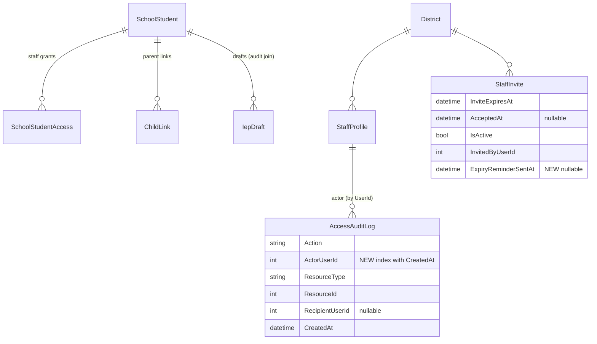

# feat: District Admin Pilot Readiness

## Problem Statement

The org foundation shipped in PR #19 (district signup, schools CRUD, staff invites, roster scoping) is solid, but a district admin has **no reason to log in after week one** and the product is missing trust signals a mixed pilot (admins + staff + parents/students, several small orgs, ≤20 students each) will judge quickly:

- The admin home is a thin profile card — no district-wide visibility.
- The FERPA access-audit log is captured (`AccessAuditLog`) but **write-only** — no admin can see it.
- Staff invites expire silently after 14 days; nothing warns the admin.
- The cross-role chain (admin → staff → student → parent → student account) has never had a deliberate end-to-end polish pass.

This plan delivers the thin-slice package decided in the brainstorm: minimal-but-complete versions of all four areas, built entirely on data and infrastructure that already exist (see brainstorm: docs/brainstorms/2026-07-01-district-admin-pilot-readiness-brainstorm.md).

## Context & Research

**Key existing code (verified 2026-07-01):**

- `api/IepAssistant.Domain/Entities/AccessAuditLog.cs` — `Action` (enum stored as string: View/Edit/Share/Export/Finalize), `ActorUserId`, `ResourceType`, `ResourceId`, `RecipientUserId?`, `CreatedAt`. Written via singleton `AuditLogger` channel drained by `api/IepAssistant.Api/BackgroundServices/AccessAuditLogWorker.cs` (per-item scope, swallow-and-log). Indexes: `(ResourceType, ResourceId, CreatedAt)`, `(ActorUserId)`. **Zero read paths.**
- `api/IepAssistant.Domain/Entities/StaffInvite.cs` — `InviteExpiresAt` (14d), derived status, `InvitedByUserId`; **no reminder tracking column**. Resend: `StaffInviteService.ResendAsync` (`api/IepAssistant.Services/Implementations/StaffInviteService.cs:288-319`).
- `api/IepAssistant.Services/Implementations/DistrictService.cs` — `GetOverviewAsync` (count queries), `GetSchoolsAsync` (per-school correlated counts).
- `api/IepAssistant.Services/Implementations/OrgAccessService.cs` — all org authorization; DistrictAdmin district-wide, SchoolAdmin own school (`StaffProfile.SchoolId == null` for district-scoped admins), Teacher rejected from admin surfaces.
- `api/IepAssistant.Services/Implementations/EmailService.cs` — ACS, interpolated-HTML methods, dev mode logs instead of sending, **send failures swallowed**.
- `IepDraft.SchoolStudentId` is the join from draft/version audit rows back to a student (matters for the audit student filter).
- Frontend: no React Query — per-feature api modules over `apiClient`, `useEffect`+`useState` with cancellation flag, `Card` spinner/empty-state/`data-testid` conventions (`web/src/features/district-admin/components/district-overview-card.tsx` is the model).
- Tests: `api/IepAssistant.Services.Tests` (xUnit, real SQLite in-memory, `SeedDistrict/SeedStaff` helpers, `CapturingEmailService`, `CapturingAuditLogger`); e2e via `e2e/helpers/org-data.ts` API fixtures.

**Institutional learnings:** `docs/solutions/` does not exist — no prior-solutions input. External research skipped (strong local patterns, no new external surface).

## Data Design Decisions

- **No new enum or lookup tables.** `AuditAction` remains the existing code enum (stored as string); invite status remains derived (no column); staff status on the dashboard is derived (invited/active/deactivated). Reminder tracking is a **nullable timestamp**, not a status field.
- **`StaffInvite.ExpiryReminderSentAt` (DateTime?, UTC)** — new column, Phase 3 migration. Nulled by `ResendAsync` so extended invites re-warn.
- **New index `(ActorUserId, CreatedAt)` on `AccessAuditLog`** — Phase 2 migration; the existing `(ActorUserId)` index doesn't cover the actor-scoped, `CreatedAt`-ordered audit query.

## Implementation Phases (vertical slices)

### Phase 1: Oversight dashboard

**Scope:** `GET /api/district/dashboard` aggregate + admin-home tiles. DistrictAdmin sees district-wide; SchoolAdmin sees own-school slice; Teacher/parent/student get 403.

**Backend**
- [x] `DistrictDashboardModel` in `api/IepAssistant.Services/Models/DistrictModels.cs`: per-school active student counts, staff status summary, invites needing attention, attention lists (no-staff / no-parent students)
- [x] `DistrictService.GetDashboardAsync(userId)` in `api/IepAssistant.Services/Implementations/DistrictService.cs` + interface
- [x] `GET dashboard` action in `api/IepAssistant.Api/Controllers/DistrictController.cs` + DTOs in `api/IepAssistant.Api/DTOs/District/DistrictDashboardDto.cs`

**Aggregate semantics (from flow analysis — all are acceptance criteria):**
- Exclude inactive schools and inactive students from every count and list; per-school counts cover active schools only.
- Staff status summary counts: active = active StaffProfiles; deactivated = inactive StaffProfiles; invited = pending **invite rows** (revoked/accepted excluded — multiple pending invites count individually).
- Invites tile includes **expired** invites, flagged distinctly — expired-invite triage is the tile's point, and `ResendAsync` already permits resending expired invites.
- **"No assigned staff" = zero `SchoolStudentAccess` rows that are active AND whose grantee's `StaffProfile.IsActive`** — a student whose only grantee was deactivated appears on the list.
- **"No linked parent" = no `ChildLink` with `IsActive && AcceptedAt != null && ChildProfileId != null`**; rows distinguish "invite pending" from "not invited."
- SchoolAdmin slice: own school's students/staff only; **district-admin invites (`SchoolId == null`) excluded** from the SchoolAdmin invites tile.
- Empty district returns a valid all-zero payload (empty arrays, no 500).

**Frontend**
- [x] `web/src/features/district-admin/api/district-api.ts` — add `getDistrictDashboard()`
- [x] New components in `web/src/features/district-admin/components/`: `dashboard-schools-tile.tsx`, `dashboard-staff-tile.tsx`, `dashboard-invites-tile.tsx`, `dashboard-attention-tile.tsx` (+ `district-dashboard-tiles.tsx` container owning the single fetch)
- [x] Compose into admin home (`web/src/features/educator/components/educator-dashboard.tsx`); shown to DistrictAdmin + SchoolAdmin, Teacher home unchanged
- [x] Attention tiles: up to 5 names inline + "view all" → `/educator/students?attention=no-staff|no-parent`; query-param filter added to `educator-students-page.tsx` (sources ID set from dashboard aggregate since roster payload lacks the signal) with a dismissible indicator
- [x] Empty states: celebratory when clean ("All students have assigned staff"), setup-oriented when the district is empty (distinct from `SetupChecklistCard`)

**Testing checkpoint**
- [x] Service tests in `api/IepAssistant.Services.Tests/DistrictServiceTests.cs`: aggregate correctness, deactivated-grantee case, pending-vs-not-invited distinction, SchoolAdmin slice + null-SchoolId invite exclusion, inactive school/student exclusion, empty district, 403 for Teacher/parent/student *(done — 10 new tests; note: expired parent invites read "pending" per literal plan wording — follow-up candidate)*
- [x] E2E in `e2e/tests/district-dashboard.spec.ts`: tiles render for seeded district; attention link lands on filtered roster *(written & type-checks against helpers; execution deferred to the Phase 4 dev-stack run — API stack not up during implementation)*

### Phase 2: Audit log viewer

**Scope:** paged/filterable `GET /api/district/audit-log` + "Activity log" page for both admin tiers. Read-only; **viewing the audit log is itself not audited** (pilot decision).

**Backend**
- [x] Migration: add `(ActorUserId, CreatedAt)` index to `AccessAuditLog` (`AddAuditLogActorCreatedAtIndex`)
- [x] `AuditLogQueryService` (new: `api/IepAssistant.Services/Implementations/AuditLogQueryService.cs` + interface) — read path kept out of the write-only `AuditLogger`; actor scope is a server-side correlated subquery (avoids SQL param ceiling)
- [x] `GET /api/district/audit-log` in new `AuditLogController` + DTOs (`AuditLogDto.cs`)

**Query semantics (acceptance criteria):**
- **Actor-scoped:** entries whose `ActorUserId` maps to a `StaffProfile` in the caller's district — **including deactivated staff** (their history is what a FERPA reviewer asks for). SchoolAdmin: own-school actors only. **Documented limitation:** district-admin actors (`SchoolId == null`) appear only in the DistrictAdmin view; staff later moved between schools carry history to the new school (latent — no reassignment feature exists).
- Filters: staff member (dropdown includes deactivated staff labeled "(deactivated)"), student, action, date range. **Student filter = resource-ID expansion**: the student's own `SchoolStudent` ID plus its `IepDraft` IDs plus their `IepVersion` IDs, matched as `(ResourceType, ResourceId)` pairs.
- Date range arrives as UTC instants; client converts local-day boundaries (end inclusive).
- **Keyset pagination** (cursor on `Id` descending) — offset paging drifts as the worker appends rows. Default page size 25, max 100; invalid cursors/sizes → 400.
- Per-page dictionary enrichment (no N+1): actor names, resource display names, **and `RecipientUserId` names** for Share rows. Unenrichable rows never drop or 500 — render fallbacks ("Former staff member", "Deleted draft #123").
- 403 for Teacher, parent, student.

**Frontend**
- [x] `web/src/features/district-admin/pages/district-audit-log-page.tsx` + `components/audit-log-filters.tsx`, `audit-log-row.tsx`; `getAuditLog()` in `district-api.ts` *(reviewer fixed a cross-filter race in "Load more" via a generation token)*
- [x] Route `/educator/admin/activity` in `web/src/app/routes.tsx`; "Activity log" item in the Administration sidebar group (`sidebar.tsx`, `ScrollText` icon) for both admin tiers
- [x] "Load more" button driven by the keyset cursor; filter-aware empty state + error/retry state
- [ ] *Deferred (minor):* student-filter **control** not in the UI (staff/action/date only); the `studentId` filter type + backend support exist, so it's additive later — dashboard deep-links target the roster, not this page

**Testing checkpoint**
- [x] Service tests in `AuditLogQueryServiceTests.cs`: actor scoping (incl. deactivated actors, SchoolAdmin slice, district-admin actor exclusion from SchoolAdmin view), student-filter expansion, keyset paging stability, enrichment fallbacks, 403 matrix *(17 new tests, 262 total green)*
- [x] E2E in `e2e/tests/audit-log.spec.ts`: staff member views a student → entry appears on the Activity log page; Teacher does not see the sidebar item or page *(written & type-checks; execution deferred to the Phase 4 dev-stack run)*

**Follow-ups noted by reviewer (not blocking):** keyset orders by `Id` but index is on `(ActorUserId, CreatedAt)` per plan literal — `(ActorUserId, Id)` may serve the cursor better; `MapFailure` message-substring classification is the existing controller convention (a `ServiceResult` error-kind enum is the long-term fix).

### Phase 3: Invite-expiry notifications

**Scope:** warn the **inviting admin only** 3 days before a pending invite expires. One migration, one email method, one timer worker.

- [x] Migration: `ExpiryReminderSentAt` (DateTime?, UTC) on `StaffInvite` (`AddStaffInviteExpiryReminder`)
- [x] `SendStaffInviteExpiringEmailAsync(...)` on `IEmailService` + `EmailService` (interpolated HTML, links to `/educator/admin/staff`)
- [x] `StaffInviteExpiryWorker` (startup + daily `PeriodicTimer`) delegating to a testable `IStaffInviteExpiryService`; per-invite scope; registered in `Program.cs`
- [x] `StaffInviteService.ResendAsync` nulls `ExpiryReminderSentAt`
- Race guard implemented as an atomic `ExecuteUpdateAsync` stamp keyed on the window (a concurrent resend can't be clobbered)

**Worker semantics (acceptance criteria — the I5–I8 correctness cluster):**
- Window: UTC `now < InviteExpiresAt <= now + 72h`, invite pending (`AcceptedAt == null && IsActive`), `ExpiryReminderSentAt == null`. Already-expired invites (including backlog at first deploy) get **no** email.
- **Race guard:** re-verify window + pending status inside the per-invite scope immediately before send/stamp, so a concurrent resend (which extends expiry and nulls the stamp) can't trigger a bogus warning.
- Skip + log when the inviting admin's `StaffProfile.IsActive == false` or the invite's school is deactivated.
- Stamp `ExpiryReminderSentAt` only after `SendEmailAsync` returns without throwing. Known accepted risk: `EmailService` swallows ACS failures, so a swallowed failure consumes the reminder — the dashboard invites tile (Phase 1) is the backstop.
- **Single-instance assumption documented** in the worker header comment: scaled-out App Service could duplicate sends; acceptable for pilot.

**Testing checkpoint**
- [x] Tests in `StaffInviteExpiryTests.cs` (13 tests) + `Resend_NullsExpiryReminderSentAt` in `StaffInviteServiceTests.cs`: window boundaries (71h → email; 72h+1min → no email; expired → no email), idempotency, resend re-arms, deactivated-inviter/deactivated-school skips, recipient = inviter's address, inviter-has-no-email skip *(276 total green)*

### Phase 4: Cross-role polish pass

**Scope:** scripted golden-path walkthrough; fixes applied as found; the script becomes the pilot onboarding runbook.

- [x] Write `docs/ops/2026-07-01-pilot-golden-path-runbook.md`: full happy path + unhappy branches (expired invite, revoked-invite link, staff-invite-to-parent-email, expiry reminder, role visibility) + ACS verification checklist
- [x] Static polish audit of every new screen's empty/error states, copy, terminology, and the expiry email — **8 findings applied** (dashboard error card, spinner a11y ×3, audit filter labels, 3 copy tweaks, dedup district name, amber contrast); also fixed an incorrect e2e assertion the audit surfaced
- [ ] *Deferred to your dev environment:* execute the runbook against the live stack (`ExposeLinksForTesting=true`) — needs API on 7200 + web on 5200 against the shared Azure SQL QA DB; findings sections are pre-seeded in the runbook
- [ ] *Deferred to deploy:* verify ACS config (`Email__ConnectionString`, `Email__SenderAddress`, `App__FrontendUrl`, one real send) per launch checklist
- [~] Final gate: lint holds baseline + `dotnet test` green (276); e2e specs written & type-check, execution deferred to the live-stack run

## Acceptance Criteria (cross-phase)

- [ ] A DistrictAdmin logging in sees district-wide tiles with correct counts; a SchoolAdmin sees only their school's slice; a Teacher's home is unchanged; parents/students/Teachers get 403 from both new endpoints
- [ ] An admin can answer "which of my staff accessed which student records, when" for any date range, including deactivated staff, without engineering help
- [ ] An admin whose staff invite is 3 days from expiring receives exactly one email, and a resend re-arms exactly one future warning
- [ ] Every attention-list link lands on a filtered view, not a dead end
- [ ] The golden-path runbook exists, passes end-to-end, and doubles as pilot onboarding documentation

## Final Review (2026-07-01)

**Security (agent-smith):** core authorization model sound — both new endpoints resolve org scope from a DB-backed `StaffContext` (never JWT claims), Teachers/parents/students denied, SchoolAdmin confined to own school, query params are AND-narrowing (can't widen scope), pageSize capped, `ExpiryWorker` emails only the inviter's own DB email. Two findings:
- *Medium (latent, accepted):* audit rows are scoped by the actor's **current** StaffProfile district/school (`AccessAuditLog` has no district column), so a staff member who moved schools/districts could expose out-of-scope history. **Not reachable at pilot** — `AcceptStaffInvite` blocks any already-registered email (no multi-district staff) and there is no school-reassignment feature. Hardened with an in-code invariant warning; proper fix (stamp `DistrictId` on audit rows at write time) is a documented follow-up before either invariant is relaxed.
- *Low (not a regression):* expiry email interpolates DB-sourced names/emails into HTML without encoding — matches the existing `EmailService` pattern (all methods), self-directed to the inviter. Follow-up: a codebase-wide HTML-encoding pass on `EmailService`.

**Performance (performance-oracle):** dashboard aggregate (anti-joins fold to single statements, index-supported, no N+1) and audit per-page enrichment (fixed batched lookups) confirmed efficient at pilot and 50×. Two fixes **applied this branch** (migrations were unshipped): audit index corrected to `(ActorUserId, Id)` to serve the keyset order; version-expansion switched to the indexed `IepVersion.SchoolStudentId`. Deferred (marginal): merge dashboard paired counts; `(SchoolId, IsActive)` composite; filtered index on the invite-expiry scan (only if `StaffInvites` grows large).

## Post-Deploy Monitoring & Validation

- **Live-stack walkthrough (owner: before pilot invite):** run `docs/ops/2026-07-01-pilot-golden-path-runbook.md` end-to-end against the deployed stack, plus both e2e specs (`district-dashboard.spec.ts`, `audit-log.spec.ts`) — written and type-checked here but never executed (stack was down during build).
- **ACS email (owner: at deploy):** verify `Email__ConnectionString`, `Email__SenderAddress` (domain-verified), `App__FrontendUrl`; send one real staff invite and confirm delivery. Without it, invite + expiry emails silently no-op.
- **Logs to watch (first week):** `StaffInviteExpiryWorker` cycle logs — confirm it runs daily and skips (not errors) on inactive-inviter/deactivated-school; any "Email would be sent" lines in prod mean ACS is misconfigured. Watch for 500s on `GET /api/district/dashboard` and `/api/district/audit-log`.
- **Healthy signals:** admins load the dashboard without errors; audit log returns rows for a known staff action; expiry reminders arrive at the admin (not invitee).
- **Failure signal / rollback trigger:** dashboard or audit endpoint 500s in prod, or expiry worker throwing (vs. logging skips). Feature is additive (new endpoints + read-only queries + one nullable column + two indexes) — low blast radius; disable the `StaffInviteExpiryWorker` hosted-service registration if the reminder path misbehaves.

## Success Metrics

- Pilot admins return to the dashboard unprompted after week one (qualitative pilot feedback)
- Zero pilot invites lost to silent expiry
- Audit viewer answers a FERPA-style access question during pilot without a support request

## Dependencies & Risks

- **ACS email config in prod** is a Phase 4 verification item — expiry emails silently no-op without it (dev mode logs instead).
- **Audit table growth**: keyset paging + new index handle pilot scale; retention/archival explicitly deferred.
- **Swallowed email failures** (existing `EmailService` behavior) can consume a reminder — accepted for pilot, dashboard tile is the backstop.
- Pre-existing e2e drift (8 failures) may add noise to the Phase 4 gate — they are tracked separately and are not in scope.

## Out of Scope

(carried from brainstorm — see origin doc) Bulk CSV import, server-side roster search/pagination, SSO (SAML/Clever/ClassLink), district billing/seats, in-app notification center, IEP-timeline compliance dashboard, multi-role accounts, SIS integration, audit retention tooling, auditing the audit viewer, `ChildProfile.SchoolDistrict` free-text → FK reconciliation, the 8 pre-existing e2e drift failures, IepVersion DB-trigger immutability.

## Sources

- **Brainstorm (origin):** `docs/brainstorms/2026-07-01-district-admin-pilot-readiness-brainstorm.md` — carried forward: thin-slice approach A over oversight-first B and walkthrough-only C; mixed pilot, ≤20 students/org; status-only staff tile; admin-only expiry email; both admin tiers see audit viewer; full deferred list.
- **Design discussion (approved):** `docs/designs/2026-07-01-district-admin-pilot-readiness-design.md` — actor-based audit scoping, single aggregate dashboard endpoint, timestamp-based reminder idempotency, 3-day/daily window, ~5-name inline attention lists.
- **Flow analysis (2026-07-01):** 25 findings folded in — notably student-filter resource expansion (C1), SchoolAdmin visibility hole documented (C2), deactivated-grantee "assigned" definition (C3), `(ActorUserId, CreatedAt)` index (C4), worker correctness cluster (I5–I8), attention-link filter target (I10), 403 matrix (I11).
- Launch checklist: `docs/ops/2026-06-07-school-launch-checklist.md`.
