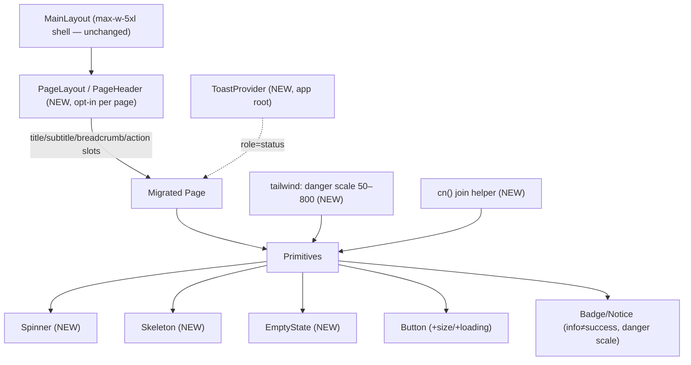

# refactor: UX Consistency & Professionalism — Foundation + Pilot Surface

## Problem Statement

The app feels "disorganized, inconsistent, and unprofessional." Research (repo inventory + external best practices) converged on one diagnosis: **a real design system exists but is under-constrained and under-enforced, and a few load-bearing primitives are missing.** Every cited source (Refactoring UI, The Linear Method, Shopify Polaris, NN/g) says this symptom is *unconstrained values + multiple ways to do the same thing*, fixed by constraint and one component vocabulary — not a visual redesign (see brainstorm: `docs/brainstorms/2026-07-01-ux-consistency-professionalism-brainstorm.md`).

**Target feel:** calm, trustworthy, understated SaaS (Linear/Stripe/Polaris) + warmth-via-tone-only; a productivity tool for a FERPA/student-PII product where polish *is* a trust signal (NN/g: design quality is one of four credibility factors).

**This plan (Plan A scope, decided at design):** build the design-system foundation and apply it to the **district-admin/educator pilot surface**, then rework that role's home/nav. Parent/student/platform-admin migration is an explicit **fast-follow plan** reusing these primitives.

## Context & Research

**Verified baselines (re-baselined by SpecFlow — the brainstorm's counts were approximate):**
- `58` hand-rolled `animate-spin` spinners; `55` raw `<button>`; `14` raw form controls; `499` `data-testid`s in `web/src`.
- Red styling split across **`26` raw `red-*` utilities + `34` `brand-red` usages** (~60 total), including inside `Badge`/`Button`/`Notice`. `brand.red` in `tailwind.config.js` is a **single flat hex `#B91C1C`**, not a scale.
- **"IEP Assistant" has ZERO occurrences in `/web`;** `index.html` `<title>` is already "IEP Advisor." → the product-name sweep is a **grep-verify in web**, not rework; any real "IEP Assistant" copy would live in `/api` emails (out of this frontend plan's scope).

**Key files:**
- Primitives: `web/src/components/ui/{button,card,input,badge,notice,tabs,progress-dots,logo}.tsx` — plain `Record<Variant,string>` template-string styling, **no `cva`/`clsx`/`tailwind-merge`**; only `input.tsx` uses `forwardRef`.
- Shell/routing: `web/src/components/layouts/main-layout.tsx` (`max-w-5xl` wrapper), `sidebar.tsx` (role-branched nav arrays; SchoolAdmin/DistrictAdmin resolved by an **async** `educatorProfile.orgRoleId` fetch), `web/src/app/role-home.ts`, `role-routing.tsx`.
- Theme: `web/tailwind.config.js` (teal/slate 9-stop, amber 7-stop, `brand.red` flat), `web/src/index.css` (global `h1/h2/h3`).
- Existing pilot dashboard tiles (reuse in P4): `web/src/features/district-admin/components/{district-dashboard-tiles,dashboard-*-tile,setup-checklist-card}.tsx`.
- Tests: **no component/unit test tooling in `/web`**; the separate top-level `e2e/` Playwright suite selects via `data-testid` (115 locator uses) + only **2** text/role selectors — `e2e/playwright.config.ts`.

**No `docs/solutions/`** (no institutional learnings). External best-practices rubric already gathered in the brainstorm (Refactoring UI, Linear, Polaris, NN/g, WCAG 2.2) — not re-run.

## Data Design Decisions

No database or lookup-table data. The only "enum-like" data is **UI variant/size unions** (`ButtonVariant`, `ButtonSize`, `SpinnerSize`, etc.) — these stay **code enums** (TS union types), matching the existing primitive convention; they are compile-time design tokens, not runtime-editable. The new **danger color scale** lives in `tailwind.config.js` (code), consistent with the existing teal/slate/amber scales.

## Component & Shell Composition

## Implementation Phases (vertical slices)

### Phase 1: Tooling + theme + state primitives

**Scope:** class helper, unit-test layer, danger color scale, and the three state primitives — proven on one pilot page.

**Tasks**
- [x] `web/src/lib/cn.ts` — hand-rolled `cn(...classes)` join (falsy-filtering, source-order passthrough; **no** `tailwind-merge`). Documented non-merge semantics; 5 unit tests.
- [x] Vitest + `@testing-library/react` + `jsdom`: `web/vitest.config.ts`, `src/test/setup.ts`, `test`/`test:watch`/`test:types` scripts, `tsconfig.vitest.json`; tests excluded from prod `tsconfig`(s) so `npm run build` stays green. Verified: vitest 5/5, test:types clean, build green.
- [x] `tailwind.config.js` — added `brand.danger` scale `50–800` (`#B91C1C` at 700; slate-shaped; WCAG pairs verified: danger-700 on danger-50 = 5.91:1). Flat `brand.red` kept until migration phase.
- [x] `web/src/components/ui/{spinner,skeleton,empty-state}.tsx` (+ `.test.tsx`, 21 tests). Spinner: size + label, `role="status"` + sr-only, `motion-reduce:animate-none`, forwards data-testid. Skeleton: aria-hidden, reduced-motion. EmptyState: icon+title+description+action slot. *(Follow-up for P3: Spinner hardcodes teal — add a `tone` prop before migrating the ~60 non-teal spinners.)*
- [x] Proved on `district-staff-page.tsx` (Spinner) + `invites-list`/`staff-list` (EmptyState); all testids preserved.

**Acceptance criteria (folds SpecFlow #5, #16, #18, #19, #20)**
- Vitest runs via a `test` script distinct from e2e; `environment: jsdom`; `npm run build` (`tsc -b && vite build`) and the separate `e2e/` run both stay green; unit + e2e are separate CI steps.
- `cn()` has unit tests (falsy filtering, order); documented as non-merging.
- `danger` scale: record the exact text-on-bg pairs used and verify WCAG contrast (4.5:1 body / 3:1 large-UI) for those pairs.
- Spinner/Skeleton respect `prefers-reduced-motion`; Spinner exposes `role="status"` + accessible label.
- The migrated page keeps every existing `data-testid`; e2e green.

**Checkpoint:** Vitest green, e2e green, one page visibly on the new state primitives.

### Phase 2: Page shell + Button/Badge/Notice/Toast

**Scope:** the shared page shell, toast system, and the primitive fixes — behavior-preserving for existing call sites.

**Tasks**
- [x] `web/src/components/ui/{page-layout,page-header}.tsx` (+ tests) — title=single h1, optional subtitle/breadcrumb (collapse-to-ellipsis + sr-only)/primary+secondary actions; composes inside `MainLayout`.
- [x] `web/src/components/ui/toast/` — in-repo `ToastProvider` + `useToast()` (context + `createPortal`), mounted once above the router in `app/provider.tsx`; `role=status`/`aria-live=polite`, auto-dismiss + pause-on-hover, stacking cap + dedupe (with timer restart), reduced-motion.
- [x] `Button` — `size` (`md`=historical) + `loading` (disabled + `aria-busy` + width-reserving overlaid Spinner via new `tone="current"`); default path pixel-identical. `danger` → `brand-danger`.
- [x] `Badge` + `Notice` — `success`(teal)≠`info`(slate); `error` → `brand-danger` scale. Verified on non-pilot consumers (admin/auth/analysis/iep-documents).
- [x] Proved on `district-staff-page` (PageLayout `title="Staff"`) + success Toast on invite; all testids preserved.

**Acceptance criteria (folds SpecFlow #6, #7, #11, #12, #13, #14)**
- **Shared-primitive safety:** enumerate `Button`/`Badge`/`Notice` consumers before editing; new props are opt-in and old call sites render identically; visually regression-check at least one **non-pilot** consumer of each changed primitive.
- **Toast:** single root mount above router; `role="status"` + `aria-live="polite"`; never steals focus; auto-dismiss (define ms, ~5s) with pause-on-hover; stacking cap + dedupe identical messages; deliberate behavior on route change; respects `prefers-reduced-motion` (no slide). One e2e assertion for a real pilot success toast.
- **Button:** `loading` implies `disabled` (no double-submit) + `aria-busy`; in-button spinner `aria-hidden`; loading reserves width (no layout shift); icon-only buttons require `aria-label`.
- **PageLayout:** primary/secondary/breadcrumb slots optional; `PageHeader` owns the one `h1`; the two full-bleed flows (`district-setup-wizard`, `onboarding-flow`) are documented as **NOT** on `PageLayout` (adopt primitives internally only).
- `MainLayout` unchanged; no double-container-width regression.

**Checkpoint:** Vitest + e2e green; pilot page has a real toast + shell header; no visual change on non-pilot surfaces.

### Phase 3: Migrate the pilot surface

**Scope:** every district-admin/educator/staff-invites page onto the shell + primitives + the state rule; retire raw patterns; fix real terminology.

**Tasks**
- [x] Migrated 6 pages onto `PageLayout` (setup-wizard + staff-accept stay full-bleed) + `Spinner`/`EmptyState` + inline-error-retry + success `Toast`. ~10 hand-rolled spinners → `Spinner`.
- [x] 2 raw `<button>` handled (audit-log "Load more" → `Button`; students "Clear" → `Button ghost`); the one remaining raw `<button>` is the audit-log inline "Try again" retry inside a `Notice` (plan-sanctioned inline-error pattern).
- [x] Red sweep: pilot dirs were already `0` raw `red-*`/`brand-red` (my prior pilot-readiness work used no raw red) — AC pre-satisfied.
- [x] `orgRoleLabel()` helper (`src/lib/org-role-label.ts` + 3 tests) applied at 7 display sites; `ORG_ROLE`/routes/testids untouched. No user-visible "IEP Assistant".

**Acceptance criteria (folds SpecFlow #1, #2, #3, #4, #8, #15, #16, #17)**
- **testid invariant:** no `data-testid` renamed/removed; primitives forward `data-testid` via `...rest`; e2e passes **unchanged** after the phase.
- **Text-selector safety:** before renaming any user-visible string, grep `e2e/` for `getByText`/`getByRole({name})`/text `locator`s over it and update spec + app in the **same commit**.
- **State rule:** full-page/region load = `Skeleton` (dimensions match final content → no layout-shift/CLS jump); in-place module refresh = `Spinner`; every list/page has a guidance `EmptyState`; errors are inline/banner with retry.
- **Red sweep:** grep guard reaches `0` for both `(bg|text|border|ring)-red-[0-9]` and `brand-red` **within pilot dirs**; each retired red confirmed to be an error/destructive use (not a required-field asterisk or chart color).
- **Terminology:** only user-visible label strings change; internal identifiers/testids/role constants untouched.
- **Scope guard:** diff touches only `ui/`, `layouts/`, `district-admin/`, `staff-invites/`, `educator/`, `role-home`/`role-routing`/`sidebar` (+ shared primitives whose non-pilot consumers were reviewed in P2); parent/student/admin page dirs unchanged.

**Checkpoint:** e2e green; grep-guard = 0 on pilot dirs; visual pass against the calm-SaaS bar.

### Phase 4: Pilot role IA (home + nav)

**Scope:** turn the educator/district-admin home into an operational "what next" home and tighten nav.

- [x] Reworked `educator-home-page` into an operational home: identity → `PageHeader` (title + role·state subtitle + "View students" action); admins get SetupChecklist(DA) + DistrictOverviewCard(DA) + DashboardTiles; **removed the redundant profile card**; Teachers get a focused "Your students" module. No tile dropped; header-load skeleton (no h1 flash).
- [x] DistrictAdmin vs SchoolAdmin content differentiated; first-run via existing SetupChecklist; no-profile/deactivated notices intact.
- [x] `sidebar.tsx` — async profile gate renders a `Skeleton` for the Administration group (no nav flash); "Dashboard"→"Home"; routes/`ORG_ROLE`/testids untouched. (74 tests incl. role-branch + async-gate coverage.)

**Acceptance criteria (folds SpecFlow #9, #10, #15)**
- Role home reuses existing pilot tiles; existing tile testids preserved; nothing regressed.
- Async `orgRoleId` load shows a skeleton for home + sidebar Admin group (no wrong-home flash).
- SchoolAdmin vs DistrictAdmin differences + empty/first-run states explicitly handled.
- Sidebar changes touch only label strings, not `ORG_ROLE`/route paths/testids.

**Checkpoint:** e2e green; home answers "what next" for both admin tiers incl. first-run.

### Phase 5: A11y + consistency sweep + fast-follow plan

**Scope:** accessibility pass on the migrated surface, a committed consistency guard, and the follow-up plan stub.

- [x] A11y verified on pilot surface: one `<h1>`/page (all 6 migrated pages have 0 raw h1 — PageHeader owns it), focus states present on Button/Input, Spinner `role="status"`, danger scale WCAG-verified (5.91:1), status paired with icon+text (not color-alone). Last raw `<button>` (audit-log retry) → `Button`. *(Full axe run vs live app = ship-notes validation item; stack down.)*
- [x] `web/scripts/ux-consistency-guard.mjs` + `npm run guard:ux`: asserts 0 raw spinners/buttons/reds in pilot dirs (PASS), prints app-wide baseline (58/55/60), doesn't fail on unmigrated surfaces.
- [x] Fast-follow plan stub `docs/plans/2026-07-02-001-refactor-ux-migration-parent-student-admin-plan.md` + contributor guide `web/src/components/ui/README.md`.

**Acceptance criteria**
- axe/manual checks pass on migrated pilot pages; every interactive element has a visible focus state; migrated pages assert exactly one `h1`.
- Consistency guard is committed, scoped to pilot dirs, green.
- Fast-follow plan stub enumerates the remaining surfaces and reuses these primitives.

**Checkpoint:** Vitest + e2e green; a11y clean on pilot surface; guard committed.

## Acceptance Criteria (cross-phase)

- [ ] The e2e Playwright suite passes **unchanged** after every phase (no testid renamed/removed).
- [ ] No visual or behavioral regression on parent/student/platform-admin surfaces (shared-primitive changes are opt-in and behavior-preserving).
- [ ] The pilot surface (district-admin/educator/staff-invites) uses exactly one spinner, one page shell, one empty-state, one button/input vocabulary, and the `danger` scale — grep-guard = 0 for raw patterns within pilot dirs.
- [ ] New primitives have Vitest tests including a11y assertions; `npm run build` green.
- [ ] The educator/admin home answers "what do I do next" (no thin/empty dashboard) and reuses existing tiles.

## Final Review (2026-07-02)

- **TypeScript reviewer:** types sound, no blockers — `useToast` guard-not-assertion pattern, discriminated unions, exhaustive `Record<Variant>` maps all correct. Minor consistency notes applied (Badge → `cn()`, Notice extends HTML attrs so it accepts `data-testid`, a11y spread-order hardening).
- **Simplicity reviewer:** flagged real YAGNI — applied: Toast provider collapsed to functional updaters (kept the dedupe + stacking-cap ACs, dropped the `toastsRef`/`commit`/`seq`/return-id/`durationMs` machinery); `EmptyState` icon single-mode; `Skeleton.rounded` and `PageHeader` breadcrumb-collapse removed. **−112 LOC.** File split kept (justified by react-refresh).
- Per-phase self-reviews (react-reviewer ×5, react-async-reviewer on Toast) all clean.

## Post-Deploy Monitoring & Validation

- **Live-stack visual + a11y pass (owner: before pilot):** run the app (API + web on :5200) and screenshot the migrated pilot pages (home, schools, staff, students, student-detail, activity log) against the calm-SaaS bar; run an axe pass for focus states/contrast/heading order (static checks passed; full axe needs the live app — stack was down during build).
- **e2e suite (owner: at deploy / in CI):** run the `e2e/` Playwright suite — the migration preserved every `data-testid` and the one text selector (`'Access restricted'`), so it should pass unchanged. This is the primary regression signal for the DOM restructure.
- **CI:** wire `npm test`, `npm run test:types`, and `npm run guard:ux` as steps (guard keeps the pilot surface from regressing; unit tests lock primitive behavior).
- **Healthy signals:** dashboard/home renders with the operational modules; one spinner style; toasts on create/invite success; no console errors.
- **Failure signal / rollback:** e2e failures pointing at moved testids, or visual breakage on non-pilot surfaces (shared Button/Badge/Notice) — the shared-primitive changes were behavior-preserving + verified against non-pilot consumers, so low risk; revert the branch if a shared-primitive regression appears.

## Success Metrics

- Pilot users perceive the district-admin/educator surface as "professional/consistent" (qualitative pilot feedback).
- Zero e2e regressions across the migration.
- The follow-up plan can migrate parent/student/admin with **no new primitives** (foundation proven sufficient).

## Dependencies & Risks

- **Cross-cutting primitives** (`Button`/`Badge`/`Notice`/`Card`) are shared — the top risk; mitigated by opt-in props + non-pilot visual regression checks (P2).
- **e2e coupling to `data-testid`** — mitigated by the testid invariant + `...rest` forwarding.
- **Vitest/e2e/build coexistence** — mitigated by scoped `include` + separate scripts (P1).
- **Async role gate** in sidebar/home — mitigated by skeleton loading (P4).
- This is **frontend-only**; no `/api` changes. Product-name copy in `/api` emails (if any) is out of scope.

## Out of Scope

Parent (IEP/ETR/analysis/children), student, and platform-admin **page migration** (explicit fast-follow plan, P5 stub); any backend/API change; a visual rebrand or new color language (existing palette enforced, only a `danger` scale added); `Modal` primitive (not needed for pilot surface); marketing/public site; the two full-bleed first-run flows adopting `PageLayout` (they keep full-bleed).

## Sources

- **Brainstorm (origin):** `docs/brainstorms/2026-07-01-ux-consistency-professionalism-brainstorm.md` — A+B hybrid; calm-SaaS + warmth-via-tone; canonical name "IEP Advisor"; add Spinner/Skeleton/PageLayout/EmptyState/Toast/danger-scale; skeleton+spinner rule; migrate pilot-first.
- **Design (approved):** `docs/designs/2026-07-01-ux-consistency-professionalism-design.md` — keep template-string styling + `cn()` (no `tailwind-merge`); in-repo Toast; Vitest+RTL for primitives; PageLayout inside MainLayout; scope = foundations + pilot + pilot IA.
- **SpecFlow analysis (2026-07-01):** 20 findings folded into ACs — testid invariant (#1), text-selector safety (#2), stale product-name premise (#3), dual red sweep (#4), Vitest/e2e coexistence (#5), shared-primitive leak (#6), Toast a11y/lifecycle (#7), skeleton thresholds (#8), async role gate (#9), reuse existing tiles (#10), PageLayout slots (#11), back-compat (#12), Button loading edges (#13), one-h1 (#14), sidebar labels vs constants (#15), scoped grep guard (#16), scope-drift (#17), cn() semantics (#18), reduced-motion (#19), per-pair contrast (#20).
- **Best-practices rubric:** Refactoring UI, The Linear Method, Shopify Polaris, NN/g (dashboards/empty-states/skeletons/trust), WCAG 2.2 (2.4.11/1.4.3/4.1.3) — gathered in the brainstorm.
