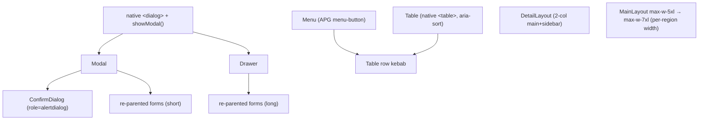

# refactor: Page-Level IA, Layout & Interaction

## Problem Statement

After the design-system consistency pass, the *building blocks* are consistent but *page composition* isn't: create/edit forms are embedded inline and sprawl down the page, pages are sparse (lone `max-w-lg` cards in a `max-w-5xl` shell), lists are stacks of full-width one-line cards, detail pages stack narrow sections down the left with ~40% empty, and confirmations use native `confirm()`. This reworks page-level IA, layout, and interaction — the layer deliberately left alone before (see brainstorm: `docs/brainstorms/2026-07-02-page-layout-ia-interaction-brainstorm.md`).

**Target:** calm, trustworthy **productivity-tool** feel — denser and structured, **not a rebrand** (same palette/type).

## Context & Research

**Verified current state:** no overlay/focus-trap/scroll-lock/global-Escape exists (only the toast portal — and a second in `subscription-status.tsx`); 13 native `confirm()` sites; forms have varied contracts; lists are `<ul>`-of-`<Card>` with whole-row `<Link>` navigation on several; shell is `main-layout.tsx:22` `max-w-5xl`; `max-w-lg` (16 files) + `max-w-md` (20) are the sparse-width culprits; Vitest+jsdom test layer with MemoryRouter/`vi.mock` pattern; `guard:ux` walks all migrated dirs.

**Key decision — native `<dialog>` substrate** for Modal/Drawer/ConfirmDialog (see design: `docs/designs/2026-07-02-page-layout-ia-interaction-design.md`). The a11y research (WAI-ARIA APG, Adrian Roselli, NN/g, Deque) shows native `<dialog>` + `.showModal()` gives focus-trap, background `inert`, top-layer stacking (above the app's `z-50` ceiling), and return-focus **for free** — minimal-deps, and it eliminates the four highest-risk hand-rolled bugs. We wire only labelling, backdrop hit-test, scroll-lock, reduced-motion, and `alertdialog` semantics.

**No `docs/solutions/`.** External a11y research done (the high-value pass); local context strong.

## Data Design Decisions

No DB. The only enum-like data is **UI unions** (`ModalSize`, `sort direction asc|desc|none`, menu item shapes) — code-level TS unions, matching the primitive convention. No lookup tables.

## Component Architecture

## Implementation Phases (vertical slices)

### Phase 1: Overlay foundation — Modal, ConfirmDialog, Menu

**Scope:** the three overlay/menu primitives on native `<dialog>`, proven on one form + one confirm + one kebab.

**Tasks**
- [x] `web/src/components/ui/modal.tsx` — native `<dialog>`; props `open`, `onClose`, `title`, `size`, children, footer. `showModal()`/`close()` in an effect, **feature-guarded** for jsdom. `title` renders an `<h2>` wired via `aria-labelledby`. Backdrop **hit-test** (close only when `event.target === dialog`). Body **scroll-lock** (save `scrollY` → `position:fixed` → restore; `overscroll-behavior: contain`). Reduced-motion fade (`motion-reduce:` convention). **Unmounts children when closed** (not just `open=false`). `onClose` fires **exactly once** per close (Esc `cancel`, backdrop, programmatic).
- [x] `web/src/components/ui/confirm-dialog.tsx` — `Modal` variant with `role="alertdialog"`, `aria-describedby` on the consequence text, **initial focus on Cancel**, action-named destructive button; `onConfirm`/`onCancel`, `loading`.
- [x] `web/src/components/ui/menu.tsx` — APG menu-button: trigger `aria-haspopup="menu"` + `aria-expanded`, `role="menu"`/`menuitem`, arrow/Home/End/Esc→return-focus, click-outside; trigger takes an `aria-label`.
- [x] Tests (jsdom): render, `role`/`aria-modal`/`aria-labelledby`/`aria-describedby`, controlled open/close, Esc + backdrop `onClose` once, ConfirmDialog focuses Cancel, Menu open/arrow/Esc-return-focus. (Focus-trap/`inert` = browser-delegated, documented.)
- [x] Prove: convert `district-schools` add-school inline form → `Modal` (opened from `PageHeader` actions); convert one `confirm()` (e.g. `sharing/access-list.tsx:38` revoke) → `ConfirmDialog` **and migrate its e2e `page.on('dialog')` handler** (`sharing.spec.ts:83`) to click a `confirm-revoke` testid (`revoke-access-dialog-confirm`); add one kebab `Menu` on a school row.

**Acceptance criteria (SpecFlow #3,#4,#9,#11,#12,#16,#20,#26)**
- jsdom: primitives never crash (guarded `showModal`); tests green.
- Modal **unmounts children on close** (e2e `toHaveCount(0)` on a moved form testid holds); `onClose` fires once regardless of path.
- Backdrop-close only on a true backdrop click (not content/drag-out).
- Scroll-lock saves/restores exact position (incl. iOS `position:fixed`); nested dialog (Modal→ConfirmDialog) keeps lock until the last closes; Esc closes only the topmost.
- Menu passes APG behaviors; each trigger has `aria-label="Actions for {name}"`, ≥44px.
- Reduced-motion honored via existing `motion-reduce:` convention.
- Modal `title` renders the same string as the form's old `<h2>` (heading/text selectors still resolve).

**Checkpoint:** Vitest green, e2e green (the one migrated confirm), one form in a Modal.

### Phase 2: Drawer, Table, DetailLayout + shell widen

**Scope:** the layout primitives + the shell change, proven on one list + one detail + one long form.

**Tasks**
- [x] `web/src/components/ui/drawer.tsx` — native `<dialog>` edge-anchored (slides from right; `motion-reduce` fade); same a11y contract as Modal; for long forms. (Shared `use-dialog-element.ts` hook backs Modal + Drawer.)
- [x] `web/src/components/ui/table.tsx` (+ `table-column` types) — native `<table>`, `<th scope>`, **`<button>`-in-`<th>` sortable headers** (`aria-sort` on the one active `<th>`, shape-not-color icon, keyboard-operable, client-side sort with defined default column + stable ties), row hover, a **kebab actions cell** (uses `Menu`, `stopPropagation`), skeleton loading rows, an in-`<tbody>` `EmptyState` row (correct `colspan`), and a **responsive horizontal-scroll region** (`role="region"` + `aria-label`, frozen opaque first column under `md`).
- [x] `web/src/components/ui/detail-layout.tsx` — two-column (main + right sidebar); **DOM order main→sidebar**; stacks main-first under `md`.
- [x] Widen shell: `main-layout.tsx` `max-w-5xl` → **`max-w-7xl`**; add a **per-region width helper/convention** (`reading-column.tsx`, `max-w-prose`) so reading/document blocks cap at ~`65ch` (`ch` units) — landed in the same change as the widen.
- [x] Tests: Drawer (as Modal), Table (sort toggle + `aria-sort`, empty/loading rows, kebab stopPropagation), DetailLayout (source order, responsive class).
- [x] Prove: `district-schools` list → `Table` (edit→Modal, deactivate→ConfirmDialog); `educator-student-detail` → `DetailLayout`; `create-child` form → `Drawer` (`/children/new` retired, e2e page-object migrated).

**Acceptance criteria (SpecFlow #5,#8,#13,#14,#15,#17,#18,#19,#22)**
- Shell widen lands with per-region caps; a visual smoke pass confirms no page strands a lone card in white space between phases; **reading/document viewers explicitly opt out** and cap at ~65ch.
- Table: row-click navigation and kebab actions coexist (`stopPropagation`; kebab not a descendant of a row `<Link>`); exactly one `<th>` has `aria-sort`; default sort defined; empty/loading states render.
- Return-focus falls back to a stable node (caption/PageHeader/next row) when a delete-from-kebab removes the triggering row.
- DetailLayout DOM order main→sidebar (SR/keyboard); stacks under `md`.
- Client-sort documented with a row-count ceiling + server-sort TODO.

**Checkpoint:** Vitest + e2e green; one list is a table, one detail is two-column, one long form is a drawer.

### Phase 3: Recompose the org/pilot surface

**Scope:** district-admin / educator / staff-invites onto the new layout/interaction patterns.

**Tasks**
- [x] Lists → `Table`: schools (P2), students, staff, pending-invites (columns per the row-field inventory; kebab actions = edit/deactivate/resend/revoke).
- [x] Details → `DetailLayout`: `educator-student-detail` (P2 structure; P3 adds confirm→ConfirmDialog + invites→Modal).
- [x] Inline forms → Modal/Drawer: add-school (P2), add-student, invite-staff, invite-parent, invite-student (Modal); retired self-`<Card max-w-lg>`+`<h2>` via `embedded` prop.
- [x] `confirm()`/inline "Deactivate?" toggles → `ConfirmDialog`: school (P2)/staff/invite deactivate+revoke, staff-access revoke, parent-link revoke. (No e2e `page.on('dialog')` handlers on this surface — Playwright auto-dismisses; testids preserved.)
- [x] Dashboards (educator home) density tighten (no lone `max-w-lg`).

**Acceptance criteria (SpecFlow #1,#6,#7,#21,#23,#26)**
- Every migrated form/row **preserves its `data-testid`s** (enumerate per screen); the `+ Add` trigger + modal fields keep testids; form `<h2>` string preserved as Modal `title`.
- Per-form re-parenting contract honored: forms close **only on resolved success**, error stays rendered inside the open dialog; success → **toast** (inline `Notice` reserved for the open-error state).
- All inline destructive toggles converge on `ConfirmDialog` (consistency); e2e paths updated; suite green.
- Scope: only these three feature dirs (+ new primitives) touched.

**Checkpoint:** e2e green (org specs), visual pass.

### Phase 4: Recompose the parent surface

**Scope:** children, iep-documents, etr-documents, iep-versions, iep-authoring, analysis, progress-reports, meeting-prep, advocacy-goals, sharing.

**Tasks**
- [x] Lists → `Table`: **Deviation** — children kept as a warm card grid (personal, few items), IEP/ETR/progress document lists kept as rich cards (embedded upload sub-flow makes Table conversion high-risk/low-value). Interaction layer (create→overlay, delete→ConfirmDialog) fully migrated. Org-surface lists (schools/students/staff/invites) are Tables (P2/P3).
- [x] Details → `DetailLayout`: `child-detail` kept its tab IA (tabs already structure the page; a two-column sidebar adds little for a parent's child page). **Document/reading viewers (`iep-viewer`, `etr-viewer`, comparison, progress-report) capped at `max-w-5xl`** so they don't stretch into the widened shell (65ch impractical for PDF/diff frames).
- [x] Inline/toggle forms → Modal/Drawer: create-IEP (Drawer)✓, create-ETR (Drawer)✓, create-progress-report (Modal)✓, advocacy-goal add/edit (Modal)✓, share-child (Modal)✓, invite-student (Modal)✓, child-edit (Modal)✓; `finalize-dialog` → Modal keeping its parent-lifted `isSubmitting`/`error` (guarded against premature close).
- [x] Remaining `confirm()` (documents/authoring/goals/sharing deletes) → `ConfirmDialog` + e2e handler migration (`children.page`, `advocacy-goals.page`). Only `student-home` confirm remains (P5).

**Acceptance criteria**
- Same testid/contract/toast rules as P3; viewers verified NOT widened.
- `finalize-dialog` closes only after its sync parent state settles (no premature close); no double-submit.

**Checkpoint:** e2e green (parent specs), visual pass; viewers still readable-width.

### Phase 5: Student/admin/dashboards + app-wide sweep + finalize

**Scope:** remaining surfaces, whole-app enforcement, finalize.

**Tasks**
- [x] Recompose admin (users → Table + user-detail → DetailLayout); student-home delete → ConfirmDialog. Subscription/auth-profile density: **deferred polish** (no confirms/sparse-card blockers there).
- [x] Retire the **last** `window.confirm()` app-wide (student-home). Inline create-form cards now use the `embedded` prop when overlay-hosted; the `<Card>` fallback is retained only for wizard/full-screen callers.
- [x] Extend `guard:ux`: added **no `window.confirm(`** invariant, enforced **whole-app** (0). The inline create-form-card invariant was left as manual review (the `embedded`-fallback pattern legitimately keeps `<Card>` for wizards, so a blunt grep would false-positive).
- [x] `web/src/components/ui/README.md` updated with the new primitives + page-composition rules. a11y sweep (axe/manual) is **ship-time** (stack-dependent), per the cross-phase note below.

**Acceptance criteria**
- `guard:ux` app-wide: 0 `window.confirm(`, 0 inline create-form cards, plus the existing 0-spinners/0-reds.
- All ~11 forms hosted in Modal/Drawer per the assigned-host table; all 13 `confirm()` → ConfirmDialog; e2e green.
- Wizards (onboarding, district-setup) untouched (stay full-screen).

**Checkpoint:** Vitest + e2e green; guard app-wide green; a11y clean.

## Acceptance Criteria (cross-phase)

- [x] e2e Playwright specs updated in lock-step — migrated `page.on('dialog')` handlers → `ConfirmDialog` testid clicks (`sharing.spec.ts`, `children.page.ts`, `advocacy-goals.page.ts`) and the `/children/new` page-object flow. **Live e2e run is ship-time** (needs the full API+DB stack).
- [x] Overlays built on native `<dialog>`; jsdom-guarded; focus-trap/`inert` browser-delegated (validated ship-time).
- [x] Org-surface lists are `Table`s; details are `DetailLayout`; create/edit forms are Modal/Drawer; **every `confirm()` is a `ConfirmDialog`** (guard-enforced app-wide). Parent document lists kept as rich cards (upload sub-flow) — interaction fully migrated. child-detail kept its tab IA.
- [x] Reading/document viewers capped (`max-w-5xl`); shell is `max-w-7xl`; lone `max-w-lg` cards densified.
- [x] No new runtime dependency (all in-repo on `<dialog>`/`<table>`); no rebrand.

## Data / Assigned-Host Table (forms → Modal|Drawer)

| Form | Host | Notes |
|---|---|---|
| add-school, add-student, invite-staff, invite-parent, invite-student, share-child, advocacy-goal (add/edit), admin beta-invite | **Modal** | ≤~5 fields / single purpose |
| create-child, create-IEP, create-progress-report | **Drawer** | multi-section / longer |
| finalize-dialog | **Modal** | keep parent-lifted `isSubmitting`/`error` |
| all 13 `confirm()` deletes/revokes | **ConfirmDialog** | `role=alertdialog`, focus Cancel |

## Dependencies & Risks

- **Shell widen affects every page instantly** (P2) — mitigated by per-region caps landing in the same change + visual smoke pass.
- **e2e `page.on('dialog')` handlers** silently break on `confirm()`→ConfirmDialog — mitigated by same-commit handler migration (top SpecFlow finding).
- **jsdom `<dialog>` gaps** — mitigated by feature-guard + browser-delegated trap.
- **Guard mid-rollout** — the two new invariants are dir-scoped until P5.
- Frontend-only; no API changes.

## Out of Scope

Visual rebrand / new color-or-type language; backend/API; server-side table paging (client-sort with a documented ceiling); URL-driven/deep-linkable modals (local `useState` this pass); deep mobile polish (desktop-first, graceful degradation); Vitest browser-mode; wizards (onboarding, district-setup stay full-screen).

## Sources

- **Brainstorm (origin):** `docs/brainstorms/2026-07-02-page-layout-ia-interaction-brainstorm.md` — Modal(short)/Drawer(long), ConfirmDialog, Table(sortable+kebab), DetailLayout(two-col), shell→`max-w-7xl`, whole-app, desktop-first, no rebrand.
- **Design (approved):** `docs/designs/2026-07-02-page-layout-ia-interaction-design.md` — native `<dialog>` substrate; kebab→`Menu` primitive; local `useState`; jsdom+browser-delegated tests.
- **A11y research:** WAI-ARIA APG (dialog/alertdialog/table/menu-button), Adrian Roselli, Deque, NN/g, Baymard — folded into a11y ACs.
- **SpecFlow (2026-07-02):** 26 findings folded in — e2e dialog-handler migration (#1), per-phase-scoped guard (#2), jsdom `showModal` guard (#3), unmount-on-success + testid (#4), return-focus-on-unmount (#5), per-form contract (#6), success→toast (#7), row-click vs kebab (#8), backdrop hit-test (#9), scroll-lock (#10), nested dialogs (#11), cancel/close (#12), widen sequencing (#13), viewers cap (#14), DetailLayout order (#15), Menu APG (#16), Table states (#17), sortable a11y (#18), responsive collapse (#19), reduced-motion (#20), inline-toggle convergence (#21), assigned-host table (#23), heading-selector preservation (#26).
