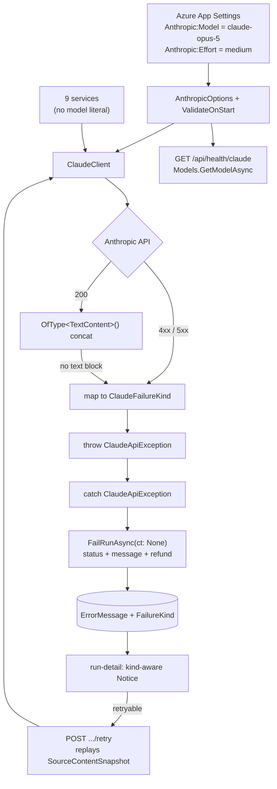

# fix: Replace retired Claude model and make analysis failures diagnosable

## Overview

Every Claude API call in the .NET API hardcodes `claude-sonnet-4-20250514`, which Anthropic has retired. The API now returns **404 `not_found_error`** for that model, so every AI-backed feature in the product is broken — analysis, IEP parsing, ETR parsing, progress reports, meeting prep, AI assist, and the student workspace. The broad `catch (Exception)` in each service flattens the 404 into `"An unexpected error occurred during analysis."`, which is why the failure is undiagnosable from the UI.

This plan moves the model to `claude-opus-5`, moves the model ID into configuration so the next retirement is a settings change, fixes a response-parsing bug that would otherwise make the model swap fail silently, introduces typed failure classification so errors say something actionable, adds a readiness probe, closes a quota leak the outage exposed, and builds the retry path the UI has been missing.

**Phase 1 alone restores service.** Phases 2–5 harden, generalize, and repair collateral damage.

## Problem Statement

### Evidence

Production logs (`app-logs-iepadvisor-api-production`), 2026-08-22 23:42–23:44 UTC — analysis runs 12, 13, and 14 in quick succession:

```
System.Net.Http.HttpRequestException: {"type":"error","error":{"type":"not_found_error",
  "message":"model: claude-sonnet-4-20250514"},"request_id":"req_011CeJg96PRbL75TvhoRJKA8"}
   at Anthropic.SDK.Messaging.MessagesEndpoint.GetClaudeMessageAsync(MessageParameters, CancellationToken)
   at IepAssistant.Services.Implementations.ClaudeClient.CompleteAsync(...) ClaudeClient.cs:line 69
   at IepAssistant.Services.Implementations.AnalysisRunService.ExecuteRunAsync(int, CancellationToken) line 170
```

### Defects

1. **Retired model, hardcoded in 11 places.** `ClaudeCompletionRequest.cs:8` (default), seven inline literals, two `private const string Model` fields, plus five test assertions. Changing the model today means editing 10 files and redeploying.

2. **Response parsing breaks on any model with thinking enabled.** `ClaudeClient.cs:71`:
   ```csharp
   var responseText = (response.Content?.FirstOrDefault() as TextContent)?.Text;
   ```
   Claude Opus 5 has adaptive thinking **on by default**, so the first content block is a `thinking` block. The `as` cast silently yields `null`, `CompleteAsync` returns `null`, and `ParseResponse(null)` fails the run with `"Failed to generate analysis."` (`AnalysisRunService.cs:179`). **A model-ID-only fix replaces a loud 404 with a silent wrong answer.** Verified that `Anthropic.SDK` 5.10.0 exports `ThinkingContent`, `RedactedThinkingContent`, `MessageParameters.Thinking`, and `OutputConfig.Effort` — the package supports Opus 5; the extraction logic is what is wrong.

3. **All failures collapse to one string.** Eleven broad `catch (Exception)` blocks across nine services; none distinguishes `HttpRequestException` from `TaskCanceledException` from a genuine `NullReferenceException`. `Exception.Message` is never persisted — detail lives only in `ILogger`. `IepAssistService` and `StudentWorkspaceService` have **zero** try/catch, so a Claude outage there becomes an uncaught 500.

4. **Legacy IEP analysis permanently burns quota on failure.** `SubscriptionService.cs:243-244`:
   ```csharp
   public async Task<bool> TryRecordUsageAsync(...)
       => await TryReserveUsageAsync(userId, childId, operationType, limit, ct) is not null;
   ```
   It reserves a usage record and **discards the id**. `IepAnalysisService.cs:115` calls it and never releases. Every failure on that path consumes one of the 5-per-child allowance for good — including every "Retry Analysis" click during this outage (`iep-documents/components/analysis-tab.tsx:91`). `EtrAnalysisService.cs:77-78` is a TODO with no quota enforcement at all.

5. **Refund leaks on cancellation.** `AnalysisRunService.cs:255` passes the possibly-cancelled `ct` to `FailRunAsync`; on shutdown the refund's `SaveChangesAsync(ct)` throws and the unit leaks. `AnalysisRunWorker.cs:66` already gets this right with `CancellationToken.None`.

6. **Parse-failure copy blames the user's documents.** `etr-error-banner.tsx` — *"This can happen when the PDF is scanned or has unusual formatting"*; `iep-viewer-page.tsx:357` — *"Try re-uploading or click Process to retry."* Both told users to fix their PDFs while the real cause was a dead model. Neither `IepDocument` nor `EtrDocument` has an `ErrorMessage` column to say anything truer.

7. **No retry path.** `AnalysisRunController` exposes only create/list/get. The `AnalysisRun` UI has no retry affordance at all, and `AnalysisRunDto` carries no failure kind, so the UI cannot vary its affordance per failure type.

### What is *not* broken

`AnalysisRunService.FailRunAsync` (`:588-613`) correctly refunds the reserved quota unit, nulling `UsageRecordId` in the same `SaveChangesAsync` as the status transition so a double failure path cannot double-refund. **The three failed `AnalysisRun` runs consumed none of the allowance.** This mechanism is the model for everything else and must not regress.

## Proposed Solution

| Concern | Change |
|---|---|
| Retired model | `claude-opus-5`, sourced from `Anthropic:Model` config |
| 10-file model edits | `AnthropicOptions` + nullable `ClaudeCompletionRequest.Model` override |
| Thinking-block parsing | Select all `TextContent` blocks, not `FirstOrDefault()` |
| Thinking consuming `max_tokens` | `output_config.effort = "medium"` globally |
| Undiagnosable failures | `ClaudeApiException` + `ClaudeFailureKind` enum, caught ahead of the broad catch |
| Silent config breakage | `GET /api/health/claude` probing `Models.GetModelAsync`, plus `ValidateOnStart` |
| Nowhere to put parse errors | Additive migration: `ErrorMessage` on `IepDocument` and `EtrDocument` |
| Legacy quota burn | `IepAnalysisService` converts to reserve/release; burned units restored |
| Refund leak on shutdown | All fail paths use `CancellationToken.None` and go through `FailRunAsync` |
| No retry | `POST /analysis-runs/{runId}/retry` replaying the stored snapshot |
| Dead-end error UI | `run-detail.tsx` gets `\|\|` fallback, kind-aware Retry, `role="alert"` |

## Technical Approach

### Architecture



### Failure classification

`ClaudeFailureKind` is a **code enum**, not a database lookup table — it exists only to drive `switch` branches and pick a canned message, so runtime editability buys nothing while a DB round-trip on every failure costs something.

`UserMessage` is **always a canned per-kind constant, never `inner.Message`.** The production 404 body carries the model id and `request_id`, and the 401 path can echo key material; neither may reach a parent-visible `ErrorMessage`.

| Kind | Trigger | User-facing message | Retryable |
|---|---|---|---|
| `Configuration` | 401, 404 (model not found), missing/blank API key | "Analysis is temporarily unavailable due to a service configuration problem." | No — suppress retry |
| `RateLimited` | 429 | "The analysis service is busy right now. Please try again in a few minutes." | Yes |
| `Timeout` | `TaskCanceledException` where `ct.IsCancellationRequested == false` | "The analysis took too long to complete. Please try again." | Yes |
| `Transient` | 5xx, connection failure | "The analysis service is temporarily unavailable. Please try again." | Yes |
| `RequestTooLarge` | 413, context-window overflow | "This document set is too large to analyze at once. Try selecting fewer documents." | No — offer "change selection" |
| `InvalidResponse` | 200 with no text block, or unparseable JSON | "The analysis could not be completed. Please try again." | Yes |
| `Unknown` | anything else | "An unexpected error occurred during analysis." (current string, preserved) | Yes |

**Cancellation is not a timeout.** `TaskCanceledException` is raised both by the 15-minute HttpClient timeout and by graceful shutdown (`AnalysisRunWorker` passes `stoppingToken` down to `CompleteAsync`). Without the `ct.IsCancellationRequested` discriminator, every deploy restart writes "the request took too long" onto in-flight runs. Shutdown cancellation must propagate as `OperationCanceledException`, not be reclassified.

### The catch contract

Every typed catch **must** delegate to the service's existing fail-and-refund helper with `CancellationToken.None`:

```csharp
catch (ClaudeApiException ex)
{
    _logger.LogError(ex, "AnalysisRun {RunId} failed: {Kind}", runId, ex.Kind);
    await FailRunAsync(runId, ex.UserMessage, ex.Kind, CancellationToken.None);
    return;
}
```

Setting `run.Status`/`run.ErrorMessage` inline instead would **leak the quota unit** — the refund lives inside `FailRunAsync`, and once the status is terminal neither the idempotency guard nor `ReconcileOrphanedRunsAsync` will repair it. This is an acceptance criterion, not a style preference.

### Implementation Status

**Phase 1 complete** — committed as `8da62c8` on `fix/claude-model-retirement`. Build clean, 483 tests pass, 0 fail.

Three corrections the plan got wrong, found by execution rather than by reading:

1. **`ThinkingParameters.Effort` is `[JsonIgnore]` in Anthropic.SDK 5.10.0.** The XML doc's "maps to output_config.effort" applies only to the `Microsoft.Extensions.AI` ChatOptions path. Setting it on `MessageParameters.Thinking` sent nothing to the wire. Effort is set via `MessageParameters.OutputConfig` instead. Caught by the regression test, not by inspection.
2. **`ThinkingEffort` has no `xhigh`** — only `low`/`medium`/`high`/`max`. `AnthropicOptions.Effort` is constrained to those four so an unrepresentable value fails at boot rather than silently degrading.
3. **The SDK throws `AuthenticationException`, not `HttpRequestException`, on 401**, with the full API body in the message. Without a dedicated catch arm a bad key escaped unclassified — and that body is exactly what must never surface.

The no-sampling-parameters regression guard **passed**: the wire body is `{"max_tokens":…,"stream":false,"thinking":{"type":"adaptive"},"output_config":{"effort":"medium"},"model":"claude-opus-5",…}` with no `temperature`, `top_p`, `top_k`, or `budget_tokens`.

**Resolved: Phase 1 now has zero schema dependency.** `FailureKind` persistence was removed (commit `7bb86b7`); the Domain project is byte-identical to `c2f4da3`. The classification still reaches operators — the kind is logged in structured form at all three failure sites (`ClaudeClient.cs:116`, `AnalysisRunService.cs:188`, `:268`), so triage is a Kibana query on `{Kind}`. The column and DTO field return in **Phase 4**, alongside the frontend that consumes them, `HasMaxLength(32)`, and a deliberate migration plan.

**Why it was removed.** Production applies migrations by hand and is demonstrably behind: the `ExpiryReminderSentAt` migration authored 2026-07-01 was still throwing `Invalid column name` in production through 2026-08-04 (75 log entries). `Program.cs` has no `Migrate()` and `deploy-api.yml` has no migration step. `FailureKind` is a mapped property, so EF emits it in every `SELECT` against `AnalysisRuns` — deploying this code before applying the migration breaks all analysis reads, which is worse than the current outage.

### Implementation Phases

Vertical slices. Each cuts through config, client, service, and test together; each ends with a checkpoint that proves something works end to end.

---

#### Phase 1: Restore the analysis path end to end

**New files**

`api/IepAssistant.Services/Models/AnthropicOptions.cs`
```csharp
namespace IepAssistant.Services.Models;

public sealed class AnthropicOptions
{
    public const string SectionName = "Anthropic";

    [Required] public string ApiKey { get; set; } = string.Empty;
    [Required] public string Model { get; set; } = "claude-opus-5";
    [RegularExpression("^(low|medium|high|max)$")]
    public string Effort { get; set; } = "medium";
}
```

`api/IepAssistant.Services/Models/ClaudeFailureKind.cs`
```csharp
public enum ClaudeFailureKind
{
    Configuration, RateLimited, Timeout, Transient,
    RequestTooLarge, InvalidResponse, Unknown
}
```

`api/IepAssistant.Services/Models/ClaudeApiException.cs`
```csharp
public sealed class ClaudeApiException : Exception
{
    public ClaudeFailureKind Kind { get; }

    /// Canned per-kind text safe to persist and show to end users.
    /// Never derived from the inner exception — API bodies carry model ids,
    /// request ids, and potentially key material.
    public string UserMessage { get; }

    public ClaudeApiException(ClaudeFailureKind kind, string userMessage, Exception? inner = null)
        : base($"Claude call failed ({kind})", inner)
    {
        Kind = kind;
        UserMessage = userMessage;
    }
}
```

**Modified files**

- `api/IepAssistant.Api/Program.cs` — bind and validate next to the existing `"Claude"` HttpClient registration (`:87-94`); the file already uses `Configure<T>` at `:202`:
  ```csharp
  builder.Services.AddOptions<AnthropicOptions>()
      .Bind(builder.Configuration.GetSection(AnthropicOptions.SectionName))
      .ValidateDataAnnotations()
      .ValidateOnStart();
  ```
  Fail-fast at startup is deliberate: a blank `Model` or a typo'd `Effort` is exactly the class of defect this plan exists to prevent, and discovering it at the first user call is what happened last night.
- `api/IepAssistant.Api/appsettings.json` — extend the `Anthropic` section (`:26-28`) with `"Model": "claude-opus-5"` and `"Effort": "medium"`.
- `api/IepAssistant.Services/Models/ClaudeCompletionRequest.cs` — `Model` becomes `string?` defaulting to `null`.
- `api/IepAssistant.Services/Implementations/ClaudeClient.cs` — take `IOptions<AnthropicOptions>`; resolve `request.Model ?? _options.Model`; set `OutputConfig.Effort`; replace the `:71` extraction; wrap the SDK call in the mapping try/catch.
  ```csharp
  // Opus 5 returns thinking blocks first; select text blocks explicitly.
  var responseText = string.Concat(
      response.Content?.OfType<TextContent>().Select(c => c.Text) ?? []);

  if (string.IsNullOrWhiteSpace(responseText))
      throw new ClaudeApiException(ClaudeFailureKind.InvalidResponse, Messages.InvalidResponse);
  ```
- `api/IepAssistant.Services/Implementations/AnalysisRunService.cs` — delete the literal at `:174`; add `catch (ClaudeApiException ex)` ahead of the broad catch at `:252` following the catch contract above; change the existing broad catch at `:255` to pass `CancellationToken.None` to `FailRunAsync` (currently passes the possibly-cancelled `ct`, leaking the refund on shutdown).
- `api/IepAssistant.Domain/Entities/AnalysisRun.cs` + configuration — add `FailureKind` (nullable string, max 32) so the UI can vary its affordance. Additive migration.

**Verification during implementation (do not skip)**
- Assert on the stub handler's `LastRequestBody` that no `temperature`, `top_p`, or `top_k` key is present — Opus 5 rejects sampling parameters with a 400, and if the SDK emits a default, every call fails. This becomes a permanent regression guard, not a one-time manual check.
- Confirm the `OutputConfig.Effort` value the SDK emits matches the API's expected `output_config.effort` shape.
- Confirm nothing relies on `CompleteAsync` returning `null` for a blank API key in dev/test before making that path throw.

**Testing checkpoint**
- `ClaudeClientTests`: 404 → `Configuration`; 429 → `RateLimited`; 503 → `Transient`; `TaskCanceledException` with `ct` not cancelled → `Timeout`; the same with `ct` cancelled → propagates `OperationCanceledException`, not `Timeout`; thinking-block-first response → text returned; thinking-block-only → `InvalidResponse`; blank API key → `Configuration`; request model override wins; null request model falls back to the configured default; request body carries no sampling parameters.
- `AnalysisRunServiceTests`: a `FakeClaudeClient` that **throws** `ClaudeApiException` (the existing fakes only return a string or null, so the broad catch is entirely untested) → run is `Error`, `ErrorMessage == ex.UserMessage`, `FailureKind` persisted, `UsageRecordId` is null, **and `ReleaseUsageByIdAsync` was called exactly once**. Plus: `ExecuteRunAsync` with a pre-cancelled token still refunds.
- Manual: log in, re-run analysis on the IEP that failed last night, confirm completion; re-check the production log index for a clean run.

**Success criteria:** analysis completes in production against `claude-opus-5`; a forced failure shows a specific message; quota accounting verified by test, not by inspection.

---

#### Phase 2: Readiness probe

**Modified files**
- `api/IepAssistant.Services/Interfaces/IClaudeClient.cs` — add `Task<ClaudeProbeResult> ProbeModelAsync(CancellationToken ct = default)`.
- `api/IepAssistant.Services/Implementations/ClaudeClient.cs` — implement via `client.Models.GetModelAsync(resolvedModel)`. Metadata lookup: no tokens, no inference, no cost. **Use a dedicated short-timeout HttpClient (2–5s), not the named `"Claude"` client** — inheriting its 15-minute timeout would let a hung Anthropic endpoint hang the health check, amplifying an outage for anything that polls it.
- `api/IepAssistant.Api/Controllers/HealthController.cs` — add the probe route returning the standard `ApiResponse<T>` envelope used everywhere else in the API.

**Authorization decision:** `HealthController` currently has no `[Authorize]`. The anonymous response must be `{ status }` only — exposing the configured model id and failure kind publicly, and letting unauthenticated callers drive outbound Anthropic requests, are both unacceptable. The detailed body (model, kind) is gated behind `[Authorize]` on an admin-scoped variant.

**Known limitation to document:** `GetModelAsync` proves the model *exists*. It does **not** prove `output_config.effort` is accepted, nor that the SDK isn't emitting a rejected sampling parameter — either would 400 on every real call while the probe returns a cheerful 200. A post-deploy smoke that runs one real minimal completion is therefore still required.

**Testing checkpoint:** integration test — valid model → 200 with resolved id; bogus configured model → 503 with `kind: "Configuration"`; `GET /api/health` still returns 200 while `/api/health/claude` is failing (the probe must not take down basic liveness); anonymous caller gets the reduced body.

---

#### Phase 3: Remaining eight callers, missing columns, and the quota leak

Apply the Phase 1 pattern across every remaining service.

| Service | Literal | Additional work |
|---|---|---|
| `IepAnalysisService.cs` | `:411` | **Convert `TryRecordUsageAsync` (`:115`) to `TryReserveUsageAsync` + `ReleaseUsageByIdAsync`**, mirroring `AnalysisRunService`. Persist the reservation id on `IepAnalysis` so refunds are scoped to the run. Also fix the error save at `:218`, which uses a possibly-cancelled token and can strand rows in `"analyzing"`. |
| `EtrAnalysisService.cs` | `:334` | Quota TODO at `:77-78` left as-is; note it explicitly rather than silently |
| `ProgressReportAnalysisService.cs` | `:221` | Also write `ErrorMessage` on the `ProgressReport` row (`ProgressReport.cs:15`), which the service currently never populates |
| `MeetingPrepService.cs` | `:686` | Already uses `CancellationToken.None` for the error save |
| `IepProcessingService.cs` | `:231` | Needs the new `ErrorMessage` column |
| `EtrProcessingService.cs` | `:271` | Needs the new `ErrorMessage` column |
| `IepAssistService.cs` | `:26` const | First try/catch; return the existing `"AI assist is temporarily unavailable."` constant. Map `ClaudeApiException` to **503**, not the default 400 — a 400 for a dependency outage misclassifies the incident in logs |
| `StudentWorkspaceService.cs` | `:23` const | First try/catch; `"AI interview is temporarily unavailable."`; **preserve the student's typed input** so a mid-interview failure is not data loss |

**Migration (additive, one file):** `ErrorMessage nvarchar(2000) NULL` on `IepDocument` and `EtrDocument`, matching the `HasMaxLength(2000)` convention of the eight existing configurations. This resolves the design's earlier "no schema changes" claim, which was wrong.

**Copy fixes:** `etr-error-banner.tsx` and `iep-viewer-page.tsx:357` currently assert a cause ("scanned PDF", "try re-uploading"). Render the real `errorMessage` when present and soften the speculative text to a secondary hint.

**Testing checkpoint:** update `IepAssistServiceTests.cs:153` to assert against the configured model rather than a literal; throwing-fake test for `IepAssistService` confirming a 503 and no exception escaping; **`IepAnalysisService` failure refunds its unit** (the regression this phase exists to prevent). Manual: upload and parse an IEP end to end.

---

#### Phase 4: Retry endpoint and the frontend error surface

**Backend**
- `POST /api/children/{childId}/analysis-runs/{runId}/retry` — creates a new run from the failed run's persisted `AnalysisRunSource.SourceContentSnapshot` rather than re-deriving from live documents. Re-deriving via `CreateRunAsync` would silently analyze a *different* document set if a source was deleted or re-parsed since, or fail outright with "None of the selected documents could be analyzed."
- Reserves its own quota unit through the same `TryReserveUsageAsync` path; rejects retry when `FailureKind` is `Configuration` or `RequestTooLarge` (deterministic failures — retry would burn a reserve/refund cycle and another Claude call per click).
- `AnalysisRunDto` gains `failureKind`.

**Frontend**
- `run-detail.tsx` (`:59-63`) — `??` → `||` (an empty-string `errorMessage` currently renders a titled Notice with a blank body; every sibling surface uses `||`); add a kind-aware action: Retry for retryable kinds, "change selection" guidance for `RequestTooLarge`, no action for `Configuration`.
- Retry must be **hidden for viewers** (`SourcePicker` is gated on `child.role === "viewer"` but `RunDetail` is not, so an ungated button would be visible to users the API will 403) and **disabled while a create is in flight** (two clicks → two runs → two reservations).
- `notice.tsx` — `role="alert"` on the error variant.
- `use-analysis-run.ts` — add a "Check now" action to the `pollTimedOut` notice. Polling stops at 5 minutes (`:7`) while the Claude call can run 15, so a slow failure currently lands in `Error` after polling has stopped and the user never sees it without a manual refresh. Without this, the `role="alert"` fix is inert in exactly the slow-failure case it is meant for.
- Align wording: `run-status-badge.tsx:12-15` says "Error", `run-detail.tsx:60` says "Analysis failed", sibling tabs say "Analysis Failed". Pick one.

**New file:** `web/src/features/analysis/components/run-detail.test.tsx` — there is currently no test file anywhere under `web/src/features/analysis/`.

**Testing checkpoint:** retry replays the stored snapshot (assert the new run's snapshot matches the original even after the source document is mutated); retry rejected for `Configuration`; Retry hidden for viewers; Retry disabled while in flight; empty-string message falls back.

---

#### Phase 5: Restore quota burned during the outage

`IepAnalysisService` failures between the model's retirement and this fix permanently consumed units. Write a one-off, idempotent remediation:

1. Identify `IepAnalysis` rows with `Status = "error"` whose `CreatedAt` falls in the outage window and whose failure is attributable to the dead model (cross-reference the production log index by timestamp).
2. Release the corresponding `UsageRecord` rows.
3. Log every credit with the analysis id so the operation is auditable and re-runnable without double-crediting.

**Testing checkpoint:** dry-run mode listing affected rows before any write; running twice credits nothing the second time.

**Success criteria:** affected users are made whole, with an audit trail.

## Alternative Approaches Considered

| Alternative | Why rejected |
|---|---|
| **Swap the model string only** | Trades a 404 for a silent null because of the thinking-block parsing bug. Same broken feature, more misleading symptom. |
| **`claude-sonnet-5` instead of Opus 5** | Cheaper ($3/$15 vs $5/$25 per MTok). Rejected by explicit decision — analysis quality is the product. Cost delta tracked as a risk. |
| **Frontend re-creates the run from `run.sources`** | Nearly free, but a "retry" that re-derives snapshots can analyze different content than the run it claims to retry. Correctness surprise. |
| **Change `CompleteAsync` to return a result type** | Cleaner functionally, but rewrites the happy path in all nine services. A typed exception keeps the `string?` signature. |
| **Remove the broad `catch (Exception)`** | It is the correct backstop for genuine bugs. The defect was that it was the *only* handler. |
| **Add Polly retry now** | Scoped out. Classification is the prerequisite — once failures are labeled, retry is a small follow-up. |
| **Migrate to the official `Anthropic` SDK** | `Anthropic.SDK` 5.10.0 already exports the Opus 5 surface. A package migration during an outage fix is unnecessary risk. |

## System-Wide Impact

### Interaction Graph

`AnalysisRunController.Create` → `AnalysisRunService.CreateRunAsync` (reserves quota) → `AnalysisRunQueue.EnqueueAsync` → `AnalysisRunWorker` (`await foreach`, serial) → new DI scope → `ExecuteRunAsync` → `ClaudeClient.CompleteAsync` → `Anthropic.SDK` → HTTP. On failure: `FailRunAsync` → status `Error` + message + kind → `ReleaseUsageByIdAsync` → frontend 5s poll → `run-detail` Notice → retry endpoint → back to the queue.

Second level: the worker's own catch (`:55-72`) calls `FailRunAsync` in a **fresh scope** with `CancellationToken.None`, and `ReconcileOrphanedRunsAsync` (`:76-101`) sweeps `Pending`/`Running` rows at startup. Both must remain idempotent against the `UsageRecordId`-nulling refund.

### Error & Failure Propagation

Today: SDK `HttpRequestException` → broad catch → generic string → `ErrorMessage` → UI. After: SDK exception → `ClaudeClient` maps to `ClaudeApiException` → service-specific catch → `FailRunAsync(…, CancellationToken.None)` → `UserMessage` + `FailureKind` → UI affordance, with the broad catch retained beneath for real bugs.

### State Lifecycle Risks

- **Double refund.** `FailRunAsync` is reachable from `ExecuteRunAsync`'s catch, the worker's catch, and the startup sweep. The `UsageRecordId`-null-in-same-save guard prevents it; every new failure path must route through `FailRunAsync` rather than setting status directly.
- **Refund leak on shutdown.** Fixed in Phase 1 by using `CancellationToken.None`.
- **Multi-instance startup sweep.** `ReconcileOrphanedRunsAsync` fails *all* `Running`/`Pending` rows at boot. On Azure App Service with more than one instance, instance B's boot kills instance A's live run. Pre-existing — but config-driven model changes mean more restarts, so it will bite more often. Flagged, not fixed.
- **Queued `Pending` runs die on restart.** The `Channel<int>` is in-memory; a run created seconds before a deploy is swept to `Error` and never re-queued. The Phase 4 retry endpoint is the intended recovery.
- **Serial worker head-of-line blocking.** A hung call holds the 15-minute timeout and blocks that worker's queue. Unchanged; noted.

### API Surface Parity

Two parallel analysis surfaces exist: `AnalysisRun*` (PascalCase enum) and the legacy per-document services (lowercase strings). Both are user-reachable and both are covered. This plan does **not** unify the two vocabularies, and does **not** give the legacy surfaces the new retry endpoint — they keep their existing retry buttons.

### Integration Test Scenarios

1. Misconfigured model → run reaches `Error` with the `Configuration` message **and** the quota unit is refunded (verify the usage row, not just the status).
2. Claude returns 200 with only a `thinking` block → `InvalidResponse`, not a silent null.
3. Worker crash mid-run then restart → sweep fails and refunds without double-refunding a run already refunded by `ExecuteRunAsync`.
4. `GET /api/health/claude` against a bogus model → 503 while `GET /api/health` still returns 200.
5. Two concurrent runs on one child, one fails → only its own reservation is released.
6. Retry after the source document is edited → the new run's snapshot matches the *original*, proving replay rather than re-derivation.
7. Graceful shutdown mid-run → run is not labeled `Timeout`, and its unit is not leaked.

## Acceptance Criteria

### Functional Requirements

- [x] No `claude-sonnet-4-20250514` literal remains in `api/` production code *(done in review follow-up `b820546` — the `Model` override was deleted, moving all nine services onto the configured model at once)*
- [x] Model resolves from `Anthropic:Model`, defaulting to `claude-opus-5`
- [x] `ClaudeCompletionRequest.Model` is a nullable per-call override
- [x] `output_config.effort` is sent as `medium`; invalid values fail at startup via `ValidateOnStart`
- [x] Text extraction returns content when the response begins with a `thinking` block
- [x] A response with no text block raises `InvalidResponse`, never a silent null
- [x] All seven `ClaudeFailureKind` values map to distinct canned messages
- [x] `UserMessage` is never derived from `inner.Message`; no request id, model id, or key material is ever persisted or returned
- [x] Shutdown cancellation is not classified as `Timeout`
- [ ] **Every typed catch calls the service's fail-and-refund helper with `CancellationToken.None`; none sets status inline**
- [ ] All nine Claude-calling services catch `ClaudeApiException` ahead of their broad catch
- [~] `IepAssistService` and `StudentWorkspaceService` no longer surface a 500 — they catch `ClaudeApiException` and return their existing "temporarily unavailable" constants. Mapping that to a 503 rather than the default 400 remains Phase 3.
- [ ] `IepAnalysisService` uses reserve/release; a failure refunds its unit
- [ ] `IepDocument` and `EtrDocument` have an `ErrorMessage` column and the processing services populate it
- [ ] `GET /api/health/claude` returns 200 for a valid model, 503 with a `kind` for an invalid one, and no model detail to anonymous callers
- [ ] `POST .../analysis-runs/{runId}/retry` replays the stored snapshot and rejects non-retryable kinds
- [ ] `AnalysisRunDto` exposes `failureKind` *(deferred to Phase 4 — see Implementation Status)*
- [ ] `run-detail.tsx` uses `||`, offers a kind-aware action, hides retry from viewers, and announces via `role="alert"`
- [ ] Analysis completes in production for the IEP that failed on 2026-08-22

### Non-Functional Requirements

- [ ] Quota reserve/refund verified by test on every path — no double-refund, no leak
- [ ] Health probe consumes no inference tokens and has its own short timeout
- [ ] Persisted messages stay within `HasMaxLength(2000)`
- [ ] Prompt-injection posture unchanged — user-uploaded content still never reaches the system prompt (`seven-hills.local.md:12`)
- [ ] Migration is additive and backward-compatible (nullable columns, no data movement)

### Quality Gates

- [ ] `ClaudeClient` failure paths covered (currently only the happy path and missing-key guard are tested)
- [ ] `AnalysisRunService`'s broad-catch path covered by a throwing fake (currently untested)
- [ ] `dotnet build` clean; `dotnet test` green; `dotnet format` clean on touched files
- [ ] Phase 5 remediation has a dry-run mode and is proven idempotent
- [ ] Review by `dotnet-reviewer`, `react-reviewer`, `ef-migration-reviewer`, `code-simplicity-reviewer`, `agent-smith` per `seven-hills.local.md`

## Success Metrics

- Zero `not_found_error` entries in `app-logs-iepadvisor-api-production` after deploy
- Analysis runs reach `Completed` rather than `Error`
- Every future failure log carries a `ClaudeFailureKind`, making triage a query rather than a code read
- Time-to-detect a bad model config drops from "a user reports it" to "the health endpoint reports it"
- No user loses a paid analysis to an infrastructure failure

## Dependencies & Prerequisites

- **`Anthropic:Model` must be set in Azure App Service application settings**, or the `appsettings.json` default applies. `.github/workflows/deploy-api.yml` has no app-settings step — production config is managed outside this repo. Confirm before or immediately after deploy.
- `Anthropic.SDK` 5.10.0 — no package upgrade required.
- Phases 1, 3, and 4 each add an additive migration (`AnalysisRun.FailureKind`; `ErrorMessage` on the two document entities; `IepAnalysis` reservation id). Consider consolidating.
- Phase 5 needs access to the production log index to scope the outage window.

## Risk Analysis & Mitigation

| Risk | Likelihood | Impact | Mitigation |
|---|---|---|---|
| SDK serializes a default sampling parameter, which Opus 5 rejects with 400 | Medium | High — every call fails | Phase 1 test asserting no `temperature`/`top_p`/`top_k` in the request body |
| Health probe returns 200 while real calls 400 on effort/sampling | Medium | Medium — false confidence | Documented as a known limitation; post-deploy smoke runs one real completion |
| Thinking tokens consume `max_tokens`, truncating analysis JSON | Medium | Medium | `effort: medium` bounds thinking; `InvalidResponse` makes truncation visible; per-call-site tuning if it appears |
| Opus 5 cost is ~1.7× `claude-sonnet-5` | Certain | Medium — margin on a 5-per-child subscription | Accepted by explicit decision; monitor spend after deploy |
| Refund logic regresses while adding catch blocks | Medium | High — users lose paid analyses | The catch contract is an acceptance criterion with a dedicated test on every path |
| Phase 5 double-credits users | Low | Medium | Dry-run mode; idempotency proven by running twice |
| `ValidateOnStart` takes production down on a config typo | Low | High | Intentional trade-off — a fail-fast boot error is far cheaper than silent per-request failure. Verify the setting before deploy. |

## Out of Scope

Flagged during research, deliberately not actioned:

- **Secrets in the working tree.** `api/IepAssistant.Api/appsettings.Development.json` holds a live-format Anthropic API key (`:18`), an Azure SQL password (`:3`), and a storage account key (`:4`) in plaintext. Correctly gitignored and confirmed **absent from git history**, so not a disclosure — but it contradicts `.claude/project-context.md:26-31` and those credentials warrant rotation into user-secrets. **Recommend as the next task.**
- **Unapplied migration in production.** `Invalid column name 'ExpiryReminderSentAt'` fails the staff-invite expiry scan daily (observed 2026-07-21 → 07-23).
- `EtrAnalysisService`'s missing quota enforcement (`:77-78` TODO); multi-instance startup-sweep race; in-memory queue durability; Polly retry; Elasticsearch alert rules; migration to the official `Anthropic` SDK; unifying the two analysis status vocabularies; test coverage for the six services with no test file at all (`.claude/project-context.md:62-68` sets a 70% bar).

## Future Considerations

Once `ClaudeFailureKind` exists, retry-with-backoff becomes a small addition: `RateLimited` and `Transient` are exactly the retryable set, `Configuration` and `RequestTooLarge` exactly the ones that must not be. A `Microsoft.Extensions.Http.Resilience` handler on the named `"Claude"` client keyed off that classification is the natural follow-up — as is an Elasticsearch alert rule on `FailureKind: Configuration`, which would have caught this outage in minutes rather than overnight.

## Sources & References

### Design

- [docs/designs/2026-08-22-claude-model-retirement-and-error-diagnosis-design.md](../designs/2026-08-22-claude-model-retirement-and-error-diagnosis-design.md) — approved 2026-08-22. Decisions carried forward: `claude-opus-5`; `effort: medium` globally; full typed-error treatment across all nine services; retry via snapshot replay; fix the legacy quota leak and restore burned units.

### Production Evidence

- Elasticsearch `app-logs-iepadvisor-api-production`, 2026-08-22 23:42–23:44 UTC — analysis runs 12, 13, 14; request ids `req_011CeJg1G4sSsN8TxhMWGKaX`, `req_011CeJg7xk2HwFudLg97a5Ai`, `req_011CeJg96PRbL75TvhoRJKA8`

### Internal References

- Root-cause call site: `api/IepAssistant.Services/Implementations/AnalysisRunService.cs:170`
- Parsing defect: `api/IepAssistant.Services/Implementations/ClaudeClient.cs:71`
- Refund pattern to replicate: `api/IepAssistant.Services/Implementations/AnalysisRunService.cs:588-613`
- Quota leak: `api/IepAssistant.Services/Implementations/SubscriptionService.cs:243-244`, `IepAnalysisService.cs:115`
- Refund leak on cancellation: `AnalysisRunService.cs:255` vs. correct handling at `AnalysisRunWorker.cs:66`
- Missing columns: `api/IepAssistant.Domain/Entities/IepDocument.cs:13`, `EtrDocument.cs:13`
- Poll cap: `web/src/features/analysis/hooks/use-analysis-run.ts:7`
- Misleading copy: `web/src/features/etr-documents/components/etr-error-banner.tsx`, `web/src/features/iep-documents/components/iep-viewer-page.tsx:357`
- HttpClient registration: `api/IepAssistant.Api/Program.cs:87-94`
- Test stub pattern: `api/IepAssistant.Services.Tests/ClaudeClientTests.cs:37-72`
- UI error rule: `docs/designs/2026-07-01-ux-consistency-professionalism-design.md:33`
- Unfulfilled resilience intent: `docs/designs/2026-05-27-school-side-and-analysis-rework-design.md:75`

### External References

- Model IDs, retirement replacements, and Opus 5 breaking changes: bundled `claude-api` skill (`shared/model-migration.md`, `csharp/claude-api/README.md`), cached 2026-06-24


## Post-Deploy Monitoring & Validation

**Prerequisites before deploy**
- Confirm `Anthropic:ApiKey` is set in Azure App Service. `[Required]` + `ValidateOnStart` means a blank value now **fails app boot**, taking down auth, billing, and documents — not just AI features.
- Optionally set `Anthropic:Model` / `Anthropic:Effort`. Absent, the `appsettings.json` defaults (`claude-opus-5`, `medium`) apply.
- No migration required for this branch.

**Log queries** (index `app-logs-iepadvisor-api-production`)
- Regression watch: `"not_found_error"` — must return **zero** results after deploy
- Failure triage: `message:"Claude call failed for model"` — inspect the `{Kind}` field
- Boot check: `message:"Analysis Run Worker started"` confirms a clean start
- Config failure: any `ClaudeFailureKind` of `Configuration` is a page-worthy signal, not a user error

**Expected healthy signals**
- Analysis runs reach `Completed`; `AnalysisRun {RunId} completed` appears in logs
- No `Invalid column name` errors (would indicate an unrelated migration gap)

**Failure signals / rollback trigger**
- Any `not_found_error`, or `invalid_request_error` mentioning `output_config` / `effort` / `thinking` → the request shape is wrong for Opus 5; roll back and re-check the SDK serialization
- App fails to boot → almost certainly the missing `Anthropic:ApiKey` app setting
- Repeated `InvalidResponse` on multi-document runs → thinking is consuming the 32000 `max_tokens` budget; lower `Anthropic:Effort` to `low` (a config change, no redeploy)

**Validation window:** first hour after deploy, then a 24-hour check. **Owner:** Brad Gardner.

**Manual acceptance test:** log in, run analysis over the IEP that failed on 2026-08-22, confirm it completes.
