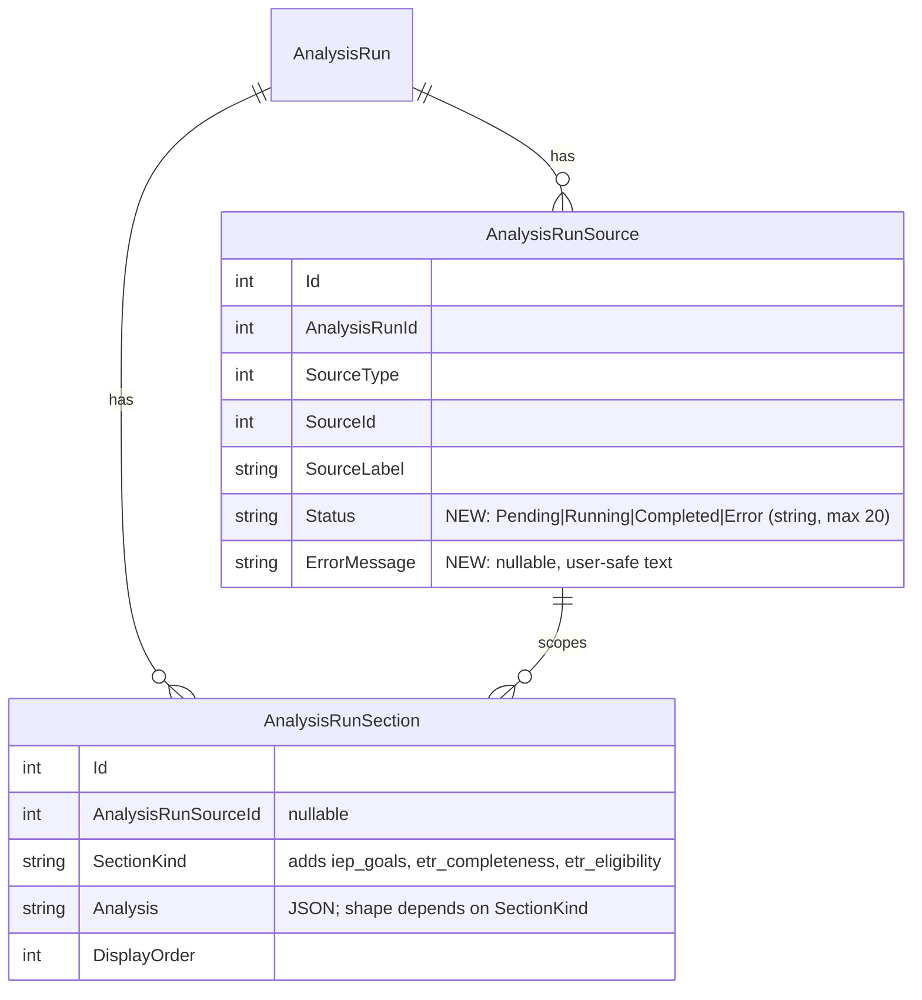

# refactor: Unified analysis — AnalysisRun as the one engine, viewed from child and document pages

## Overview

Parents see "Analysis" on the child page and on each IEP/ETR page, produced by two engines that don't know about each other. This plan makes `AnalysisRun` the only analysis engine for IEPs and ETRs:

- The child page owns history and multi-document runs.
- Each document page's Analysis tab becomes a view of the latest run that included that document.
- Runs gain per-goal SMART ratings for every IEP and execute one Claude call per source plus a synthesis call.

(see brainstorm: docs/brainstorms/2026-10-02-unified-analysis-navigation-brainstorm.md; design approved: docs/designs/2026-10-02-unified-analysis-design.md)

## Problem Statement

- **Two engines drift.**
  - `IepAnalysisService` / `EtrAnalysisService` overwrite one row per document in place (`IepAnalysisService.cs:137-150`, `EtrAnalysisService.cs:96-105`).
  - `AnalysisRunService` makes one Claude call for all sources with no goal ratings (`AnalysisRunService.cs:174-179, 493-601`).
  - Every fix lands twice or is missed: the 32k output budget, refunds on failure, polling caps (5 / 15 / ~3 minutes).
- **The one-way copy goes stale.** `AnalysisRunBackfillService` skips existing keys (`:82-86`). On QA, run 15 still shows **Error** for document 35's analysis, which completed on 2026-09-29.
- **Backfilled goal ratings are invisible.** They are stored as an array section that `AnalysisRunSectionResult` can't read (`AnalysisRunBackfillService.cs:128-136`; `run-source-sections.tsx:19-23`).
- **No links.** Run sources don't link to documents, documents don't link to runs, and a run can't be addressed by URL (`child-analysis-tab.tsx:23`). Advocate citations land on the tab with no run (`citation-links.ts:40-47`).
- **Duplicate analyses.** The same IEP is analyzed twice (QA runs 15 and 16) in two places.

## Proposed Solution

Decided in brainstorming and design (see origin and design docs):

1. **One engine.** `AnalysisRun` for IEPs and ETRs. The legacy analyze endpoints, queues and workers are removed. `IepAnalyses` / `EtrAnalyses` become **read-only history for one release** and are dropped in a follow-up.
2. **Per-source execution.** One Claude call per source, then one synthesis call when there are 2+ sources. Each source has its own status.
   - **Partial failure:** the run completes with failed sources marked, synthesis covers the sources that succeeded, and the unit is refunded only if every source fails.
3. **Goal ratings for every IEP in a run**, as an `iep_goals` section per IEP source. `goalId`s are validated against that source's parsed goals.
4. **ETR sections:** the ETR's completeness and eligibility become typed run sections (`etr_completeness`, `etr_eligibility`).
5. **Child page:** run in the URL (`?run=`), source → document links, goal ratings, per-source progress, 15-minute polling.
6. **Document page Analysis tab:**
   - shows this document's slice of the latest run that included it;
   - says so and links out when the run covered other documents;
   - "Analyze this IEP/ETR" starts a single-source run;
   - shows a stale banner when the run's goals are missing from the current parse.
7. **Metering:** a run costs one `"analysis"` unit regardless of source count, billed to the child's owner. **ETR analyses now count** (the `CheckEtrAnalysisLimitAsync` stub is removed).
8. **Consumers move to runs:** meeting prep, advocate tools and citations, IEP comparison, data export, admin stats.
9. **Final re-sync:** one upsert pass makes every legacy row's run match it, and converts the old shapes into the new section kinds.

## Design direction

- **Mode:** operate — parents read an analysis next to the document it describes, and move between a document and its history without hunting.
- **Visual system:** preserve. Brand tokens in `web/tailwind.config.js` (`brand-slate-*`, `brand-teal-*`), serif headings (`font-serif`), components in `web/src/components/ui/` (`Notice`, `Button`, `Card`, `Spinner`).
- **Screens and states:**
  - *Child page → Analysis* (`?run=`): history list; run detail with per-source cards. States:
    - no runs (empty);
    - pending / running with "N of M documents analyzed";
    - completed;
    - completed with failed sources ("Couldn't analyze — try again in a new analysis");
    - error;
    - "still working" after the poll cap;
    - a deep link to an unknown or foreign run id: falls back to the latest run with an info notice.
  - *IEP page → Analysis:* the existing sidebar layout (Overview, Your Goals, Goal Analysis, per-section). States:
    - never analyzed (empty + "Analyze this IEP");
    - analyzing (processing card, progress);
    - completed;
    - completed as part of a multi-document run (info line: "Part of an analysis with *ETR, Sep 2025* — View full analysis →");
    - this source failed in its latest run;
    - stale (re-processed after the run);
    - limit reached / no subscription (existing error copy).
  - *ETR page → Analysis:* the same states, with completeness and eligibility in place of goal ratings.
- **Follow:**
  - Reuse `AnalysisGoalsList` / `AnalysisGoalCard` / `SmartCriteriaGrid`, `AnalysisSectionDetail`, `RedFlagCard`, `AdvocacyGapAnalysisSection`, `RunSourceSections`.
  - Reuse the ETR overview components (`etr-analysis-overview.tsx`) for completeness and eligibility.
  - Keep the existing processing card (`analysis-processing.tsx`), with honest copy: "This usually takes a few minutes", not "30–60 seconds".
- **Avoid:**
  - a third analysis surface or a modal;
  - duplicating run history on document pages (one link out instead);
  - new colors or icon sets;
  - grey-on-grey helper text below the `slate-500` contrast floor set in PR #33.
- **Assumptions:**
  - The "View full analysis" link sits in an info line above the document view, not in the sidebar.
  - Failed-source copy reuses the `Notice` warning variant.
  - Source → document links use the source label as link text.
- **Tooling:** impeccable 4.1.1 (`/Users/bradgardner/.claude/skills/impeccable`), with the craft floor, detector and audit available to workers and the UI reviewer.

## Technical Approach

### Architecture

**Data model** (one migration, additive):

- **`AnalysisRunSource.Status`** is backfilled to the run's status for existing rows (Completed → Completed, else Error).
- **Section JSON by kind:**
  - ordinary kinds → `AnalysisRunSectionResult` (unchanged);
  - `iep_goals` → `{ "goalAnalyses": GoalAnalysisResult[] }` (an object, not an array);
  - `etr_completeness` / `etr_eligibility` → typed objects mirroring today's `assessment_completeness` / `eligibility_review` (camelCase).
- **Read mapping** switches on `SectionKind`, so a malformed section maps to `analysis: null` (as today) instead of failing the run.

**Execution** (`AnalysisRunService.ExecuteRunAsync`):

1. Mark the run `Running`.
2. For each source, in order:
   - mark it `Running`;
   - build the per-source prompt (IEP or ETR variant; progress reports and shared drafts keep today's generic section prompt);
   - `CompleteAsync` with a 32k cap;
   - parse;
   - validate `goalId`s against `Goals` under that source's `IepSections` (drop unknown ones; log the count only);
   - persist the sections;
   - mark it `Completed`, or `Error` with a user-safe message.
3. If 2+ sources completed: synthesis call (input: each completed source's summary, sections, goal ratings and red flags, *not* the raw documents) → `overallSummary`, `crossDocSynthesis`, `overallRedFlags`, `advocacyGapAnalysis`. With 1 completed source, that source call's own summary, red flags and gap are promoted to the run.
4. **Terminal state:**
   - every source failed → `FailRunAsync(refundQuota: true)`;
   - otherwise `Completed`;
   - a synthesis failure with 2+ completed sources → `Completed` with run-level fields from a deterministic merge (concatenated source summaries, union of red flags) and a run `ErrorMessage` noting the synthesis was skipped; the unit is **not** refunded.
5. **Runtime sweep:** `AnalysisRunWorker` checks every 5 minutes for runs `Running` for 30+ minutes → `FailRunAsync(refundQuota: true)`. The startup reconcile stays.

**Document-scoped read:**

- `GET api/children/{childId}/analysis-runs/latest?sourceType=IepDocument&sourceId={id}` returns the latest run (any status) whose sources include the document, plus `otherSources` (labels + ids) and `stale`.
  - `stale` is true when an IEP source's `iep_goals` references goal IDs absent from the document's current goals, or when the document's `UpdatedAt` is after the run's `CreatedAt`.
- "Analyze this IEP/ETR" calls the existing `POST api/children/{childId}/analysis-runs` with one source; no new create endpoint.

**Re-sync** (`AnalysisRunBackfillService`, now an upsert):

- For each legacy row: find the run by `BackfillSourceKey`.
- If the legacy row's `UpdatedAt` is newer than the run's, or the run's shape is old, rebuild the run's sources and sections from the legacy row in one transaction:
  - `annual_goals` array → `iep_goals` object;
  - ETR snake_case → `etr_completeness` / `etr_eligibility` + run red flags.
- The run keeps its id.
- It runs at startup behind the existing `Backfill:AnalysisRunsEnabled`. It becomes a no-op once legacy rows stop changing (no writers after Phase 3).

### Implementation Phases

#### Phase 1: Per-source engine and goal ratings on the child page

**Backend:**
- [x] Migration `AddAnalysisRunSourceStatus`: `AnalysisRunSources.Status` (nvarchar(20), default `'Pending'`) + `ErrorMessage` (nvarchar(500) null); data step sets existing rows from their run's status. Reversible `Down`.
  - `api/IepAssistant.Domain/Entities/AnalysisRunSource.cs`
  - `api/IepAssistant.Domain/Data/Configurations/AnalysisRunSourceConfiguration.cs`
  - `api/IepAssistant.Domain/Data/Migrations/*`
- [x] Per-source execution, synthesis, partial-failure and refund rules (`api/IepAssistant.Services/Implementations/AnalysisRunService.cs`):
  - split `BuildPrompt` into `BuildSourcePrompt(source)` (IEP variant asks for `goalAnalyses` using the legacy goal schema from `IepAnalysisService.cs:276-375`) and `BuildSynthesisPrompt(completedSources)`.
- [x] `iep_goals` section persistence with `goalId` validation; read mapping by `SectionKind` (`api/IepAssistant.Services/Models/AnalysisRunModels.cs`: `AnalysisRunSectionModel` gains `GoalAnalyses` / typed payloads; `AnalysisRunSourceModel` gains `Status`, `ErrorMessage`).
- [x] 30-minute runtime sweep in `api/IepAssistant.Api/BackgroundServices/AnalysisRunWorker.cs`.

**Web:**
- [x] `web/src/features/analysis/types.ts`: source status, goal-analyses payload.
- [x] `run-source-sections.tsx`: renders `AnalysisGoalsList` for IEP sources; failed-source notice; each source header links to `/children/:childId/ieps/:id` or `/etrs/:id` (progress report → its IEP's progress-report route).
- [x] `run-detail.tsx`: "N of M documents analyzed" while running.
- [x] `child-analysis-tab.tsx`: selected run ↔ `?run=` search param (replace, not push, on auto-select); unknown run id → latest + info notice.
- [x] `use-analysis-run.ts` / `use-analysis-runs.ts`: 15-minute cap (180 polls), shared `ANALYSIS_MAX_POLLS` constant reused from `use-iep-analysis.ts`.

**Testing checkpoint:**
- `AnalysisRunServiceTests`: fake `IClaudeClient` returning per-call responses. Cover:
  - 1 source → no synthesis call;
  - 3 sources → 3 + 1 calls;
  - one source fails → run Completed, that source Error, no refund;
  - all fail → Error, refunded;
  - synthesis fails → Completed with merged fields, no refund;
  - unknown `goalId` dropped;
  - `iep_goals` round-trips;
  - sweep fails a 31-minute run and refunds.
- Vitest: `run-source-sections` (goals, failed source, links), `child-analysis-tab` (`?run=` select / fallback).

**Success:** on QA, a run over Jacob's IEP + ETR on the child page shows goal ratings under the IEP, ETR sections, a synthesis, and working links to both documents; `?run=` reloads to the same run.

#### Phase 2: IEP page becomes a view of runs (+ IEP consumers, IEP re-sync)

**Backend:**
- [x] `latest` endpoint (above) in `api/IepAssistant.Api/Controllers/AnalysisRunController.cs` + `AnalysisRunService.GetLatestForSourceAsync` (Collaborator-or-Viewer read, same access check as `GetRunAsync`).
- [x] Remove `POST/GET api/ieps/{id}/analyze|analysis` (`IepDocumentsController.cs:215-257`), `IepAnalysisQueue`, `IepAnalysisWorker` (`Program.cs` registrations), and `IepAnalysisService.AnalyzeDocumentAsync`.
  - Keep the read-only model mapping only if a consumer still needs it after this phase; otherwise delete the service.
- [x] Re-sync becomes an upsert for `IepAnalysis` rows (`AnalysisRunBackfillService.cs`): `annual_goals` array → `iep_goals` object; stale runs rebuilt in place.
- [x] **Meeting prep Mode A** (`MeetingPrepService.cs:367-370, 505-522`): latest *completed* run including the checklist's IEP. Prompt input from that source's sections, red flags and `iep_goals`. No completed run → sections only (today's no-analysis path).
- [x] **Advocate** (`AdvocateToolset.cs:291-301, 443-502, 575-600`):
  - document list status and the analysis tool read runs;
  - goal citations come from the `iep_goals` section;
  - `citation-links.ts` (web) builds `/children/:id/analysis?run=:runId` for `analysis_run` citations;
  - `iep_analysis` citations map to the re-synced run (by `BackfillSourceKey`) when present.
- [x] **IEP comparison** (`IepComparisonService.cs:56-60, 299-310`): red flags and counts from each IEP's latest completed run (that source's section red flags + run-level red flags when single-source).

**Web:**
- [ ] `web/src/features/iep-documents/hooks/use-iep-analysis.ts` → reads the `latest` endpoint; `trigger` posts a single-source run.
- [ ] `analysis-tab.tsx`: maps the run slice onto the existing sidebar (Overview, Your Goals, Goal Analysis, sections) plus:
  - a multi-document info line + "View full analysis" (`/children/:childId/analysis?run=:id`);
  - a stale `Notice`;
  - a failed-source state.
- [ ] `analysis-processing.tsx`: copy "This usually takes a few minutes."
- [ ] `iep-viewer-page.tsx`: unchanged tab list; `#goal-{id}` deep links keep working off `iep_goals`.

**Testing checkpoint:**
- Service tests:
  - `GetLatestForSourceAsync` picks the newest run including the document, flags `stale`, and returns `otherSources`;
  - re-sync upsert fixes a stale copy and converts `annual_goals`;
  - Mode A reads the run;
  - comparison reads the run;
  - advocate document list / analysis tool read runs.
- Vitest: `analysis-tab` states (empty, analyzing, completed, multi-document, failed source, stale).

**Success:** on QA after deploy, run 15 shows Completed; "Analyze this IEP" on document 35 creates a run visible on both pages; meeting prep (Regenerate) cites goal ratings.

#### Phase 3: ETR page becomes a view of runs (+ ETR consumers, ETR re-sync, metering)

**Backend:**
- [ ] ETR source prompt returns `etr_completeness`, `etr_eligibility` and red flags (severity normalized to the run's red/yellow).
- [ ] Remove `CheckEtrAnalysisLimitAsync` (`EtrAnalysisService.cs:73-80`, `EtrDocumentsController.cs:244`) and the legacy ETR analyze/analysis endpoints, queue and worker.
- [ ] ETR re-sync upsert: snake_case → typed sections.
- [ ] Meeting prep ETR mode (`MeetingPrepService.cs:350-353, 634-658`) and advocate ETR paths read runs.

**Web:**
- [ ] `web/src/features/etr-documents/hooks/use-etr-analysis.ts` + `etr-analysis-tab.tsx` → run slice; reuse `etr-analysis-overview.tsx` for completeness and eligibility; same multi-document / stale / failed states.
- [ ] Delete `parse-analysis.ts` if no longer used.

**Testing checkpoint:**
- ETR source parse;
- ETR run consumes a unit (and the 6th is refused for a non-admin);
- ETR re-sync conversion;
- ETR meeting-prep mode reads the run;
- Vitest `etr-analysis-tab` states.

**Success:** an ETR analyzed from its page appears on both pages and the child's analysis count increases by one.

#### Phase 4: Export, stats, legacy lockdown, E2E

- [ ] `AccountService.cs:84,155`: the export includes `AnalysisRuns` (+ sources and sections) for the user's children; legacy rows still exported while they exist.
- [ ] `AdminController.cs:243-246`: stats count runs (keep legacy counts labelled "legacy").
- [ ] Legacy lockdown: no code path writes `IepAnalyses` / `EtrAnalyses` (grep-verified; an architecture test asserting no `Add`/`Update` on those sets outside the backfill reader is optional). Add a todo for the drop migration (follow-up release).
- [ ] `e2e/tests/iep-analysis.spec.ts` rewritten: analyze from the IEP page → goal ratings visible → "View full analysis" / child timeline show the same run.
- [ ] `docs/` updates: the wiki pages describing analysis (via `/sht:docs`), and a `docs/solutions/` entry for the 2026-09-29 output-budget + keepalive learnings if not already captured.

**Testing checkpoint:** export test includes runs; e2e green in CI.

**Success:** a data export for user 4 contains Jacob's runs; nothing writes the legacy tables.

## Alternative Approaches Considered

(see brainstorm and design docs for full rationale)

- **Keep both engines, link them.** Less work, but keeps two prompts, two limits and drift. Rejected in brainstorming.
- **Child level only (remove the document tab).** Loses analysis in context while reading the IEP. Rejected.
- **One Claude call for a multi-IEP run with goal ratings.** Exceeds the output budget that broke IEP analysis on 2026-09-29. Rejected for per-source calls.
- **Fail the whole run on any source failure.** Discards good results. Rejected for partial completion.
- **Drop legacy tables now.** No rollback if the re-sync misses something. Rejected for one read-only release.

## System-Wide Impact

### Interaction Graph

- **Run creation:** `POST analysis-runs` → `AnalysisRunService.CreateRunAsync` → `SubscriptionService.TryReserveUsageAsync` (Serializable transaction) → `AnalysisRunQueue` → `AnalysisRunWorker` → `ExecuteRunAsync`. Per source: `ClaudeClient.CompleteAsync` (keepalive HTTP client) → `SaveChanges` (auditing override stamps `UpdatedAt`).
- **On the client:** run polling → document view and child tab re-render. The advocate's `LatestRunSectionsAsync` reads the new sections on the next turn.
- **Meeting prep:** `GenerateChecklistAsync` → latest completed run query → prompt.
- **IEP comparison:** reads runs on every comparison view (no cache).

### Error & Failure Propagation

- **Per-source Claude failure:** `ClaudeApiException` is caught per source → source `Error` with a user-safe message → the run continues.
  - `InvalidResponse` (unparseable JSON) on a source is a source failure, **not** a no-refund run failure, so the whole-run refund rule applies uniformly: refund only when all sources fail.
- **Caller cancellation (shutdown):** propagates. Startup reconcile fails and refunds `Running` runs (existing).
- **Hung call:** HTTP 15-minute timeout → source Error. The 30-minute sweep catches anything beyond that.
- **Release ordering:** keep the release-before-terminal-commit ordering (todos/P2-03).

### State Lifecycle Risks

- **Partially persisted run** (some sources' sections saved, then a process kill): startup reconcile marks the run `Error` and refunds. The saved sections remain but are hidden behind `Error`. Acceptable; documented in tests.
- **Re-sync** rebuilds a run's sources and sections in one transaction keyed by `BackfillSourceKey`. A crash mid-batch leaves earlier batches committed (existing resumable behavior).
- **Goal IDs change on re-processing** (`IepProcessingService.cs:78-110` adds without deleting). The view flags `stale` rather than showing ratings against missing goals.

### API Surface Parity

- **Removed:**
  - `POST /api/ieps/{id}/analyze`, `GET /api/ieps/{id}/analysis`;
  - `POST /api/etrs/{id}/analyze`, `GET /api/etrs/{id}/analysis`.
  - Bruno collection (`bruno/`) requests for these are removed.
- **Added:** `GET /api/children/{childId}/analysis-runs/latest?sourceType=&sourceId=` (+ Bruno request).
- **Changed:** run DTOs gain source `status` / `errorMessage` and typed section payloads (additive).
- **Callers to update:** the web document hooks, advocate citation links, and the e2e helpers that call the legacy endpoints.

### Integration Test Scenarios

1. Start a run of IEP + ETR on the child page → ETR call fails → run Completed; IEP page shows goal ratings; ETR page shows "couldn't analyze"; usage count +1.
2. Re-process an IEP after a run → IEP page shows the stale banner; goal ratings hidden or marked; "Analyze this IEP" clears it.
3. Legacy row updated after first backfill (QA run 15 pattern) → next boot's re-sync updates the run's status and goal ratings in place, same run id.
4. Meeting prep Regenerate after a single-IEP run → the checklist prompt includes that run's goal ratings; the "Based on the IEP dated …" label is unchanged.
5. Advocate cites an analysis → the link opens `/children/:id/analysis?run=:runId` on the cited run.

## Acceptance Criteria

### Functional Requirements

- [ ] No code path creates or updates `IepAnalysis` / `EtrAnalysis` rows outside the re-sync reader.
- [ ] A run over N sources makes N source calls (+1 synthesis when 2+ succeed) and records per-source status.
- [ ] Every IEP source in a completed run has an `iep_goals` section containing only goal IDs from that IEP.
- [ ] One failed source among several → run Completed, source marked, usage kept; all failed → run Error, usage refunded.
- [ ] Child Analysis tab: run selectable by `?run=`; source headers link to their documents; IEP sources show goal ratings; running runs show "N of M documents analyzed".
- [ ] IEP and ETR Analysis tabs show the latest run including the document, the multi-document note + link, and stale / failed / empty / analyzing states; "Analyze this …" creates a single-source run.
- [ ] ETR analysis counts toward the per-child `"analysis"` limit (admins exempt per PR #35).
- [ ] Meeting prep (IEP and ETR modes), advocate tools and citations, and IEP comparison read runs.
- [ ] Data export includes runs; admin stats count runs.
- [ ] After re-sync on QA, run 15 matches IEP analysis 4 (Completed, goal ratings visible).

### Non-Functional Requirements

- [ ] No source call exceeds the 32k output cap on QA's sample documents (no `max_tokens` warnings in Elastic).
- [ ] Hung runs are failed and refunded within 35 minutes without a restart.
- [ ] Prompts include only server-derived IDs; model-returned `goalId`s are validated (never trusted).
- [ ] UI states meet the PR #33 contrast floor (slate-500+) and are keyboard reachable; detector clean.

### Quality Gates

- [ ] Service tests for every Phase 1–3 checkpoint above; Vitest coverage for each listed view state; e2e rewritten and green.
- [ ] `/sht:review` with 0 P1/P2 outstanding per phase.
- [ ] Bruno collection updated for removed and added endpoints.

## Success Metrics

- One analysis per document-analysis action (no duplicate legacy + run analyses created after Phase 2).
- Zero runs stuck in `Running` > 35 minutes in QA over a week.
- Zero analysis JSON-truncation errors in Elastic after Phase 1.

## Dependencies & Prerequisites

- PR #35 (meeting prep anchors to the latest IEP; admin usage exemption; IEP analysis refunds) — merged.
- The 2026-09-29 Claude fixes (32k cap, keepalive connect, 15-minute IEP polling) — merged.
- QA data: Jacob (child 1) with IEP document 35 and an ETR, for the manual checks.

## Risk Analysis & Mitigation

| Risk | Mitigation |
|---|---|
| Per-source calls make runs slower (N × several minutes) | Per-source progress line; 15-minute poll; 30-minute sweep. Sources run sequentially to stay inside rate limits; parallelism is a later optimization |
| Synthesis loses detail compared with today's single prompt | Synthesis input is each source's structured output; Phase 1 checkpoint compares a QA run's synthesis with the current one |
| Re-sync corrupts history | Upsert in a transaction per row; keyed by `BackfillSourceKey`; legacy tables kept read-only for one release as the rollback source |
| Goal-ID drift after re-processing | Stale flag + banner; ratings never shown against goals missing from the current parse |
| Parents notice ETR analyses now count | Product decision accepted (design Resolved Q1); the existing limit copy applies |
| Advocate behavior change (tool output shape) | `AdvocateToolsetTests` updated; the size-cap ordering (todos/217) re-checked against `iep_goals` |

## Future Considerations

- Drop `IepAnalyses` / `EtrAnalyses` and their entities (follow-up release).
- Move progress-report analysis onto runs (out of scope per brainstorm).
- Parallel source calls; retry a single failed source inside an existing run.

## Sources & References

### Origin

- **Brainstorm:** [docs/brainstorms/2026-10-02-unified-analysis-navigation-brainstorm.md](../brainstorms/2026-10-02-unified-analysis-navigation-brainstorm.md). Carried forward:
  - one engine, two views;
  - IEP + ETR scope (progress reports out);
  - the document view shows the latest run including the document;
  - goal ratings for every IEP via per-source calls.
- **Design:** [docs/designs/2026-10-02-unified-analysis-design.md](../designs/2026-10-02-unified-analysis-design.md). Approved 2026-10-02 with: ETR metered as analysis; partial completion with refund only if all sources fail; legacy tables read-only for one release.

### Internal References

- **Run engine:** `api/IepAssistant.Services/Implementations/AnalysisRunService.cs:51-143, 174-301, 426-601, 641-724`; `api/IepAssistant.Api/BackgroundServices/AnalysisRunWorker.cs:9-112`; `api/IepAssistant.Api/Controllers/AnalysisRunController.cs:29-101`
- **Legacy engines:** `api/IepAssistant.Services/Implementations/IepAnalysisService.cs:72-225, 276-416`; `EtrAnalysisService.cs:73-105`; `IepDocumentsController.cs:215-257`; `EtrDocumentsController.cs:221-261`
- **Backfill:** `api/IepAssistant.Services/Implementations/AnalysisRunBackfillService.cs:56-150, 222-240, 306-314`; `AnalysisRunConfiguration.cs:24-26`
- **Consumers:** `MeetingPrepService.cs:350-370, 505-522, 634-658`; `AdvocateToolset.cs:291-600`; `IepComparisonService.cs:56-60, 299-310`; `AccountService.cs:84,155`; `AdminController.cs:243-246`
- **Web:**
  - `web/src/features/analysis/` (child tab, run detail, run-source-sections, hooks);
  - `web/src/features/iep-documents/components/analysis-tab.tsx`, `analysis-goals-list.tsx`, `analysis-goal-card.tsx`;
  - `web/src/features/iep-documents/hooks/use-iep-analysis.ts`;
  - `web/src/features/etr-documents/components/etr-analysis-*.tsx`;
  - `web/src/features/advocate/lib/citation-links.ts:40-47`;
  - `web/src/hooks/use-polling.ts`
- **Learnings:**
  - `docs/solutions/logic-errors/2026-09-16-family-draft-sharing-untrusted-ids-in-prompts-*.md` — validate model-returned IDs;
  - `docs/solutions/best-practices/2026-09-19-tool-using-advocate-over-sse-*.md` — reserve before calling, refunds outside the change tracker, `max_tokens` = truncation;
  - `docs/solutions/best-practices/2026-09-15-grounding-ai-suggestions-*.md` — lenient citation parsing.

### Related Work

- PR #35 — meeting prep grounding, admin usage exemption, IEP analysis refunds.
- Commits `3510b98`, `d0f6e8f`, `2a13516` — the Claude output budget, keepalive and polling fixes behind this rework's constraints.
- `docs/plans/2026-05-28-001-feat-school-side-and-analysis-rework-plan.md` — introduced `AnalysisRun`.
- `todos/217-pending-p3-fitcap-drains-goal-analyses*.md` — advocate size cap and goal analyses.
